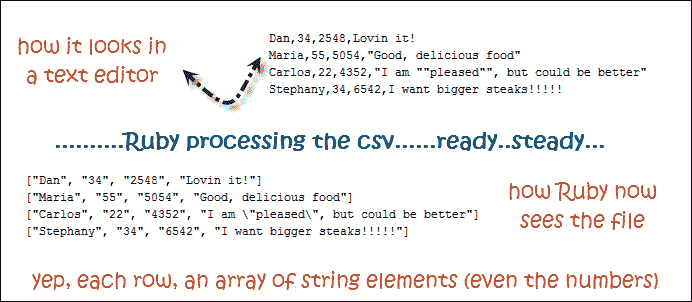
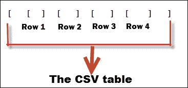

# Ruby CSV 库指南，第一部分

> 原文：<https://www.sitepoint.com/guide-ruby-csv-library-part/>

几周前，我需要用 Ruby 做一些事情，包括处理大量的 CSV 文件。我很高兴得知有一个很好的、全面的 CSV 库可以让我的工作变得更容易。

然而，当我开始寻找教程时，我发现了一件事:它们都没有详细介绍这个库。我看到的大多数文章几乎没有触及 CSV 库可以做什么的表面。我下定决心要对 Ruby 的这一部分有一个坚实的理解，所以我开始阅读每一个可能的关于 CSV 的教程和书籍章节。这个由两部分组成的系列是我努力的结果。

我在这篇文章中做了一些基本假设:

*   你知道 CSV(逗号分隔文件)是什么样子的。
*   您对 Ruby 有基本的了解。
*   您已经对在 Ruby 中使用文件有了基本的了解。这在最后一节会有帮助。

## 避免 CSV 文件中的常见问题

想象一下，你有一个开餐馆的叔叔(姑且叫他鲍勃吧)。

鲍勃叔叔的员工保存了一份所有顾客的电子表格。每行包含(在单独的单元格中):

1.  客户的姓名。
2.  他们到达并在餐厅用餐的总次数。
3.  总花费。
4.  当被要求描述餐馆的食物时，他们使用的一个短语。

首先，Bob 叔叔给了您一个小的 CSV 文件，其中包含 4 行他们最常去的客户。以下是该文件的可视化表示:


鲍勃叔叔的 CSV

让我们做一个小测验。我们如何以纯文本的形式表示这些数据？填空:

```
Dan,34,2548,Lovin it!
Maria,55,5054,_____________
Carlos,22,4352,_________________
Stephany,34,6542,I want bigger steaks!!!!!
```

回答:未完成的两行看起来像这样:

```
Maria,55,5054,"Good, delicious food"
Carlos,22,4352,"I am ""pleased"", but could be better"
```

如果 CSV 是逗号分隔的，并且单元格中有一个逗号，则需要用双引号将该单元格的文本括起来(如第三行)。否则，您可能会混淆解析器。

现在，如果事情变得更加复杂，除了逗号之外，单元格中还有双引号，你只需用另一个双引号来转义每个双引号(就像在第 4 行)。

## Ruby 如何看待 CSV 文件

随着我们对 CSV 文件理解的加深，让我们学习如何将它们导入 Ruby。在我们开始做任何事情之前，我们需要`require 'csv'`在我们的程序文件中。

继续我们鲍勃叔叔的任务，我们现在有一个他给我们的文件(让我们把它命名为`customers.csv`)。我们如何将它导入 Ruby？**在 Ruby 中，你可以一次导入你的 CSV 文件(将所有文件内容存储在内存中)，也可以逐行读取**。每种方法都有自己的优点和缺点。例如，您不希望在一台 512MB RAM 的计算机上一次导入一个 300，000 行的文件并使您的程序崩溃，这一点我们将在后面了解。

不管用哪种方式，Ruby 都会将每个表格行存储为一个数组，每个单元格都是数组的一个字符串元素。



Ruby 如何看待 CSV 文件

为了举例说明，让我们试着一次导入一个小的 4 行 CSV 文件。我们用 **`CSV.read`方法来实现，将文件名作为参数**传递。该方法将读取*整个*文件，并将其存储在`customers`变量中:

```
require 'csv'
customers = CSV.read('customers.csv')
```

我们的`customers`变量现在是一个大数组(表示表格),包含行作为其元素。因为我们知道 Ruby 用一个数组表示每个表行，所以我们的客户变量基本上是一个包含其他数组的数组。如果你在 Ruby 中没有遇到过一个数组存储其他数组的情况，也不要困惑。如果您仍然不清楚，请尝试使用上述数据运行代码(在我自己尝试运行和修补东西之前，对我来说就是这样)。

这里有一个例子可以让事情更清楚:



数组的数组

让我们试着逐行读取我们的文件。我们可以用 **`CSV.foreach`** 方法做到这一点，将文件名作为参数传递，并为其提供一个块变量，该变量以数组的形式包含已经处理过的行:

```
CSV.foreach('customers.csv') do |row|
  puts row.inspect
end
```

这段代码的输出将是:

```
["Dan", "34", "2548", "Lovin it!"]
["Maria", "55", "5054", "Good, delicious food"]
["Carlos", "22", "4352", "I am \"pleased\", but could be better"]
["Stephany", "34", "6542", "I want bigger steaks!!!!!"]
```

从 CSV 文件处理的所有东西都是一个字符串，甚至是数字(尽管有一些关于改变默认行为的提示…稍后会有更多的提示:)。

## CSV 库也可以处理字符串，而不仅仅是文件

如果在 Ruby 中有逗号分隔的数据作为`String`对象，可以用`CSV.parse`方法将数据转换成 CSV 的 Ruby 表示(其中表是一个包含其他数组(即行)的数组):

```
a_string = "Dan,34\nMaria,55"
CSV.parse(a_string) #=> [["Dan", "34"], ["Maria", "55"]]
```

您也可以提供一个块给`CSV.parse`:

```
CSV.parse(a_string) { |row| puts row.inspect } 
#=> produces ["Dan", "34"] and ["Maria", "55"] on separate lines
```

没有块的`CSV.parse`在输出方面与`CSV.read`相似。在输入方面，它们从不同类型中获取逗号分隔的数据(从字符串对象中获取`CSV.parse`，从硬盘中的某个文件中获取`CSV.read`)。)然而，输出是相同的(数组的数组)。这样做:

```
CSV.parse(File.read('customers.csv')) 
# File.read returns a (big) string of the data in 'customers.csv', comma-separated
# and CSV.parse just re-structures that data into an array data structure.
```

将输出与此完全相同的内容:

```
CSV.read('customers.csv')
```

将`CSV.parse`与块一起使用类似于`CSV.foreach`。两者都允许你一次处理一行(不像`CSV.read`解释器只是扔给你一个大数组就完成了)。)

## 当您的 CSV 是 SSV(分号分隔的值)时该怎么办

哦哦。鲍勃大叔给了作为另一个文件，*新人. csv* 。这一个包含了当天最新客户的列表，因为是早上，所以列表不是很大:

```
James;1;43;Not bad
Robin;1;56;Fish is tasty
Anna;1;79;"Good; better; the best!"
```

休斯顿，我们有麻烦了。这些文件没有用逗号分隔。这不是 CSV，这是 SSV！(好吧，我不确定是否有一个标准术语来描述分号分隔的文件，但是现在让我们使用 SSV。)我们怎么办？我们刚刚学的方法*对于 SSV 档案来说都没用*吗？不要害怕！

到目前为止，我们所学的 4 种方法有一个共同的模式:它们都只接受一个参数，即我们希望 Ruby 处理的文件名(或者说，文件名的路径)。实际上，它们都接受第二个(可选的)参数，这是一个包含各种选项的*散列*(键-值对)，指示 Ruby 如何处理文件。最常用的选项是`:col_sep => ':'`,正如您已经猜到的，它指定了文件中使用的分隔符。如果我们添加这个散列参数，上面的所有方法都可以工作:

```
new_customers = CSV.read('newcomers.csv', { :col_sep => ';' })
CSV.foreach('newcomers.csv', { :col_sep => ';' }) { |row| p row }
```

为了让事情更清楚，我们可以使用新的`symbol_key: value` hash 语法，这个语法从 Ruby 1.9 开始就有了，如果 hash 是参数列表中的最后一个参数，我们就不需要在 hash 中包含花括号:

```
CSV.foreach('newcomers.csv', col_sep: ';') { |row| p row }
a_string = "Dan;34\nMaria;55"
CSV.parse(a_string, col_sep: ';') #=> [["Dan", "34"], ["Maria", "55"]]
```

还有很多其他类似`col_sep`的选项可以通过。我们将在这个系列中讨论最常见的，但是如果你好奇的话，[你可以在这里](http://ruby-doc.org/stdlib-1.9.3/libdoc/csv/rdoc/CSV.html#method-c-new)看到它们。

## 让我们做一些操作

Bob 叔叔希望我们使用最频繁的客户的 CSV(customers . CSV)并计算每次到达的平均花费。很简单，对吧？我们只是用顾客花的钱总数除以他们来餐馆就餐的总次数。我们已经有了第 3 列和第 2 列中数据:

```
average_money_spent = Array.new
  CSV.foreach('customers.csv') do |row|
    average_money_spent << row[2] / row[1]
    # row is just an ordinary array and you access its elements with []
  end #=> Undefined method '/' for "2548":String
```

这是怎么回事？记住，即使我们的 CSV 文件包含数字，**在 Ruby** 中它们不会被视为数字。默认情况下，CSV 文件中的所有内容都被视为一个*字符串*。幸运的是，您可以用另一个键值选项参数(`converters: :numeric`)告诉 CSV 库偏离这个默认行为。让我们把第二行从`CSV.foreach('customers.csv')`改成`CSV.foreach('customers.csv', converters: :numeric)`

在这种情况下，键是一个符号(`:converters`)，值是一个符号(`:numeric`)。既然我们已经说过所有选项都是散列的一部分，我们可以同时指定多个选项，如下所示:

```
CSV.read('customers_separated_with_semicolons.csv', col_sep: ';', converters: :numeric)
```

现在，所有的数字都将被转换成近似的格式。整数会变成 Fixnum 的，小数会变成 Floats 的，有几百个小数的数字就成 Bignums 了。太棒了。

## 在文件中输出我们的结果

让我们尝试在工作表中添加一个新列。请记住，原始 CSV 文件(customers.csv)的内容是:

```
Dan,34,2548,Lovin it!
Maria,55,5054,"Good, delicious food"
Carlos,22,4352,"I am ""pleased"", but could be better"
Stephany,34,6542,I want bigger steaks!!!!!
```

我们得到了这个代码:

```
average_money_spent = Array.new
CSV.foreach('customers.csv', converters: :numeric) do |row|
  average_money_spent << row[2] / row[1]
end
```

这为我们提供了一个阵列中 4 个客户的平均花费。我们希望在包含这些值的 CSV 文件中添加第 5 列。

如果您在 Excel 中处理过 CSV 文件，通常的工作流程是进行更改并保存。好吧，在 Ruby 中事情不是那样工作的(如果你熟悉`File`类，你会知道我在说什么。)在 Ruby 中处理 CSV 文件的通常工作流程是(假设它们在您的硬盘上):

1.  用像`CSV.read`和`CSV.foreach`这样的方法将行加载到程序的内存中。如果你熟悉 Ruby 中的`File`类，你会很高兴知道你也可以用`CSV.open(file_name, 'mode-like-r(+)-w(+)-or-a(+)', { options like converters: :numeric in key-value pairs})`打开文件，然后调用 block 变量上的`.each`来获取每一行。这只是做`CSV.foreach`的一种更长的方式。

2.  您可以使用各种 Ruby 表达式对每一行做任何事情，像访问数组一样访问行的内容。使用`CSV.read`，你可以像访问数组一样访问你的行，而使用`CSV.foreach`，你可以在读的时候访问你的行。

3.  完成工作后，您可以将数据保存回一个新文件(就像电子表格程序中的“另存为”一样)。这是我们在这一部分要关注的部分。

回到我们的例子，假设我们将整个 customers.csv 文件的内容作为一个数组(我们称之为`customers_array`)存储在内存中，该数组包含 4 个元素(也是数组，还记得吗？)和具有(也)4 个元素的`average-money-spent`变量，第一个元素(数字)对应于第 1 行的平均花费金额，第二个对应于第 2 行，依此类推。这里有一种方法可以将这个数字添加到每一行:

```
customers_array = CSV.read('test.txt')
customers_array.each do |customer|
 customer << average_money_spent.shift
end
```

酷！现在每一行(即数组)的末尾都包含一个新的单元(即元素)。让我们更新我们的 CSV 文件。但是等等……没有一个神奇的“CTRL+S”按钮可以让你按下，也没有一个命令可以让你执行。您不能用更新后的值神奇地修改您的 CSV 文件。在这方面，使用 CSV 库与使用 File 类几乎 100%相似，并且适用相同的逻辑:

您**打开** a (CSV)文件，用于**读取、写入或追加模式**，并使用 `or` 或`puts`追加新的一行。如果你不知道 Ruby `File`类是如何工作的，我强烈建议你花些时间学习它，然后回到本文(你有一些关于它的[很棒的视频](http://www.youtube.com/results?search_query=ruby+working+with+files&page=&utm_source=opensearch))。

`File.open`和`CSV.open`(是的，它甚至有相同的方法名)之间唯一的区别是**和`File.open`，你附加了字符串。使用`CSV.open`，您可以添加行(表示为数组)**。让我们用更新后的`customer_array`做个例子:

```
CSV.open('our-new-customers-file.csv', 'w') do |csv_object|
  customers.array.each do |row_array|
    csv_object << row_array
  end
end
```

就是这样！我们现在有了一个名为`our-new-customers-file.csv`的新的更新文件。鲍勃叔叔对我们很满意。

在第 2 部分的[中，我们将更深入地处理带有实际头文件的 CSV 文件(注意我们的示例 CSV 文件没有任何头文件),并探索处理大文件和有限 RAM 时的内存问题。我们还将学习其他一些有趣的东西，比如在 CSV 迭代器方法中使用枚举器，添加头如何为您带来大量新方法，以及其他一些有用的技巧。敬请期待！](https://www.sitepoint.com/guide-ruby-csv-library-part-2/ "CSV, part 2")

## 分享这篇文章