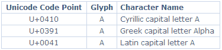

# 网络字符编码权威指南

> 原文：<https://www.sitepoint.com/guide-web-character-encoding/>

**字符编码。你可能听说过它，但是它是什么，你为什么要关心它？如果你做错了会发生什么？你怎么知道用哪一个？**

我们一会儿会研究细节，但现在我们只能说字符编码是一种将字母、数字和其他符号表示为计算机可以理解的数值的方式。

文件(例如 HTML 文档)以特定的字符编码保存。有关文件使用的编码形式的信息被发送到浏览器和其他用户代理，以便它们可以正确地解释位和字节。如果声明的编码与实际使用的编码不匹配，浏览器可能会将您宝贵的网页渲染成天书。当然，搜索引擎也看不懂。

##### 有什么区别？

为什么我们选择哪种编码形式很重要？如果我们选择了“错误”的那个会怎么样？

字符编码的选择会影响我们在网页中可以使用的文字字符的范围。常规的拉丁字母很少是问题，但是一些语言比其他语言需要更多的字母，一些语言需要在字母上方或下方有各种发音符号。然后，当然有些语言根本不用拉丁字母。如果我们想要正确的标点符号和特殊符号，编码的选择也变得更加重要。

如果我们需要一个不能用我们选择的编码来表示的字符呢？我们不得不求助于实体或数字字符引用(NCR)。实体引用是特定字符的符号名，如符号的`&copy;`。它以一个&符号(&)开始，应该以一个分号(；).NCR 通过字符的代码位置来引用字符(见下文)。版权符号的 NCR 是`&#169;`(十进制)或`&#xa9;`(十六进制)。

实体或 NCR 和文字字符一样好用，但是它们使用更多的字节，使得标记更难阅读。他们也容易出现打字错误。

##### 是什么影响了选择？

在我们选择一种编码形式之前，应该考虑一些参数，包括:

*   我将使用哪些字符？
*   我的编辑器可以用哪种编码保存文件？
*   我的发布链中的各个组件支持哪些编码？
*   访问者的浏览器支持哪些编码？

让我们依次考虑这些问题。

***字符范围***

我们需要考虑的第一个参数是我们需要的字符范围。显然，用单一语言编写的网站比多语言网站使用的字符范围更有限，尤其是混合了拉丁字母和西里尔字母、希腊语、希伯来语、阿拉伯语、中文等的网站。如果我们想使用印刷正确的引号、破折号和其他特殊的标点符号,“普通的”编码是不够的。如果我们需要数学或其他特殊符号，也是如此。

***文字编辑功能***

一些作者更喜欢使用常规的文本编辑器，如记事本或 Vim 其他人喜欢像 Dreamweaver 这样的点击式所见即所得工具；有些使用复杂的内容管理系统(CMS)。不考虑个人偏好，我们对编辑器的选择会影响我们对编码的选择。有些编辑器只能保存一种编码，甚至不会告诉你是哪一种。其他的可以保存成几十种不同的编码，但是需要你知道哪一种适合你的需要。

***其他组件***

出版链不仅仅由编辑组成。在链条的末端总是有一个 web 服务器(HTTP 服务器),但是中间可能还有其他组件:数据库、编程或脚本语言、框架、应用服务器、servlet 引擎等等。

这些组件中的每一个都可能影响您对编码的选择。也许数据库只能以一种特定的编码存储数据，或者也许您使用的脚本语言不能处理某些编码。

不可能在本文中列举所有不同的编辑器、数据库等的功能，因为它们实在太多了。在选择要使用的编码之前，您需要查看组件的文档。

***浏览器支持***

一些编码——如 US-ASCII、ISO 8859 系列和 UTF-8——得到了广泛支持。其他人不是。最好避免使用更深奥的编码，尤其是在面向国际观众的网站上。

##### 什么是字符编码？

字符是能够传达信息的最小书写单位。这是一个抽象的概念:角色没有视觉外观。“大写拉丁文 A”是不同于“小写拉丁文 A”以及“大写西里尔字母 A”和“大写希腊文 Alpha”的字符。

字符的可视表示称为字形。某一组字形被称为字体。“大写拉丁字母 A”、“大写西里尔字母 A”和“大写希腊字母 A”可能具有相同的字形，但它们是不同的字符。同时,“大写拉丁字母 A”的字形在 Times New Roman、Gill Sans 和 Poetica chancery italic 中可能看起来非常不同，但它们仍然表示相同的字符。



可用字符集称为字符集。给定字符在指令集中的位置(索引)称为它的代码位置或代码点。

在给定的指令集中用数字表示代码点的方法称为字符编码。不幸的是，术语“字符集”或“charset”既用于存储库，也用于编码，所以最好完全避免使用它。

编码通常用八位字节来表示。八位字节是一组八个二进制数字，即八个 1 和 0。使用十六进制表示法，一个八位字节可以表示 0 到 255 之间的数值范围，或者 0x00 到 0xFF 之间的数值范围。

***简史***

早期的计算机没有标准化的字符编码，但这并不重要，因为那时计算机很少能相互通信。当计算机间的通信成为可能时，对编码标准的需求变得显而易见。一个常见的早期指令/编码是 EBCDIC，另一个是美国信息交换标准代码，也称为 ASCII。美国版本 US-ASCII 已被标准化为 ISO 646。

ASCII 仅使用 7 位(1 和 0)，这意味着它可以表示 128 个数字:0 到 127，包括 0 和 127。0-31 的范围为 C0 控制字符保留，127 为 DEL(删除)保留，总共剩下 95 个可打印字符。对于大写和小写的英语字母表，加上数字和一些常见的(当然，还有一些不太常见的)标点符号，这就足够了。但是，仅仅理解许多欧洲语言所必需的重音符号和发音符号是不够的，更不用说任何不使用拉丁字母的文字了。相互不兼容的国家版本的 ASCII 曾经是司空见惯的，但它们不适合国际信息交换。

ISO 8859 系列是为英语以外的语言提供选择的一次尝试。它是 ASCII 的超集，即前 128 个代码点在 ASCII 和 ISO 8859 的所有版本中都是相同的。但是 ISO 8859 使用 8 位，因此可以表示 256 个字符(0-255)。因此，它有时被错误地称为“8 位 ASCII”。128 到 159 (0x80 到 0x9F)的范围是为 C1 控制字符保留的。

西方语言最常见的版本是 ISO 8859-1，又名 ISO 拉丁语-1。它包含许多元音的重音版本，以及各种特殊字符。现在它已经被 ISO 8859-15 取代，以适应欧元符号(，€)。

ASCII 和 ISO 8859 系列都是字符库和编码。ASCII 码的码位范围是 0 到 127，ISO 8859 码的码位范围是 0 到 255。编码是简单的一对一，因为一个八位字节可以轻松地表示整个范围。“大写拉丁文 A”的码位为 65 (0x41)，编码为 65 (01000001)。

微软从来不以在可以创建自己的标准时遵循别人的标准而闻名，它也创建了许多字符库/编码。这些在 DOS 中被称为“代码页”，CP850 是用于西方语言的代码页。

最常见的微软版本/编码之一是 Windows-1252。虽然与 ISO 8859-1 非常相似，但又不完全相同。Microsoft 使用 ISO 编码中为 C1 控制字符保留的范围来提供 ISO 系列中不可用的某些方便字符，如印刷正确的引号和破折号。

对于不使用拉丁字母的语言，也设计了类似的专门曲目/编码。问题是没有可用于这些语言组合的汇编/编码。

***Unicode/ISO 10646***

这个问题的解决方案被称为 Unicode——一个包含世界语言中使用的大多数字符的字符集。它可以容纳几百万个字符，并且已经包含了几十万个。Unicode 被分成 64K 个字符的“平面”。大多数情况下唯一使用的是第一个平面，称为基本多语言平面，或 BMP。

Unicode 中的前 256 个码位与 ISO 8859-1 兼容，这也意味着前 128 个码位与 US-ASCII 兼容。Unicode 中的码位以十六进制编写，以大写字母“U”和加号为前缀(例如，U+0041 表示“大写拉丁文 A”(码位 65 或 0x41))。

一个被 ISO 标准化的 Unicode 版本被称为 ISO 10646(这个数字不是巧合；与 US-ASCII ISO 646 相比)。Unicode 和 ISO 10646 之间有一些细微的差别，但我们这些凡人无需担心。

ISO 10646 很重要，因为它是 HTML 使用的字符集。

但 ISO 10646 只是一个保留项目。我们需要一个编码来配合它。由于代码集可以表示数百万个代码点，一对一的编码效率非常低。我们需要每个字符 32 位(四个八位字节)，这是相当浪费的，尤其是对于西方语言。这种编码(UTF-32)是存在的，但是很少使用。另一种是 UTF-16，它对每个字符使用两个八位字节，但它还没有完全流行起来。

相反，一种更有效的(对西方语言而言)编码方式，即 UTF-8 编码，已经成为推荐的发展方向。它使用可变数量的八位字节来代表不同的字符。ASCII 范围(U+0000 到 U+007F)是一对一编码的。对于其他字符，需要两个、三个或四个八位字节。理论上，UTF-8 可以使用多达六个八位字节来编码某些字符。

##### 我应该选择哪种编码？

对于一个只有英文的网站来说，这并不重要。除非你想使用一些印刷正确的标点符号(花引号等)。)，普通的老 US-ASCII 就够了。ISO 8859-1 已经成为西方网站事实上的标准，如果你喜欢“天真”、“罗勒”或“斯莫尔斯巴德”这样的拼写，你可能会感兴趣

对于我们这些需要用其他西欧语言写作的人来说，如法语、西班牙语、葡萄牙语、意大利语、德语、瑞典语、挪威语、丹麦语或芬兰语，ISO 8859-1 非常好用。那些需要捷克语或波兰语的发音符号，或者像希腊语或西里尔语这样完全独立的字母的人，可以从 ISO 8859 系列的其他版本中选择。

正如我提到的，希伯来语、阿拉伯语和东方文字也有专门的编码。但是如果你需要在同一个网站上混合使用英语、俄语、希腊语和日语呢？或者甚至在同一页上？

我建议尽可能使用 UTF-8，因为它可以代表 ISO 10646 剧目中的任何角色。即使你只写英语，UTF-8 给你直接访问印刷正确的引号，几个破折号，省略号，等等。如果你需要用希腊语或日语写作，你可以这样做，而不必与实体或 NCR 打交道。

在多语言网站上，当然有可能对不同的页面使用不同的编码，但是想想维护的噩梦吧。为什么不用 UTF-8 做任何事情，不用再担心了？

然而不幸的是，即使在今天这个时代，使用 UTF-8 也存在一些小问题。

***UTF-8 题***

 *使用 UTF-8 的第一个问题是，并非所有的编辑器或出版工具都支持它。你可能认为这么多年后所有的软件都会支持 UTF-8，但遗憾的是事实并非如此。

下一个问题是所谓的字节顺序标记，或 BOM。这是一个由两个(UTF-16)或三个(UTF-8)二进制八位数组成的序列，它告诉计算机是最高位还是最低位二进制八位数先出现。有些浏览器不理解 BOM，会以文本形式输出。其他编辑不允许我们省略 BOM。

一个小问题是，一些古老的浏览器不支持 UTF-8(即使没有 BOM)。然而，这些日子应该很少。

***ISO 8859 问题***

 *如果你用英语、法语和德语出版，遇到 UTF-8 的问题，你可以选择我们信任的老朋友:ISO 8859-1。但是仍然有一些陷阱需要注意。

Windows 下的很多编辑器都会使用 Windows-1252 作为默认(或者只有！)编码。如果您将文件保存为 Windows-1252 并声明编码为 ISO 8859-1，它通常是有效的。这是因为两者非常相似。

但是，如果您使用某些文字字符，如印刷正确的引号、破折号、省略号等，您就会遇到麻烦。这些人物不是 ISO 8859-1 的一部分。在 Windows-1252 中，它们位于 ISO 编码为 C1 控制字符保留的范围内——换句话说，这些码位在 ISO 8859-1 是无效的。从另一个 Windows 应用程序(如 Word)进行复制是一个特别可能导致问题的原因。

W3C 的 [HTML 验证器](http://validator.w3.org)将捕捉这些类型的无效字符，并将它们报告为错误。

***其他编码的问题***

现代浏览器很好地支持 UTF-8 和 ISO 8859 系列。大多数浏览器也支持相当多的其他编码，但是如果你选择一种外来的编码，你就要冒一些访问者不能阅读你的内容的风险。

在一些不使用拉丁字母的国家，web 开发人员可能会使用提供所需字符的字体，而根本不关心编码。这是非常不明智的。任何没有安装这种字体的访问者只会看到胡言乱语。这些“访问者”包括谷歌和其他搜索引擎。

##### 指定编码

一旦选择了要使用的编码，就必须确保将正确的信息传递给浏览器、搜索引擎等。

使用超文本传输协议(HTTP)提供网页服务:浏览器通过 HTTP 发送请求，服务器通过 HTTP 发回响应。响应由两部分组成:标题和正文，由一个空行分隔。标题提供了关于主体(内容)的信息。主体包含请求的资源(通常是 HTML 文档)。

对于 HTML，编码信息应该由 web 服务器使用 Content-Type 头发送:

```
Content-Type: text/html; charset=utf-8
```

您可能还希望在 HTML 中提供一个等效的 HTTP，以便在脱机查看页面时声明编码。您可以在文档的 HEAD-section 中使用 META 元素来实现这一点:

```
<meta http-equiv="Content-Type"  

      content="text/html; charset=utf-8">
```

但是，请注意，任何真正的 HTTP 头都会覆盖 META 元素，因此正确设置 web 服务器是非常必要的。对于 Apache，您可以通过编辑配置文件来实现这一点(在大多数*nix 系统上是`/etc/httpd.conf`)。该指令应该如下所示:

```
AddDefaultCharset UTF-8
```

对于 Microsoft IIS，此设置需要位于其众多的对话框中。

对于 XML——包括正确服务的 XHTML——编码应该在文件顶部的 XML 声明中指定。在这些情况下，Content-Type 头不应该包含任何编码信息。XML 解析器只需要支持 UTF-8 和 UTF-16，这使得选择更加容易:

```
<?xml version="1.0" encoding="utf-8"?>
```

注意，这不适用于作为文本/HTML 的 XHTML，因为那根本不是真正的 XHTML，所以 XML 声明不起作用。

##### 摘要

选择正确的字符编码很重要。如果你选择了一个不适合你的网站的编码(例如，使用 ISO 8859-1 的中文网站)，你将需要使用大量的实体或 NCR，这将不必要的增加文件的大小。

不幸的是，选择编码并不总是容易的。发布链中的各种组件缺乏支持会阻止您使用最适合您的内容的编码。

尽可能使用 UTF-8(无 BOM ),尤其是多语言网站。也许最重要的是:你声明的编码必须与你保存文件时使用的编码相匹配！** 

## **分享这篇文章**