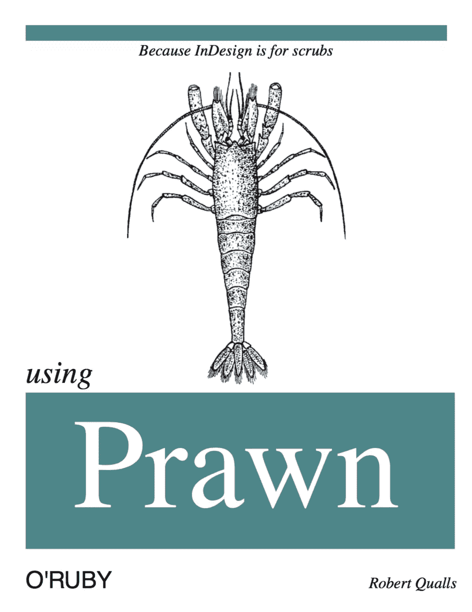
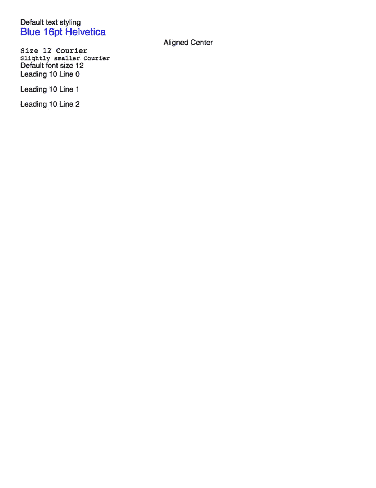
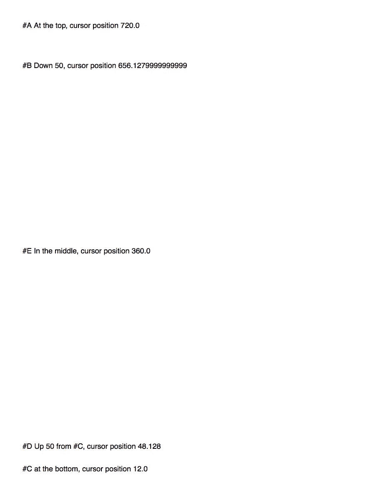
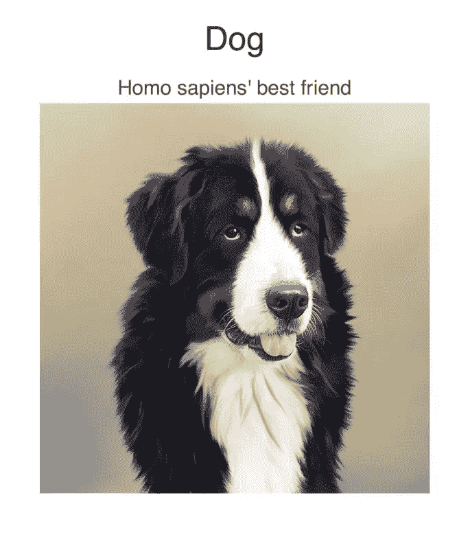

# Ruby 中的 Hackable PDF 排版

> 原文：<https://www.sitepoint.com/hackable-pdf-typesetting-in-ruby-with-prawn/>



生成可移植文档可能很棘手。在很大程度上，这项任务已经从排版语言转移到所见即所得编辑器，比如 Scribus 和 Adobe InDesign。

但是自动化有它自己的好处。代替厨房的水槽，拥有一个可以轻松调整的平台来得到我们想要的东西是很好的。

[大虾](http://prawnpdf.org)是`PDF::Writer`的精神继承者。它目前维护得很好，和许多其他 Ruby 项目一样，对虾是一个可以构建工具的平台。

## 乳液

在我们进入大虾之前，大象值得一提。

《特克斯》由唐纳德·克努特创作，于 1978 年发行。那时，数字印刷还相当新，Knuth 刚刚拿回他的《计算机编程的艺术》第二卷的校样。他对质量感到震惊，并决定几个月后可以做得更好。最终他花了十年时间([来源](http://ctan.org/tex/))。

特克斯因没有虫子而出名。根据 Knuth 的计划，那些在他的文档或程序中发现错误的人会得到一笔费用。TeX 程序的奖励紧随[小麦和棋盘问题](http://en.wikipedia.org/wiki/Wheat_and_Chessboard_Problem)之后，从 1.28 美元开始，达到 327.68 美元。典型的 Knuth，TeX 的版本号收敛到π。

[LaTeX](http://www.latex-project.org/) (发音为“lahtehk”)是一个用于 TeX 的宏包，它使制作标准文档变得更加容易。现在，TeX 经常被称为 LaTeX，它是在学术界创建科学或数学文档的事实上的标准。

这里有一个乳胶的例子:

```
\documentclass{article}
\title{LaTeX Hello World}
\author{Robert Qualls}
\today
\begin{document}
\maketitle
Hello World
\end{document} 
```

那些对 LaTeX 软件包感兴趣的人会想去看看 CTAN、全面的 TeX 存档网络和 LaTeX rubygems。如果您认识到与 CPAN 的相似之处，那就更好了:全面的 Perl 存档网络。

## 安装对虾

如果您运行的是 Rails 操作，LaTeX 不是生成文档的最方便的方法。有一些可用的宝石，但当逻辑和表示使用同一种语言时真的很好。大虾供应的就是这个。

首先，我们需要安装大虾宝石:

```
gem install prawn 
```

我们可以通过下面的测试来验证对虾的工作情况:

```
require "prawn"

Prawn::Document.generate("hello.pdf") do
  text "Hello World!"
end 
```

## 制作文本

大虾的大多数命令都非常简单，正如你所期望的:

```
require "prawn"

Prawn::Document.generate("styling_text.pdf") do
  text "Default text styling"
  text "Blue 16pt Helvetica", size: 16, font: "Helvetica", color: "0000FF"
  text "Aligned Center", align: :center

  font_size 12
  font "Courier" do
    text "Size 12 Courier"
    font_size 10 do
      text "Slightly smaller Courier"
    end
  end
  text "Default font size 12"

  font "Helvetica"
  3.times do |i|
    text "Helvetica with leading 10 line #{i}", leading: 10
  end
end 
```



与 Ruby 一致，对虾提供了多种方法来完成同样的事情。大多数 DSL 方法可以选择使用块来确定作用域。

## 四处走动

对虾有两个重要的几何位置:

1.  起源
2.  光标

原点 *[0，0]在文档的左下角*。当*光标从左上角的*开始时，这可能会引起混淆。

“[0，0] *什么*？”，你可能会问。对虾的默认单位是一个 *PDF 点*，其中一个 PDF 点等于 1/72 英寸。因为美国。

移动光标就像`move_down`、`move_up`或`move_cursor_to`一样简单:

```
require "prawn"

Prawn::Document.generate("moving_around.pdf") do
  text "#A At the top, cursor position #{cursor}"

  move_down 50
  text "#B Down 50, cursor position #{cursor}"

  move_cursor_to bounds.bottom + font_size
  text "#C at the bottom, cursor position #{cursor}"

  move_up 50
  text "#D Up 50 from #C, cursor position #{cursor}"

  move_cursor_to bounds.top / 2
  text "#E In the middle, cursor position #{cursor}"
end 
```



## 添加图像

对虾让我们使用本地路径或外部 URL 与`open-uri`:

```
require 'prawn'
require 'open-uri'

Prawn::Document.generate("image.pdf") do
  text "Dog", align: :center, color: "333333", size: 42
  move_down 20
  text "Homo sapiens' best friend", align: :center, color: "555555", size: 26
  url = "https://pixabay.com/static/uploads/photo/2014/03/14/20/13/dog-287420_960_720.jpg"
  image open(url), fit: [500, 500], position: :center
end 
```



它也支持背景。不幸的是，大虾似乎没有提供任何方法来适应这样做的背景，所以你可能需要修补大小。这可以用 [ImageMagick](http://www.imagemagick.org/script/index.php) 和`mini_magick` gem 来完成:

```
$ brew install imagemagick
$ gem install mini_magick 
```

我决定使用 650×950 的图像:

```
require 'prawn'
require "mini_magick"

url = "https://pixabay.com/static/uploads/photo/2015/11/19/08/12/milky-way-1050526_960_720.jpg"
filename = "fitted_background.jpg"
image = MiniMagick::Image.open(url)
image.resize "650x950"
image.write filename
background = filename

Prawn::Document.generate("background.pdf", background: background) do
  options = { align: :center, valign: :center, leading: 25, color: "C1C1C1" }
  text "\"Somewhere, something incredible is waiting to be known\"", options.merge({ size: 20 })
  text "- Carl Sagan", options.merge({ size: 18 })
end 
```


## 图书封面

这是假书皮的来源。

```
require "prawn"

Prawn::Document.generate("oruby_cover.pdf") do
  move_down 60

  image "shrimp.png", fit: [500, 400], position: :center

  move_cursor_to bounds.top

  shape_color = "008888"
  font "Times-Roman"

  fill_color shape_color
  fill_rectangle [0, bounds.top], bounds.width, 20

  move_down 25

  fill_color "000000"
  text "Because InDesign is for scrubs", :size => 20, :style => :italic, :align => :center

  bounding_box([0, bounds.top - 50], :width => bounds.width, :height => bounds.height) do
    move_down 380
    text "using", :size => 40, :style => :italic
    move_up 380

    fill_color shape_color
    fill_rectangle [0, 300], 550, 200

    fill_color "FFFFFF"
    move_down 410
    font "Times-Roman"
    text "Prawn", :size => 165, :align => :center

    fill_color "000000"
    font "Helvetica"
    draw_text "O'RUBY", :at => [0, bounds.bottom + 50], :size => 30

    move_to [0, bounds.bottom + 100]
    font "Times-Roman"
    draw_text "Robert Qualls", :at => [bounds.right - 100, bounds.bottom + 50], :size => 20, :style => :italic
  end
end 
```

图片由[皮尔森·斯科特·福尔斯曼](https://commons.wikimedia.org/wiki/Commons:Pearson_Scott_Foresman) ( [来源](http://4vector.com/free-vector/shrimp-100177))提供

## 结论

如果你想了解更多关于大虾的知识，大虾团队有[一本不错的手册](http://prawnpdf.org/manual.pdf)。

大虾的 DSL 方法并不适合所有人，也不是所有情况下的最佳解决方案。其实 HTML+CSS 转 PDF 很可能是程序化排版的未来。硬编码而不是灵活设计感觉很像 20 世纪，但是大虾相当受欢迎，所以你很可能会不时遇到它。谢天谢地，我们有 [wkhtmltopdf](http://wkhtmltopdf.org/) 被 [PDFKit](https://github.com/pdfkit/pdfkit) 宝石包裹着。如果你想看比较，请务必阅读 Rails 中的 [PDF 生成。](https://www.sitepoint.com/pdf-generation-rails/)

## 分享这篇文章