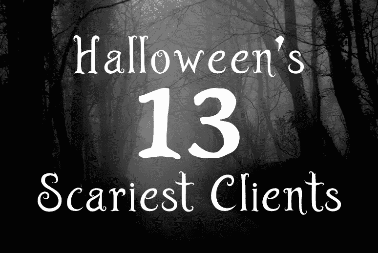

# 万圣节的 13 个最可怕的客户

> 原文：<https://www.sitepoint.com/halloweens-13-scariest-clients/>

我们一年 364 天都有通情达理、心存感激的客户，但 10 月 31 日不同。万圣节是亡灵揭竿而起，用可悲的网站请求轰炸我们的时候。幸运的是，我们可以识别警告信号并驱魔！

*感谢 Philip Male via Flickr 提供的背景图片。*

## 1.“多少”的恐怖

客户现在想要一个最终报价。他们没有明确的要求，不能承诺一个时间表，但仍然希望你为他们的项目提供一个固定的价格。你也可能被神秘的灵魂所困扰，他们不会讨论他们的革命性想法，因为你可以窃取它——但他们仍然想要一个报价。

这些客户很少是技术型的，需要大量的帮助。他们需要的教育程度与他们问“我的网站要多少钱”所需的时间成反比。谨慎地相应调整成本，或者考虑提供咨询服务来帮助他们确定自己的需求。

## 2.邪恶的轶事幽灵

这个客户有一个糟糕的网站。他们上一个设计师毫无用处，你们都会嘲笑他的无能。

不久，你意识到幽灵有许多关于他们每一个供应商的邪恶轶事。是他们都很糟糕，还是客户很快就对每个人和每件事吹毛求疵。解决办法？让他们了解情况，并确保你能兑现你的承诺。考虑适当的应急时间和预算。

## 3.宠爱的恶魔

“你应该免费创建我们的网站——我们是在帮你的忙！”这可以翻译成:*“我们没有钱。我们没有专业知识。我们希望你承担所有风险，但不保证任何回报。”*

也许他们是下一个 Twitter，但这是百万分之一的赌博。在开始这种无聊的事情之前，问自己一个问题:你有没有更好的想法来发展并保持 100%的收入？

## 4.闹鬼的讨价还价者

“我们无法支付您的费用！我们要打折！”讨价还价者永远不会让步。不管你的报价多低，他们都会继续压榨你。

不要屈服:讨价还价会降低你的专业知识，浪费你的时间，降低你的动力。走开——这会让他们更想要你，时不时地说“不”是一种力量。

## 5.荒谬的幻影

“我们希望‘香蕉’在谷歌上排名第一，比脸书更受欢迎。你必须在下周前交货。”

我被几个幽灵拜访过。他们可能有技术头脑，有合理的预算，但他们不会听取务实的建议，也不会被自己可笑的期望所动摇。无论如何都要做这项工作，但要仔细斟酌你的合同。你的技术实现不会成为他们业务失败的原因。

## 6.第二个猜测的食尸鬼

这位客户不断指责你的推荐，因为他从一位朋友或亲戚那里听到了一些传闻，而这位朋友或亲戚是“这方面的专家”。你很快就会发现，食尸鬼十年前就使用 FrontPage 了，他们的想法已经过时，包括闪屏和关键字填充。

二手知识很难处理。你可以建议食尸鬼把他们的“专家”带到所有的会议上，并把决定权交给他们。或者，你可以决定客户不相信你的判断，然后离开。

## 7.承诺动物

你参加过无数次会议。你已经提供了详细的时间表和报价。你很开心。你的委托人很开心。然后……*一切归于平静。*您的电话将被忽略，并且不进行存款。你继续前进。

六个月后，这种生物神秘地再次出现。他们已经准备好了，希望你明天就开始工作——就好像你一直在等他们的电话一样。这是一个提醒，总是在你的建议和合同中添加有限的条款，例如，这个估计和时间表的有效期为 28 天。当项目延期超出你的控制范围时，保留重新协商的权利。

## 8.中层管理者突变

变种人的工作是发现问题，用行话迷惑你，以保证任何解决方案都是品牌的。他们发现的问题越多，看起来就越好。

自由职业的一个主要好处是你永远不需要关心办公室政治。但它仍然存在，一些员工可以从破坏项目稳定中获益。我的建议是:专业一点，不要陷进去。如果任何人造成延误，将进度延误和原因记录在所有利益相关者都可以访问的文件上。

## 9.后座怪物

妖怪比你更了解你的工作。如果他们有时间，他们可以创建一个更好的网站。和工具。和技能。和倾向。

让客户满意的最好方法是让他们了解信息，并定期询问他们的建议。一些自由职业者可能会给他们很多“重要”的问题，让他们忙个不停……重要的决定，比如主页照片、关键词元标签或汉堡图标的颜色。

## 10.消失的恶魔

项目开始后不久，恶魔就消失了几个星期。你听到奇怪的声音，但没有实质性的东西。没有做出决定，时间表进一步推迟。然后，当他们突然出现并询问为什么他们的网站还没有准备好时，一切都乱套了。

理想情况下，你应该有一个单一的联系人能够给你一个明确的决定所有的问题。如果他们做不到这一点，请另一位能做到的员工。这对小公司来说是不切实际的，所以要确保你的合同涵盖了这些可能性。

*   无论客户造成任何延迟，计费时间表都将继续，和/或
*   如果在合理的时间内无法做出决定，开发商将选择合适的方案。变更请求需要支付额外费用。

## 11.时间吸血鬼

时间吸血鬼可能比消失的恶魔更可怕。吸血鬼不停地打电话和要求见面，把你一天的生活都吸走了。他们经常与健忘症患者一起工作，这些患者忘记了你同意的事情，需要在几周后再次讨论所有事情。

解决方案:考虑[敏捷开发和支付](/charge-websites-agile-way/)。每天的站立会议都有安排，客户可以随意要求你的时间；他们的项目只会持续更长时间。

## 12.之字形僵尸

僵尸会提出奇怪的、没有根据的要求，并不停地改变方向。他们很清楚自己想要什么…当他们看到它的时候。这个项目永远不会结束，因为他们永远不会 100%满意。

幸运的是，僵尸在开始时很容易识别。避免收取[固定价格](/charge-websites-fixed-price-projects/)的费用，选择[按小时付费](/charge-websites-pay-per-hour-projects/)或[敏捷](/charge-websites-agile-way/)支付选项。

## 13.不付钱的捣蛋鬼

闹鬼制造噪音，造成混乱，只有在付款到期时才会安静得令人毛骨悚然。

解决办法很简单:总是要求一笔健康的定期付款或预付费用的存款。对于新客户或信用记录不佳的客户来说尤其如此。如果他们不支付，停止所有工作，并相应地更新时间表。防止支付问题比通过法院起诉客户更便宜也更容易。

你被一个奇怪的幽灵困扰过吗？你是跑着还是站着与幽灵搏斗？！

## 分享这篇文章