# 如何像专业人士一样处理 2018 年客户的设计任务

> 原文：<https://www.sitepoint.com/handle-design-tasks-like-a-pro/>

*本文由 [BAW 传媒](https://bawmedia.com/)赞助。感谢您对使 SitePoint 成为可能的合作伙伴的支持。*

你有没有感觉到你的网页设计客户提高了他们的期望值？放心，这很可能是真的，而且不只是你的想象。事实上，因为他们可以不断地获得更多的信息，包括他们的竞争对手在做什么，所以你的客户会非常希望确保他们得到了最大的回报。

你可以期待 2018 年不会有什么不同，尤其是如果你选择“即兴发挥”。更好的方法是适应企业的需求，这将让你在不断变化的市场中成功竞争。

[https://www.youtube.com/embed/uPvjfW5VVTI?rel=0](https://www.youtube.com/embed/uPvjfW5VVTI?rel=0)

让你的客户满意并不困难。这里有一些建议，将有助于保持他们敲你的门。

## 1.使用 BeTheme 的 290 多个预建网站，为您的客户找到最合适的网站

[Be Theme](http://themes.muffingroup.com/be/splash/?utm_source=sitepoint.com&utm_medium=content&utm_campaign=dec17) 是 ThemeForest 上的前五名，有两个主要原因:

*   它的一键安装是创新和可靠的。当你试图开始一个项目时，这会节省你大量的时间。
*   它拥有市场上数量最多(290 多个)的预建网站。这包括 30 多个商业领域。Be 主题让你很容易为客户找到完美的网站主题。

这里是几个 [Be Theme 的](http://themes.muffingroup.com/be/splash/?utm_source=sitepoint.com&utm_medium=content&utm_campaign=dec17)预建网站的例子，展示了让客户满意是多么容易。

### 他们有 60 多个创意产业模板

创意产业的客户可能是最难满足的。这三个例子向你展示了 Be Theme 如何能够轻松地帮助你创建时尚优雅的网站，肯定能取悦创意行业中任何挑剔的客户。

**[气韵 2](http://themes.muffingroup.com/be/artist2/?utm_source=sitepoint.com&utm_medium=content&utm_campaign=dec17)**

[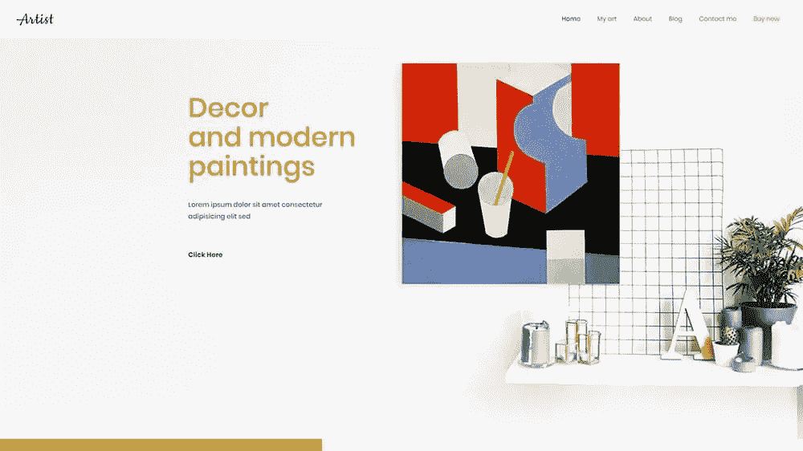](http://themes.muffingroup.com/be/artist2/?utm_source=sitepoint.com&utm_medium=content&utm_campaign=dec17)

**[设计 2](http://themes.muffingroup.com/be/design2/?utm_source=sitepoint.com&utm_medium=content&utm_campaign=dec17)**

[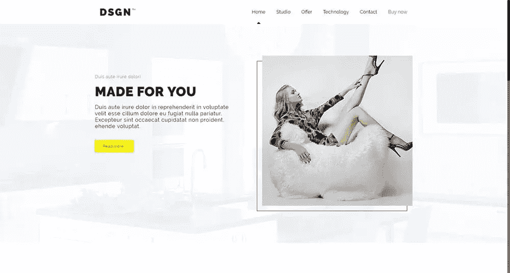](http://themes.muffingroup.com/be/design2/?utm_source=sitepoint.com&utm_medium=content&utm_campaign=dec17)

**[数字](http://themes.muffingroup.com/be/digital/?utm_source=sitepoint.com&utm_medium=content&utm_campaign=dec17)**

[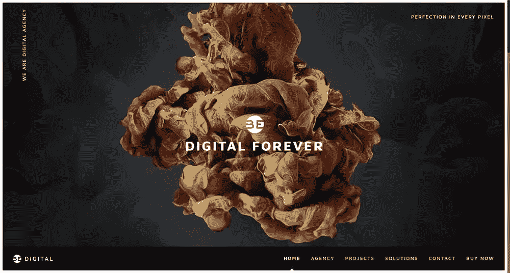](http://themes.muffingroup.com/be/digital/?utm_source=sitepoint.com&utm_medium=content&utm_campaign=dec17)

为摄影师、视觉艺术家或视频制作人找到完美的匹配毫无问题。建筑师和室内设计师也有多个选择，服装设计师和美容院就更不用说一堆了。博客作者也没有被排除在外，广告公司和营销人员也有很多选择。

这 60+预建的网站，每一个都不一样。每一个都是为了帮助你的客户在竞争中脱颖而出。然而，它们有几个共同的特征。

*   互动画廊是投资组合和展示产品的理想选择
*   强调大而醒目的图像
*   直观的导航，无论类别或页面的大小和构成如何
*   清晰的结构强调让客户的品牌清晰可见

### 30 多个单页预建网站

单页网站有独特性的倾向；这使得构建满足客户需求的单页页面变得困难。但是不要害怕，Be Theme 的 37 个不同的模板你都有。

**[落地](http://themes.muffingroup.com/be/landing/?utm_source=sitepoint.com&utm_medium=content&utm_campaign=dec17)**

[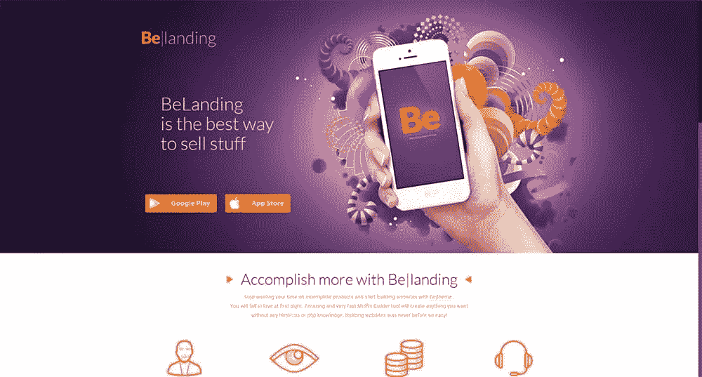](http://themes.muffingroup.com/be/landing/?utm_source=sitepoint.com&utm_medium=content&utm_campaign=dec17)

**[机构 2](http://themes.muffingroup.com/be/agency2/?utm_source=sitepoint.com&utm_medium=content&utm_campaign=dec17)**

[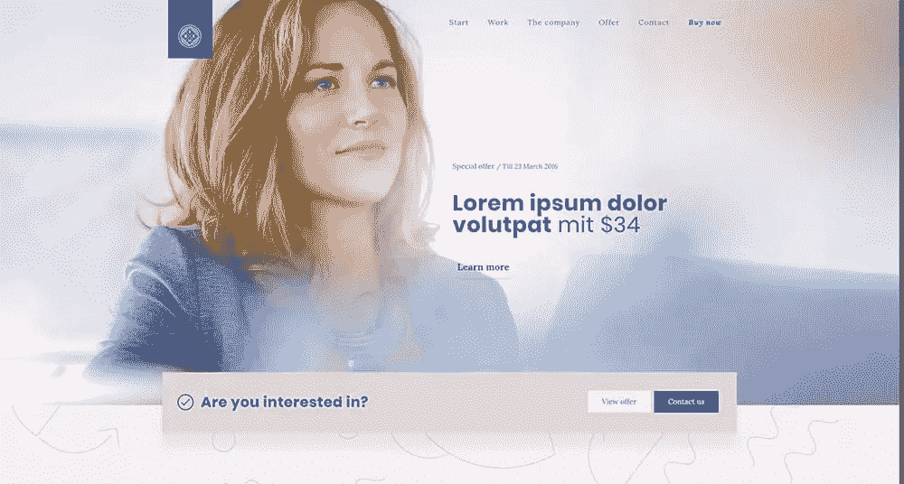](http://themes.muffingroup.com/be/agency2/?utm_source=sitepoint.com&utm_medium=content&utm_campaign=dec17)

**[电子书](http://themes.muffingroup.com/be/ebook/?utm_source=sitepoint.com&utm_medium=content&utm_campaign=dec17)**

[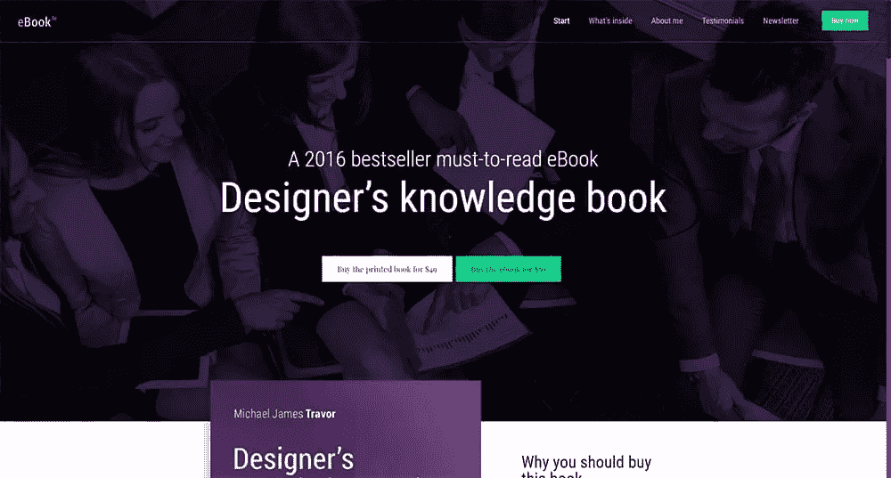](http://themes.muffingroup.com/be/ebook/?utm_source=sitepoint.com&utm_medium=content&utm_campaign=dec17)

这些一页纸的主题有很多值得喜欢的地方。每个主题都是有针对性的，每个主题都很好地利用了留白来创造一个很棒的设计。灵活的结构使你可以随心所欲地安排你的内容和媒体，在大多数情况下，你可以在不到 4 小时内建立一个单页网站

### 9+网上商店的预建网站

这些预建的网站是专门为电子商务企业设计的。

**[牛仔](http://themes.muffingroup.com/be/denim/?utm_source=sitepoint.com&utm_medium=content&utm_campaign=dec17)**

[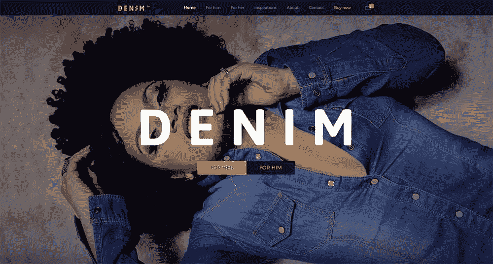](http://themes.muffingroup.com/be/denim/?utm_source=sitepoint.com&utm_medium=content&utm_campaign=dec17)

**[鞋子](http://themes.muffingroup.com/be/shoes/?utm_source=sitepoint.com&utm_medium=content&utm_campaign=dec17)**

[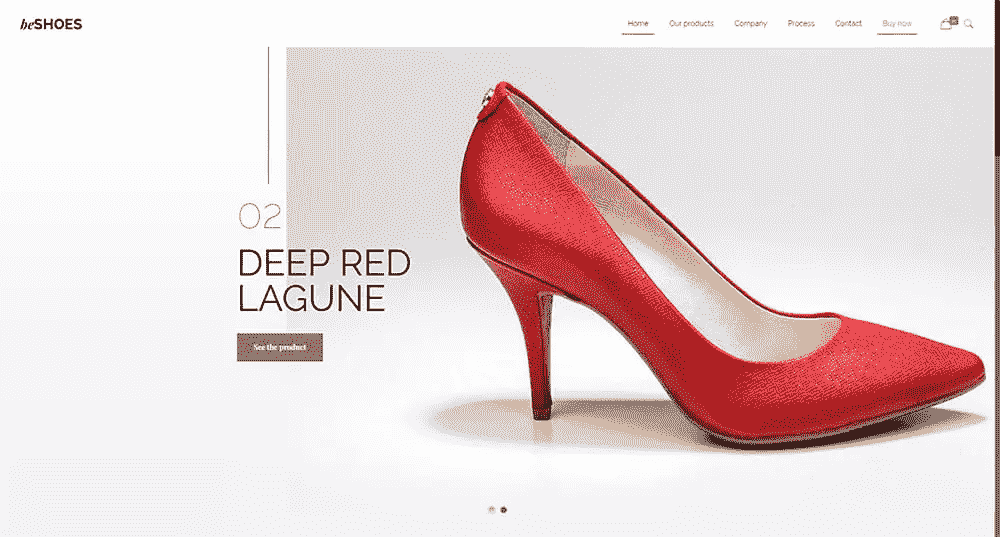](http://themes.muffingroup.com/be/shoes/?utm_source=sitepoint.com&utm_medium=content&utm_campaign=dec17)

**[商店](http://themes.muffingroup.com/be/store/?utm_source=sitepoint.com&utm_medium=content&utm_campaign=dec17)**

[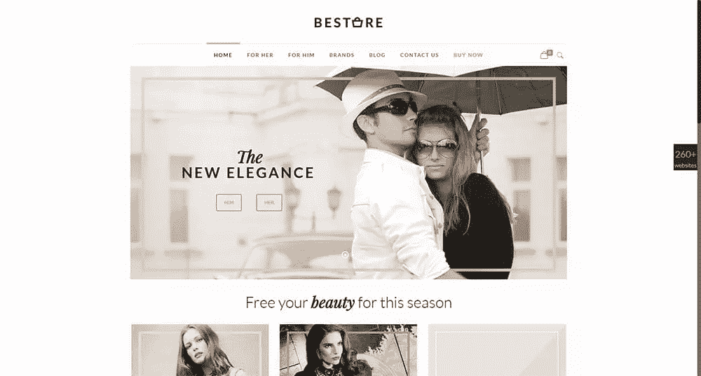](http://themes.muffingroup.com/be/store/?utm_source=sitepoint.com&utm_medium=content&utm_campaign=dec17)

查看产品图库，在这些模板中进行干净的设计！高质量的图像是上述三个例子的例证。但是，一定要注意它们易于使用的菜单和订单，更不用说它们与 Shopify 完美集成的事实。

我们还远没有完成。无论是什么样的领域，你一定会找到适合你需求的模板。你有:

**[诊所 2](http://themes.muffingroup.com/be/clinic2/?utm_source=sitepoint.com&utm_medium=content&utm_campaign=dec17)**

[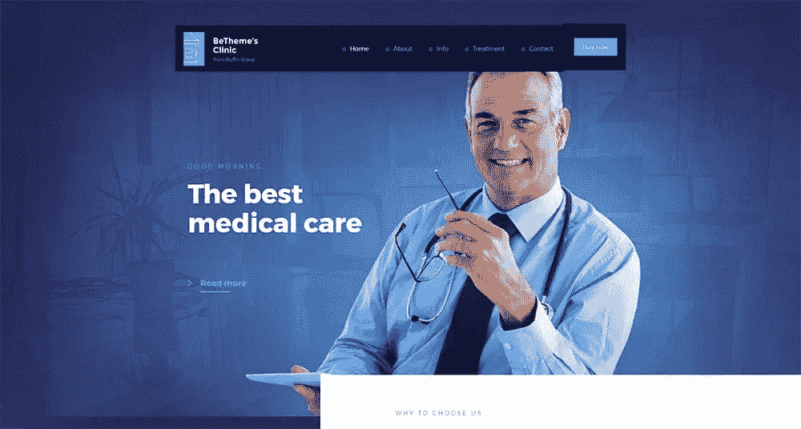](http://themes.muffingroup.com/be/clinic2/?utm_source=sitepoint.com&utm_medium=content&utm_campaign=dec17)

**[Spa2](http://themes.muffingroup.com/be/spa2/?utm_source=sitepoint.com&utm_medium=content&utm_campaign=dec17)**

[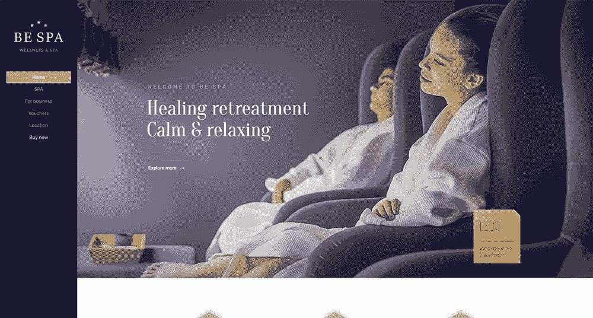](http://themes.muffingroup.com/be/spa2/?utm_source=sitepoint.com&utm_medium=content&utm_campaign=dec17)

**[草药](http://themes.muffingroup.com/be/herbal/?utm_source=sitepoint.com&utm_medium=content&utm_campaign=dec17)**

[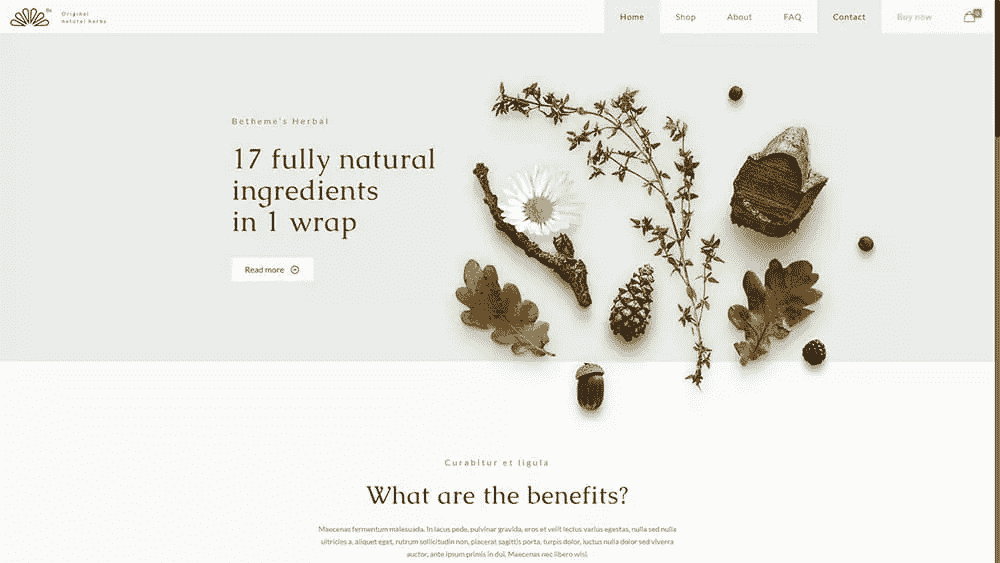](http://themes.muffingroup.com/be/herbal/?utm_source=sitepoint.com&utm_medium=content&utm_campaign=dec17)

### 12+适合健身和营养

**[私人教练](http://themes.muffingroup.com/be/personaltrainer/?utm_source=sitepoint.com&utm_medium=content&utm_campaign=dec17)**

**[体能](http://themes.muffingroup.com/be/fitness/?utm_source=sitepoint.com&utm_medium=content&utm_campaign=dec17)**

[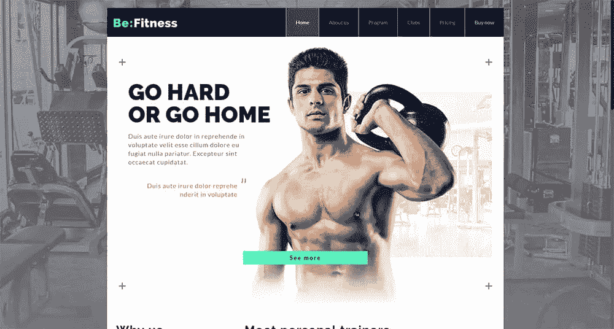](http://themes.muffingroup.com/be/fitness/?utm_source=sitepoint.com&utm_medium=content&utm_campaign=dec17)

[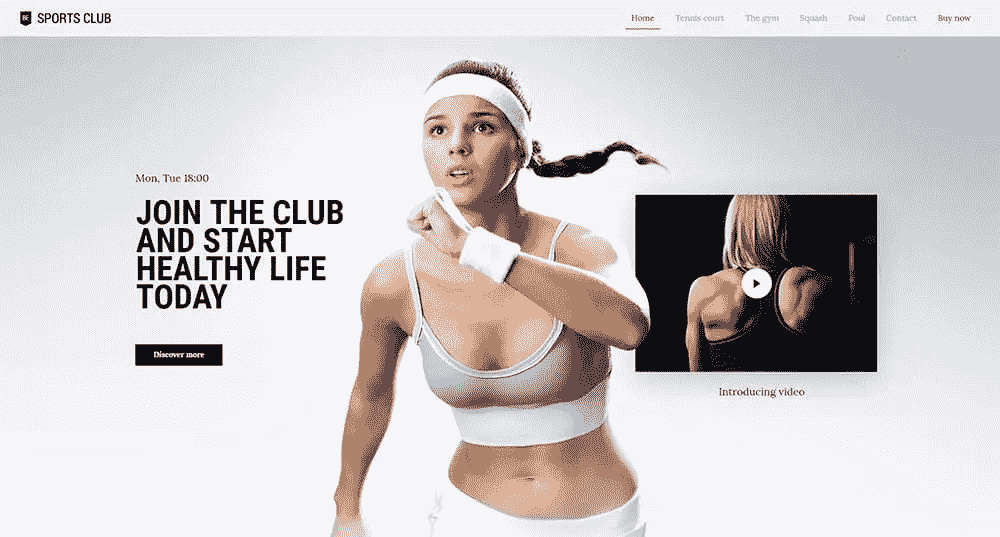](http://themes.muffingroup.com/be/sportsclub/?utm_source=sitepoint.com&utm_medium=content&utm_campaign=dec17)

### 16+适合活动和夜生活

**[结婚 2](http://themes.muffingroup.com/be/wedding2/?utm_source=sitepoint.com&utm_medium=content&utm_campaign=dec17)**

[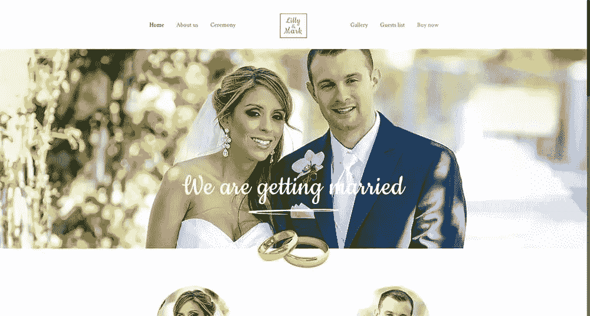](http://themes.muffingroup.com/be/wedding2/?utm_source=sitepoint.com&utm_medium=content&utm_campaign=dec17)

**赌场**

[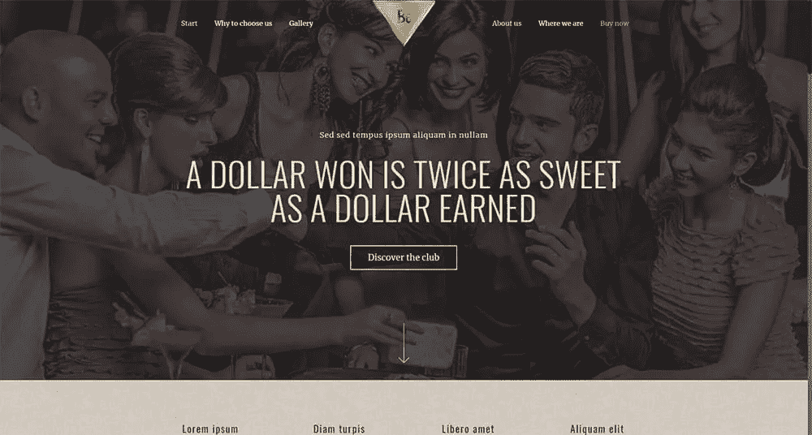](http://themes.muffingroup.com/be/casino/?utm_source=sitepoint.com&utm_medium=content&utm_campaign=dec17)

**[台球](http://themes.muffingroup.com/be/billiard/?utm_source=sitepoint.com&utm_medium=content&utm_campaign=dec17)**

[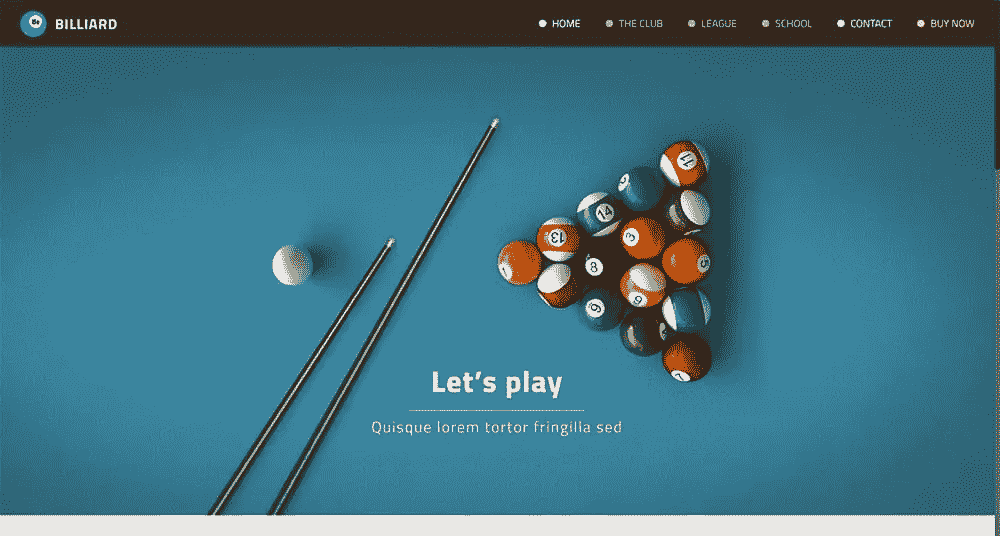](http://themes.muffingroup.com/be/billiard/?utm_source=sitepoint.com&utm_medium=content&utm_campaign=dec17)

### 餐馆、酒吧和咖啡馆的 9+

**[餐厅 2](http://themes.muffingroup.com/be/restaurant2/?utm_source=sitepoint.com&utm_medium=content&utm_campaign=dec17)**

[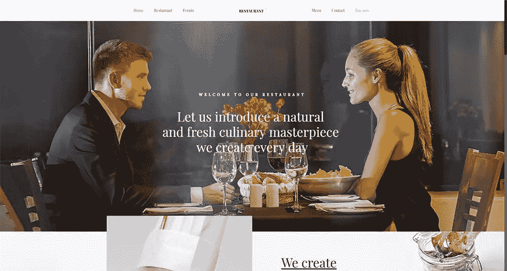](http://themes.muffingroup.com/be/restaurant2/?utm_source=sitepoint.com&utm_medium=content&utm_campaign=dec17)

**[小酒馆](http://themes.muffingroup.com/be/bistro/?utm_source=sitepoint.com&utm_medium=content&utm_campaign=dec17)**

**[cafe 2](http://themes.muffingroup.com/be/cafe2/?utm_source=sitepoint.com&utm_medium=content&utm_campaign=dec17)**

### 10+IT 服务和产品

**[IT](http://themes.muffingroup.com/be/it/?utm_source=sitepoint.com&utm_medium=content&utm_campaign=dec17)**

**[游戏](http://themes.muffingroup.com/be/game/?utm_source=sitepoint.com&utm_medium=content&utm_campaign=dec17)**

[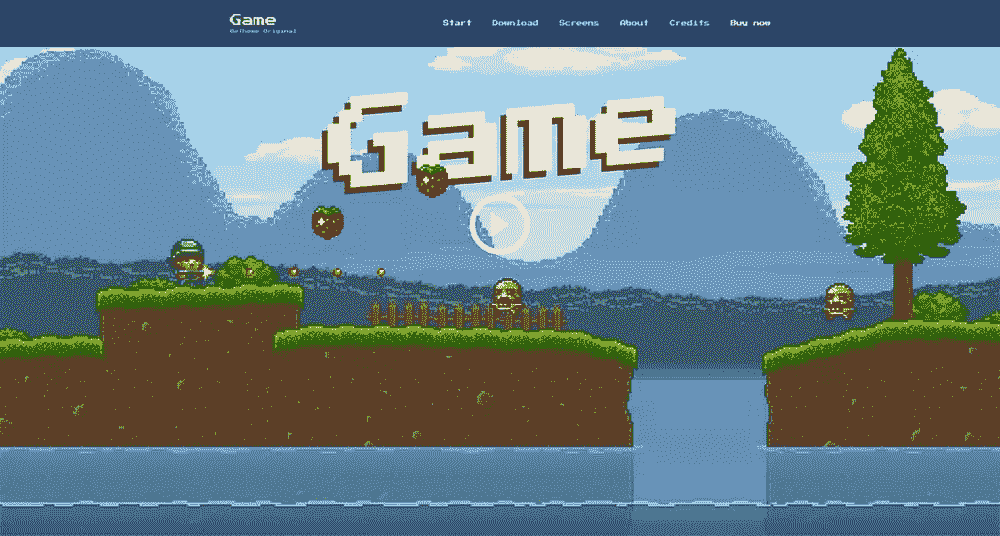](http://themes.muffingroup.com/be/game/?utm_source=sitepoint.com&utm_medium=content&utm_campaign=dec17)

**[代号](http://themes.muffingroup.com/be/code/?utm_source=sitepoint.com&utm_medium=content&utm_campaign=dec17)**

[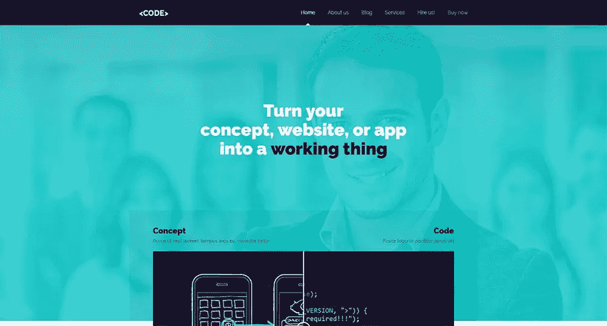](http://themes.muffingroup.com/be/code/?utm_source=sitepoint.com&utm_medium=content&utm_campaign=dec17)

### 最后，同样重要的是，金融和簿记的 7+分

[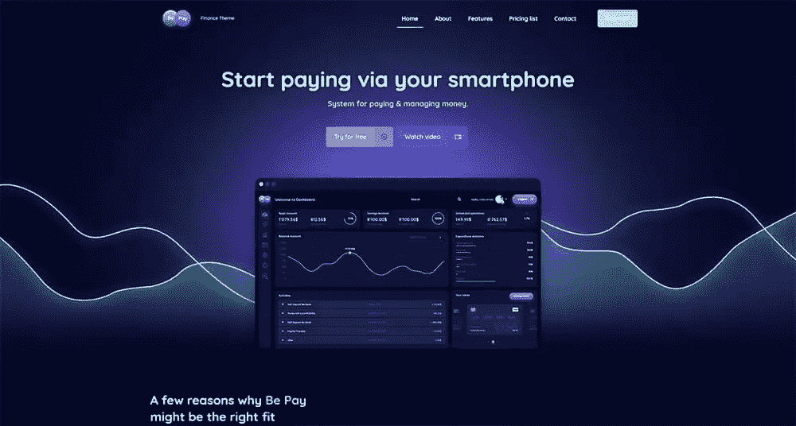](http://themes.muffingroup.com/be/pay/?utm_source=sitepoint.com&utm_medium=content&utm_campaign=dec17)

**[投资](http://themes.muffingroup.com/be/investment/?utm_source=sitepoint.com&utm_medium=content&utm_campaign=dec17)**

[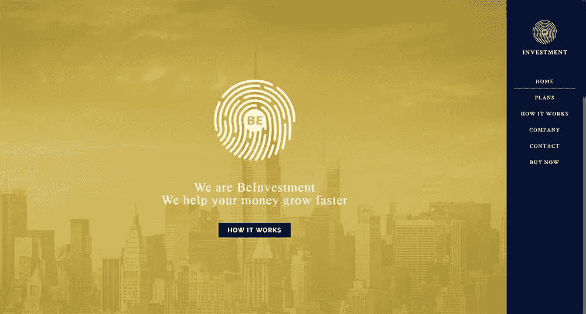](http://themes.muffingroup.com/be/investment/?utm_source=sitepoint.com&utm_medium=content&utm_campaign=dec17)

**[会计](http://themes.muffingroup.com/be/accountant/?utm_source=sitepoint.com&utm_medium=content&utm_campaign=dec17)**

[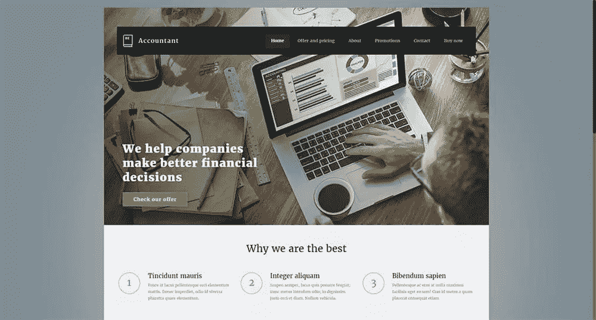](http://themes.muffingroup.com/be/accountant/?utm_source=sitepoint.com&utm_medium=content&utm_campaign=dec17)

## 2.建立一个清晰的工作流程，并与你的客户分享，让自己看起来像个专家

你会从使用这些预建的网站中获得很多好处。其中之一是你可以轻松地把客户拉进来。他们想知道他们从一开始就能从你那里得到什么，而你恰恰能给他们提供这些。

你可以让他们相信你有能力在截止日期前完成工作。他们也会确信自己有能力在你进行过程中为你提供任何必要的反馈。

但是有时候，仅仅有现成的网站是不够的。在这种情况下，您可以向他们提供概述您的工作流程的文档。这样做会让你看起来像个专业人士；一个有经验的人，已经为其他客户做过几百次了。

这些步骤需要什么？

*   他们什么时候能收到你的提议
*   如果需要的话，他们什么时候能得到一份合同
*   他们什么时候能收到发票。对于预付款，50-50 付款，或任务完成后付款
*   完成任务的期限加上任何临时期限。还要注意客户是否可以在任何时候提供反馈，或者仅在签署时提供反馈
*   您还需要指定如何管理修订或变更。另外，哪些包含在报价中，哪些需要额外收费

你的文档应该易于理解、简洁和完整。你不希望你的客户经历任何不必要的或不愉快的惊喜

## 3.提前交付额外的惊喜，超越客户的期望

给客户一两个意想不到的惊喜应该不成问题。除非是紧急工作，否则你通常有协商最后期限的自由。

给你的估计增加足够的天数，以考虑到意外事件或故障。然后，提前交付超出预期的产品，给你的客户一个惊喜。

## 总结

这些想法应该可以帮助你在 2018 年达到并超越客户的期望。

*   使用 [Be Theme](http://themes.muffingroup.com/be/splash/?utm_source=sitepoint.com&utm_medium=content&utm_campaign=dec17) 作为你的工具，每次都能交付设计完美的网站。
*   制定一个让你看起来像专业人士的客户入职流程
*   提前交货让你的客户开心。还有。不要忘记告诉他或她你有多感激有机会为他或她服务。

## 分享这篇文章