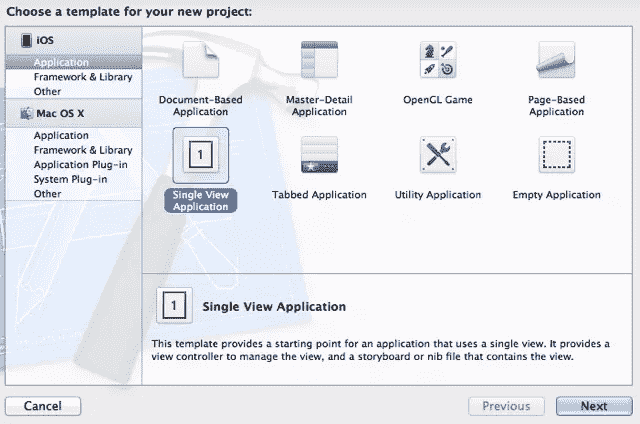
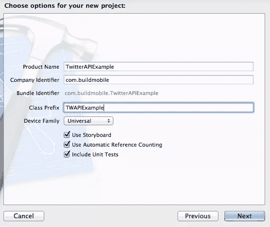
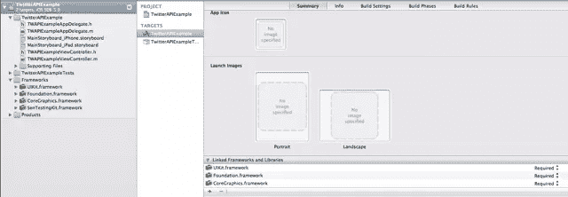
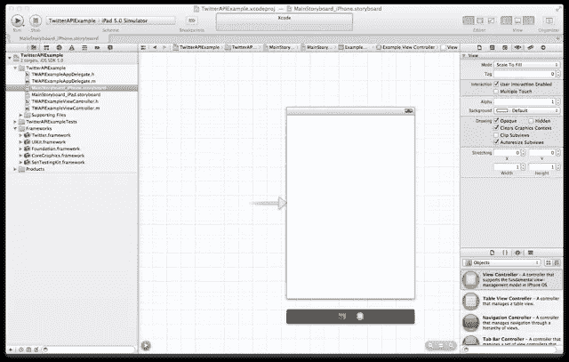
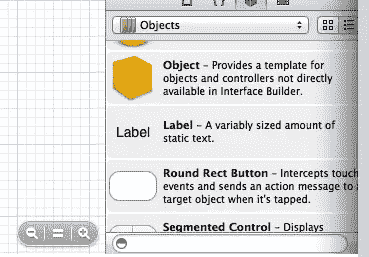
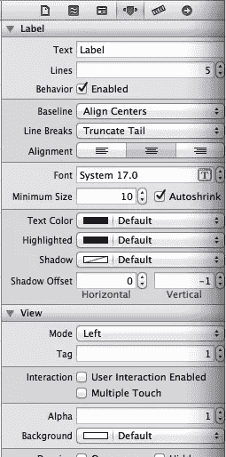

# 在 iOS5 中处理 Twitter API

> 原文：<https://www.sitepoint.com/handling-the-twitter-api-in-ios5/>

今天，我将从写关于[或](https://www.sitepoint.com/ios-development-basics-orny-2/)的文章中抽出一点时间来讨论[苹果的 Twitter](http://developer.apple.com/search/index.php?q=twitter) 集成 API，这是在 [iOS 5 SDK](http://developer.apple.com/technologies/ios5/) 中新引入的。

具体来说，我们将介绍 Twitter 框架(对`NSHTTPRequest`的详细阐述)、Accounts 框架(一个用于存储和管理帐户凭证的中央框架和守护进程)，我们将简要介绍`NSJSONSerialization`，这是苹果以前私有的(现在是公开的)JSON-to-Foundation-Object 解析器的实现(它也以相反的方式工作)。

### 开始

我将假设你已经阅读了我们之前的 [iOS 教程](https://www.sitepoint.com/mobile/ios/)，并且知道如何开始一个新项目。在 Xcode 的新版本中，情况略有不同，但没有大到过去的指令已经过时的地步。创建一个新项目，使用以下图片作为线索。

[](https://www.sitepoint.com/wp-content/uploads/2011/11/screenshot_1.png)
[](https://www.sitepoint.com/wp-content/uploads/2011/11/screenshot_2.png)

对于那些没有图像的，我们使用*单视图应用*模板，添加一个“TWAPIExample”的*类前缀*,*设备系列*是“通用的”并且所有三个复选框都被勾选，因为我们使用*故事板*、*自动引用计数*并且我们希望*包括单元测试*。

### 稀疏的文档

在撰写本文时，关于这些框架的文档还处于早期阶段。我尽了最大努力将 API 文档中的东西拼凑在一起，并在这里给出一个连贯的概述。然而，在使用这些代码之前，你一定要阅读 Apple 的文档(因为在你阅读本文档时，这些代码可能已经发生了变化)。

### 形成一致的请求

首先，我们将做一个简单的请求，从 Twitter 的公共消防水管获取一些结果。这不需要认证。我们将抓取一条公共推文，并在应用加载时将其弹出到屏幕上的`UILabel`中。没什么特别的。

#### 添加框架

在使用`TWRequest`类之前，我们需要将框架添加到我们的项目中。如果您不熟悉框架，它们是 iOS API 的可选部分，您的应用程序可以在编译时包含它们。添加框架让 Xcode 知道你想在你的应用中使用这些特性。

选择您的项目，向下滚动到*链接的框架和库*部分(在*摘要*标题下)。单击加号箭头，向下滚动直到找到“Twitter.framework”。补充一下。(在撰写本文时，我发现列表顶部的文本输入搜索框无法工作。YMMV 如有疑问，请手动滚动)。

[](https://www.sitepoint.com/wp-content/uploads/2011/11/screenshot_3.png)

#### 指定 URL

我们需要做的第一件事是指定我们要点击的 URL 来获取数据。我们获得了一些优秀的 API 文档，例如完整的 [Twitter REST API 资源](https://dev.twitter.com/docs/api)列表。我们将在这个应用程序中使用 REST API。还提供了一个 [Twitter 流 API](https://dev.twitter.com/docs/streaming-api) ，用于对大量 Twitter 数据的高容量、接近实时的访问，这远远超出了我们在这个例子中想要实现的范围。

苹果在`TWRequest`上的文档并没有真正说明它期望 URL 采用什么形式，但是正如我所猜测和实验发现的，它想要 Twitter 的 API 的完整 URL，加上文档中指定的路径。在这种情况下，我们想要的 URL 是:

```
https://api.twitter.com/1/statuses/public_timeline.json 
```

#### 指定参数

对象允许我们指定可选参数，可能的值，如 Twitter API 文档中所述。我们将这些编码为一个基础字典对象(键值对)，指定我们只希望返回一条 Tweet。这样做的代码如下所示:

```
NSDictionary *parameters = [NSDictionary dictionaryWithObjectsAndKeys:@"1", @"count", nil]; 
```

#### 添加 UILabel 对象

在 Xcode 的最新版本中，我们现在可以访问两个*故事板*。

*故事板*取代了之前 iOS 项目中所有的 NIB 文件。现在所有的`Views`都出现在同一个*故事板*上，并被附加到各自的`ViewControllers`上。你可以更容易地从*故事板*中感受到你的应用程序是如何结合在一起的，尽管它可能会变得更加混乱。

点击 iPhone UI ( `MainStoryboard_iPhone.storyboard`)的*故事板*，选择`View`。将一个`Label`拖放到`View`的中心，选择`Label`，并导航到其属性。把下面三张截图看完，我们在底部碰头改属性。

[](https://www.sitepoint.com/wp-content/uploads/2011/11/screenshot_4.png)
[](https://www.sitepoint.com/wp-content/uploads/2011/11/screenshot_5.png)
[](https://www.sitepoint.com/wp-content/uploads/2011/11/screenshot_6.png)

给`View`一个标签(我在这个例子中用了“1”，只是一个整数，没什么特别的)。我选择使用对齐控件居中对齐我的文本，并将*行*增加到 5 行(允许标签扩展到 5 行，而不是截断文本。)

接下来，转到`Label`的“查看属性”选项卡。您可能希望调整`Label`的大小，使其更漂亮、更大，这样它就可以显示一条完整的 Tweet。抓住边缘，将其展开以填充可用空间。您还想使它成为多行标签，所以在名为*行*的字段中(见上面的截图)，将数字增加到 3 或 4。为你的 iPad *故事板*重复上述步骤，确保使用相同的标签！

#### 创建 TWRequest 对象

我们将向我们的`ViewController`对象添加一条消息`getTweet`。首先，我们需要将 Twitter API 头添加到第 10 行附近的`ViewController`的头类`TWAPIExampleViewController.h`中。我们将在第 13 行指定我们需要的函数和方法。

```
#import <UIKit/UIKit.h>
#import <Twitter/Twitter.h>

@interface TweetAMaticViewController : UIViewController
    @property (nonatomic, retain) UILabel *tweetLabel;

-(void)getTweet;

@end 
```

我们将使用`tweetLabel`属性作为我们在`View`中的`UILabel`的句柄，因此我们可以随意地轻松引用它。我们已经定义了一个`@property`，所以我们当然需要在开始实现时在`TWAPIExampleViewController.m`中`@synthesize`它:

```
@implementation TWAPIExampleViewController

@synthesize tweetLabel;

- (void)didReceiveMemoryWarning
{ 
```

现在，让我们定义我们将用来获取 tweet 的函数，就在我们在`TWAPIExampleViewController.m`中实现的`@end`之前。

```
#pragma mark - Twitter Interactions

-(void)getTweet
{
    // Specify the URL and parameters
    NSURL *url = [NSURL URLWithString:@"https://api.twitter.com/1/statuses/public_timeline.json"];   
    NSDictionary *parameters = [NSDictionary dictionaryWithObjectsAndKeys:@"1", @"count", nil];

    // Create the TweetRequest object
    TWRequest *tweetRequest = [[TWRequest alloc] initWithURL:url parameters:parameters requestMethod:TWRequestMethodGET];    

    [tweetRequest performRequestWithHandler:^(NSData *responseData, NSHTTPURLResponse *urlResponse, NSError *error) {
        // Request completed and we have data
        // Output it!

        NSError *jsonError = nil;
        id timelineData = [NSJSONSerialization JSONObjectWithData:responseData options:NSJSONReadingMutableContainers error:&jsonError];

        if(timelineData == NULL) {
            // There was an error changing the data to a Foundation Object,
            // so we'll output a bunch of debug information.
            NSString *myString = [[NSString alloc] initWithData:responseData encoding:NSUTF8StringEncoding];
            NSLog(@"nnConversion to object failed.");
            NSLog(@"HTTP Response code: %d", [urlResponse statusCode]);
            NSLog(@"Output from server: %@", myString);
            NSLog(@"JSON Error: %@nn", [jsonError localizedDescription]);
            abort();
            // TODO: Show a graceful error message here
        }

        NSDictionary *timelineDict = (NSDictionary*) timelineData;
        NSLog(@"nnConversion succeeded!");
        NSLog(@"%@nn", timelineDict);

        self.tweetLabel.text = [[(NSArray*)timelineDict objectAtIndex:0] objectForKey:@"text"];

    }];
} 
```

咻，忙功能！我们或许可以通过分解它并将许多功能转移到另一个类来对其进行实质性的重构，但目前我们将保持原样。把这个重构看作是读者的一个练习，如果你愿意的话，可以看作是家庭作业。

会将信息输出到控制台，您可以使用 Console.App 查看这些信息。这是一种从您的应用程序中获取信息的非常俗气的方式(您最好熟悉调试器),但这是一种开始和诊断简单问题的简单方式(调试器有时在处理大字符串和显示复杂数据时会有问题)。)

我们在`performRequestWithHandler`之后使用一个块来处理来自服务器的响应。块是闭包的 Objective-C 2.0 实现，对它们的解释超出了本文的范围，但是它是封装简单代码块的一种便捷方式，而不必将其封装在自身的函数中(并且应该为房间中的任何 Javascript 开发人员所熟悉)。

最后，我们设置了`self.tweetLabel`的文本属性…哦，但是我们还没有一个句柄，不是吗？

#### 处理和显示响应

我们需要抓住我们的`Label`，并且调用我们的`getTweet`消息。我们将在`ViewController`的`viewDidLoad`消息中这样做，它定义了一旦`View`从一个 NIB 文件中加载后要采取的动作。

```
- (void)viewDidLoad
{
    [super viewDidLoad];

    self.tweetLabel = (UILabel*)[self.view viewWithTag:1];

    [self getTweet];
} 
```

还记得我们之前如何在`View`中的`Label`上设置标签吗？我们现在使用这个标签来引用那个`View`组件，并获取它，这样我们就可以修改它。

### 结论

如果你编译并运行这个程序，它应该会从 Twitter 的公共消防水管中拉出一条 Tweet。谁知道它会来自哪里，或者它会是什么语言！？

现在你应该掌握了足够的知识来通过 Twitter 的 API 显示一条推文，包括一些元数据，如作者的屏幕名称和日期时间，这只是复制我们对标签所做的事情。如果你感觉特别勤奋，你甚至可以使用位置信息显示一张地图，如果推文中包含它…

## 分享这篇文章