# Android Wear 开发人员 SDK 实践

> 原文：<https://www.sitepoint.com/hands-android-wear-developer-sdk/>

谷歌最近公布了 Android Wear 开发者预览版。它旨在为现有的 Android 应用程序创建可穿戴体验，这些应用程序可能会出现在即将推出的方形和圆形 Android 可穿戴设备上，如手表。

您可以使用 Android Wear APIs 自定义和扩展通知。它为连接到 Android 智能手机的可穿戴设备创造了标准的用户体验。

谷歌声明 Android wear 如下:

> 小而强大的装置，戴在身上。在你最需要的时候提供有用的信息。对口头问题的明智回答。帮助达到健身目标的工具。你开启多屏世界的钥匙。

谷歌已经为 Android Wear 提供了一个 SDK 更新、一个模拟器和几个其他工具。目前，您需要注册参加 [Android Wear 开发者预览版](http://developer.android.com/wear/preview/start.html):

理解可穿戴设备如何工作的一个很好的起点是谷歌制作的这个 YouTube 视频。

## Android Wear 系统映像安装

如果你还没有，从下载 [Android SDK](https://developer.android.com/sdk/index.html) 开始。下载后，解压文件夹。它由以下文件夹结构组成:

*   Eclipse IDE(文件夹)
*   SDK(文件夹)
*   SDK 管理器(应用程序)

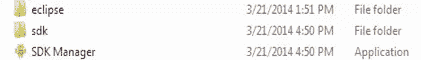

*   启动 *SDK 管理器* :
    注意:如果你的 Android SDK 工具版本低于 22.6，就需要更新了。
*   进入*包*，选择*安卓 SDK 工具*。

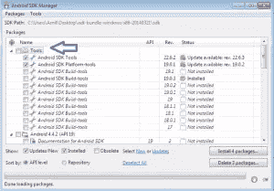

*   在 Android 4.4.2 (API 19)下面，选择 **Android Wear ARM EABI v7a 系统镜像**安装 Android Wear:

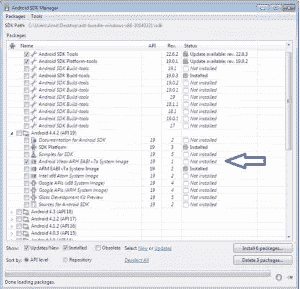

*   在 *Extras* 下面，确保你有最新版本的*安卓支持库*。如果有更新的版本，请更新它。
    如果你使用的是 Android Studio，也可以选择 *Android 支持库*。
*   如下图，点击*安装包*，*接受许可*，点击*安装*。

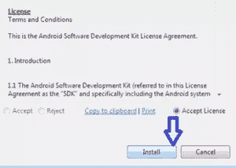

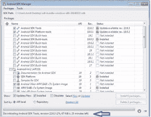

*   安装后，检查版本是否高于 *22.6* :

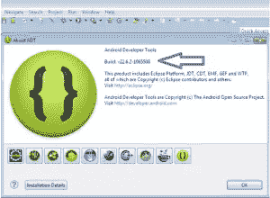

*   安装完成后重启 *Android SDK 管理器*。

## Android Wear 模拟器设置

要设置 Android Wear 模拟器，请使用刚刚下载的系统映像为 Wear 创建一个新的 *Android 虚拟设备(AVD)* 。有两种皮肤可供选择，*圆形*和*方形*。我这里用了*圆*。

*   启动 *Android 虚拟设备管理器*从 *Eclipse，选择窗口> Android 虚拟设备管理器*。

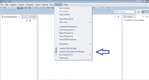

*   点击*新建*创建新的 *Android 虚拟设备*:

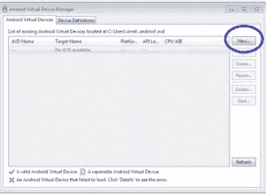

*输入以下详细信息:

**AVD 名称**:这是 Android 虚拟设备名称，我用过“Amit _ AndroidWearRound”
**设备**:从圆形或方形中选择，我选择了 Android Wear Round (320 x 320: hdpi)来模拟一个‘手表’。
**目标**:选择 Android 4 . 4 . 2——API 等级 19(或更高)
**CPU/ABI**:Android Wear ARM(armea bi-v7a)。
**键盘**:保持*硬件键盘存在*被选中，这样你就可以提供文本输入而不是语音输入。
**皮肤**:选择 *AndroidWearSquare* 或 *AndroidWearRound* 。我选择了*和*机器人

其余部分保持默认，点击*确定*

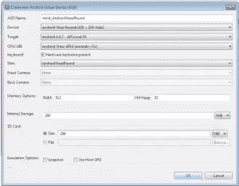

*   现在可以看到现有 AVD 的列表，显示 *AVD Amit_AndroidWearRound* :

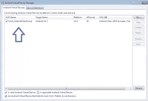

*   选择并点击*开始*。出现*【发射选项】*窗口，点击*发射*。

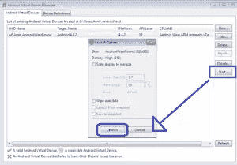

*   现在，点击启动后，等待 Android 模拟器加载。

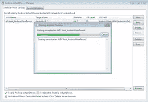

*   Android Wear 模拟器现在将启动。它将看起来像下面的图片。

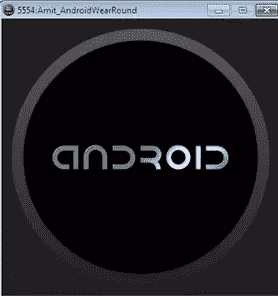

*   在模拟器中看到的时间和断开的电话图标没有什么可担心的。它显示模拟器没有连接到电话。这表明您正在正确地遵循这些步骤。

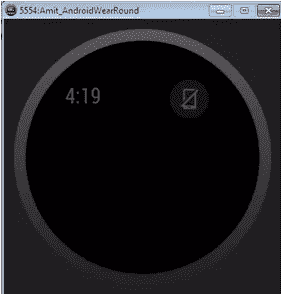

## Android Wear 预览应用程序设置

要在 Android Wear 模拟器上查看应用程序的通知，请按照以下步骤下载 Android Wear 预览应用程序和支持库:

使用谷歌账户注册开发者预览版。

注意:使用同一个谷歌帐户从 Play Store 接收 Android Wear 预览应用程序

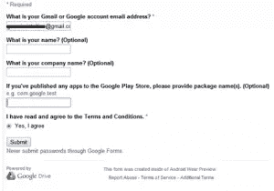

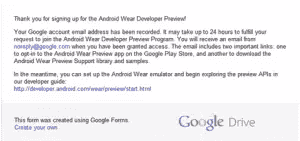

*   检查您的电子邮件，您会收到一封确认电子邮件，如下所示。该电子邮件将包括:
    *   选择加入 Android Wear 预览版应用测试计划的链接。一旦您选择加入，该应用程序可能需要 24 小时才能在 Play Store 中可用。
    *   下载预览支持库和示例的链接

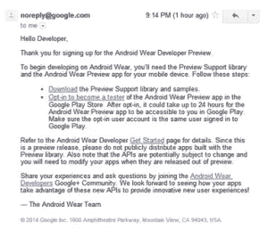

*   从上面选择“选择加入成为测试员”，您将被重定向到谷歌 Play 商店。现在，点击“成为测试者”:
*   您现在已经成功注册为测试员。

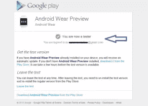

*   该应用程序可能需要 24 小时才能在 Play Store 中发布。从上面使用的同一个帐户登录，并下载如图所示的 *Android Wear 预览应用*。

*注意:*您的设备需要运行 Android 4.3 及更高版本

安装 Android Wear 预览应用程序后，设置您的设备与 Android Wear 模拟器通信:

*   打开 Android Wear 预览应用，它当前会说*“该应用当前未启用为通知监听器”*。点击信息以打开系统设置。要授予其通知权限，请选择 *Android Wear 预览*。
*   使用 USB 将设备连接到开发机器。
    *注意:*不得将其他安卓设备连接到机器上。
*   确保 Android Wear 模拟器正在运行，即我们之前创建的模拟器。模拟器应该处于相同的状态，显示时间和表示没有设备连接的断开图标。
*   打开命令行终端，导航到 Android SDK 的 platform-tools/目录并执行以下命令(请记住，每次通过 USB 连接设备时都会执行该命令)。

`adb -d forward tcp:5601 tcp:5601`

*   接下来，返回 Android Wear 预览应用。Android Wear 模拟器现在将显示“g”orb 图标，表明它已与您的 Android 设备配对。

现在，来自您设备的通知也会出现在 Android Wear 模拟器中。

*注意:*您可能会得到“错误:找不到设备”错误。这意味着 Android 设备没有与计算机一起正确设置以进行调试。你可能要在开发者选项里开启 USB 调试模式，安装合适的 USB 设备驱动:
**设置- >开发者选项- >开启 USB 调试**

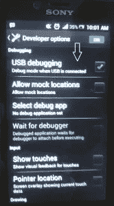

## 一些有趣的 Android Wear 通知

完成这个设置后，您应该能够在模拟器上看到通知。举个简单的例子，试着拨打你的电话，观察可穿戴模拟器会发生什么。

下面列出了一些通知示例，这些示例摘自官方 [Android Wear 开发者网站](http://developer.android.com/wear/index.html):

### 上下文流:

*   显示卡片的垂直列表。
*   每张卡片都展示了潜在的有用信息。
*   屏幕上一次显示一张卡片。
*   背景图像可以提供额外的视觉信息。
*   如果卡没有被使用，可以通过从左到右交换来移除。

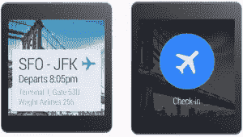

### 提示卡

*   提示卡通过语音输入打开，例如，*“Ok Google”*。
*   也可以通过点击主屏幕上的*“g”*图标来启动。
*   它允许用户对着他们的设备说话。
*   在提示卡上向上滑动会显示一个动作列表。

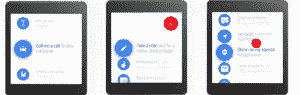

### 通知

*   通知是 Android Wear 的核心组件。
*   它们应优先反映通知的紧急程度。
*   时间敏感的通知具有高优先级。

### 行动

*   出现在通知的右侧。
*   最多允许三个动作。
*   这些是可选的。
*   动作由图标和标题组成。
*   标题应该保持简短。

### 页

*   使用页面提供附加内容和信息，而不是主要通知中的打包信息。
*   页面立即出现在主通知卡的右侧。
*   它可以是下一趟列车出发卡，显示天气预报、预定比赛等的卡。

### 语音回复

*   提供口述短消息的免提方法。
*   由消息应用程序使用，并建议用于在您提供的选项中涵盖一系列简单、中性的回复。
*   可以提供五个建议的回答。

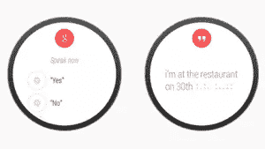

## 未来计划

谷歌计划为 Android wear 推出新的 API，这将有助于开发者创建更多定制应用。它可能包含以下特征:

### 构建自定义用户界面

直接在可穿戴设备上创建自定义卡片布局和运行活动。

### 发送数据

支持通过数据复制 API 和远程过程调用(RPC)在可穿戴设备和手机之间发送数据和动作。

### 控制传感器

收集传感器数据并在 Android 可穿戴设备上实时显示的能力。

即将到来的发展还包括:

*   推出 Android Wear SDK。
*   Android 与不同供应商合作推出由可穿戴设备驱动的设备。

Android wearable 提供的更多示例将在我的下一篇文章中讨论，其中包括创建通知、接收语音回复等等。在此之前，只需通过注册开发者预览版并遵循上面给出的步骤来尝试一下。

## 分享这篇文章