# 动手与侠盗猎车手 3:10 周年纪念版

> 原文：<https://www.sitepoint.com/hands-on-with-grand-theft-auto-iii-10-year-anniversary-edition/>

《侠盗猎车手 3》标志着动作/冒险类电子游戏的突破性转变。十多年前，流行的射击游戏突然出现，游戏玩家体验到了类似好莱坞大片的[有组织犯罪](http://gta.wikia.com/Gangs_in_GTA_III)和肆无忌惮的伤害。最近， [Rockstar Games](http://www.rockstargames.com/) 发布了一款适用于 iOS 和部分 Android 设备的 GTA III 端口，以庆祝游戏 10 周年。史诗般的[自由城](http://gta.wikia.com/Liberty_City_in_GTA_III_Era)暴力和复仇传奇会转化为移动设备吗？让我们来了解一下！

* * *

<iframe width="640" height="360">
 
 <h3>首轮放映</h3> 
目前有 20 款 Android 设备可以运行《侠盗猎车手 3:十周年纪念版》:
 <ul> <li>Acer Iconia</li> <li>华硕 Eee Pad 变压器</li> <li>戴尔 Streak 7</li> <li>星系联系</li> <li>HTC Rezound</li> <li>LG Optimus 2x</li> <li>LG Optimus Pad</li> <li>摩托罗拉心房 4G</li> <li>摩托罗拉 Droid Bionic</li> <li>摩托罗拉机器人 X2</li> <li>摩托罗拉光子 4G</li> <li>摩托罗拉 Xoom</li> <li>三星 Galaxy R</li> <li>三星 Galaxy S II</li> <li>三星 Galaxy Tab 8.9</li> <li>三星 Galaxy Tab 10.1</li> <li>索尼爱立信 Xperia Play</li> <li>索尼平板电脑 S</li> <li>T-Mobile G2x</li> <li>东芝茁壮成长</li> </ul> 
如果你没有这些设备，只要你有 Android 2.2 或更高版本，你仍然可以玩游戏。您的里程可能会有所不同。在这篇评测中，我使用的是三星 Galaxy S II。
 
如果你急于在安装游戏后就投入战斗，那你得等一会儿。第一次运行时，游戏下载了超过 400MB 的数据，这是开始前所必需的。总下载时间大约需要 5-6 分钟，取决于您的连接速度。
 
下载完附加文件后，您就可以开始游戏了。
 
 
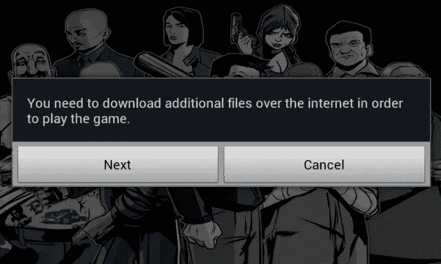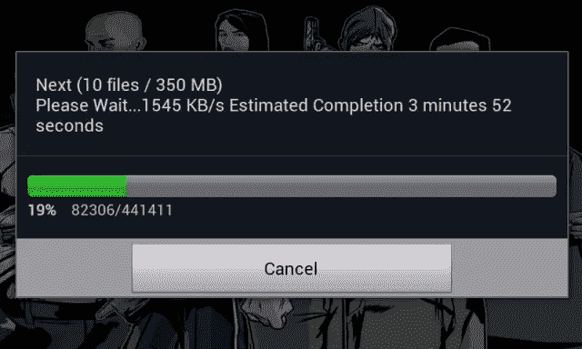 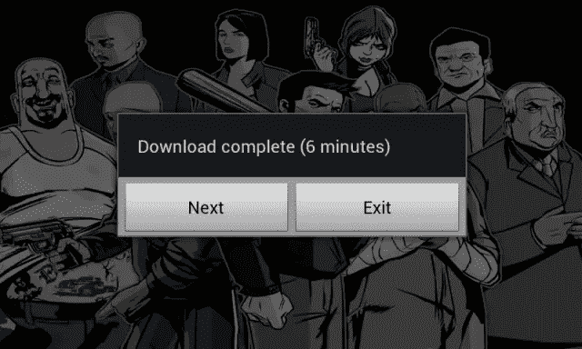
 
 <h3>主屏幕和选项</h3> 
从主屏幕可以看到，你有三个选项可以选择:<strong>开始游戏</strong>、<strong>选项</strong>和<strong>退出游戏</strong>。虽然你可能很想直接跳进来，开始游街并袭击平民，但先花点时间在<strong>选项</strong>部分。尽管这款游戏是 PS2 经典的忠实移植，但界面已经改变，以适应触摸屏设备。
 
 
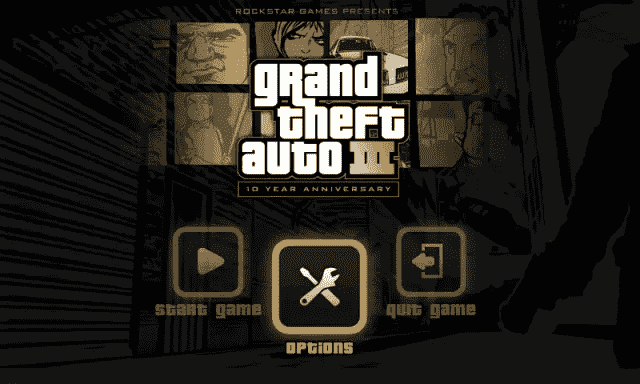 
 
 
<strong>选项</strong>部分包括五个选项:<strong>控制</strong>、<strong>音频</strong>、<strong>显示</strong>、<strong>语言</strong>、<strong>主菜单</strong>。<strong>控制</strong>屏幕包括用于调整摄像机视角以及重新定位和调整触摸屏控制的选项。(游戏的最新版本也支持蓝牙控制器，包括<a href="http://www.gamestop.com/android/accessories/tablet-wireless-bluetooth-controller/97838" target="_blank"> Gamestop 无线游戏控制器</a>。)我强烈推荐查看<strong>视图控件</strong>链接，因为它包含所有触摸屏图标的便捷图例。
 
 
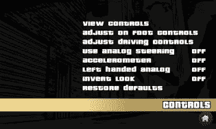 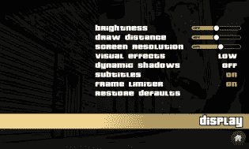
 
 
<strong>音频</strong>部分包括一个用于调整音乐音量和音效的页面，你可以切换振动反馈。<strong>显示</strong>部分可以让你调整游戏的亮度、屏幕分辨率、字幕和其他视觉效果。根据您设备的处理器，您可能需要编辑这些设置，以获得更流畅的游戏体验。<strong>语言</strong>部分给你六种不同的语言选项(英语、法语、德语、意大利语、西班牙语、日语)，而<strong>主菜单</strong>按钮带你回到主屏幕。
 
当您完全配置好选项后，<em>现在</em>您就可以开始游戏了。
 <h3>游戏部分</h3> 
尽管这是 Playstation 2 游戏的移动端口，但声音和图像都没有受到影响。全动态过场动画包括语音音频，用户可以在自由城的街道上开车时从几个电台中选择。无论你是在手机上玩还是在平板电脑上玩，你都能获得完整的 GTA III 体验。新手和经验丰富的老手都会喜欢城市，自由式游戏<a href="http://gta.wikia.com/Businesses_in_GTA_III" target="_blank">环境</a>，各种不同的<a href="http://gta.wikia.com/Vehicles_in_GTA_III" target="_blank">车辆</a>，多彩的自由城<a href="http://gta.wikia.com/Category:Characters_in_GTA_III" target="_blank">居民</a>，以及贯穿整个游戏的几十个<a href="http://gta.wikia.com/Missions_in_GTA_III" target="_blank">犯罪任务</a>。在游戏中不缺少要完成的任务，即使你只是想大肆破坏和进行疯狂的警察追捕。
 
 
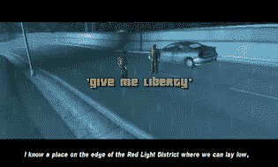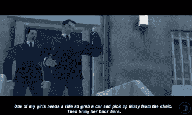 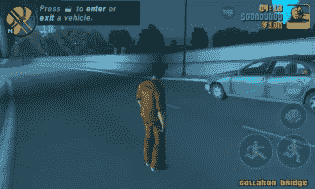
 
 <h3>缺点</h3> 
或许这款游戏最大的缺点是触摸屏控制。考虑到该端口是针对触摸屏设备的，这是一个相当大的问题。如果你想想游戏在 Playstation 2 上是如何运行的，你的控制器有 16 个按钮(D-pad、开始、选择、圆形、三角形、正方形、X、L1、L2、R1、R2 和模拟手柄按钮)。
 
现在想象一下，如果所有这些控件都通过一系列点击和滑动映射到触摸屏设备上。
 
当你在进行一些快节奏的动作时，比如追车，甚至是在街上行走或在任务之间开车，你的控制力只与你点击和滑动的速度一样好。有时候，甚至是<em>那个</em>也不够灵敏。
 
控制主角的移动是通过一个虚拟操纵杆来完成的，每当你轻敲拇指时，它就会出现在屏幕的左侧。然后右边有按钮，用于跑步、跳跃、打拳或射击、进入汽车、改变你的相机角度。一旦你进入汽车，这些控制就会改变，因为你现在有加速、刹车、按喇叭、下车的按钮。如果你以前玩过 GTA III，你会知道驾驶仍然很挑剔。使用控制器驾驶的压力敏感度会因触摸屏控制而丧失。一旦你正在驾驶，你还可以选择打开你的设备的加速度计来驾驶(这是在<strong>选项</strong>屏幕中，但这使得驾驶和看到你要去的地方变得更加糟糕。除非你在玩蓝牙控制器，否则在自由城穿行很快就会变成一种耐心的锻炼。
 
 
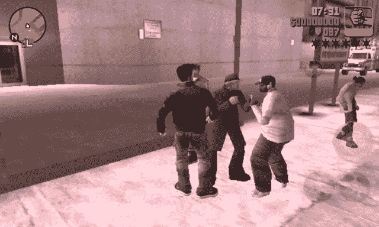 
 
 
游戏中的战斗和射击同样有问题，因为控制。对于战斗，你必须确保你面对你的对手，这对于触摸控制来说是很困难的。另一方面，你的对手通常会比你更灵活地绕过你，调整摄像机。如果你碰巧和几个对手发生争吵，如果你想活下来，逃跑是你最好的选择。当射击时，游戏有一个自动瞄准功能，它会根据你的距离瞄准你射击半径内的任何人。当然，这意味着当你的对手毫无阻碍地向你开火时，你最终会标记无辜的旁观者。
 
我发现的另一个缺点是结束你的游戏。该游戏具有自动保存功能，但如果您按下 Home 或 Back 按钮退出游戏，它仍将在后台运行。为了正确地退出游戏，你需要导航到游戏的主屏幕并点击<strong>退出游戏</strong>按钮。虽然我很欣赏游戏发布通知让你知道它在等你回来，但从通知抽屉中退出游戏的选项也会很好。一天中的几次快速播放会很容易将您设备的电池电量消耗到临界水平。
 
 
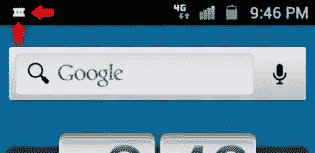 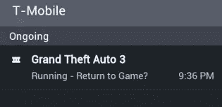
 
 <h3>结论</h3> 
《侠盗猎车手 3:10 周年纪念版》带给你侠盗猎车手系列中你所喜爱的一切——开放的、可破坏的游戏性、内乱以及城市范围内肆无忌惮的混乱。你所知道和喜爱的所有音乐和角色都回来了，对于铁杆游戏玩家来说，这是一次伟大的回忆之旅。然而，触摸屏控制的缺乏技巧使得享受游戏更多的是一种麻烦而不是一种享受。为了获得最佳性能，请确保您有一个蓝牙控制器来解决这个问题。
 
 

 
《侠盗猎车手 3:10 周年纪念版》在 Android Market 上售价 4.99 美元，需要运行 Android OS v2.2 或更高版本的精选 Android 设备才能运行。从下面的市场链接或使用提供的二维码下载应用程序。
 
<a title="Grand Theft Auto III: 10 Year Anniversary Edition" href="https://market.android.com/details?id=com.rockstar.gta3" target="_blank">下载侠盗猎车手三:十周年纪念版</a>
 
<aside class="flex space-x-4"><h2 class="text-lg my-2 mr-2">分享这篇文章</h2><button aria-label="Share Sitepoint on facebook" data-network="facebook" class="social-share-button mr-2 cursor-pointer transform transition duration-200 hover:scale-125 text-primary-700"><svg aria-hidden="true" focusable="false" data-prefix="fab" data-icon="facebook-square" class="svg-inline--fa fa-facebook-square fa-w-14 fa-lg share-icon" role="img" viewbox="0 0 448 512"><path fill="currentColor" d="M400 32H48A48 48 0 0 0 0 80v352a48 48 0 0 0 48 48h137.25V327.69h-63V256h63v-54.64c0-62.15 37-96.48 93.67-96.48 27.14 0 55.52 4.84 55.52 4.84v61h-31.27c-30.81 0-40.42 19.12-40.42 38.73V256h68.78l-11 71.69h-57.78V480H400a48 48 0 0 0 48-48V80a48 48 0 0 0-48-48z"/></svg></button><button aria-label="Share Sitepoint on reddit" data-network="reddit" class="social-share-button mr-2 cursor-pointer transform transition duration-200 hover:scale-125 text-primary-700"><svg aria-hidden="true" focusable="false" data-prefix="fab" data-icon="reddit" class="svg-inline--fa fa-reddit fa-w-16 fa-lg share-icon" role="img" viewbox="0 0 512 512"><path fill="currentColor" d="M201.5 305.5c-13.8 0-24.9-11.1-24.9-24.6 0-13.8 11.1-24.9 24.9-24.9 13.6 0 24.6 11.1 24.6 24.9 0 13.6-11.1 24.6-24.6 24.6zM504 256c0 137-111 248-248 248S8 393 8 256 119 8 256 8s248 111 248 248zm-132.3-41.2c-9.4 0-17.7 3.9-23.8 10-22.4-15.5-52.6-25.5-86.1-26.6l17.4-78.3 55.4 12.5c0 13.6 11.1 24.6 24.6 24.6 13.8 0 24.9-11.3 24.9-24.9s-11.1-24.9-24.9-24.9c-9.7 0-18 5.8-22.1 13.8l-61.2-13.6c-3-.8-6.1 1.4-6.9 4.4l-19.1 86.4c-33.2 1.4-63.1 11.3-85.5 26.8-6.1-6.4-14.7-10.2-24.1-10.2-34.9 0-46.3 46.9-14.4 62.8-1.1 5-1.7 10.2-1.7 15.5 0 52.6 59.2 95.2 132 95.2 73.1 0 132.3-42.6 132.3-95.2 0-5.3-.6-10.8-1.9-15.8 31.3-16 19.8-62.5-14.9-62.5zM302.8 331c-18.2 18.2-76.1 17.9-93.6 0-2.2-2.2-6.1-2.2-8.3 0-2.5 2.5-2.5 6.4 0 8.6 22.8 22.8 87.3 22.8 110.2 0 2.5-2.2 2.5-6.1 0-8.6-2.2-2.2-6.1-2.2-8.3 0zm7.7-75c-13.6 0-24.6 11.1-24.6 24.9 0 13.6 11.1 24.6 24.6 24.6 13.8 0 24.9-11.1 24.9-24.6 0-13.8-11-24.9-24.9-24.9z"/></svg></button><button aria-label="Share Sitepoint on twitter" data-network="twitter" class="social-share-button mr-2 cursor-pointer transform transition duration-200 hover:scale-125 text-primary-700"><svg aria-hidden="true" focusable="false" data-prefix="fab" data-icon="twitter-square" class="svg-inline--fa fa-twitter-square fa-w-14 fa-lg share-icon" role="img" viewbox="0 0 448 512"><path fill="currentColor" d="M400 32H48C21.5 32 0 53.5 0 80v352c0 26.5 21.5 48 48 48h352c26.5 0 48-21.5 48-48V80c0-26.5-21.5-48-48-48zm-48.9 158.8c.2 2.8.2 5.7.2 8.5 0 86.7-66 186.6-186.6 186.6-37.2 0-71.7-10.8-100.7-29.4 5.3.6 10.4.8 15.8.8 30.7 0 58.9-10.4 81.4-28-28.8-.6-53-19.5-61.3-45.5 10.1 1.5 19.2 1.5 29.6-1.2-30-6.1-52.5-32.5-52.5-64.4v-.8c8.7 4.9 18.9 7.9 29.6 8.3a65.447 65.447 0 0 1-29.2-54.6c0-12.2 3.2-23.4 8.9-33.1 32.3 39.8 80.8 65.8 135.2 68.6-9.3-44.5 24-80.6 64-80.6 18.9 0 35.9 7.9 47.9 20.7 14.8-2.8 29-8.3 41.6-15.8-4.9 15.2-15.2 28-28.8 36.1 13.2-1.4 26-5.1 37.8-10.2-8.9 13.1-20.1 24.7-32.9 34z"/></svg></button><button aria-label="Share Sitepoint on linkedin" data-network="linkedin" class="social-share-button mr-2 cursor-pointer transform transition duration-200 hover:scale-125 text-primary-700"><svg aria-hidden="true" focusable="false" data-prefix="fab" data-icon="linkedin" class="svg-inline--fa fa-linkedin fa-w-14 fa-lg share-icon" role="img" viewbox="0 0 448 512"><path fill="currentColor" d="M416 32H31.9C14.3 32 0 46.5 0 64.3v383.4C0 465.5 14.3 480 31.9 480H416c17.6 0 32-14.5 32-32.3V64.3c0-17.8-14.4-32.3-32-32.3zM135.4 416H69V202.2h66.5V416zm-33.2-243c-21.3 0-38.5-17.3-38.5-38.5S80.9 96 102.2 96c21.2 0 38.5 17.3 38.5 38.5 0 21.3-17.2 38.5-38.5 38.5zm282.1 243h-66.4V312c0-24.8-.5-56.7-34.5-56.7-34.6 0-39.9 27-39.9 54.9V416h-66.4V202.2h63.7v29.2h.9c8.9-16.8 30.6-34.5 62.9-34.5 67.2 0 79.7 44.3 79.7 101.9V416z"/></svg></button><button aria-label="Share Sitepoint on email" data-network="email" class="social-share-button mr-2 cursor-pointer transform transition duration-200 hover:scale-125 text-primary-700"><svg aria-hidden="true" focusable="false" data-prefix="fas" data-icon="envelope" class="svg-inline--fa fa-envelope fa-w-16 fa-lg share-icon" role="img" viewbox="0 0 512 512"><path fill="currentColor" d="M502.3 190.8c3.9-3.1 9.7-.2 9.7 4.7V400c0 26.5-21.5 48-48 48H48c-26.5 0-48-21.5-48-48V195.6c0-5 5.7-7.8 9.7-4.7 22.4 17.4 52.1 39.5 154.1 113.6 21.1 15.4 56.7 47.8 92.2 47.6 35.7.3 72-32.8 92.3-47.6 102-74.1 131.6-96.3 154-113.7zM256 320c23.2.4 56.6-29.2 73.4-41.4 132.7-96.3 142.8-104.7 173.4-128.7 5.8-4.5 9.2-11.5 9.2-18.9v-19c0-26.5-21.5-48-48-48H48C21.5 64 0 85.5 0 112v19c0 7.4 3.4 14.3 9.2 18.9 30.6 23.9 40.7 32.4 173.4 128.7 16.8 12.2 50.2 41.8 73.4 41.4z"/></svg></button></aside> </body> </html></iframe>