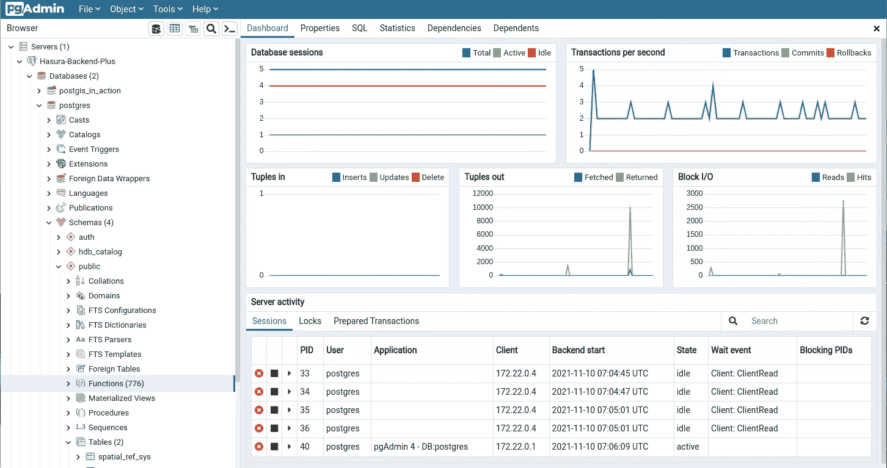
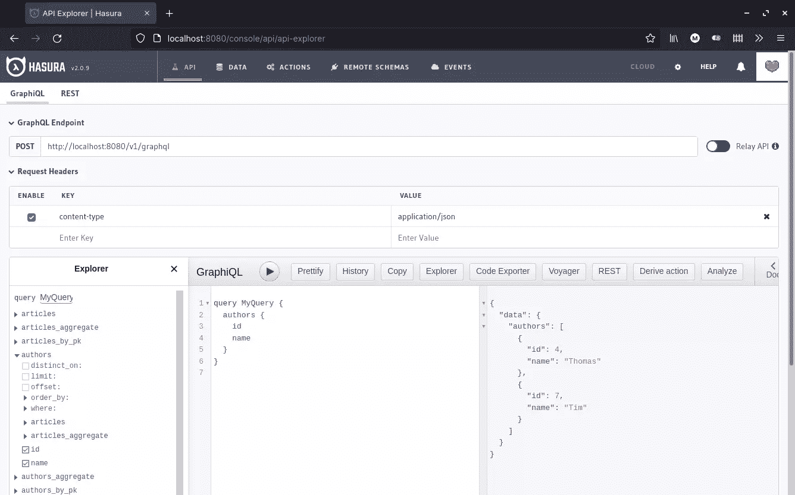
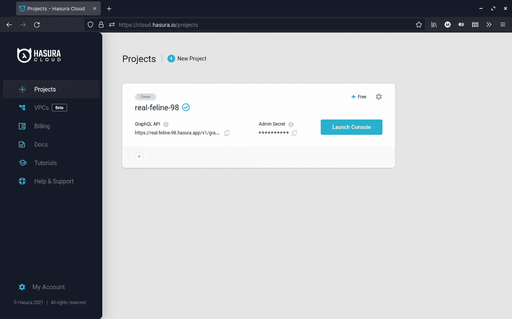
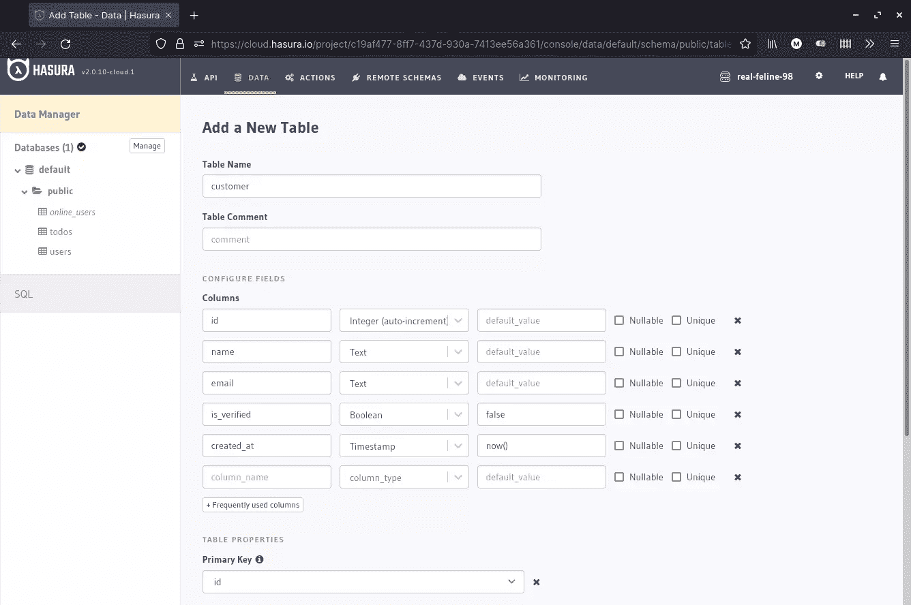
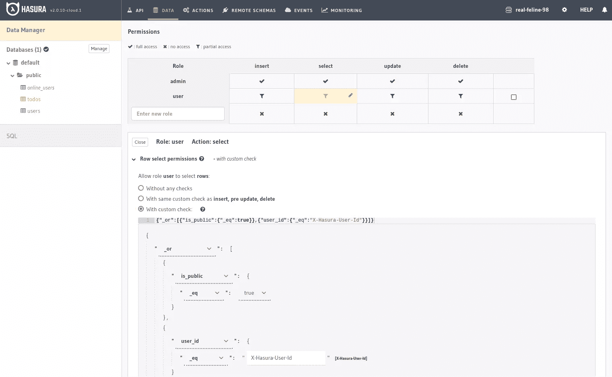
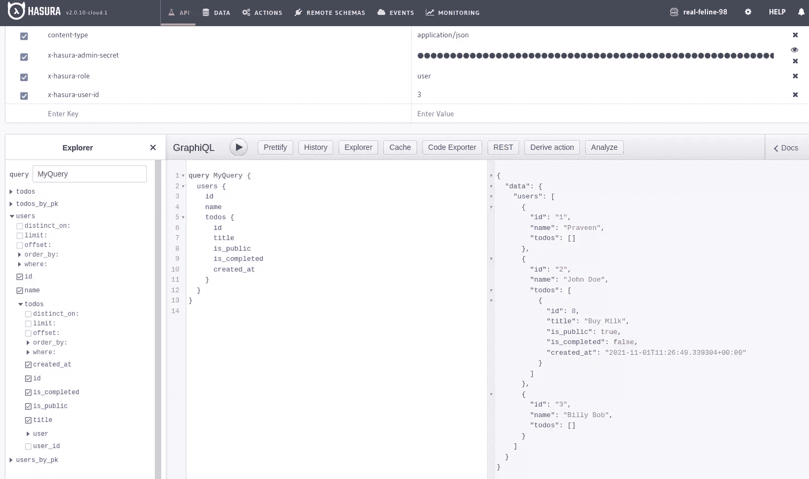
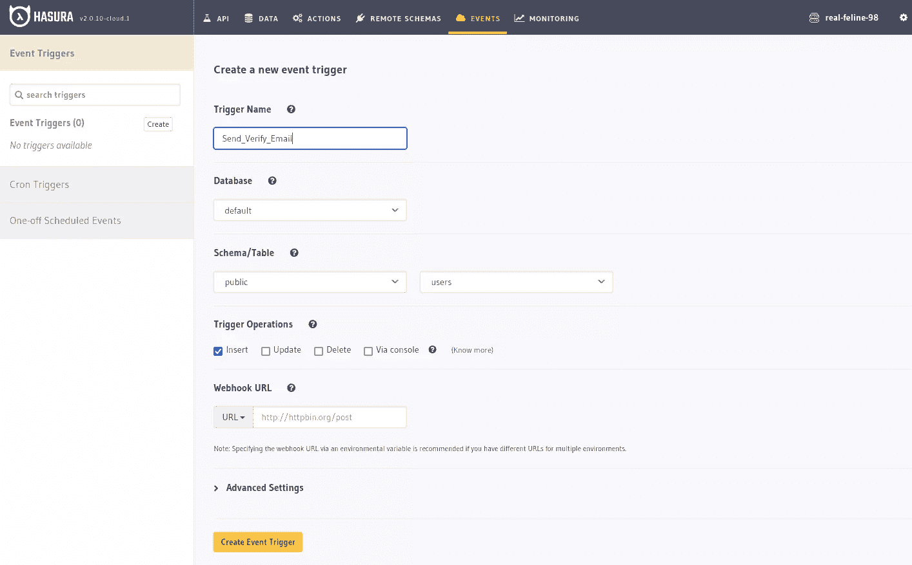

# 如何用 Hasura 和 PostgreSQL 构建你的后端

> 原文：<https://www.sitepoint.com/hasura-postgresql-build-backend/>

后端开发通常需要编写许多代码来处理 CRUD、授权和业务逻辑。所有这些代码都需要在项目的整个生命周期中进行测试、调试和维护。这花费了开发人员开发新功能的大量时间。在本文中，您将了解 Hasura 和 PostgreSQL 如何帮助您加速应用程序开发，并以最小的努力快速启动后端。

[Hasura](https://hasura.io/) 是一个开源的 GraphQL 引擎，它使用您的数据库模式生成 GraphQL 和 REST API 端点。它支持数据建模、实时查询、事件编程、基于角色的授权和在 GraphQL 上运行定制业务逻辑的操作。

[PostgreSQL](https://www.postgresql.org/) 是一个流行且功能强大的开源、面向对象的关系数据库，它提供了类似于 Oracle 数据库和 Microsoft SQL Server 的企业级特性。据 [StackShare](https://stackshare.io/postgresql) 称，PostgreSQL 被网飞、Instagram、优步和 Spotify 等大型国际公司使用。

在本文中，我们将回顾 Hasura 提供的主要特性，这些特性使它适合于开发和启动 web 和移动应用程序的可伸缩后端。我们还将了解如何利用 PostgreSQL 的特性，仅使用 SQL 来执行各种计算和分析任务，从而将正确的数据传送到您的前端，而无需编写定制代码。

请注意，Hasura 也支持其他数据库，如 Microsoft SQL Server、Amazon Aurora 和 Google BigQuery。我们将关注 PostgreSQL，因为它对大多数企业和组织来说都是免费的。如果你感兴趣的话，对 MySQL 的支持即将到来。

如果你是 GraphQL 的新手，请查看我们的[教程](https://www.sitepoint.com/how-to-build-a-web-app-with-graphql-and-react/)以了解更多。让我们从为什么 PostgreSQL 是您项目的完美选择开始。

## 为什么选择 PostgreSQL

与其他类型的数据库相比，关系数据库有许多明显的优势，因为您可以使用严格的模式和表关系来建模数据。在大多数行业中，执行连接和执行 ACID 事务的能力是许多应用程序的主要需求。这些特性对于在任何给定时间促进业务数据的完整性和一致性都是必不可少的。

PostgreSQL 还具有优于 MySQL 等其他关系数据库的其他优势，因为:

*   您可以使用**表继承**来建模数据
*   对于多用户环境，它有更好的**并发控制**(你可以更有效地写大量数据)
*   它具有**容错能力**，并且不容易出现数据损坏
*   它支持许多独特的数据类型，如 **JSON** 和 **Spatial** ，这对于金融和研究相关的应用非常有用

PostgreSQL 不仅仅是一个数据存储服务。它也是一个能够运行自定义函数和触发器来执行各种计算和分析任务的服务器。在 PostgreSQL 上运行逻辑更加高效，因为它不再需要编写定制的服务器代码。您可以使用以下方式在 PostgreSQL 中定义逻辑:

*   **视图**，一个可以帮助简化复杂查询的存储查询
*   **函数&运算符**，如日期格式化、模式匹配、算术运算等
*   **扩展**，扩展 PostgreSQL 功能的插件(如 [PostGIS](https://postgis.net/)
*   **过程语言**，编写自定义函数、存储过程、触发器和扩展标准 SQL 的编程语言(如 [PL/pgSQL](https://www.postgresql.org/docs/9.0/plpgsql-overview.html)

当您在 PostgreSQL 中实现逻辑时，Hasura 能够通过 GraphQL 查询和变异将它们暴露给前端应用程序。下面是 PostgreSQL 服务器的顶层视图，通过 [pgAdmin](https://www.pgadmin.org/) 接口可以看到:



学习利用 PostgreSQL 特性可以帮助您轻松解决复杂的问题，而无需编写服务器代码。下面是一些使用 PostgreSQL 可以做些什么的例子:

### 示例 1

您可以使用**视图**检索当前活动的在线用户列表:

```
CREATE OR REPLACE VIEW "public"."online_users" AS
 SELECT users.id,
    users.last_seen
   FROM users
  WHERE (users.last_seen >= (now() - '00:00:30'::interval)); 
```

### 示例 2

使用 **PostGIS 函数**，您可以列出位于 1000 米半径内的所有商店。详见本[地理定位教程](https://www.compose.com/articles/geofile-everything-in-the-radius-with-postgis/):

```
SELECT id, name, address, geom
FROM Seattle_Starbucks
WHERE ST_DWithin(geom, ST_MakePoint(-122.325959,47.625138)::geography, 1000); 
```

在下一节中，我们将重点介绍 Hasura 的特性。

## 哈苏拉是什么？

Hasura 是一个开源的实时 GraphQL 引擎，它为您的数据库生成 GraphQL 和 REST API 端点。它带有一个 web 控制台，允许您:

*   为您的数据库模式建模
*   查看、插入、更新和删除数据
*   实施基于角色的访问控制策略
*   运行 GraphQL 查询和变异
*   创建 REST 端点
*   运行 SQL 代码
*   定义操作和触发器



Hasura 不支持用户认证，所以您需要将 Hasura 和您的前端应用程序与一个提供者集成在一起，比如:

*   [店员](https://docs.clerk.dev/integrations/hasura)
*   [Auth0](https://hasura.io/docs/latest/graphql/core/guides/integrations/auth0-jwt.html)
*   [AuthGuardian](https://hasura.io/blog/add-5-login-methods-to-your-hasura-app-in-5-minutes-with-onegraphs-authguardian/)
*   [燃烧基地](https://hasura.io/blog/authentication-and-authorization-using-hasura-and-firebase/)
*   [魔法](https://hasura.io/blog/how-to-build-a-simple-secure-social-media-site-with-magic-and-hasura/)

也没有文件存储服务，你需要将你的应用与第三方存储提供商整合。如果您更喜欢使用 Hasura 的开箱即用的集成体验，您可以查看 **NHost** ，我们将在稍后的部署部分讨论。

在下一节中，我们将看看如何在本地和云中运行 Hasura。

## 发射 Hasura

有几种方法可以快速启动和运行 Hasura 实例:

### 1.码头工人

使用 Docker 在本地机器上运行 Hasura 是设置开发环境的推荐方式。有了这个设置，当你与 Hasura 的 web 控制台交互时，没有 API 请求的速率限制，也没有互联网连接限制你的体验。您在本地完成的任何工作都可以轻松地迁移到试运行和生产环境中。我们将在“迁移和环境”一节中讨论这是如何实现的。

假设你已经在你的机器上安装了 [Docker](https://docs.docker.com/get-docker/) 和 [Docker Compose](https://docs.docker.com/compose/install/) ，你可以按照这个[指南](https://hasura.io/docs/latest/graphql/core/getting-started/docker-simple.html)提供的说明在你的机器上运行 Hasura:

```
# create new directory
mkdir my-hasura
cd my-hasura

# download docker-compose.yml
curl https://raw.githubusercontent.com/hasura/graphql-engine/stable/install-manifests/docker-compose/docker-compose.yaml -o docker-compose.yml

# start hasura and postgresql container instances
docker-compose up -d 
```

您可以通过执行命令`docker ps`来确认您的 Hasura 和 PostgreSQL 容器实例正在运行。您应该能够在`http://localhost:8080/console`通过浏览器访问您的本地 Hasura 实例。要完成设置，您需要连接到 PostgreSQL 数据库，它与 Hasura 的数据库一起作为一个容器运行。

连接数据库后，您将能够使用 web 控制台创建表、定义关系并对数据执行 CRUD 操作。请注意，使用默认 Docker 设置时，您的数据是公开的。您可以通过取消对您的`docker-compose.yml`文件中以`HASURA_GRAPHQL_ADMIN_SECRET`开头的行的注释并重启您的 Hasura 容器来保护它。

### 2.云

更简单的开始方式是通过 [Hasura Cloud](https://hasura.io/cloud/) 。这是开源 Hasura 的重新设计版本，旨在实现可伸缩性、可用性、安全性
和全球分发。



Hasura Cloud 提供了一些开源版本中没有的新功能，包括:

*   [监控仪表板](https://hasura.io/graphql/monitoring/)的错误、连接、订阅、慢速查询和其他操作
*   [GraphQL 缓存](https://hasura.io/graphql/caching/)提高服务器和客户端的数据读取性能
*   [速率限制](https://hasura.io/docs/latest/graphql/cloud/security/api-limits.html)用于防止恶意用户和 DDoS 攻击损害您的 API
*   [回归测试](https://hasura.io/docs/latest/graphql/cloud/regression-tests.html)用于运行测试套件，例如对照生产实例检查开发实例中的变更

要开始使用 Hasura Cloud，你需要[注册一个免费账户](https://cloud.hasura.io/signup/)。请注意，免费帐户的速率限制为每分钟 60 次请求。创建帐户后，您需要:

*   创建一个项目(一个 Hasura 实例)
*   连接到 PostgreSQL 数据库

为了方便起见，Hasura Cloud 提供了一键安装和连接到一个免费的 Heroku Cloud 数据库实例。您还可以连接到任何其他可通过互联网访问的 PostgreSQL 数据库。您可以使用许多 PostgreSQL 提供程序。这些服务包括云服务，例如:

*   自动警报系统
*   蔚蓝的
*   数字海洋
*   时标云
*   YugabyteDB

如果您需要更清楚地了解上述步骤，您可以遵循此[指南](https://hasura.io/docs/latest/graphql/cloud/getting-started/index.html)。默认情况下，Hasura Cloud 使用 admin secret 密钥限制公众对数据的访问。我们将在接下来的章节中对此进行更多的讨论。

## 哈苏拉特征

在这一节中，我将向您概括介绍 Hasura 提供的无需编写代码即可构建自定义后端的特性。

### 数据管理器

Hasura 附带了一个可视化设计器，用于为数据层建模。这允许您:

*   创建表格
*   定义关系(一对一、一对多、多对多)
*   执行 CRUD 操作
*   创建视图
*   运行任何 SQL 语句
*   使用 PostgreSQL 的 DDL 约束实现数据验证
*   定义触发器



说到列，Hasura 支持一组丰富的数据类型，包括:

*   整数、数字和浮点数
*   串行和 uuid
*   字符和文本
*   日期和时间
*   布尔代数学体系的
*   几何图形-如直线、方框、路径、多边形和圆形
*   JSON

您还可以使用`CREATE TYPE` SQL 命令添加定制类型。接下来，我们将看看在 Hasura 中数据是如何被授权的。

### 批准

Hasura 中的访问控制是基于角色的。默认情况下，有一个名为`admin`的角色可以完全访问您的数据。为了限制其他用户的访问，您需要创建额外的角色，如`user`、`public`或`accountant`。

对于您创建的每个角色，您需要为以下操作定义访问策略:

*   插入
*   挑选
*   更新
*   删除

您可以定义三种类型的策略:

*   **完全访问**，无限制
*   **部分访问**，有条件限制
*   **禁止进入**

下面的例子演示了一个针对`user`角色的`select`授权策略。下面定义的规则旨在确保`user`只能查询自己的记录或标记为公开的记录:



### 问题

在设计模式和定义权限之后，您可以在 Hasura 的 API 仪表板中测试您的 GraphQL 查询。只要启用了跟踪，就可以查询您定义的每个表、视图和关系。

您可以执行的查询类型包括:

*   **简单查询**:选择返回一个或多个对象的查询。
*   **嵌套查询**:基于外键关系以嵌套格式返回对象的连接查询。
*   **聚合查询**:选择对结果进行了求和、平均等算术运算的查询。它也可以应用于嵌套对象。
*   **过滤/搜索查询**:在一个或多个字段上使用比较运算符过滤数据的查询。它们还可以用于使用模式或模糊匹配来执行搜索。



GraphQL 查询结果可以**排序**、**分组**、**分页**。也支持基于光标的分页。基本上，任何可以在 PostgreSQL 上运行的 SQL 语句都可以通过 GraphQL 查询公开。在下一节，我们将看看突变。

### 突变

GraphQL 突变是用于修改数据的语句。以下是您可以执行的突变类型:

*   **插入**:创建一行或多行数据:

    ```
     mutation insert_single_article {
        insert_article_one(
          object: {
            title: "Article 1"
            content: "Sample article content"
            author_id: 3
          }
        ) {
          id
          title
        }
      } 
    ```

*   **升级**:创建，冲突时更新。在下面的例子中，列`value`有一个*唯一*约束:

    ```
     mutation upsert_single_tag {
        insert_tags(
          objects: { value: "Java" }
          on_conflict: { constraint: tags_value_key, update_columns: value }
        ) {
          returning {
            id
            value
          }
        }
      } 
    ```

*   **更新**:更新一行或多行数据。还有一些特殊的操作符用于处理`int`和`jsonb`数据类型。下面的例子更新了所有评分*小于或等于* 2 的文章。变异将返回受*影响的行*的数量，并将这些行作为对象的数组列出:

    ```
     mutation update_article {
        update_article(
          where: { rating: { _lte: 2 } }
          _set: { rating: 1, is_published: false }
        ) {
          affected_rows
          returning {
            id
            title
            content
            rating
            is_published
          }
        }
      } 
    ```

*   **删除**:删除一行或多行数据。以下示例通过主键删除文章:

    ```
     mutation delete_an_object {
        delete_article_by_pk(id: 1) {
          id
          title
          user_id
        }
      } 
    ```

*   **事务**:在一个变异块中进行多次变异。如果其中一个失败，该块中所有以前执行的突变都将回滚。以下示例首先删除属于某个作者的所有文章。在第二次变异中，作者的名字被更新:

    ```
     mutation reset_author {
        delete_article(where: { author_id: { _eq: 6 } }) {
          affected_rows
        }
        update_author(where: { id: { _eq: 6 } }, _set: { name: "Cory" }) {
          returning {
            id
            name
            articles {
              id
              title
            }
          }
        }
      } 
    ```

### 捐款

Hasura 的订阅是通过 [WebSocket 协议](https://www.sitepoint.com/real-time-apps-websockets-server-sent-events/)执行的**实时查询**。这是一种用于从数据库获取实时数据的协议。任何 GraphQL 查询都可以通过简单地将关键字`query`替换为`subscription`来转化为订阅。默认情况下，这种查询每秒钟运行一条 SQL 语句。这是一个可配置的设置，可以通过调整来提供数据库负载和延迟之间的适当平衡。如果底层数据发生变化，新值将被推送到客户端。

以下示例演示了跟踪车辆位置的 GraphQL 订阅:

```
# $vehicleId = 3
subscription getLocation($vehicleId: Int!) {
  vehicle(where: { id: { _eq: $vehicleId } }) {
    id
    vehicle_number
    locations(order_by: { timestamp: desc }, limit: 1) {
      location
      timestamp
    }
  }
} 
```

使用订阅的其他用例包括:

*   食品交付跟踪
*   聊天消息
*   在线民意调查

### 远程模式

通常，在构建现代应用程序时，您需要集成第三方 API:

*   提供数据库中没有的数据，如体育直播比分或股票价格
*   提供业务逻辑——如支付处理或预订航班

这些第三方 API 通常直接从客户端应用程序访问。使用 Hasura，您可以将这些 API 与您的数据库合并，以创建一个统一的 GraphQL API。这创造了新的机会，您可以实现授权并定义表/视图和远程 API 之间的**远程关系**。您还可以创建基于这种类型的关系执行特定任务的**动作**。

拥有一个统一的 GraphQL API 使得前端开发人员更容易构建应用程序。在下一节中，我们将看看什么是 Hasura 动作。

### 行动

Hasura 中的定制业务逻辑通过 webhooks 在微服务或无服务器功能上进行外部处理。这意味着您可以使用您喜欢的任何语言编写定制逻辑，如 Node.js、Python、Go 或 Ruby on Rails。Hasura 中的一个动作只是一个定制的 GraphQL 查询或变异，它映射到一个定义了输入和输出接口的 webhook。

动作定义由以下部分组成:

*   类型:查询或突变
*   动作名称
*   输入和输出的自定义类型
*   头球
*   处理程序 URL

我们来看一个简单的“你好，世界！”举例。首先，我们将动作查询定义如下:

```
type Query {
  hello(name: String!): HelloResponse
} 
```

上面的操作定义了一个名为`hello`的函数，它接受一个名为`name`的字符串变量作为输入。该函数返回一个`HelloResponse`对象，它是一个自定义类型，定义如下:

```
type HelloResponse {
  message: String!
} 
```

定义了接口之后，剩下的就是实现 webhook 服务和一个可以被 Hasura 实例访问的 URL。下面是一个为 Express.js 编写的实现，它是在 Hasura 的 CodeGen 助手的帮助下创建的:

```
// Request Handler
app.post("/hello", async (req, res) => {
  // get request input
  const { name } = req.body.input;

  // success
  return res.json({
    message: `Hello, ${name}!`,
  });
}); 
```

### 事件触发器

在 Hasura 中，你可以使用被称为[事件驱动编程](https://hasura.io/event-driven-programming/)的软件架构来构建应用。这是一种设计模式，它将复杂的状态管理从单片后端中分离出来，并将其委托给执行业务逻辑的单个微服务或无服务器功能。这允许构建高度健壮和可伸缩的应用程序。

借助事件编程，您可以轻松处理许多用例，例如:

*   发送电子邮件
*   发送推送通知
*   向您的 [Algolia 搜索索引](https://www.algolia.com/doc/guides/sending-and-managing-data/send-and-update-your-data)发送新数据

在 PostgreSQL 中，您可以[创建触发器](https://www.postgresql.org/docs/9.1/sql-createtrigger.html)，当`INSERT`、`UPDATE`或`DELETE`等事件发生时，该触发器执行 SQL 语句或存储过程。触发器与表或视图相关联，可以在事件之前或之后触发。

在 Hasura 中，[事件触发器](https://hasura.io/event-triggers/)被类似地定义，并用于在事件被触发时调用 **web 钩子**。这个上下文中的 web 挂钩与我们刚刚在“操作”部分讨论的挂钩非常相似。事件触发器也可以通过控制台或 API 手动调用。

以下是 YAML 格式的事件触发器定义示例:

```
- table:
    schema: public
    name: author
  event_triggers:
    - name: author_trigger
      definition:
        enable_manual: false
        insert:
          columns: "*"
        update:
          columns: "*"
      webhook: https://httpbin.org/post 
```

事件触发器可以用头来定义(为了认证的目的),通常包含一个有效负载，它被发送到 webhook 服务进行数据处理。唯一期望的响应是`200`状态。如果需要的话，实际的结果会通过不同的途径发回——比如发布一个 GraphQL 变体，或者发送一个电子邮件通知，等等。

前端应用程序可以通过 GraphQL 订阅查询来接收结果。这种类型的架构使得构建具有出色用户体验的非阻塞交互式实时应用变得容易。对于开发人员来说，代码库也更容易维护、测试和扩展。

### 预定触发器

[预定触发器](https://hasura.io/blog/introducing-scheduled-triggers-api-driven-cron-jobs-scheduled-events/)是基于时间的事件，通过 webhooks 执行定制的业务逻辑。您可以定义两种类型:

*   **CRON 触发器**:用于定期的周期性事件
*   **一次性预定事件**:用于一次性执行

可以通过 web 控制台或元数据 API 创建预定触发器。下面的屏幕截图显示了 web 控制台示例。



元数据 API 允许使用应用程序代码创建预定事件。以下示例显示了如何使用 API 构建一次性事件的创建:

```
{
  "type": "create_scheduled_event",
  "args": {
    "webhook": "https://my-awesome-serverless-fn.com/send-email",
    "schedule_at": "2022-07-20T12:45:00Z",
    "payload": {
      "email": "bob@ross.com"
    }
  }
} 
```

Hasura 提供了许多容错机制，确保预定的触发器成功运行。例如，假设一个安排在下午 2:00 的事件没有被处理，因为 Hasura 在下午 1:59 停机。当 Hasura 重新联机时，它将根据可定制的容差配置重新恢复事件并重新运行错过的预定触发器。默认设置是六小时。

Hasura 还提供了一个灵活的重试配置，以防 HTTP 失败。您可以配置重试次数和每次重试之间的超时时间。每个触发器调用都会被记录下来，您可以在以后访问它以进行检查。

预定触发器的用例包括:

*   发送提醒
*   生成日终报告
*   删除在过去 90 天内未验证其电子邮件地址的非活动用户

### 迁移和环境

任何软件项目的理想开发工作流程都是为开发、试运行和生产建立多个环境。此工作流程简化了测试，并确保开发人员在部署其软件的新版本时不会意外删除或破坏生产数据。

为了将开发环境的状态转移到试运行和生产，需要**迁移**文件。使用 Hasura，您需要:

*   数据库/SQL 迁移文件
*   Hasura 元数据

Hasura 元数据由配置文件的快照组成，用于跟踪:

*   关系
*   许可
*   扳机
*   行动
*   GraphQL 模式
*   远程模式

您需要安装 [Hasura CLI](https://hasura.io/docs/latest/graphql/core/hasura-cli/install-hasura-cli.html) 才能创建这些迁移文件并将其应用到不同的 Hasura 实例。随着开发过程中模式的改变，这些迁移文件可以进行版本控制和增量更新。

使用`hasura migrate`命令创建和应用 SQL 迁移文件，而使用`hasura metadata`命令处理元数据迁移文件。CLI 命令还使您能够:

*   回滚应用的迁移
*   创建种子数据迁移
*   重置迁移文件
*   压缩迁移文件—也就是说，用一个主要更新替换小的增量更新

Hasura 有一个特殊的 Docker[CLI-migration image](https://hasura.io/docs/latest/graphql/core/migrations/advanced/auto-apply-migrations.html#auto-apply-migrations)，它会在服务器启动时自动应用迁移。该映像还包含 **Hasura CLI** 工具，可用于在您的工作流中运行 CI/CD 脚本。

## 部署

为生产部署 Hasura 最简单的方法是使用 [Hasura Cloud](https://hasura.io/cloud/) 。这是推荐选项，因为您可以获得开源版本中没有的**企业特性**。幸运的是，与大多数后端即服务提供商(BaaS)不同，Hasura 不会将你锁定在他们的平台上。您可以在以下平台中利用**一键式部署**服务提供商:

*   [Heroku](https://elements.heroku.com/buttons/hasura/graphql-engine-heroku)
*   [数字海洋](https://marketplace.digitalocean.com/apps/hasura-graphql)
*   [渲染](https://render.com/docs/deploy-hasura-graphql)
*   [蔚蓝色](https://azure.microsoft.com/en-us/blog/use-graphql-with-hasura-and-azure-database-for-postgresql/)

你也可以在任何一个 Kubernetes 平台上部署 Hasura，比如 T2 谷歌云。 [AWS](https://hasura.io/blog/instant-graphql-on-aws-rds-1edfb85b5985/) 也受支持，但你必须经历许多步骤才能让它工作。外部托管给你自由和更多的价格选择。但是，以上所有选项都要求您为以下项目设置附加服务:

*   证明
*   储存；储备
*   自定义业务逻辑

在下一节中，我们将简要介绍如何使用 NHost 来进一步简化 Hasura 后端应用程序的开发。

### 使用 NHost 部署

NHost 是一个开源的 BaaS 提供商，旨在与诸如 [Firebase](https://www.sitepoint.com/react-firebase-build-mvp/) 的平台竞争。他们的后端堆栈包括:

*   PostgreSQL 数据库
*   Hasura GraphQL 引擎
*   认证服务
*   MinIO ，一个 S3 兼容的对象存储服务
*   无服务器功能(目前处于测试阶段)

该平台带有一个名为 [`nhost-js-sdk`](https://docs.nhost.io/libraries/nhost-js-sdk) 的客户端库，用于前端认证和文件管理。存储服务支持[图像优化](https://docs.nhost.io/storage/image-transformation)，这为我们省去了集成另一个图像服务的麻烦。

在撰写本文时，NHost 目前为其服务提供 14 天的试用期。免费层将很快推出。有一个 Docker 版本叫做 [Hasura Backend Plus](https://nhost.github.io/hasura-backend-plus/) ，你可以把它部署在你的机器上。

## 摘要

总之，Hasura GraphQL 引擎和 PostgreSQL 数据库在无需编写代码即可为移动和 web 应用程序构建后端的速度方面具有革命性。大多数计算和分析逻辑可以由 PostgreSQL 处理，而其余的定制业务逻辑可以使用微服务或无服务器功能来实现。

采用 Hasura 意味着您将能够更快地推出并构建一个高性能、安全、容错、可伸缩且易于维护的产品。没有基础设施的麻烦还会降低你的运营成本，让你专注于前端开发和应用程序面向用户的部分。

尽管 Hasura 不像其他开源替代方案(如 [Parse platform](https://parseplatform.org/) )那样功能丰富，但它支持版本控制和环境升级，这是 CI/CD 开发工作流的一个关键需求。因为它是开源的，所以您可以免受供应商锁定带来的风险。

## 分享这篇文章