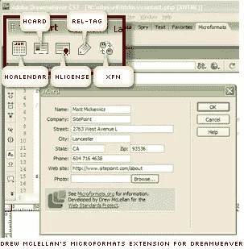
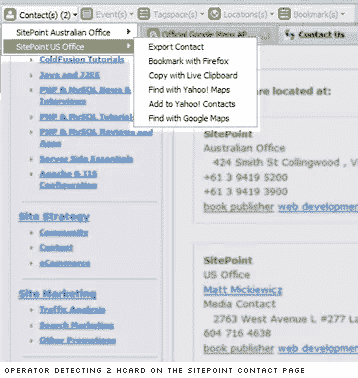

# 微格式终于到来了吗？

> 原文：<https://www.sitepoint.com/have-microformats-finally-arrived/>

我必须承认，当微格式的概念第一次在会议上出现时，我有点不以为然。当然，我可以看到这个想法的潜在价值——让有用的数据(活动时间、联系方式等)从网络传输到其他设备变得容易。听起来不错。

将它们整合到一个网站上从来都不是什么大问题。这种标记确实趋于麻木，但是现在所有最流行的格式都有按钮生成器( [hCard](http://microformats.org/code/hcard/creator) 、 [hCalendar](http://microformats.org/code/hcalendar/creator) 、 [hReview](http://microformats.org/code/hreview/creator) )，可以为你做大部分繁重的工作。

不，对我来说，问题是“太好了！但是他们最近为我做了什么？

大多数情况下，这遇到了一个扩展的。很久很久以前，在一个星系里，很远很远的地方…’还有一些集中的地毯擦伤。虽然我花了一些时间将微格式编码到我的页面中，但对我来说，这有点像购买碳补偿信用——这是一件“光荣”的事情，但我的一部分无法摆脱我被骗的想法。

也许这种情况正在开始改变。

[谷歌地图](http://googlemapsapi.blogspot.com/2007/06/microformats-in-google-maps.html)本周加入了[雅虎地图](http://ylocalblog.com/blog/2006/06/21/we-now-support-microformats/)对 [hCard 微格式](http://microformats.org/wiki/hcard)的本地读写，这是一种致力于描述人和组织的微格式。现在，虽然这给 Google maps 服务增加了一些方便的功能，但这实际上是如何影响您的页面，开始使微格式在日常生活中变得有用。

首先，坏的部分。目前没有浏览器可以有效地使用微格式，尽管它显然是为 Firefox 3.0 设计的。要欣赏它们的价值，你必须安装两个可用的火狐扩展中的一个( [Tails](https://addons.mozilla.org/firefox/2240/) 或 [Operator](https://addons.mozilla.org/en-US/firefox/addon/4106) )或者满足于一个[书签](http://microformats.org/wiki/bookmarklets)。我将在这里使用运算符。

今天早上，我花了大约 30 分钟使用在线 [hCard creator](http://microformats.org/code/hcard/creator) 对我们的[联系页面细节](https://www.sitepoint.com/contact-us)进行“微格式化”，尽管 Dreamweaver 用户也可以使用[微格式扩展](http://www.webstandards.org/action/dwtf/microformats/)。

这种相对快速、简单且不可见的标记变化带来的好处越来越明显——如下所示。

任何访问安装了[操作器](https://addons.mozilla.org/en-US/firefox/addon/4106)的 [SitePoint 联系人页面](https://www.sitepoint.com/contact-us)的人现在可以看到两个可用的联系人，每个联系人都有一系列下拉选项。

在 Win 版本中，目前包括:

*   将关联的 URL 加入书签
*   添加到 Yahoo 联系人
*   导出到实时剪贴板(一种站点间交换格式)

毫无疑问，随着更多的公司采用微格式，这一选择范围将在未来一两年内迅速扩大。诚然，今天能够访问它们的用户总数将达到数千，但同样真实的是，原生 Firefox 支持将在一夜之间飙升这些数字。缺乏微格式支持的用户看不到他们的体验有任何变化，这意味着很难想到在未来的项目中不开始实现它们的抑制因素——除了懒惰。

也许我们终于到了微格式的理论优势开始与其应用相匹配的时候了。

## 分享这篇文章