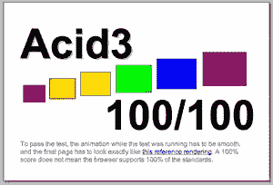

# 帮助创建符合 JavaScript 的 Acid3 测试

> 原文：<https://www.sitepoint.com/help-create-the-acid3-test-for-javascript-compliance/>

随着去年年底宣布 [IE8 通过了 CSS 渲染](https://www.sitepoint.com/ie8-passes-acid2-test-web-standards-project-dies-of-shock/)的 Acid2 测试(或者将会通过，当它发布的时候)，[网络标准项目](http://webstandards.org/)将目光放在了他们使命的下一阶段，鼓励浏览器制造商为网络用户提供一致的体验。

虽然 Acid2 测试侧重于 HTML 和 CSS 的静态呈现，但 [Acid3 测试](http://www.hixie.ch/tests/evil/acid/003/)(仍在开发中)将测试浏览器在实现文档对象模型和 ECMAScript 规范方面的表现。如果您曾经花时间试图找出为什么即使是最简单的脚本也不能在多种浏览器中表现一致，那么这肯定是个好消息。

更令人兴奋的是，你可以贡献测试！

伊恩·希克森是 Acid3 背后的主要驱动力，迄今为止已经编写了 84 个脚本测试。为了达到 100 项测试的偶数，伊恩[请求公众再贡献 16 项测试](http://ln.hixie.ch/?start=1200301306&count=1)。他甚至创建了一个简单的[测试开发控制台](http://www.hixie.ch/tests/evil/acid/003/competition/)，您可以用它来验证您的测试是否返回了它应该返回的值。你还有几天的时间来提交，任何被接受的测试的作者都会在最终脚本的评论中得到表扬。

如果你了解你的 JavaScript(更重要的是，你了解你的浏览器缺陷)，那么这可能是你为一个可互操作的 web 做贡献的机会。开始吧。

约翰·瑞西格发布了每个浏览器在(仍未完成的)测试中表现的截图。为了通过测试，所有的浏览器都有一些工作要做，但公平地说，IE 比大多数浏览器有更多的工作要做。我相信这对你们很多人来说并不意外。

## 分享这篇文章