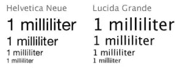
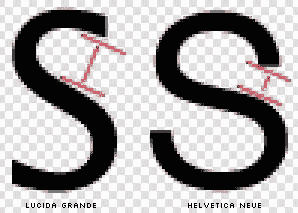

# Helvetica 的黄金时代结束了——但不是在苹果。

> 原文：<https://www.sitepoint.com/helvetica-apple/>

设计师总是喜欢 Helvetica。他们不断地重申他们对它的爱。在[片](http://www.helveticafilm.com/)里。在无数的 t 恤上。 [Pinterest](http://www.pinterest.com/rumdesign/helvetica-love/) 收藏。见鬼，甚至还有一款 *[Helvetica 香水！](http://helveticatheperfume.com/ "Helvetica Perfume")*

图片来源:桑瑟奥

作为一种字体，它一直是“好女巫格兰达”到漫画“咯咯叫的西方坏女巫”。

但在 2010 年左右的某个时候，这段关系发生了一些变化。

我们开始看到来自摇滚明星印刷商和设计师的帖子，说 Helvetica 是垃圾。

瑞士字体设计师布鲁诺·马格称之为“香草冰淇淋”，并设计了一种新的字体——Aktiv Grotesk——明确的目标是取代它。

2012 年，[埃里克·斯皮克曼](http://spiekermann.com/)宣称[很烂，可能很难破译](http://spiekermann.com/en/helvetica-sucks/)。早些时候他甚至称之为“麦当劳式的”。

AnyoneCanSwiss 的德克和韦斯质疑 Helvetica 是否只是一个完全的设计逃避。

在 50 年的天真崇拜之后，潮流似乎已经转向了这位前设计师的宠儿。

具有讽刺意味的是，苹果公司周一宣布，下一个版本的 OS X(约塞米蒂)将放弃 Lucida Grande——自 1999 年以来一直是该系统的固定设备——而支持 Helvetica·纽。

设计师们立即做出了负面反应。

特别是，[托比亚斯·弗雷尔-琼斯](http://en.wikipedia.org/wiki/Tobias_Frere-Jones)——也许是摇滚明星类型设计师的“保罗·麦卡特尼”—*—[说，尽管 Helvetica 名声显赫，但它不能做所有的事情。它在大尺寸时工作良好，但在小尺寸时却很弱](http://www.fastcodesign.com/3031432/why-apples-new-font-wont-work-on-your-desktop)。*

托拜厄斯认为，当缩小到更小的尺寸时，像“S”这样的字母中的孔或开口就会关闭。

显然，在像操作系统这样复杂的系统中，文本会以多种大小、粗细和颜色呈现。多功能性是关键。

现在，毫无疑问，苹果是一家建立了智能设计选择帝国的公司。他们也从不回避潜在的困难决定。

然而，这个似乎有点过时了。

我们会看到的。

(最初发表于 SitePoint 设计通讯)

## 分享这篇文章