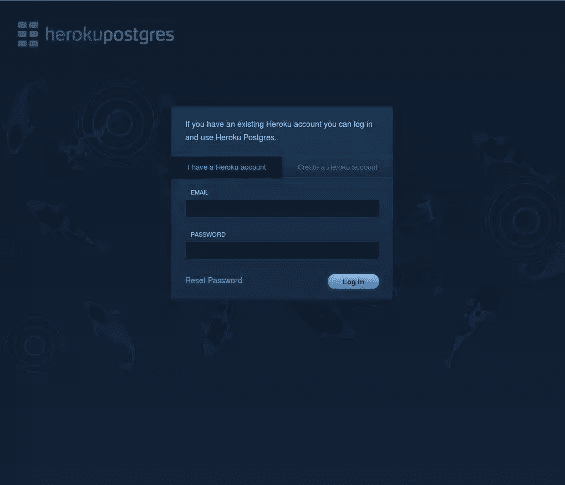
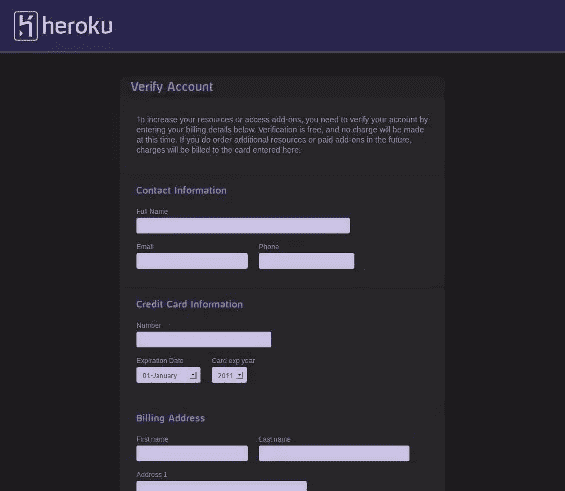
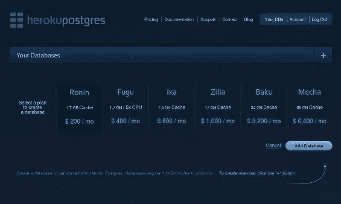
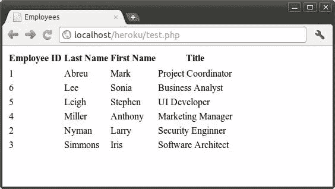

# 云托管的 PostgreSQL: Heroku Postgres

> 原文：<https://www.sitepoint.com/heroku-postgresql/>

PostgreSQL 是一个成熟、稳定、功能丰富的数据库服务器。与它的开源竞争对手 MySQL 和 Firebird 不同，PostgreSQL 在您第一次入门时有一个更陡峭的学习曲线，但如果您使用云托管的数据库服务，您可以避免大多数安装、配置和维护麻烦。

Heroku Postgres 是一款基于 Heroku 提供的 PostgreSQL 的可靠而强大的[数据库即服务。使用 Heroku 托管数据可以让您更专注于编写应用程序的 SQL，而不是学习如何成为一名 DBA。](https://postgres.heroku.com)

在本文中，我将向您展示如何开始使用 Heroku Postgres。我将分享使用 Heroku 的一些好处，向您展示如何注册，并向您展示建立一个托管的 PostgreSQL 数据库实例并使用 PDO 从 PHP 连接到它是多么容易。

## 为什么是 Heroku？

当面临一个严肃的选择时，在做最后决定之前权衡利弊是个好主意。如今，几乎所有基于 web 的应用程序的核心都是数据，因此选择正确的数据库策略可能比大多数人意识到的更重要。Heroku Postgres 可能不适合你，但你怎么知道？

Heroku Postgres 是一种分层服务，最低的价格为每月 200 美元。如果你是一名开发人员，只是想修修补补，学习一些新的东西，这可能是一个交易破坏者。(如果 Heroku 能在未来提供某种有限的免费开发者试用版就好了，这样更多的人可以学习使用他们的产品。)另一方面，对于一个成功的基于网络的应用程序来说，200 美元只是沧海一粟。这肯定比运行自己的硬件和维护数据库并确保符合任何相关法规的人员费用要便宜。

创建一个数据库实例非常容易，而且您可以根据需要自由升级或降级您的层。事实上，使用 Heroku Postgres 创建数据库的便利性缓解了经常听到的关于 PostgreSQL 的抱怨之一——难以安装。Heroku 自称是最大的 PostgreSQL 数据库即服务提供商。鉴于这种规模，让专家来管理您的数据库是有意义的。

Heroku 承诺 99.99%的正常运行时间，并为此做了一些令人印象深刻的事情。事务不断归档到地理上分散的数据存储中，每 30 秒执行一次自动运行状况检查，以确保您的数据库可用。你只需输入一个命令，Heroku 就能完成剩下的工作。

Heroku 允许几乎无限的数据，因此大型数据集和数据仓库是没有问题的。他们的计划是根据热数据集定价的，热数据集是您的数据中被访问最多的部分，出于性能原因，它驻留在 RAM 中。最低层支持 1.7GB 的热数据，最高层支持 68GB。

## 设置数据库实例

注册 Heroku Postgres 服务很容易。只需在浏览器中进入[postgres.heroku.com](http://postgres.heroku.com)，点击页面中间的立即注册按钮。如果你已经有一个 Heroku 帐户，你只需提供你的电子邮件地址和密码，你就可以登录了。否则，您现在可以创建一个新帐户。



当然，您需要提供您的信用卡详细信息来支付 Heroku Postgres 服务。如果您刚刚创建了一个新帐户，您将被带到验证帐户页面，在那里您可以提供必要的详细信息。



登录并验证后，如果您还没有看到它，请转到“您的数据库”页面，该页面可从顶部菜单中的“您的数据库”条目访问。此页面是一个仪表板，您可以在其中监视和管理所有数据库实例。

单击箭头指向的+添加数据库；你会看到一个计划列表，你可以从中选择。选择所需的计划，然后单击添加数据库按钮以确认选择。



只需几分钟，您就可以为您的数据准备好一个漂亮、崭新、闪亮的数据库实例。当它准备好了，点击它深入查看它的连接信息。


## 从 PHP 交互

现在您已经有了一个运行在云上的 PostgreSQL 数据库，让我们试着从 PHP 与它交互。

使用 PostgreSQL 的交互式终端客户端连接到数据库。如果您在本地运行 PostgreSQL，那么您已经安装了客户端；否则你将不得不求助于你的平台的软件包管理套件(例如在 Ubuntu 上运行`sudo apt-get install postgresql-client`)或者去[postgresql.org](http://www.postgresql.org/download/)，在那里你会找到适合 FreeBSD、Linux、Mac、Solaris 和 Windows 的预建二进制软件包以及其他安装选项可供下载。

要连接，调用带有`-h`选项的`psql`来指定服务器的主机名，`-U`来指定用户名，然后是数据库名:

```
timothy@zarkov:~$ psql -h ec2-184-73-194-179.compute-1.amazonaws.com -U dj1wcxb3x9fy3x5 ul28zxpr39no1rr
Password for user ul28zxpr39no1rr: ********
psql (8.4.9, server 9.0.5)
WARNING: psql version 8.4, server version 9.0.
         Some psql features might not work.
SSL connection (cipher: DHE-RSA-AES256-SHA, bits: 256)
Type "help" for help.

dj1wcxb3x9fy3x5=>
```

使用以下 SQL 创建一个表来存储一些员工信息:

```
CREATE TABLE employees (
    employee_id SERIAL,
    last_name VARCHAR(30),
    first_name VARCHAR(30),
    title VARCHAR(50)
);
```

`employee_id`是一个`SERIAL`字段，并将成为`employee`表的主键。`last_name`、`first_name`和`title`是`VARCHAR`字段，将存储个人的姓名和职务。

然后，在表中插入一些记录，以便有一些数据可以处理:

```
INSERT INTO employees (last_name, first_name, title) VALUES
    ('Abreu', 'Mark', 'Project Coordinator'),
    ('Nyman', 'Larry', 'Security Engineer'),
    ('Simmons', 'Iris', 'Software Architect'),
    ('Miller', 'Anthony', 'Marketing Manager'),
    ('Leigh', 'Stephen', 'UI Developer'),
    ('Lee', 'Sonia', 'Business Analyst');
```

与终端客户端一样，大多数开发人员可能会运行使用包管理工具安装的 PHP 版本。如果是这种情况，可以通过安装 PostgreSQL 支持(例如`sudo apt-get install php5-pgsql`)在 PHP 中启用 PostgreSQL 扩展。

实际上有两种可能的 PHP 扩展可以用来处理 PostgreSQL——[PostgreSQL 扩展](http://www.php.net/manual/en/ref.pgsql.php),它本质上是 C 客户端库 libpq 的包装器，以及使用 PDO_PGSQL 驱动程序的 [PDO。这两者通常是一起安装的，但是这里我将使用 PDO，因为它提供了一个一致的 API 来处理各种数据库，并且通常被认为是在现代的专业代码中处理数据库的合适接口。](http://www.php.net/manual/en/ref.pdo-pgsql.php)

通过创建一个新的 PDO 对象，在实例化时传入一个 DSN(数据源名称)字符串来建立连接。该字符串包含数据库的连接设置部分中显示的信息。

```
<?php
$dsn = "pgsql:"
    . "host=ec2-184-73-194-179.compute-1.amazonaws.com;"
    . "dbname=ul28zxpr39no1rr;"
    . "user=dj1wcxb3x9fy3x5;"
    . "port=5432;"
    . "sslmode=require;"
    . "password=p28xwd9pjcrzyzp6mf74m99cze";

$db = new PDO($dsn);
```

DSN 以“pgsql”开头，指定使用 PDO_PGSQL 驱动程序，然后每条信息都表示为用分号分隔的键=值对。

现在，建立了到数据库的连接，就可以像连接到本地运行的实例一样发送查询。

```
<html>
 <head>
  <title>Employees</title>
 </head>
 <body>
  <table>
   <thead>
    <tr>
     <th>Employee ID</th>
     <th>Last Name</th>
     <th>First Name</th>
     <th>Title</th>
    </tr>
   </thead>
   <tbody>
<?php
$query = "SELECT employee_id, last_name, first_name, title "
    . "FROM employees ORDER BY last_name ASC, first_name ASC";
$result = $db->query($query);
while ($row = $result->fetch(PDO::FETCH_ASSOC)) {
    echo "<tr>";
    echo "<td>" . $row["employee_id"] . "</td>";
    echo "<td>" . htmlspecialchars($row["last_name"]) . "</td>";
    echo "<td>" . htmlspecialchars($row["first_name"]) . "</td>";
    echo "<td>" . htmlspecialchars($row["title"]) . "</td>";
    echo "</tr>";
}
$result->closeCursor();
?>
   </tbody>
  </table>
 </body>
</html>
```

这里的代码假设`$db`的实例化已经发生，并提交一个 SELECT 查询从远程 PostgreSQL 数据库中检索雇员信息——雇员 id、姓氏、名字和职位。

代码以适当的 HTML 标记为结尾来呈现一个表，遍历检索到的记录并输出每个字段。最后，关闭结果游标以释放与服务器的连接。

该脚本的输出如下所示:



## 摘要

越来越多的开发者意识到将他们的数据库托管外包给像 Heroku 这样的云服务提供商是有意义的。这让您可以更专注于编写应用程序代码和一些 SQL 查询，而不是学习如何成为一名 DBA。

在本文中，您看到了注册并开始使用 Heroku Postgres 是多么容易。整个过程从开始到结束只需要几分钟，而且您可以像其他 PostgreSQL 数据库一样，使用 PDO 从 PHP 连接到数据库。

如果您的 web 应用程序使用 PostgreSQL，那么您肯定应该研究 Heroku 的产品。你会发现它们非常适合你。

<small>图片通过[约瑟夫·巴戈塔](http://www.shutterstock.com/gallery-117865p1.html) / [快门](http://www.shutterstock.com)</small>

## 分享这篇文章