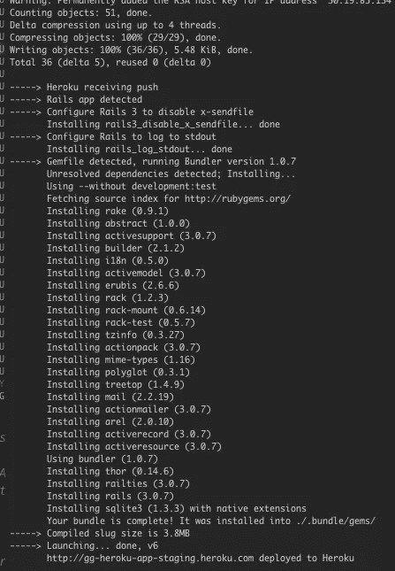
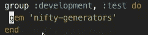
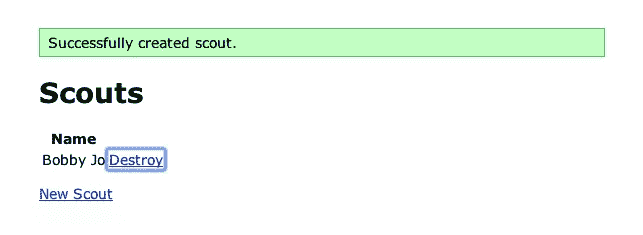
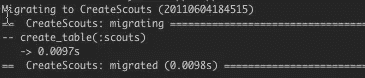

# Heroku:你的第一个登台环境

> 原文：<https://www.sitepoint.com/heroku-your-first-staging-environment/>

当我开始使用 Rails 时，有几次“啊哈！”让我觉得我作为. NET 开发人员一直在浪费生命的时刻。宝石，耙子，活动记录，还有很多。

其中一个时刻在几年后以 Heroku 的形式出现。Heroku 是基于 Ruby 和 Node.js 的 web 应用程序的部署平台。有许多关于 Heroku 的“入门”文章，其中最好的一篇是 [Ben Scofield 的](http://rubylearning.com/blog/2010/12/15/getting-started-with-heroku/)，我建议您在继续阅读本文之前阅读一下。Ben 很好地向您展示了如何在 Heroku 上安装应用程序，并详细介绍了 Heroku 平台的一些限制。

到那篇文章结束时，您应该会看到在 web 上安装 Rails 是多么简单。在本文中，我计划将 Heroku 部署场景向前推进一步，并向您展示如何拥有一个开发/登台应用程序以及一个生产应用程序。

当您为客户/朋友/您的猫创建应用程序时，最好有一个“准备”应用程序来测试应用程序的更改，并允许最终用户在您将任何东西应用到生产之前看到它。你可以测试新的 gem 版本或布局变化，并在不损害网站赚钱部分的情况下获得批准。当你有一个临时区域时，问题是要使它易于管理，这样你就不必处理多个代码库，复制源代码树，等等。Heroku 让这变得轻而易举。

## 准备

为了开始，您需要以下内容:

*   git 知识([列出分开的文章)](http://www.alistapart.com/articles/get-started-with-git/)
*   GitHub repo ( [为所有平台设置](http://help.github.com/mac-set-up-git/)
*   Heroku API 帐户([伟大的创业文章](http://rubylearning.com/blog/2010/12/15/getting-started-with-heroku/))
*   基本的 Rails 知识

我鼓励你在研究任何红宝石时使用 RVM。

## 过程

闲聊够了，让我们进入代码。从一个没有 gem 的环境开始，我们需要 Bundler (1.0.14)和 Rails (3.0.7)

```
gem install bundler
gem install rails
```

现在，创建你的 Rails 应用程序(rails new your_heroku_app ),并放入这个应用程序的根目录。让我们确保一切正常:

```
bundle install
rails s
```

如果一切正常，您应该会看到标准的“欢迎使用 Rails”页面。现在，让我们把这个应用程序置于源代码控制之下。使用 Heroku 的另一个巨大的副作用是它迫使你使用源代码管理。

```
git init
git add .
git commit -m "Initial repo commit"
```

## 开源代码库

太好了，现在我们有了一个本地 git 存储库。由于这个应用程序将改变世界，我们将需要一些合作者。让协作变得简单的最好方法是使用 GitHub。GitHub 使得分叉(基本上是复制库)成为鼠标点击和拉取请求(git 的说法是“嘿，我有一个补丁给你”)变得非常简单。此外，为您的应用程序添加 GitHub 存储库会为您提供一个与您的部署平台无关的异地副本。

登录您的 GitHub 帐户，创建一个新的资源库。

[](https://www.sitepoint.com/wp-content/uploads/2011/06/newrepo.png)

新回购

然后 GitHub 会带你到一个页面，告诉你如何把你的本地库推到你的新的 GitHub 库。您会注意到我们将远程存储库称为“origin ”,这是 git 对标识主要上游存储库的委婉说法。在这种情况下，我们希望 GitHub 存储库成为我们协作的中心存储库，因此它需要我们主分支的当前版本。让我们将代码推送到 GitHub:

```
git remote add origin git@github.com:your-user-name/your_app.git
git push -u origin master
```

摇摆。现在我们的应用程序是安全的，我们正在练习良好的编码实践。好样的。

## Heroku 登台环境

现在是时候在 Heroku 上设置我们的登台环境了。当然，我们需要赫罗库宝石

```
gem install heroku
```

Heroku 增加了一个命令行界面(CLI)来创建和操作应用程序。要创建应用程序，很简单:

```
heroku create your-app-name --remote staging
```

在这里，我们向 create 命令传递两个可选参数。第一个是应用程序的名称，它在 Heroku 上必须是唯一的(也就是说，您需要将其更改为其他名称)。第二个参数(–remote)会自动将 git 远程存储库添加到我们的本地 git 设置中，称为“staging”。暂存 git 存储库将是我们将应用程序的更改推送给客户审查的地方。现在让我们将我们的 Rails 应用程序推向 staging:

```
git push staging master
```

[](https://www.sitepoint.com/wp-content/uploads/2011/06/pushtostaging1.png) 
现在，你的 app 已经上线了。很简单，是吧？您可以使用 Heroku CLI 打开它:

```
heroku open --app your-app-name
```

## 做某事

好吧，所以我们的应用还没有改变世界。让它做点什么吧。对于这个人为的例子，我们的应用程序将允许用户创建一个童子军的列表(我是我的男孩的部队的一个巢穴首领)。尽可能简单的说，球探只有一个名字。我将使用 Ryan Bates 的非常棒的[漂亮的生成器 gem](http://everydayrails.com/2010/05/25/nifty-generators.html) ,这样我们就可以快速启动一些东西。我将它添加到 gem 文件中:

[](https://www.sitepoint.com/wp-content/uploads/2011/06/gemfile.png)

漂亮的发电机

然后生成布局和脚手架。

```
rails g nifty:layout
rails g nifty:scaffold Scout name:string index new destroy
rake db:migrate
```

注意:如果您有 Rake 的问题，请确保安装了 0.8.7 或 0.9.1。这两种方法都可以帮助你完成本教程。

现在我们已经定义了模型。让我们设置我们的路线并去掉默认的 Rails 页面:

```
# config/routes.rb
root :to => "scouts#index"
```

```
rm public/index.html
```

启动我们的本地 Rails 服务器，我们可以添加球探。

[](https://www.sitepoint.com/wp-content/uploads/2011/06/scouts.png)

添加球探

我们有大量的本地变更需要推送到我们不同的存储库。首先，我们希望推进到 GitHub，这样我们的合作者就可以开始开发我们的 scout API。

```
git add .
git commit -m "Added layout and Scout scaffold"
git push origin master
```

当然，我们也需要更新 staging。

```
git push staging master
```

在我们开始在 staging 中添加 Scouts 之前，我们需要迁移我们的 staging 数据库。您可能已经猜到了，我们利用了 Heroku CLI。

```
heroku rake db:migrate
```

[](https://www.sitepoint.com/wp-content/uploads/2011/06/rake_migrate.png)

耙式迁移

现在 a

```
heroku open --app staging
```

我们还可以增加侦察兵！

## 生产

我们这里的最后一步是在 Heroku 上创建我们的生产环境。只需再次运行“heroku create”命令，给我们的 heroku 应用一个不同的名称，并创建一个“生产”git remote。

```
heroku create your-app-name-production --remote production
git push production master
heroku rake db:migrate --app your-app-name-production
```

瞧啊。您现在拥有了一个生产环境和一个满意的客户！

在 Heroku 上有关于这种方法的其他资源，其中之一来自 Heroku 站点本身。这当然值得一读，因为它提到了我们在这里没有涉及的多种环境的一些方面。此外，还有一个名为 [heroku_san](http://jqr.github.com/2010/08/27/easy-heroku-deploys-with-heroku-san.html) 的 gem，它处理了我们在本文中为您介绍的许多细节，您应该检查一下，现在您已经知道了它的一些功能。

[](https://www.sitepoint.com/wp-content/uploads/2011/06/rake_migrate.png)

耙式迁移

## 分享这篇文章