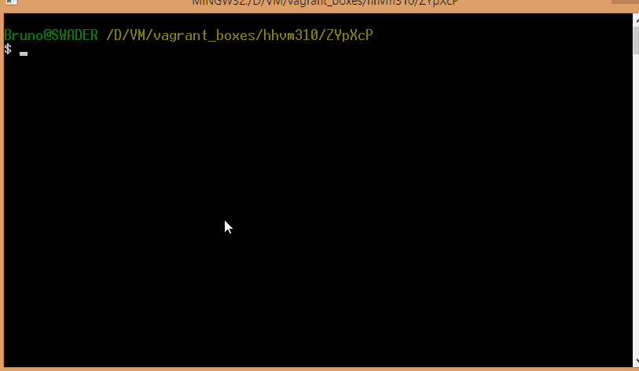

# HHVM 3.1.0 发布

> 原文：<https://www.sitepoint.com/hhvm-3-1-0-released/>

HHVM 团队[刚刚发布了](http://hhvm.com/blog/5195/hhvm-3-1-0)3 . 1 . 0 版本。

该团队主要致力于清理 Github repo，修复 bug 和未解决的问题，但新功能也已登陆。这个版本使 HHVM 与 PHP 5.6 更加同步。，其特征我们在之前已经[写过了。](https://www.sitepoint.com/new-features-php-5-6/)

亮点是[实现了`$...args`功能](https://wiki.php.net/rfc/variadics)，400 ini 可调设置，以及——这听起来是我最感兴趣的——对 [Zend 扩展兼容层](https://github.com/facebook/hhvm/tree/master/hphp/runtime/ext_zend_compat)的改进。这一层将允许用 HHVM 构建现有的 PHP 扩展，只需对源代码做一些小的调整。最终，该层将有望处于允许扩展无缝转换的状态。

我希望看到 Phalcon 与此兼容，这样我们也可以在 HHVM 享受它，但在过于乐观之前，我正在等待 Phalcon 团队在这个问题上的反馈。同时，鼓励其他扩展开发者调整他们的扩展，并尝试在 HHVM 上构建它们，以达到兼容性。

完整的变更日志，引用自原始发布的帖子，但添加了一些链接和一两个解释:

**《坎耶西》**

*   CVE-2011-2202 的反向端口修复
*   接口{键控}容器匹配数组*和*集合，而不是可迭代的
*   向 HHVM 添加了`**`和`**=`操作符，并修正了 PHP5.6 的兼容性
    *   *这些操作员是新的[电力操作员](http://stackoverflow.com/questions/21803213/is-new-power-operator-instead-of-power-in-php)*
*   集合的修复和改进
*   用 json-c 库替换 json 解码器
*   记录 VMRegAnchor 和 isVMFrame()
*   对数组迭代器代码的改进
*   对类型检查器的改进
*   允许用 [bison 3](http://en.wikipedia.org/wiki/GNU_bison) 生成解析器
*   反射代码的改进和加速

**“Jay-Z”2014 年 5 月 9 日**

*   使处理 code.hot 溢出更加健壮
*   更快地发现服务器错误
*   修复 fileinfo 扩展中的 segfault 和无限递归
*   在编译时解析 systemlib 常量
*   本机恢复可恢复性
*   从 php-src 导入 round()表优化
*   删除字节码窥视孔优化器
*   删除 annotation.cpp 的大部分内容，以及其他一些代码！UsedHHBBC
*   为本地人创建 phi
*   修复 rfc1867PostHandler 中的""错误
*   将 firstValue()、firstKey()、lastValue()、lastKey()添加到集合
*   将 concat()添加到集合
*   澄清[黑客许可](https://github.com/facebook/hhvm/blob/master/hphp/hack/LICENSE)
*   将 [CakePHP3](http://book.cakephp.org/3.0/en/contents.html) 添加到测试转轮中
*   TC 满时误差更小
*   从 PHP 5.6 添加 [hash_equals()](http://comments.gmane.org/gmane.comp.php.cvs.general/65571)

**《疯狂的诗歌》2014 年 4 月 24 日**

*   支持 PHP 5.6 [variadic …$args 语法](https://wiki.php.net/rfc/variadics)用于 func 声明
*   开源 [HHMeasure](https://github.com/facebook/hhvm/tree/87eee2c464414b413444fe8c7f3aee9461d18541/hphp/tools/hhmeasure) ，一个简单且可扩展的微基准测试工具
*   添加了新的基于时间的采样分析器([项目氙](https://github.com/facebook/hhvm/blob/e683605e338b774ff7c857d5a1cd3d33d8549d8d/hphp/test/quick/xenon/config.ini))
*   修复 PCRE unicode 处理
*   将 Zend 兼容层和各种扩展转换为 HNI
*   将执行模式(急切或恢复)编码到 SrcKey 中
*   合并异步函数的紧急部分和恢复部分
*   返工各种异步/连续字节码指令

**“ph pain 之家”2014 年 4 月 1 日**

*   允许最多 15 个参数的直接 arg 传递(如果至少有一个是 double，则为 7 个)

如果你是喜欢阅读最原始的变更日志的人之一，完整的变更日志在这里。

如果你想尝试新的 HHVM，我已经做了一个流浪文件，让它为你在几分钟内启动并运行，而不会用不必要的运行时污染你的主机。

只需克隆这个 repo 就可以将最新的 HHVM 安装到 Ubuntu 14.04 中。，用 Nginx 作为服务器，安装了工作的 MySQL 数据库。流浪档案是在 [PuPHPet](https://www.sitepoint.com/build-virtual-machines-easily-puphpet/) 的帮助下制作的，但经过了额外的编辑。

检查你运行的是 HHVM 的最新版本(包括 Hack 和 3.1.0 的版本。更新)只需检查 PHP 的版本——HHVM 可执行文件已经取代了常规的 PHP，可以直接调用:

请注意，我还没有完全调整 repo 以使其开箱可用，所以您需要首先调整 Nginx Vhost 配置，使其读取 PHP 文件。我也还没有在这个盒子上激活远程 MySQL 连接，但它会发生，我会相应地更新这篇文章。

你在生产中使用 HHVM 吗？至少玩玩吧？请告诉我们——我们渴望发布 HHVM 和黑客使用的先进范例。

## 分享这篇文章