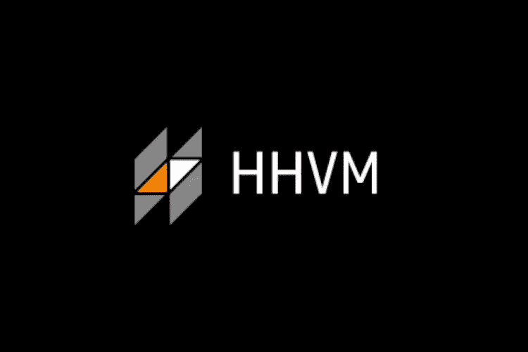
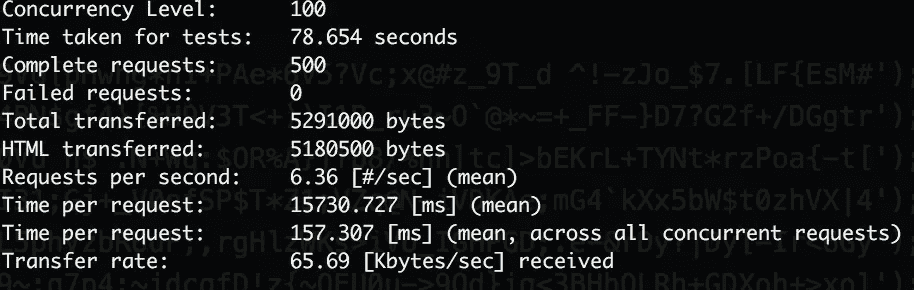
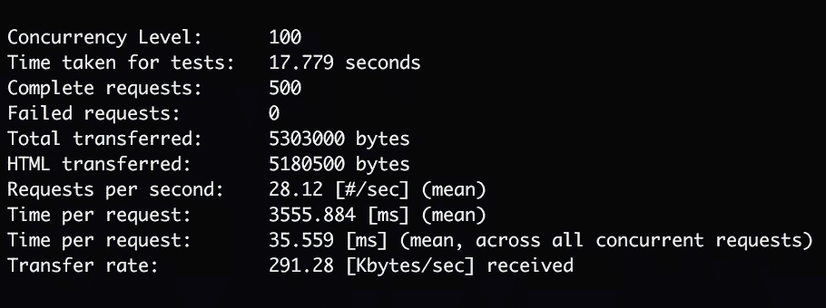

# HHVM 和 WordPress 入门

> 原文：<https://www.sitepoint.com/hhvm-and-wordpress/>

仅仅几个月前，**(hip hop 虚拟机)**还是 PHP 社区中的热门词汇。我们中的许多人对这项技术很好奇，尤其是关于改进性能的报道。以前，Zend 的 PHP 是唯一的选择——直到脸书把 HHVM 介绍给世界。



好消息是，HHVM 不再是流行语了。许多人(包括我自己)不喜欢被夸大的技术，但我很乐意将此作为一篇后流行词文章来写。

所以让我们开始吧！

在本文中，我将介绍:

1.  什么是 HHVM？
2.  什么是 Hack？
3.  与传统 PHP 相比有什么区别？
4.  为什么它在今天存在(或者可能不存在)如此重要？
5.  有哪些基准可以看出 HHVM 与 PHP 5 和 PHP 7 的区别？

## 什么是 HHVM？

为了理解 HHVM 是什么，我们首先需要了解 Zend Engine 是什么(目前我们在 PHP 7 的版本 3 中)。对此最好的解释可以在[这篇维基百科文章](https://en.wikipedia.org/wiki/Zend_Engine)中找到:

> Zend 引擎是解释 PHP 编程语言的开源脚本引擎。它最初是由 Andi Gutmans 和 Zeev Suraski 在 Technion 以色列理工学院学习时开发的。他们后来在以色列拉马特甘成立了一家名为 Zend Technologies 的公司。Zend 这个名字是他们的名字 Zeev 和 Andi 的组合。

是语言还是翻译？这是每一种脚本语言都在争论的问题。然而，假设 PHP 语言是抽象的，它是解释器(解析器)的蓝图。与其说是真正的辩论，不如说是哲学上的辩论。HHVM 类似于 Zend Engine，但它采用不同的方法来解析和运行源代码。

最终，两个解释器/解析器可以(理论上)执行相同的源代码，并提供具有相同副作用的相同输出。HHVM 采取了不同的方法。HHVM 背后的团队将其描述为一个虚拟机，它使用 [JIT](https://en.wikipedia.org/wiki/Just-in-time_compilation) (just in time)编译来获得比 Zend 的方式更高的速度和灵活性。

考虑 HHVM 的另一个原因是速度。直到 PHP 5。*基准站在 HHVM 一边。我知道基准也是一个有争议的话题，但是如果做得好，它们可以揭示一些真相。长话短说，HHVM 似乎优于 PHP，但在 PHP 7 之后就没那么好了。PHP 7 问世后，这一差距开始变得更加模糊。这就是我们今天运行一些基准测试来比较它们的原因。

HHVM 仍然是一个新的，很酷的，不同于 Zend 的技术。从技术角度来说完全不一样。有些事情开始是作为一个实验，可能是一些开发人员日常工具箱的一部分。我有没有提到它是在脸书烘焙的，他们也在生产中使用它(虽然不确定是脸书的哪个地区)。HHVM 是从脸书面临的一个现实问题——速度(以及其他一些大多数开发人员可能从未遇到过的复杂问题)中建立起来的。

HHVM 也支持**黑**。Hack 是 HHVM 的一种编程语言。然而，PHP 不就是 HHVM 解析的语言吗？是的，但是也有黑客。基本上 Hack 是 PHP 加上一些目前不属于 PHP 或者近期没有计划的其他特性。所以当你写 PHP 的时候，HHVM 可以解析并执行它，但是你也可以使用 Hack，这是 PHP 加上一些额外的东西。这是你的选择。但是别忘了 Hack 并不是 100%兼容 PHP 的。具体的黑客功能在 Zend Engine 上不起作用，它们只在 HHVM 上起作用。

## 在 Docker 上设置 HHVM 和 WordPress

我不想只在我的设置上写整篇文章，所以这就是为什么我创建了[WP _ Dock](https://github.com/AleksanderKoko/WP_Dock)(WordPress+Docker)。如果你想了解 Docker 和 WordPress 的更多信息，请务必阅读以下文章:

*   [面向 WordPress 开发者的 Docker 简介](https://www.sitepoint.com/docker-for-wordpress-developers/)
*   [如何为 WordPress 手动构建 Docker 容器](https://www.sitepoint.com/how-to-manually-build-docker-containers-for-wordpress/)
*   [如何使用 Docker 官方 WordPress 图片](https://www.sitepoint.com/how-to-use-the-official-docker-wordpress-image/)
*   [用 Docker 部署 WordPress】](https://www.sitepoint.com/deploying-wordpress-with-docker/)

你可以选择在你的操作系统上安装所有的东西，但是使用 Docker 可以让每个人更容易地在每个操作系统上安装。它还消除了在桌面操作系统上安装 PHP、HHVM、nginx 或 MySQL 的需要。也就是说，如果你愿意，你可以按照 HHVM 自己的教程来安装 HHVM 和 WordPress。

首先你必须下载 [Docker 工具箱](https://www.docker.com/products/overview#/docker_toolbox)，如果你还没有的话。然后下载或克隆这个项目。

```
git clone https://github.com/AleksanderKoko/WP_Dock wpdock
```

下载 WordPress，复制到文件夹里面，重命名为‘app’。导航至 Docker 文件夹内的`cd wpdock/docker`。

默认情况下，nginx 运行 php-fpm，所以您必须改变这一点。在'`docker-compose.yml`'上将 nginx ' `links`'改为'`hhvm`'。它应该是这样的:

```
nginx:
    build: ./nginx
    volumes:
        - ./../storage/logs/nginx:/var/log/nginx        - ./../app:/var/www/app    ports:
        - "80:80"        - "443:443"    links:
        - hhvm
```

同样在`docker/nginx/config/upstream.conf`中，将`php`改为`hhvm`。它应该是这样的:

```
upstream fastcgi-upstream { server hhvm:9000; }
```

然后执行`docker-compose up -d nginx`。这将使用“docker-compose.yml”作为配置来构建 Docker 容器。现在您将知道在哪个 IP 上可以找到您的容器，为下一步做好记录。

```
docker-machine ip default
```

现在打开你的浏览器到上面提到的 IP 地址，你会看到 WordPress 安装指南。最后一步是改变 WordPress 数据库配置。默认情况下，凭证在`docker-compose.yml`中指定。如果您查看 MySQL 部分，您会看到:

```
mysql:
     build: ./mysql
     volumes:
         - ./../storage/data/mysql:/var/lib/mysql         - ./../storage/logs/mysql:/var/log/mysql     ports:
         - "3306:3306"     environment:
         MYSQL_DATABASE: databasename
         MYSQL_USER: username
         MYSQL_PASSWORD: secret
         MYSQL_ROOT_PASSWORD: root
```

如果要更改数据库名称、用户名和密码，请更改这些值，然后:

```
docker-compose down
docker-compose up -d --build nginx
```

注意:MySQL 主机应该是机器的 IP。你在浏览器上用来查看 WordPress 安装的那个。

要切换回 PHP，首先运行`docker-compose down`，然后将配置改回 PHP。所以把作为 nginx `link`的`hhvm`去掉，加上`PHP`。也更新`docker/nginx/configuration/upstream.conf`到:

```
upstream fastcgi-upstream { server php:9000; }
```

执行`docker-compose up -d --build nginx`改为使用 PHP。

## HHVM + WordPress 对 PHP 7 + WordPress

对于基准测试，这些是规则。我将按原样使用基本容器。HHVM 也可以单独使用，但我用它来做比较。我知道这两者都可以配置得更优化，但那是另一天的文章。由于 HHVM 需要热身才能发挥其全部潜力，我应该先提出一些请求，让 HHVM 编译它的东西(我们将为 PHP 做同样的事情，使事情更加平衡)。对于基准测试，我们将使用 [Apache Bench](https://httpd.apache.org/docs/2.4/programs/ab.html) (ab)。如果你想在你的机器上运行基准测试，检查他们的[文档](https://httpd.apache.org/docs/2.4/programs/ab.html)来安装或者如何使用它。另外，布鲁诺·什科沃茨有一篇关于 Apache Bench 的优秀文章可以帮助你开始。

我的板凳命令是:`ab -n 500 -c 100 http://192.168.99.100`。总共有 500 个请求，其中有 100 个并发请求。

### PHP 结果



### HHVM 结果



79 秒 vs 18 秒听起来是个不小的承诺，即使 79 秒是 PHP 7。但不得不承认，我没有优化过 PHP 或者 HHVM。也许 HHVM 开箱后速度更快，所以不要想当然地相信我的话——要有所保留，自己测试一下。在现实世界中，PHP 7 可能比 HHVM 还要快。

## 一些最后的提示

HHVM 似乎是一项很酷的技术(这就是为什么我把它打包在 Docker 上)。不过，我得警告你，慎用。Zend Engine 是一款成熟的、久经考验的工具。一般来说，PHP 是经过实战检验的，不会受到大肆宣传的影响。这并不意味着你不能用它做实验。这不是唯一的问题。WordPress 的许多插件和主题可能无法在 HHVM 上使用。它们是基于 PHP 开发的，HHVM 并不是 100%兼容 PHP。

## 结论

在这篇文章中，我们看到了什么是 HHVM 以及如何用 HHVM 设置 WordPress。

我认为 HHVM 是脸书的一个积极举措，不仅仅是从开源的角度。在这个新的网络时代，每种语言都跳上了服务器端的列车，竞争加剧了。没必要增加碎片化，但让整个场景与众不同，很有新意。

PHP 本身借鉴了 Java 的很多东西，或者借鉴了 Ruby on Rails 的 Laravel。除了酷、快、有新方法，HHVM 背后的团队也推动 Zend Engine 背后的团队变得更好。PHP 7 是 PHP 社区最好的更新之一。由于 PHP 本身与 Zend 紧密结合，来自其他团队的竞争是一件好事。此外，一些人可能知道 HHVM 不是游戏中唯一的虚拟机。[塔瓜 VM](https://github.com/tagua-vm/tagua-vm) 是用 Rust 写的新 VM。此外，他们的方法是不同的，主要思想是内存安全。

好奇，实验和制作大部分时候都不一样。然而，如果碰巧你自己也尝试过 HHVM，我想听听你的意见。你和 HHVM 有什么经历？您是否尝试过在真实站点上进行基准测试？出现了什么问题(如果有的话)？

## 分享这篇文章