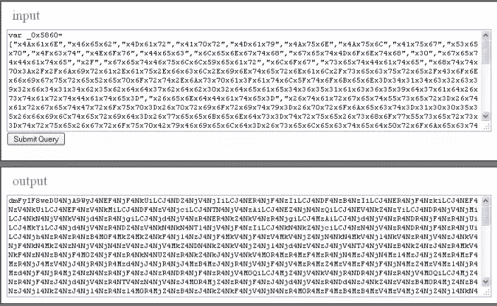

# 隐藏您的 jQuery 源代码

> 原文：<https://www.sitepoint.com/hide-jquery-source-code/>

所以我写了这个很棒的 jQuery 脚本，但是我不想让任何人复制它！！！显然，在大多数网站上，你可以简单地*右键单击>查看源代码*，然后如果你使用像 firefox 这样的浏览器，只需点击 javascript 文件，你就可以查看它的内容。heypresto！

众所周知，jQuery 是 **JavaScript，所以它需要被浏览器解释，因此需要是可见的**。然而，您可以混淆/缩小您的 JavaScript，使其变得几乎不可读。

**您可以使用的一些在线工具有:**

*   让你的 JavaScript 代码看起来更漂亮！
*   JavaScript Minifier–Minifier 使您能够通过减少级联样式表和 JavaScript 文件的大小来提高 Ajax 应用程序的性能(它还提供了 hypercrunch 选项来降低可读性)
*   JavaScript 混淆器–它使用混淆技术(如上图所示！).很好。
*   编码基数 64-[http://www.shell-tools.net/index.php?op=base64_enc](http://www.shell-tools.net/index.php?op=base64_enc)
*   解码基数 64-[http://www.shell-tools.net/index.php?op=base64_dec](http://www.shell-tools.net/index.php?op=base64_dec)
*   [http://jsutility.pjoneil.net/](http://jsutility.pjoneil.net/)–JavaScript 实用程序版本 3–混淆程序

**提示和警告:**

*   CTRL+U 是查看网页源代码的热键。
*   禁用鼠标右键不会阻止任何事情。
*   请注意，如果浏览器可以呈现页面，那么源代码就可以被访问，并且您无法阻止一个坚定的 JavaScript 代码告密者。
*   试图混淆代码可能会导致高达 9%的浏览者无法充分利用你的网站(包括搜索引擎)。

## 其他方法

我发现这是隐藏 JavaScript 代码的一个巧妙的小技巧。这个函数将卸载所有链接的 javascript 文件，这样当你查看源代码时，你就看不到 javascript 文件了！(在使用 FF 和 web 开发工具时特别有用——不显示链接的 js 文件)文件驻留在内存中——允许函数工作。

 `函数 unload js(script name){
var head = document . getelementsbytagname(' head ')。项目(0)；
var js = document . getelementbyid(script name)；
js . parent node . remove child(js)；
}

函数 unload alljs(){
var jsArray = new Array()；
js array = document . getelementsbytagname(' script ')；
for(I = 0；我

*   [**10 jQuery 安全插件**](http://www.jquery4u.com/security/10-jquery-security/)`

## `分享这篇文章`