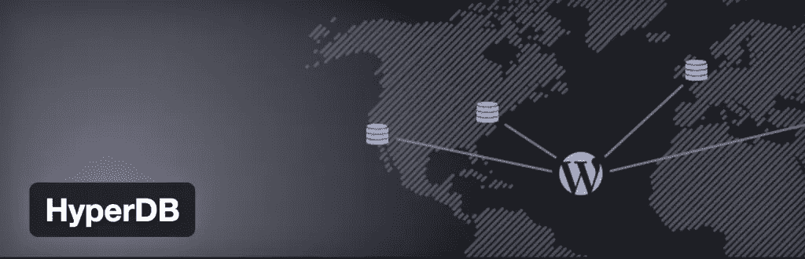

# 具有 HyperDB 的高可用性 WordPress

> 原文：<https://www.sitepoint.com/high-availability-wordpress-with-hyperdb/>

我一直如此迷恋 WordPress 的原因之一是因为它拥有无限的可能性。似乎如果你知道 PHP 以及如何利用数据和控制它，你几乎可以做任何事情。WordPress 数据库可以保存任何类型的数据，这使得它在添加了自定义文章类型和自定义字段的功能后更加有用。你可以将各种数据保存到 WordPress 数据库中。

当您收集太多数据时，问题就出现了，这会使您的服务器陷入困境。想象一下拥有成千上万成员的巨大网站，储存着各种各样的信息。这可以是任何内容，从成员个人资料数据，如姓名、位置和 bios，到商业网站的产品信息。挑战之一是使用单个数据库和单个服务器来处理所有这些的局限性。当您的唯一服务器出现故障时会发生什么？整个网站及其功能会崩溃，直到服务器恢复正常工作。

随之而来的是 [HyperDB](https://wordpress.org/plugins/hyperdb/) ，它是一个插件，用于将你网站的负载分散到几个服务器和数据库上。

HyperDB 有其优势，我们将在继续探索时讨论。你为什么想用 HyperDB 来安装 WordPress？这里只是几个特点。

## 分割

就像您可以对计算机上的硬盘驱动器进行分区一样，您也可以对数据进行分区或分离，并将其分散到多台服务器上。这可以节省资源，并有助于将数据分布到多个数据库和服务器上。Hyper DB 会先尝试最优的服务器，这很有帮助。

这样想吧。如果你踩在一根钉子上，把你整个身体的重量放在那根钉子上，它会很容易穿过你的脚。然而，如果你把你的体重分布在一整层钉子上，你可以躺在上面而不被刺穿。HyperDB 中的分区类似于同样的想法。不是一个服务器或数据库承载很重的负载，增加了崩溃的可能性，而是分布在多个服务器和数据库上，所以是均匀分布的。

## 分身术

复制是指拥有同一服务器的多个副本。一个是主人，其他的叫奴隶。您可以向主服务器写入，但只能从从服务器读取。这对于安全性是您的首要任务的情况可能很有用。

需要注意的是，HyperDB 不提供复制服务。您必须自己以这种方式配置服务器。然后，一旦设置好，HyperDB 就可以访问它们。

## 故障切换

这就像是一个数据库和服务器的链，它们作为彼此的故障安全回退方法。它们都包含相同的数据，但是如果一个失败，下一个将接管。如果前两个失败，那么第三个将接管。我认为这对于需要 100%正常运行时间和 24/7 可访问性的应用程序非常有用。如果你有一个人们付费的网站，你不会希望它关闭，损失你宝贵的收入。如果第一台服务器出现故障，您需要准备好备份。

故障转移是您必须预先设置的。一旦设置了该选项，它将查询下一个可用的服务器。如果没有设置，HyperDB 会自己多尝试几次，但最终会放弃，返回一个错误。

## HyperDB 真正变得有趣的地方

大企业可以真正从使用 HyperDB 中获益。想象一下依赖数据库和服务器运行的不同类型的企业。想象一下，一家全国性甚至国际性公司的服务器需要大量的存储空间。您不必局限于将所有服务器都放在一个位置。您可以将它们配置为与其他物理位置的远程服务器一起工作。

## 一种可能的情况

我们以一家托管公司为例。他们不会在一个地方存放足球场大小的服务器。大多数较大的托管公司将服务器放在他们的总部，但是他们也可以将远程服务器放在全国各地。想想这在提供数据方面有多有用。尽管我们愿意认为数据在任何地方都是即时的，但如果你在纽约，从加州的服务器加载数据要比你在东海岸的服务器花费更长的时间。

HyperDB 简单地利用了一个服务器的限制，并且没有扩展的配置选项，并且拒绝了。谁更强壮，谁能活得更久:一个孤独的健身者，还是 50 个中等身材的敏捷男人。总的来说，这群人可以分担工作，让一切都更有效率。

## 结论

HyperDB 对于优化您自己的定制服务器配置非常有用。想想看，与一台服务器相比，多台服务器可以提高您的性能。灵活性，加上这些基本特性，使得 HyperDB 成为一个值得一看的 WordPress 插件。

如果您想了解更多关于 HyperDB 的信息，请查看官方文档:

*   [HyperDB 抄本页面](https://codex.wordpress.org/HyperDB)
*   [官方 HyperDB 插件](https://wordpress.org/plugins/hyperdb/)

## 分享这篇文章