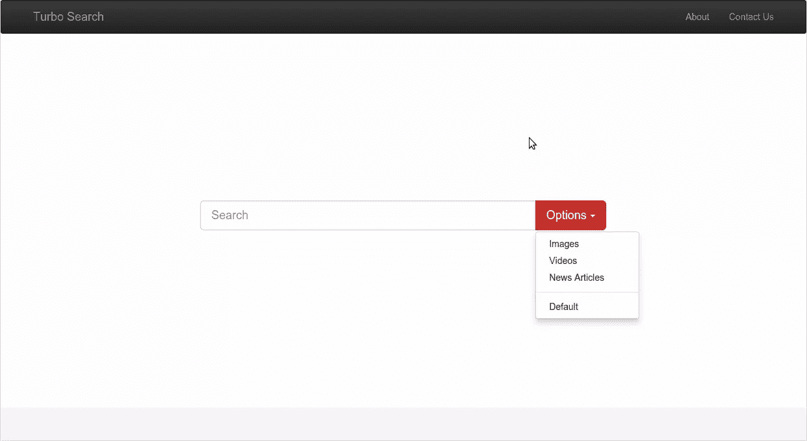
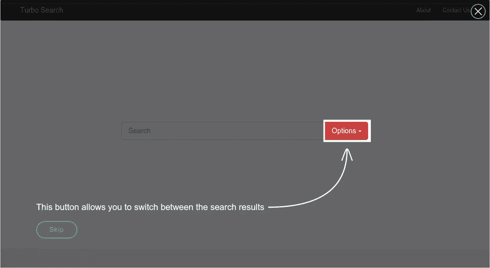
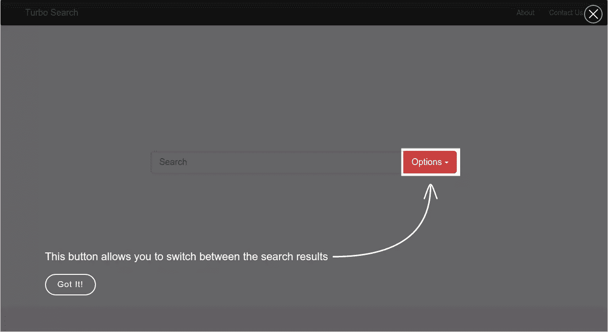
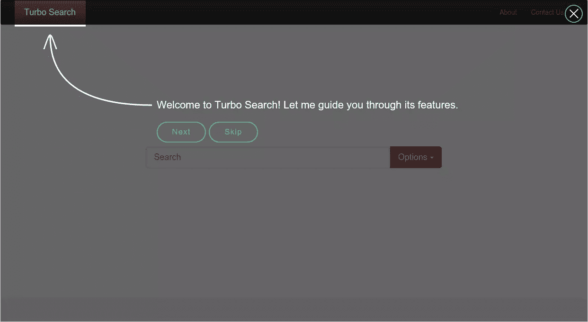
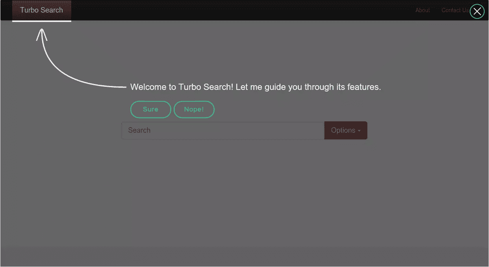
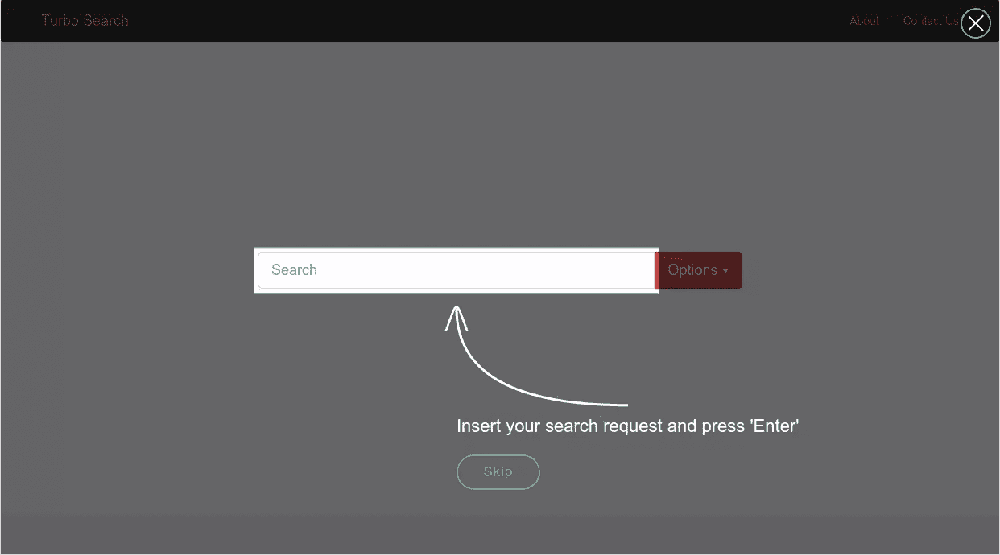
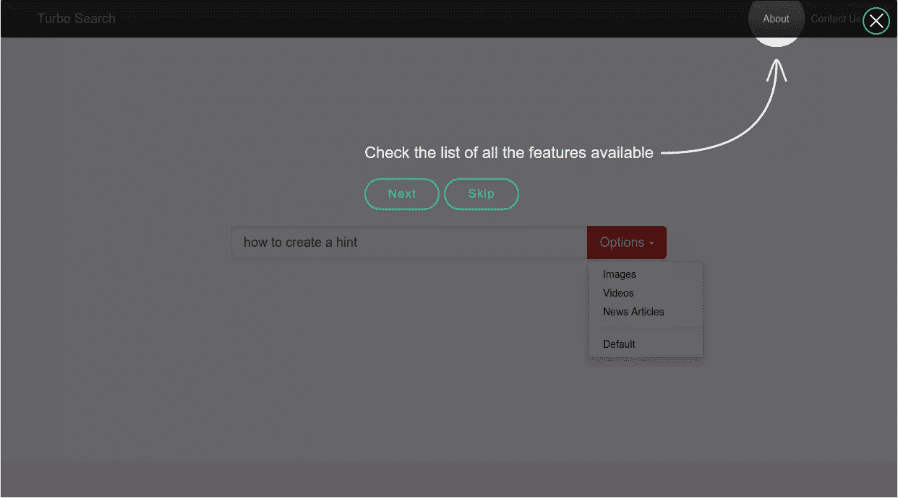
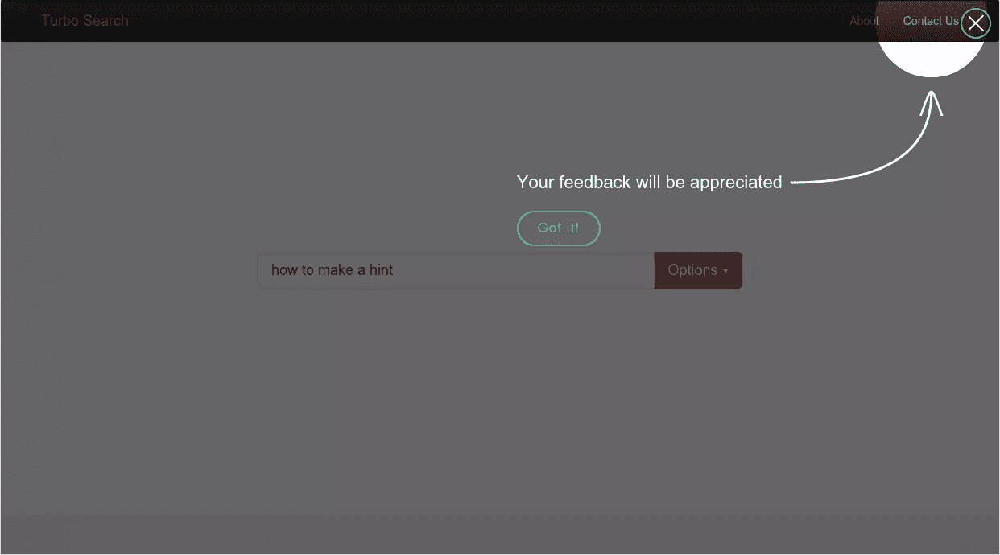

# 用快乐暗示创作

> 原文：<https://www.sitepoint.com/hints-creation-with-enjoyhint/>

这篇文章的目的是介绍为网站创建提示的过程。首先，我们将看看如何为一个合适的网站元素创建一个单一的提示。然后，我们将创建一个提示序列来引导浏览一个网站。为了创建提示，我将使用 [EnjoyHint](http://xbsoftware.com/products/enjoyhint/) 。作为一个例子，我用[引导框架](http://getbootstrap.com/)制作了一个简单的演示[。](http://derrvish.github.io/enjoyhint-demo/)

EnjoyHint 依赖于 [jQuery](https://jquery.com/) ，它需要高于或等于版本 1.7 的库版本。另一个依赖项是[kinetics](https://github.com/ericdrowell/KineticJS/)v 5 . 1 . 0，它已经包含在 EnjoyHint 中，所以没什么好担心的。

如果你想查看演示的源代码，[你可以访问这个 GitHub 库](https://github.com/sitepoint-editors/enjoyhint-demo)。

## 为什么要用 EnjoyHint？

EnjoyHint 的主要目标是给你一个机会来帮助用户找到浏览你的网页的方法。对于包含大量元素的大型 web 应用程序来说，这非常有用。


您可以突出显示单个元素并为其添加描述，或者牵着用户的手向他逐一展示所有可用的功能。有了这个库，也可以改变高亮区域的形状，或者对提示文本使用你自己的风格。以下是它的主要特性列表:

*   免费使用
*   自动聚焦并突出显示与提示相关的区域
*   突出显示区域的不同形状
*   提示延迟属性
*   恢复中断的提示序列的可能性
*   跨浏览器支持
*   支持 Android、iOS 和 Windows 触摸屏

考虑到这一点，现在是时候编写一些代码来查看这个库的运行情况了。

## 创建提示

作为一个例子，我创造了这个小小的搜索引擎模型:



它包含标题、搜索栏和帮助在不同类型的搜索结果之间切换的选项按钮。网站的开发非常简单，也不在本教程的讨论范围内，所以我就不描述细节了。然而，[如果你愿意，你可以检查源代码](https://github.com/sitepoint-editors/enjoyhint-demo)。

一旦我们有了一个基本的网页，我们就可以开始使用 EnjoyHint。要执行的第一步是使用 [Bower](http://bower.io/) 安装它:

```
bower install enjoyhint
```

或者，[你可以从它的 GitHub 库](https://github.com/xbsoftware/enjoyhint)下载它。

下载并解压缩软件包后，您可以将它包含到 HTML 文件中。我们说过，这个库依赖于 jQuery，所以在享受 Hint 之前，你必须包含后者。如果不想在本地托管 jQuery，可以使用 [jQuery CDN](https://code.jquery.com/) ，如下所示:

```
<script src="https://code.jquery.com/jquery-1.11.3.min.js"></script>

<script src="enjoyhint/enjoyhint.min.js"></script>
<link href="enjoyhint/enjoyhint.css" rel="stylesheet"/>
```

### 享受打印初始化

要初始化新的 EnjoyHint 实例，您可以编写:

```
var enjoyhint_instance = new EnjoyHint({});
```

现在你可以描述你的第一个暗示了:

```
var enjoyhint_script_steps = [{
    /*hint code goes here*/
}];
```

或者，如果您想要创建一系列提示:

```
var enjoyhint_script_steps = [{
    /*first hint code*/
}, {
    /*second hint code*/
}];
```

下一步是将提示的描述设置为实例配置:

```
enjoyhint_instance.set(enjoyhint_script_steps);
```

一切都准备好了，我们现在可以运行我们的脚本:

```
enjoyhint_instance.run();
```

### 提示定义

作为我们的第一个示例，让我们添加一个新的提示来描述选项按钮的用途:

```
'click .btn' : 'This button allows you to switch between the search results'
```

结果如下所示:



`click`是将运行下一个提示的事件。在我们的例子中，事件是点击一个按钮。`.btn`是我们想要突出显示的元素的选择器(在我们的例子中是带有`btn`类的选项按钮)。然后，在冒号之后，我们应该定义提示的文本。

因为我们的脚本中只有一个提示，所以当我们单击 Options 按钮或 Skip 按钮时，这个提示就会消失。默认情况下，会出现“跳过”按钮。EnjoyHint 允许您为其内置元素应用自己的 CSS 类和名称，如果您想要描述页面的单个元素，这可能会很有帮助。

您可以使用`skipButton`属性更改按钮的标签:

```
'click .btn' : /*hint text*/,
'skipButton' : {className: "mySkip", text: "Got It!"}
```

这段代码还向其中添加了`mySkip` CSS 类。例如，使用以下 CSS 代码:

```
.mySkip {
    color: white;
    border-color: white;
}
```

你可以得到这样的结果:



您甚至可以通过指定`showSkip: false`来删除跳过按钮。

既然您已经知道了如何创建一个单独的提示，那么是时候创建两个了。他们将一个接一个地运行，创建一个向导。

## 提示序列

为了开始创建一个提示序列，我们应该从头重写提示定义的所有代码。

### 提示一。“下一个”事件

第一个提示将被指定如下:

```
'next .navbar-brand' : /*hint text*/
```

这次我使用了`next`事件，下面是我得到的结果:



如你所见，我们的网站标题现在高亮显示。现在，我们有两个按钮。“下一步”按钮将运行下一个提示，而“跳过”按钮将中止脚本。您可以像我们在前面的示例中更改跳过按钮一样更改下一个按钮:

```
'nextButton' : {className: "myNext", text: "Sure"},
'skipButton' : {className: "mySkip", text: "Nope!"}
```

下面是这些按钮现在的样子:



### 提示二。“关键”事件

下一个提示将告诉用户如何使用搜索字段。为此，我们将使用`key`事件。我们按下某个键后，它将运行下一个提示:

```
'key #mySearch' : /*hint text*/,
'keyCode' : 13
```

注意，这一次我们使用 ID 作为选择器。属性定义了触发下一个提示的按钮的代码。在这种情况下，它相当于 Enter 按钮。

让我们来看看它是什么样子的:



单击 Enter 按钮后，将调用下一个提示。

### 提示三和四。改变形状

在第三步中，我们将使用之前为选项按钮定义的提示(有关详细信息，请参见“提示定义”一节):

```
'click .btn' : /*hint definition*/
```

当您点击此按钮时，第四个提示将运行。现在我们将使用`shape`属性来改变默认的高亮形状:

```
'next .about' : /*hint definition*/,
'shape': 'circle'
```

该代码将突出显示 About 部分，如下所示:



### 最后一步

如果默认的圆形大小对您来说不够大，您可以使用`radius`属性来更改它的大小。我们现在将使用这个特性创建最后一个提示。由于这是我们指南的最后一步，我们不再需要 Skip 按钮，我们可以使用`showSkip`属性禁用它。

所以，这是我最后一个提示的代码:

```
'next .contact' : 'Your feedback will be appreciated',
'shape': 'circle',
'radius': 70,
'showSkip' : false,
'nextButton' : {className: "myNext", text: "Got it!"}
```

结果是:



可以看到，这次高亮区域的半径更大了。

## 回收

我想讨论的最后一个特性是执行回调函数的可能性。EnjoyHint 为您提供了运行回调的`onStart`和`onEnd`属性。第一个在第一个提示开始前执行，第二个在最后一个提示结束后执行。下面是一个使用示例:

```
var enjoyhint_instance = new EnjoyHint({
    onStart: function () {
        // runs before the first hint
    },
    onEnd: function () {
        // runs after the last hint
    }
});
```

还有另一个运行回调的属性叫做`onBeforeStart`。这个在某个提示开始之前触发:

```
var enjoyhint_script_steps = [{
    /* hint description */
    onBeforeStart: function () {
        // runs before the hint
    }
}];
```

## 结论

EnjoyHint 允许您通过逐步向网站添加提示来创建逐步指南。该工具为您提供了额外的有用功能，例如自定义事件创建。您可以在提示的描述中使用 HTML，这允许您根据需要更改其外观。

如果你想查看源代码，[你可以访问这个 GitHub 页面](https://github.com/sitepoint-editors/enjoyhint-demo "Demo")。这里是[演示页面](http://derrvish.github.io/enjoyhint-demo/ "Demo page")。

## 分享这篇文章