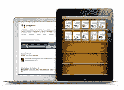

# 帮助你跨越极客游戏终点线的提示

> 原文：<https://www.sitepoint.com/hints-to-help-you-get-across-the-geekgames-finish-line/>

[极客运动会](https://www.sitepoint.com/)本周末闭幕…

…这意味着有人将赢得 Macbook Air 和 iPad3 的总奖——9 名亚军每人获得一台 Kindle touch！

我们有几个关于秘密计分算法在三个游戏中如何工作的问题:鼠标探索，垃圾邮件射击和乒乓龙。不透露太多，这里有一些提示:

1.  有一个**最高总分**(提示…目前的获胜分数已经非常接近了。此外，三个游戏中的每一个对总得分的贡献*相等*。)
2.  在**鼠标-Questrian** ..速度就是一切(所以要想办法靠近终点线，但要尽可能快地冲过终点)。
3.  在**垃圾邮件射击** …你射击“坏人”(蓝色垃圾邮件)和不射击“好人”(橙色非垃圾邮件)会得到很好的奖励，但射击“好人”和错过射击“坏人”会严重影响你的机会并降低你的分数。
4.  在 **Pong-Long** …这一切都是为了让你的分数尽可能高。但是计算一下可以达到的最高总分(见上面的第一条),你就会知道什么时候该停下来了:)

好吧，就这样。

祝你和其他成千上万的极客游戏玩家好运，因为你们正在向终点线和极客游戏的[闭幕冲刺。](http://www.timeanddate.com/worldclock/fixedtime.html?msg=geekgames+closing&iso=20120812T14&p1=15)

享受…并确保你也接受他们的极客游戏[数据书呆子 t 恤报价](http://newrelic.com/geekgames?utm_source=SITE&utm_medium=banner_ad&utm_content=geekgames&utm_campaign=RPM&utm_term=mainsponsor&mpc=BA-SITE-RPM-en-100-geekgames-mainsponsor)！

## 分享这篇文章