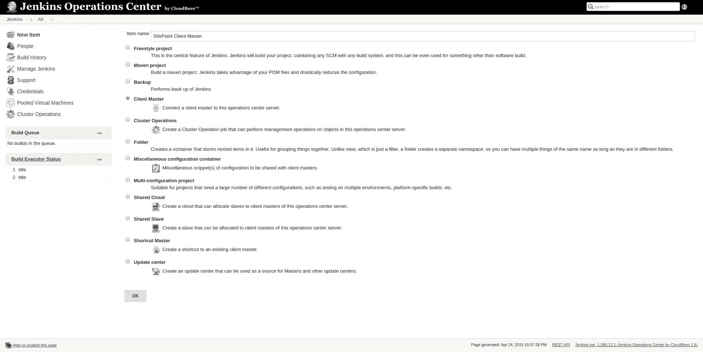
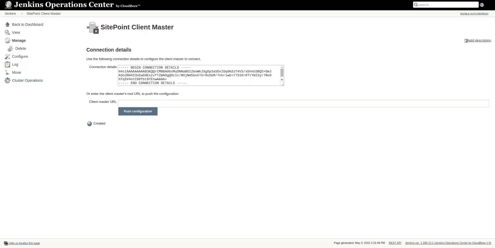
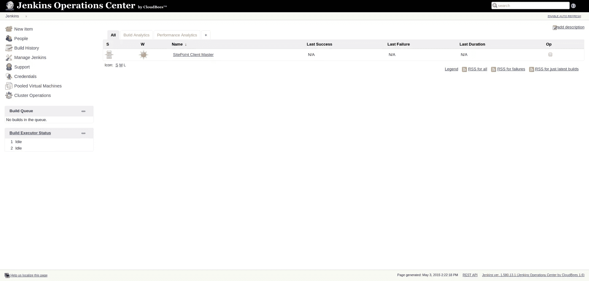
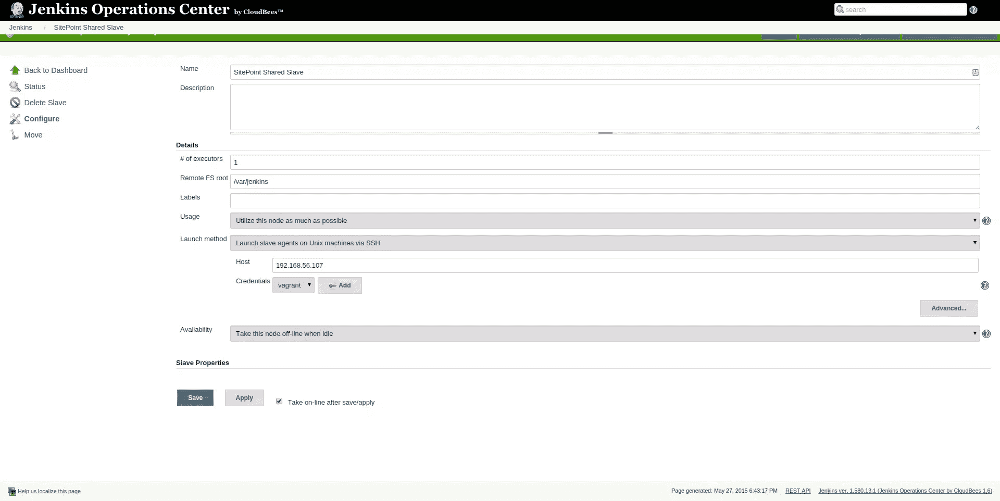
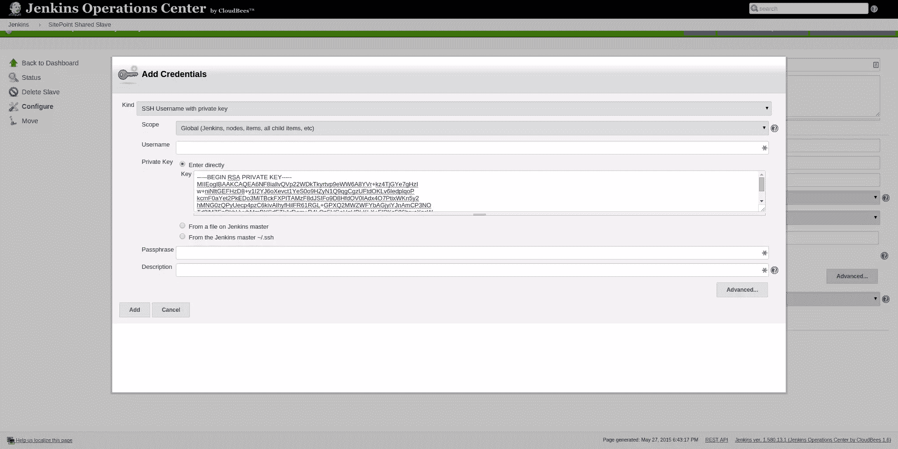
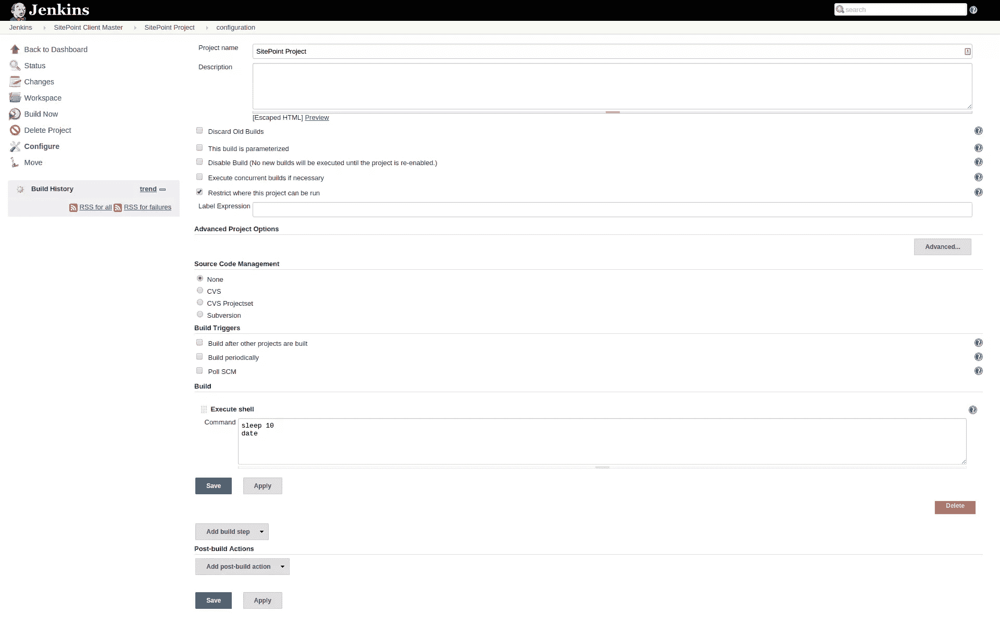
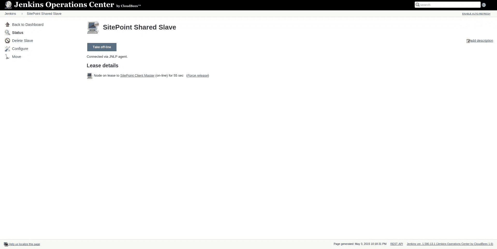

# CloudBees Jenkins 运营中心的水平扩展

> 原文：<https://www.sitepoint.com/horizontal-scaling-with-cloudbees-jenkins-operation-center/>

*本文由*[*cloud bees*](https://www.cloudbees.com/)*赞助。感谢您对使 SitePoint 成为可能的赞助商的支持！*

想象一下:你开始使用 Jenkins，可能只有一台机器。随着项目的数量和项目本身的规模开始增长，您开始添加从属项目。慢慢地，您的 Jenkins 服务器集群增长，您开始慢慢失去控制。如果你的詹金斯大师崩溃了怎么办？如果你意识到这种感觉，或者你想避免这种感觉，你一定要继续读下去。

在本文中，我们将在 [CloudBees Jenkins 运营中心](https://www.cloudbees.com/products/jenkins-operations-center)拍摄一个小高峰。由 [CloudBees](https://www.cloudbees.com/) 创建的 CloudBees Jenkins 操作中心为您提供了许多附加功能，让您的 Jenkins 集群更上一层楼。CloudBees Jenkins 运营中心的主要功能包括:

*   跨所有客户端主机的整合导航体验。
*   任何客户端主服务器都可以使用的共享构建从资源。
*   控制客户端主机使用的身份验证和授权方案。这实现了一些功能，例如:单点登录和整合的权限方案。
*   管理客户端主机使用的更新中心。
*   Jenkins 企业许可证的整合管理。
*   在客户端主机上管理和实施某些关键安全设置。

在本文中，我们将只使用少量的可用特性。我们将创建一个客户端主服务器和一个共享的从服务器。为此，我们将使用三台独立的服务器。第一个将运行 CloudBees Jenkins 运营中心，第二个将运行 Jenkins Enterprise，第三个将用作共享从机。我们将在接下来的几章中解释一切。

## 准备

我将在本地计算机上使用三台虚拟机。如果你想跟着做，你可能要确保你自己的电脑足够强大。如果您恰好在某个地方有三台备用服务器，您也可以直接在那些服务器上尝试。

这三个服务器将通过流浪者管理。我创建了一个[多机](http://docs.vagrantup.com/v2/multi-machine/)流浪文件，它将引导所有三台服务器。如果你还不熟悉流浪者，你可能想看看[这篇文章](https://www.sitepoint.com/vagrantfile-explained-setting-provisioning-shell/)。

让我们从流浪汉档案开始。您可以在此找到内容

*注意:这三个盒子都运行 CentOS 7。如果你愿意，你可以很容易地用 Ubuntu 盒子来代替它们，但是请注意，下面所有的命令都是针对 CentOS 的。*

当您运行`vagrant up`时，将创建三个服务器。他们每个人都有不同的 IP:

*   192 . 168 . 56 . 105:cloud bees Jenkins 运营中心
*   192.168.56.106:詹金斯企业-客户主(主)
*   192.168.56.107:共享从机(从机)

## 安装 CloudBees Jenkins 运营中心

我们首先在第一台服务器上安装 cloud bees Jenkins Operation Center。CloudBees Jenkins 运营中心是我们管理所有 Jenkins 实例的主要控制中心。我们将使用它来创建我们的客户端主设备和共享从设备。在您的终端中运行`vagrant ssh CloudBees Jenkins Operation Center`登录第一台流浪机器后，您可以执行以下命令来安装 cloud bees Jenkins Operation Center。

```
sudo rpm --import http://nectar-downloads.cloudbees.com/jenkins-operations-center/latest/rpm/jenkins-ci.org.key
sudo wget -O /etc/yum.repos.d/jenkins-oc.repo http://nectar-downloads.cloudbees.com/jenkins-operations-center/latest/rpm/jenkins-oc.repo
sudo yum update
sudo yum install java jenkins-oc
sudo chkconfig jenkins-oc on
sudo service jenkins-oc start
```

您将收到一条`ok`消息，表明 cloud bees Jenkins Operation Center 已成功安装并启动。

在我们真正开始使用 cloud bees Jenkins Operation Center 之前，我们必须打开 web 服务端口以允许访问，并允许我们的其他服务器访问该服务器。我们可以通过运行以下命令来更改防火墙。

```
sudo firewall-cmd --zone=public --permanent --add-port=8888/tcp --permanent
sudo firewall-cmd --zone=public --permanent --add-rich-rule='rule family="ipv4" source address="192.168.56.105/32" accept'
sudo firewall-cmd --zone=public --permanent --add-rich-rule='rule family="ipv4" source address="192.168.56.106/31" accept'
sudo firewall-cmd --reload
```

现在，您应该可以通过以下 URL 到达 CloudBees Jenkins 运营中心:`http://192.168.56.105:8888/`。输入上面的网址后，会出现一个注册表单。如果你还没有从 [CloudBees](https://www.cloudbees.com/) 购买产品，你可以注册一个评估许可证。只需填写您的详细信息，然后按`Next`。

当你注册后，我建议你更新所有的插件。CloudBees Jenkins 运营中心需要一些特定版本的插件，因此我们希望确保我们拥有这些插件。一般不建议在不需要的时候更新插件，如本文所述，[改进 Jenkins 的 7 种方法](https://www.sitepoint.com/7-ways-optimize-jenkins/)。

*注意:安装 CloudBees Jenkins 操作中心或使用不同的服务器设置时出现问题？请看* [*官方手册*](http://operations-center.cloudbees.com/docs/operations-center/setup.html) _ 进行故障排除。_

## 准备客户端主机

在客户端主服务器上，我们将安装 Jenkins Enterprise。Jenkins Enterprise 是由 [CloudBees](https://www.cloudbees.com/) 开发的类似 CloudBees Jenkins 运营中心的商业产品。它会通过安装几个插件来增强你的 Jenkins 体验。

可以通过在命令行运行`vagrant ssh master`进入客户端主服务器。现在，您可以运行以下命令来安装 Jenkins。

sudo rpm–import[http://nectar-downloads . cloud bees . com/Jenkins-enterprise/1.580/rpm/Jenkins-ci . org . key](http://nectar-downloads.cloudbees.com/jenkins-enterprise/1.580/rpm/jenkins-ci.org.key)

sudo wget-O/etc/yum . repos . d/Jenkins . repo[http://nectar-downloads . cloud bees . com/nectar/rpm/Jenkins . repo](http://nectar-downloads.cloudbees.com/nectar/rpm/jenkins.repo)

```
sudo rpm --import  http://nectar-downloads.cloudbees.com/jenkins-enterprise/1.580/rpm/jenkins-ci.org.key
sudo wget -O /etc/yum.repos.d/jenkins.repo http://nectar-downloads.cloudbees.com/nectar/rpm/jenkins.repo
sudo yum update
sudo yum install java jenkins
sudo chkconfig jenkins on
sudo service jenkins start
```

正如我们在安装 CloudBees Jenkins 操作中心时所做的那样，我们必须再次配置我们的防火墙。

```
sudo firewall-cmd --zone=public --permanent --add-port=8080/tcp --permanent
sudo firewall-cmd --zone=public --permanent --add-rich-rule='rule family="ipv4" source address="192.168.56.105/32" accept'
sudo firewall-cmd --zone=public --permanent --add-rich-rule='rule family="ipv4" source address="192.168.56.106/31" accept'
sudo firewall-cmd --reload
```

当您在服务器上执行了这些步骤后，您可以通过在您最喜欢的 web 浏览器中输入`http://192.168.56.106:8080/`来进入 Jenkins 实例。您将再次收到自行注册的选项。填写 Jenkins Enterprise 评估版的详细信息。

完成后，确保你进入*管理詹金斯- >配置系统*并将执行者的数量设置为`0`。通过将它设置为`0`，我们确保稍后这个客户机主机使用任何可用的共享从机，而不是构建在服务器本身上。

## 向 CloudBees Jenkins 运营中心添加客户端主机

安装詹金斯企业是一个步骤。为了创建一个客户端主机，我们必须在 CloudBees Jenkins 操作中心对其进行配置。再次进入 cloud bees Jenkins Operation Center 后，我们在菜单中点击`new item`，并在 cloud bees Jenkins Operation Center 实例上选择`client master`作为我们的选项。



创建客户端主文件后，您可以定义一些设置，如使用哪种许可证类型以及是否有特定用户管理该主文件。当不同的人管理特定的 Jenkins 实例时，后一种选择会派上用场。你可以在 [](http://operations-center.cloudbees.com/docs/operations-center/_jenkins_operations_center_tasks.html) [官方手册](http://operations-center.cloudbees.com/docs/operations-center/_jenkins_operations_center_tasks.html)中找到更多关于可用设置的信息。默认的许可证是`License (no dedicated executors)`。

我们现在可以将这个客户端主机与实际的服务器连接起来。通过在`Client Master URL`中填写`http://192.168.56.106:8080/`并点击`Push Notification`，我们可以将我们的主实例与 CloudBees Jenkins 运营中心连接起来。



确认此连接后，您将在 CloudBees Jenkins 操作中心的概述中找到一个已连接的客户端主机。



## 添加共享从属服务器

第三台服务器是我们的共享从服务器。顾名思义，共享从设备是可以在多个客户机主设备之间共享的从设备。每当客户端主机需要从机时，它将从 CloudBees Jenkins 操作中心的池中检索从机。任何可用并连接到客户端主设备的从设备都将连接到客户端主设备。

共享从服务器不一定需要自己的服务器。它可以与我们的其他实例(cloud bees Jenkins Operation Center & Client Master)运行在相同的服务器上，甚至可以在一个服务器上运行多个从服务器。然而，最佳实践要求通过使用一个单独的实例来分散负载，就像我们现在做的那样。

你可以在命令行运行`vagrant ssh slave`进入从服务器。现在，您可以运行以下命令来安装 Java。

```
sudo yum update
sudo yum install java
```

现在，我们必须确保我们有一个可写的从属目录。我们通过在从属服务器上运行以下命令来实现这一点。

```
sudo mkdir /var/jenkins
sudo chown vagrant:vagrant /var/jenkins
```

要向 CloudBees Jenkins 操作中心添加共享从机，请在菜单中单击“新建项目”,并在 CloudBees Jenkins 操作中心选择“共享从机”。

更改以下设置:

*   遗嘱执行人数量:1
*   远程文件系统根目录:/var/jenkins
*   启动方式:通过 SSH
    在 Unix 机器上启动从代理
*   主机:192.168.56.107

我们将在服务器之间建立一个 SSH 连接。出于安全原因，建议通过 SSH 与单独的用户进行通信。

现在，我们将使用已经存在的流浪者用户。如果你想创建自己的用户，请查看这篇文章。[在这里](https://www.digitalocean.com/community/tutorials/how-to-set-up-ssh-keys--2)你可以找到如何建立一个公钥/私钥对。

在我们自己的机器上，我们首先在命令行上运行下面的命令。

```
cat ~/.vagrant.d/insecure_private_key
```

复制您得到的输出。现在回到你的浏览器。在最后一步中，您填写了主机。现在，单击“添加”按钮添加凭证。

在下拉列表中选择“带私钥的 SSH 用户名”。填写“流浪者”作为用户名，选择“直接输入”作为私钥。在出现的文本框中，您可以粘贴之前复制的内容。



完成后点击`add`。接下来你可以点击`save`来保存这个奴隶。从设备现在应该声明它已准备好出租。

## 创建项目

到目前为止，我们只是在准备我们的服务器。我们现在实际上可以开始运行一个项目，并看到共享从设备的使用。登录我们的 client master，点击`new item`，然后选择`freestyle project`，创建一个新的自由作业。

我们添加了一个新的 shell 构建步骤，内容如下。

```
sleep 10
date
```



当您开始构建这个项目时，您会注意到两件事。在客户机主程序中，您会注意到项目是在共享从程序上构建的。在 CloudBees Jenkins 操作中心，您会注意到从机被标记为“使用中”。



当然这个项目是不现实的，但是你可以想象你自己的项目正在建设中。下一步您可能想做的是添加更多的共享从设备，这样您的客户端主设备就有更多的从设备可供选择。此外，您希望创建更多的客户端主机，并将您的同事分配到一个客户端主机进行管理。这样，您可以使用 cloud bees Jenkins Operation Center 保持控制，同时让多个 Jenkins 服务器处理您的项目。

## 结论

不幸的是，我们在文章的最后。你可以想象，我们还没有准备好生产。为了达到这一步，你可能会想通过单点登录来保护所有的 Jenkins 实例，并配置多个共享从服务器或者一个 T2 共享云。你也可以开始生成[分析](http://operations-center.cloudbees.com/docs/operations-center/_cloudbees_analytics_2.html)或者配置[更新中心](http://operations-center.cloudbees.com/docs/operations-center/_configuring_an_update_center.html)。

如您所见，Jenkins Operations Center 是管理 Jenkins 实例的绝佳工具，本文只是向您展示了水平扩展 Jenkins 集群的一小部分。

你试过 CloudBees Jenkins 运营中心吗？你觉得怎么样？

## 分享这篇文章