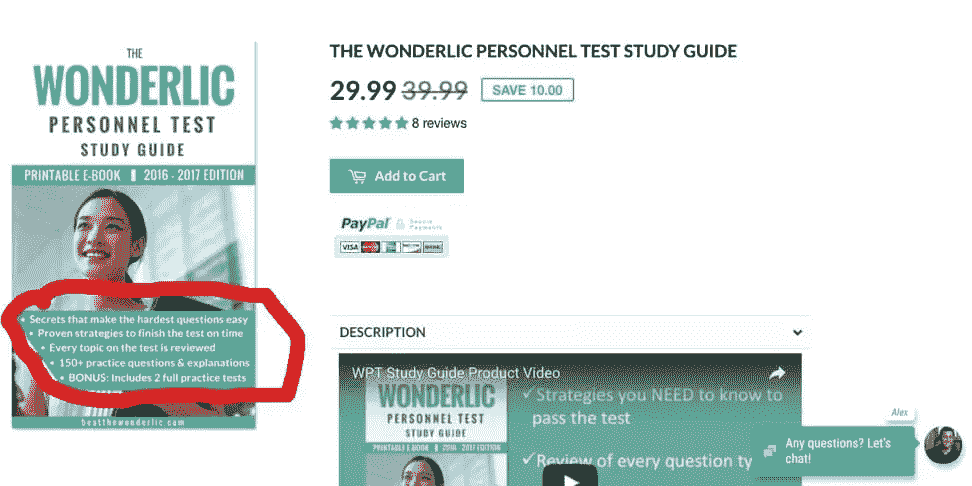
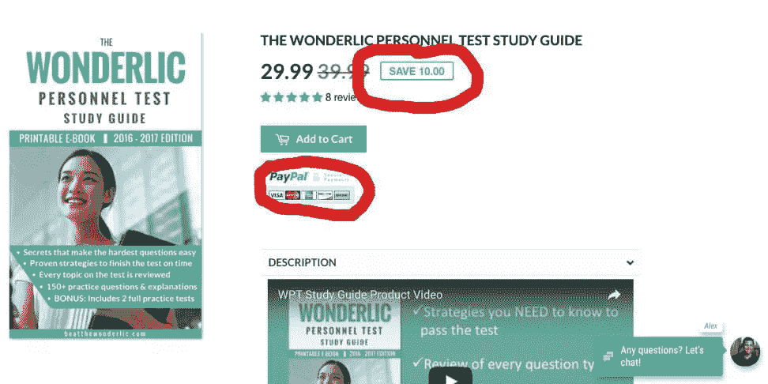
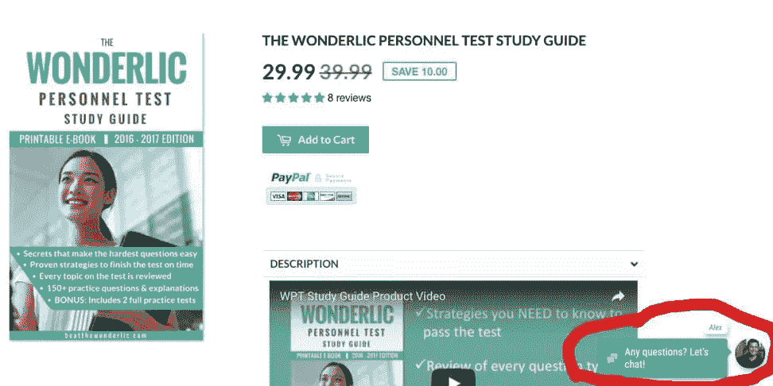
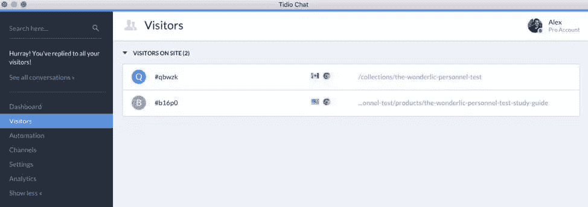
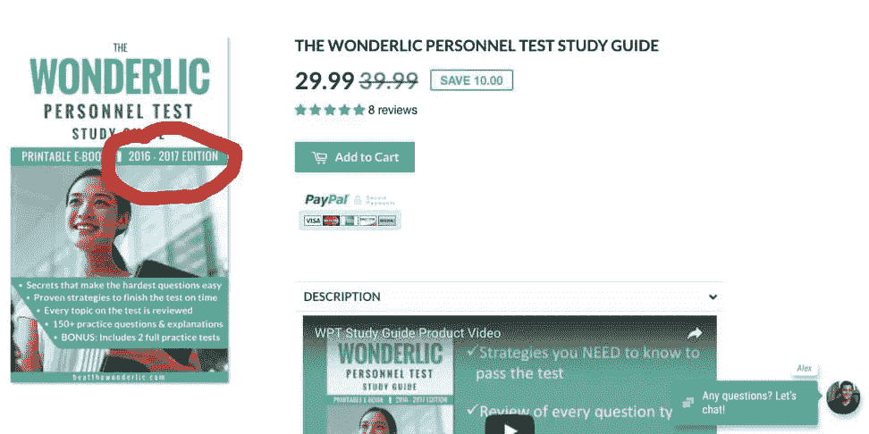

# 问访问者一个简单的问题如何让我的转化率提高了 27%

> 原文：<https://www.sitepoint.com/how-asking-visitors-one-question-boosted-our-conversion-rate-by-27/>

一年前，我在工作之余住在父母的房子里。我当时 28 岁。

那时候，我的生活由两项任务组成:

1.  寻找新工作
2.  在完成第一项任务的同时，尽我所能赚钱来支付我的账单。

我以前是一名教师，在备考方面有广泛的背景，所以我决定在当地图书馆做家教赚点小钱。

当我不做家教的时候，我开始为广泛使用的就业前考试 Wonderlic 编写备考材料。

不到一个月，我 **[推出了一个小网站](https://beatthewonderlic.com/)** 销售模拟考试和 Wonderlic 考试的学习指南。

对于那些想知道这是什么的人，我的网站上有一个免费的练习测试，你可以试试。

发布后不久，我收到了一份全职工作邀请，并接受了邀请。

我喜欢我的新 9-5，但我也继续在晚上和周末做 Beat the Wonderlic，慢慢地发展到仅这项业务就完全覆盖了我所有的月支出。

一年后，我决定迈出可怕的一步，成为全职企业家，并全力以赴扩大我的公司。

在过去几个月的全职工作中，我学到了很多东西，但我最重要的知识是偶然获得的。

## 我的转化率糟透了..而且没有改善

我公布了扩展三个主要支柱的计划:

1.  电梯转换率
2.  增加流量
3.  提升 AOV(平均订单价值)

我开始关注我的转换率，因为投资更多的流量是浪费时间和金钱，如果这些流量都没有转化的话。

我的转化率徘徊在停滞的 1%左右。

像许多企业家一样，我(可笑地)觉得这令人不快。

这生意是我的宝贝。我非常自豪并保护它。

我还*知道*这是市场上最好的 Wonderlic prep 产品——我已经购买了所有竞争对手的产品，研究了真正的 Wonderlic 测试，并且知道市场上没有人有比我创造的更完整和准确的学习指南。

我天真地认为这一定是问题所在——人们不知道我的产品有多棒……也许我应该在屋顶上大声喊出来，这样他们就会明白我的学习指南的价值，然后*然后*他们就会买了！

## 为什么我最初的计划没有成功…

我计划阐明并详述我认为的价值主张。

我在学习指南的封面上加了几个项目符号，列出了我认为我的客户想知道的所有理由。

我添加了一个 PayPal 徽章，试图与国际客户建立信任，我还添加了一个 MSRP 价格，以突出我的产品比竞争对手便宜。

我甚至决定在我的网站上添加一个聊天工具，以防访问者在浏览我的网站时有任何问题——更好的是，也许我可以将这些问题转化为对话，然后将对话转化为销售！

现在，这些变化的总和很重要，*也确实提高了转化率，但这肯定不是我期望的成功。*

我的销售仍然相对停滞，我开始绝望了。

如果我不能提升转化率，我的生意可能永远不会增长，我将不得不爬回我的朝九晚五，乞求他们让我回去。

## 你知道为什么人们不买你的东西吗？

我急切地想提高我的销售额。我*需要*成长，而且需要快速成长。

我在我的聊天工具的管理视图中，**看着人们进入我的网站**，但是不久之后他们就离开了，没有购买。我开始盯着那些匿名游客，看他们登陆、浏览和离开。

然后，我点击了其中一个访问者，打开了一个聊天对话框。我开始打字:

“你好！我叫亚历克斯，最近我辞去了朝九晚五的工作，开始发展我的小生意。我能问你几个简单的问题吗？你的反馈对我来说非常有价值。”

“当然可以。”

“太好了！谢谢大家！我的问题是:你为什么还没有购买我的学习指南？你有什么犹豫？你还有什么问题我没有回答吗？”

“我担心你的学习指南不是最新的。

这个回应让我措手不及。

我没有意识到这是一个问题。

“有意思！你能详细说明吗？”

“嗯，我担心我会买你的书，但不是为了 2016 年的 Wonderlic”。

## 你的客户有你不知道他们有问题——除非你问

我从来没有考虑过这个问题，因为 Wonderlic 不是像 ACT 或 SAT 那样每年更新和重新发布的考试。但是，当然，我的潜在顾客不会知道——他们不是这方面的专家。

我喜欢这个反馈，因为它是如此的令人谦卑——我意识到我不知道我的目标客户有什么问题或顾虑。

我继续问来访者:“你为什么还没有买我的学习指南？”我总是得到同样的回答:“我不知道这是否是最新的。你说它是准确的，但那可能是几年前的事了。”

那天下午，我对我的封面做了如下改动:

我大概花了 20 分钟更新封面，然后把更新版本的封面放回我的网站。

第二天是我有史以来销售最好的一天。

那一天之后又是创纪录的一天，这一天变成了创纪录的一周。

过去的一个月是我迄今为止最好的一个月，增长了 27%，这在我看来很傻，因为这是一个我从未想过需要的变化，如果我没有直接问我的非转换访问者为什么他们不从我这里购买，我也不会猜到会发生这种变化。

## 收紧你对每个访问者的反馈环&利用你独特的故事

总结我学到的东西，以及如何将它们应用到自己的业务中:

1.  **与客户和非转化访问者建立紧密的反馈回路**。我在我的 Shopify 网站上使用了 Tidio chat 的免费聊天工具；然而，有很多聊天应用程序可供你尝试。
2.  不要害怕接触别人，问他们你如何赢得他们的生意。如果你能和他们交流，告诉他们你的故事，带着谦卑和渴望倾听和学习的态度接近他们，你会惊讶地发现有多少人非常愿意帮助他们。我很惊讶人们在知道我的故事后会如此慷慨地付出时间和反馈。
3.  除非你去问目标客户，否则你永远无法真正理解他们的问题。你是你所在领域的专家。你的目标客户可能不是。这意味着他们对你的产品或服务有着与你完全不同的问题。

## 分享这篇文章