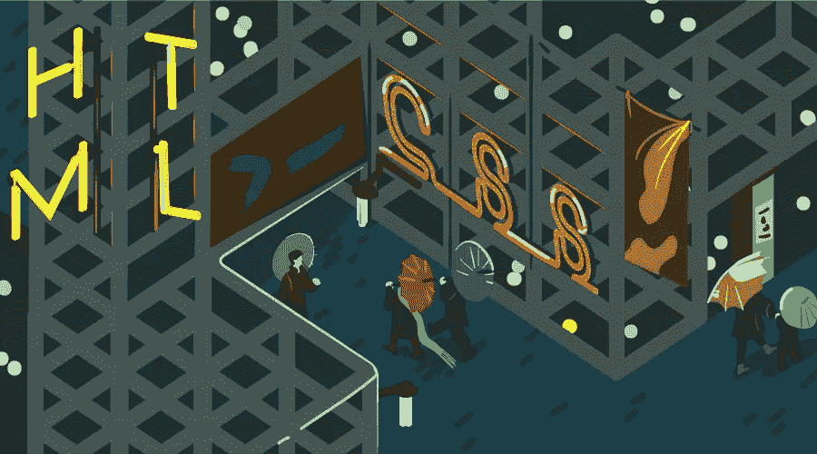
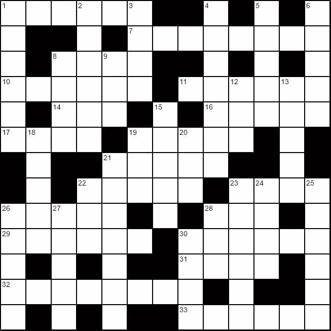

# 我如何建立一个纯粹的 CSS 纵横字谜

> 原文：<https://www.sitepoint.com/how-built-pure-css-crossword-puzzle/>



最近我创建了一个纯粹的 CSS 纵横字谜游戏,使用 CSS grid 实现，不需要 JavaScript 就可以工作。它很快在 CodePen 上引起了极大的兴趣。截至本文撰写时，它已经拥有 350 多颗心和 24，000+的页面浏览量！

伟大的 [CSS Grid Garden](http://cssgridgarden.com/) 教程启发我构建一些具有网格布局特性的东西。我想知道这些特性是否可以很好地用于构建一个纵横字谜——然后我想，让我们试着不用 JavaScript 来创建整个游戏。

## 构建板/网格

所以，首先，让我们创建董事会本身！

我以下面的基本结构结束，包括 HTML 注释，以显示不同部分将完成什么:

```
<div class="crossword-board-container">

  <div class="crossword-board">

    <!-- input elements go here. Uses CSS Grid as its layout -->

    <div class="crossword-board crossword-board--highlight crossword-board--highlight--across">
      <!-- highlights for valid 'across' answers go here. Uses CSS Grid as its layout -->
    </div>

    <div class="crossword-board crossword-board--highlight crossword-board--highlight-down">
      <!-- highlights for valid 'down' answers go here. Uses CSS Grid as its layout -->
    </div>

    <div class="crossword-board crossword-board--labels">
      <!-- row and column number labels go here. Uses CSS Grid as its layout -->
    </div>

    <div class="crossword-clues">

      <dl class="crossword-clues__list crossword-clues__list--across">
        <!-- clues for all the 'across' words go here -->
      </dl>

      <dl class="crossword-clues__list crossword-clues__list--down">
        <!-- clues for all the 'down' words go here -->
      </dl>

    </div>

  </div>

</div>
```

这使我们的基本框架到位，所以我们可以添加更多的元素，并开始设计东西。

## 为正方形使用形状元素

我正在创建的纵横字谜是一个 13×13 的网格，有 44 个空格，所以我需要创建 125 个`input`元素，每个元素都有自己的 id，格式为`item{row number}-{column number}`，即`item4-12`。下面是网格的样子:



每个输入都有一个“1”的`minlength`和`maxlength`来模拟一个纵横字谜的行为(即每个方格一个字母)。每个输入还将具有`required`属性，以便使用 HTML5 表单验证。我使用 CSS 利用了所有这些 HTML5 属性。

## 使用通用同级选择器

输入元素在视觉上分组排列(就像填字游戏一样)。每组输入元素代表纵横字谜中的一个单词。如果该组中的每个元素都是有效的(可以使用`:valid`伪选择器来验证)，那么我们可以使用 CSS 来样式化稍后出现在 DOM 中的元素(使用一个被称为通用兄弟选择器的[高级 CSS 选择器](https://www.sitepoint.com/premium/courses/css-selectors-3-diving-deeper-2882)来指示单词是正确的)。

由于兄弟选择器的工作方式，以及 CSS 的一般工作方式，这个元素不得不出现在 DOM 的后面。CSS 只能样式化当前选定元素之后的元素。它不能在 DOM 中向后看(或在 DOM 树中向上看)，也不能在当前元素之前设置样式(至少目前是这样)。

这意味着我可以使用`:valid`伪类来设计有效元素的样式:

```
.input:valid {
  border: 2px solid green;
}
.input:invalid {
  border: 2px solid red;
}
```

参见 [CodePen](https://codepen.io) 上 SitePoint ( [@SitePoint](https://codepen.io/SitePoint) )的 Pen [有效伪选择器示例](https://codepen.io/SitePoint/pen/RgaqKb/)。