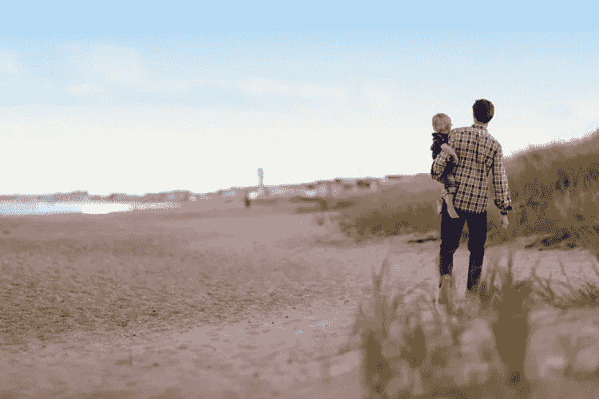
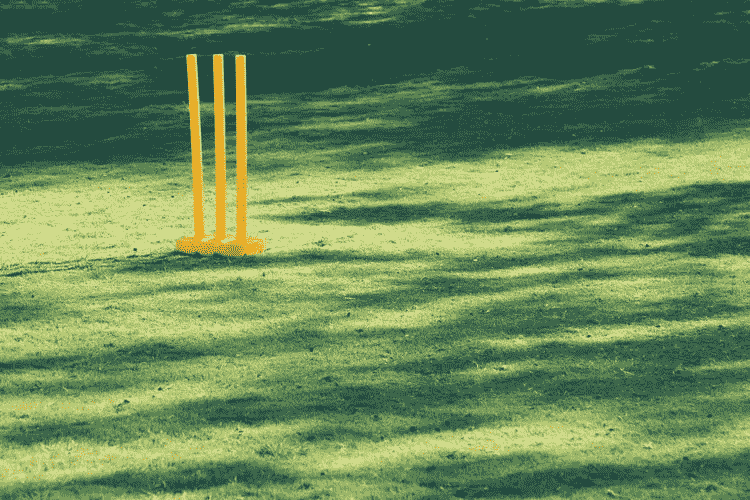

# 忙碌的企业家如何能找到时间锻炼

> 原文：<https://www.sitepoint.com/how-busy-entrepreneurs-can-find-time-for-exercise/>

对于一个企业家来说，平均每天都要花在管理待办事项清单、应付尴尬的客户和顾客、努力赶上最后期限，当然还有回复数百封电子邮件上。

有时候会觉得没有时间去过工作之外的生活，更不用说日常锻炼了。然而，锻炼并不一定要在健身房进行 30 分钟的激烈运动才能对你的健康产生影响。这里有一些绝妙的方法，让你在忙碌的一天中也能锻炼身体，而不会把你从其他责任(工作、家庭或其他)中绑架出来。

## 1.质疑你实际上是如何利用业余时间的

你知道不锻炼最常见的借口是“我没有时间”吗？你每天只需要锻炼大约 30 分钟——接近你一天时间的 2%。与其每天早上下班回家后看《T2 公园》和《娱乐城》或者按下贪睡键，不如花 30 分钟做几个俯卧撑或者仰卧起坐。半小时的锻炼会让你比多睡半小时或狂看电视更清醒。

## 2.做早操，让一天更有效率

让你的身心在早上做好准备是创造更多空闲时间的一种极其简单的方式。体育锻炼(或者甚至将[大脑锻炼](https://www.sitepoint.com/8-brain-warm-up-exercises-for-mental-clarity-in-the-morning/)作为次要选项)将确保你的大脑全天高效工作，在更短的时间内产生更好的效果，从而创造更多的自由锻炼时间。

你有没有过那种懒散的 10 小时工作日，你的大脑感觉模糊不清，而你实际上什么也没有完成？早上锻炼会提高你的思维清晰度，确保你最大限度地利用你的工作时间。

## 3.不带任何设备在午餐时间散步

大多数企业家花在办公桌前的时间太多了。甚至休息时间通常都是在电脑前度过的。从查收邮件中休息一下吧！午饭时间去散步；这可能不像是一次大汗淋漓的锻炼，但午餐时间散步比坐在椅子上，逐渐产生注意力疲劳，对你的健康和健身更有好处。把设备留在办公室，给你的身体和精神一个自我修复的机会。

## 4.步行或跑步回家

企业家一天中压力最大的事情之一就是往返办公室(甚至在你开始工作之前就足以产生压力！).高峰时间拥挤的火车和公共汽车是致命的；相反，尝试步行、慢跑、跑步，甚至骑自行车上下班。有时候高峰时间的交通会让你的旅程比走路还长！

或者，你可以将活跃的晚间活动与家庭时间结合起来(比如散步)。

## 5.在工作中组织体育活动

锻炼有时会让人觉得有点无聊，尤其是当你度过了糟糕透顶的一天，但是锻炼并不一定是无聊的。你可以和同事一起组织工作活动，让工作变得更有趣。也许试运行一个“周五半天”的活动，办公室打一场足球友谊赛，或者看看团队对慈善跑步的感觉如何。

## 6.如果你身体受到束缚，那就进行精神锻炼

锻炼你的大脑(通过[冥想](https://www.sitepoint.com/the-entrepreneurs-quickstart-guide-to-mindfulness-meditation/)，大脑游戏或者甚至是简单的 5 分钟暂停)不仅可以重置你的精神健康，还可以改善你的*身体*的荷尔蒙和肌肉。压力会削弱你的免疫系统，而**会抵消**从之前的锻炼中获得的益处，比如健康的心脏。

## 7.在工作和家庭中创造一种健身文化

如果你不能在工作或家里组织基于活动的活动，不要气馁。人们有他们自己的承诺——你的时间表不会总是和他们的一致。相反，让你自己的锻炼成为一个话题，并询问他人的锻炼。

对锻炼感到兴奋，并与他人谈论锻炼的好处会让你(和他们)有动力坚持下去，甚至鼓励你超越你的同事。问他们昨晚坐了多长时间的板凳或者跑了多少英里，然后试着打破这个记录。创造这样的健身文化在团队和家庭中都非常有效。

## 结论

当你是一个忙碌的企业家时，很容易找到不锻炼的借口— *“我没有时间”*、*、“我压力太大太累了”*、*“我的工作需要我坐下来。”你可能真的相信他们，但实际上无论你去哪里都有锻炼的机会。即使这意味着走楼梯而不是坐电梯，或者提前一站下车，然后走完剩下的旅程。*

记住，你只需要腾出一天中的 **2%，也就是花在床上查看邮件的时间！**

## 分享这篇文章