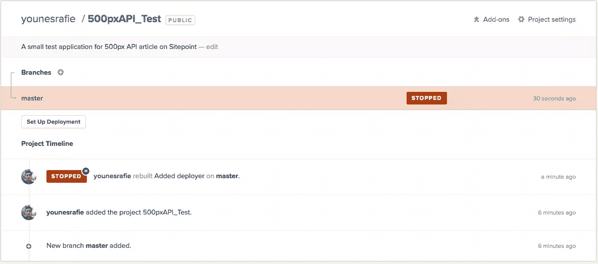
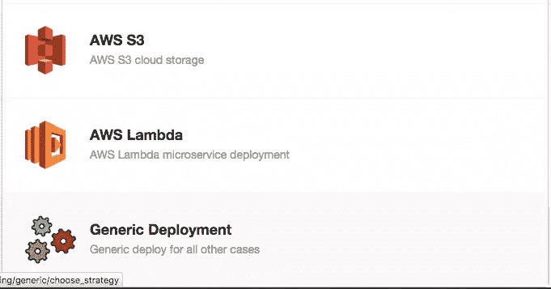
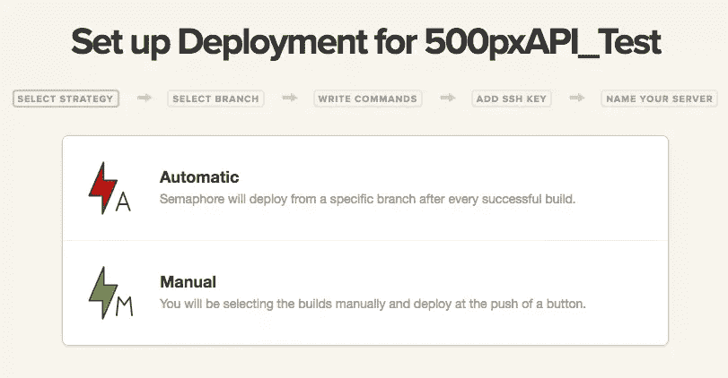
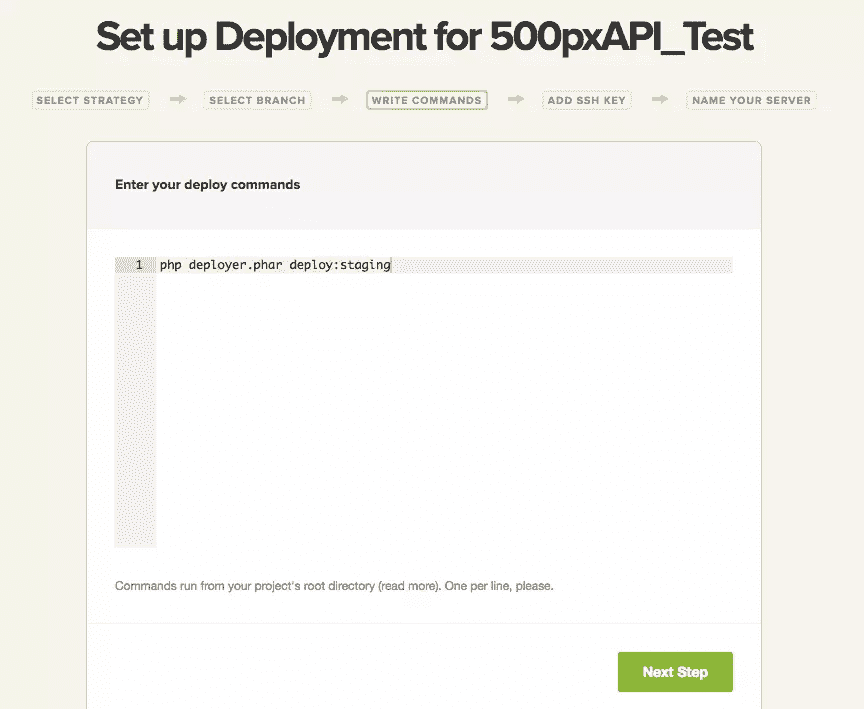
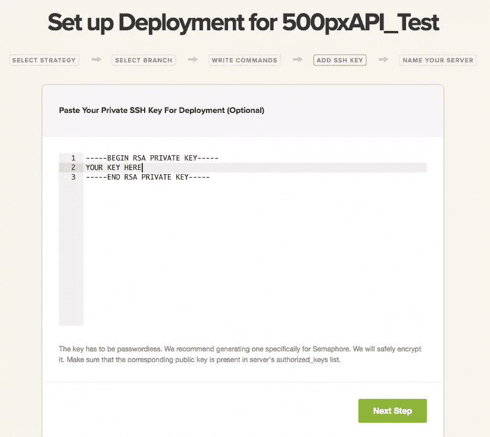
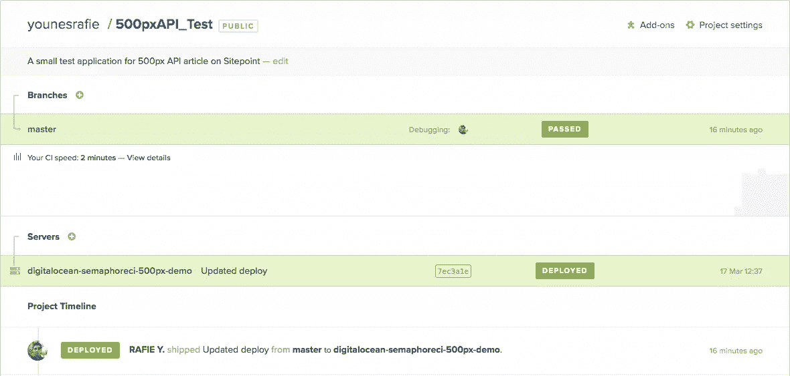
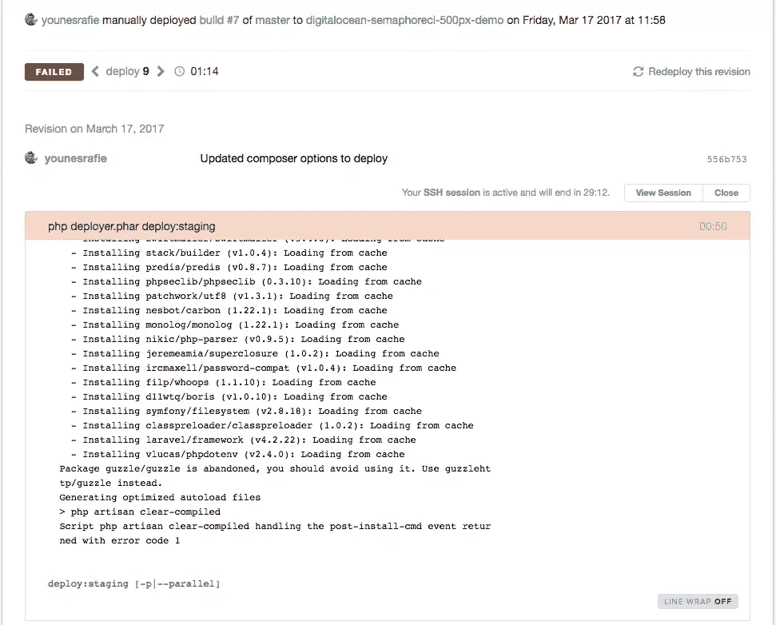

# 如何将 Laravel Envoy 或 Deployer 与 SemaphoreCI 一起使用？

> 原文：<https://www.sitepoint.com/how-can-i-use-laravel-envoy-or-deployer-with-semaphoreci/>

*这篇文章由 [Wern Ancheta](https://www.sitepoint.com/author/wancheta/) 和 [Viraj Khatavkar](https://www.sitepoint.com/author/vkhatavkar/) 进行了同行评审。感谢 SitePoint 的所有同行评审员使 SitePoint 的内容尽可能做到最好！*

* * *

测试自动化、持续集成和持续交付现在在社区中非常普遍。这带来了多种服务，试图使开发过程更加愉快，减少开发人员的负担，因此他们可以专注于交付软件，而不是构建/配置工具来完成这项工作。其中一项服务是 [SemaphoreCI](https://www.sitepoint.com/crash-course-continuous-deployment-semaphore-ci/) 。

在本文中，我们将介绍如何使用我们自己的部署脚本和工具在成功测试后继续部署过程。

我们将使用 SemaphoreCI 进行连续交付，并使用 [Deployer](http://deployer.org/) 将我们的代码推送到 DigitalOcean production server。如果您不熟悉 Deployer，我们建议您查看一下[这篇简介](https://www.sitepoint.com/deploying-php-applications-with-deployer)。


## 演示应用程序

我们将使用一个 [500px](http://500px.com/) 的应用程序从市场上加载照片。它是使用 Laravel 建造的，你可以在这里阅读关于其建造过程[的完整文章，并在](https://www.sitepoint.com/popular-photos-filters-user-profiles-500px-api/) [GitHub](https://github.com/Whyounes/500pxAPI_Test) 上找到回购。

## 创建部署者脚本

Deployer 的工作方式是我们定义服务器，然后创建任务来处理将应用程序部署到这些服务器的过程。我们的`deploy.php`脚本看起来像这样:

```
<?php 

require_once "recipe/common.php";

set('ssh_type', 'native');
set('default_stage', 'staging');
env('deploy_path', '/var/www');
env('composer_options', 'install --no-dev --prefer-dist --optimize-autoloader --no-progress --no-interaction');
set('copy_dirs', [
    'app/commands',
    'app/config',
    'app/controllers',
    'app/database',
    'app/lang',
    'app/models',
    'app/src',
    'app/start',
    'app/tests',
    'app/views',
    'app/filters.php',
    'app/routes.php',
    'bootstrap',
    'public',
    'composer.json',
    'composer.lock',
    'artisan',
    '.env',
]);

set('shared_dirs', [
    'app/storage/cache',
    'app/storage/logs',
    'app/storage/meta',
    'app/storage/sessions',
    'app/storage/views',
]);
set('writable_dirs', get('shared_dirs'));
set('http_user', 'www-data');

server('digitalocean', '174.138.78.215')
    ->identityFile()
    ->user('root')
    ->stage('staging');

task('deploy:upload', function() {
    $files = get('copy_dirs');
    $releasePath = env('release_path');

    foreach ($files as $file)
    {
        upload($file, "{$releasePath}/{$file}");
    }
});

task('deploy:staging', [
    'deploy:prepare',
    'deploy:release',
    'deploy:upload',
    'deploy:shared',
    'deploy:writable',
    'deploy:symlink',
    'deploy:vendors',
    'current',// print current release number
])->desc('Deploy application to staging.');

after('deploy:staging', 'success'); 
```

如果您想了解更多关于这个特定脚本的功能，您应该阅读 [Deployer 文章](https://www.sitepoint.com/deploying-php-applications-with-deployer)。我们的下一步是建立一个 SemaphoreCI 项目。如果你以前从未尝试过 SemaphoreCI，请阅读[速成班](https://www.sitepoint.com/crash-course-continuous-deployment-semaphore-ci/)的文章，并尝试一下。

## 设置部署

为了配置部署策略，我们需要转到项目的页面并点击`Set Up Deployment`。



接下来，我们选择通用部署选项，以便 SemaphoreCI 让我们可以自由地添加手动配置。





选择自动部署后，SemaphoreCI 将为我们提供指定部署命令的能力。手动和自动的区别在于，自动部署是在每次成功的测试之后触发的，而手动将允许我们部署任何成功的提交。



我们可以选择将`deployer.phar`作为 PHAR 文件包含在我们的回购中，或者使用 Composer 来要求它。无论哪种方式，命令都是相似的。

如果我们选择使用 SSH 来部署应用程序，SemaphoreCI 让我们能够在他们的服务器上存储我们的 SSH 私有密钥，并在部署阶段提供它。



**注意** : SemaphoreCI 建议我们专门为部署过程创建一个新的 SSH 密钥。万一有人偷了我们的钥匙什么的，我们可以轻松撤销。密钥在存储到他们的终端之前也会被加密。

该键在`~/.ssh/id_rsa`下可用，因此 [`identityFile()`](https://deployer.org/docs/servers) 可以保留默认值。

## 推动部署

现在一切都设置好了，我们需要向存储库提交一些更改来触发集成和部署过程。

```
// Edit something
git add .
git commit -am "Updated deploy"
git push origin master 
```



如果出现问题，我们可以单击失败的部署过程并查看日志来进一步调查问题。



上面的截图是一个失败的提交，原因是因为没有启用`mcrypt`扩展，所以`php artisan clear-compiled`命令返回了一个错误。

**注意**:semaphore ci 提供的另一个巧妙的技巧是连接到构建服务器来查看哪里出错了。


## 其他部署工具

我们在这里使用的相同过程可以应用于任何其他部署工具。例如，Laravel Envoy 可能是这样配置的:

```
@servers(['web' => 'root@ip-address'])

@task('deploy', ['on' => 'web'])
cd /var/www

@if($new) {{-- If this is the first deployment --}}
git init
git remote add origin repo@github.git
@endif

git reset --hard
git pull origin master

composer update
composer dumpautoload -o

@if($new)
    chmod -R 755 storage
    php artisan storage:link
    php artisan key:generate
@endif

php artisan migrate --force

php artisan config:clear
php artisan route:clear

php artisan optimize
php artisan config:cache
php artisan route:cache
php artisan view:clear
@endtask 
```

在部署命令步骤中，我们将安装并运行 Envoy:

```
cd /var/www
composer global require "laravel/envoy=~1.0"
envoy run deploy 
```

就是这样！Envoy 现在将使用我们添加的密钥进行身份验证，并运行我们指定的更新命令。

## 结论

CI/CD 工具对开发人员的工作流程是一个很大的改进，当然可以帮助团队将新代码集成到生产系统中。SemaphoreCI 是一个很好的选择，我推荐它，因为它有易于使用的界面和极好的支持。如果您有任何意见或问题，请发表在下面！

## 分享这篇文章