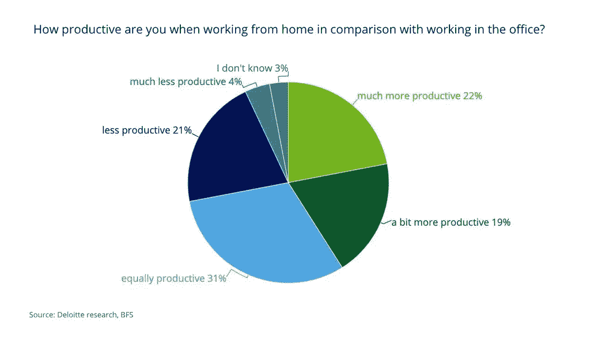
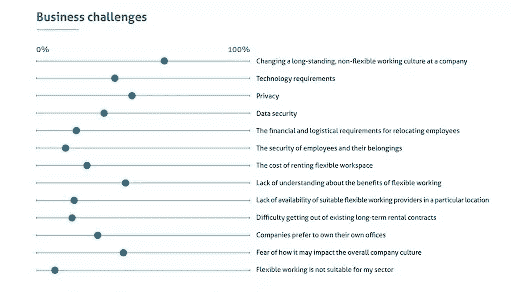

# 同处一地的公司如何适应远程工作环境

> 原文：<https://www.sitepoint.com/how-colocated-companies-can-adapt-to-a-remote-work-world/>

直到 2020 年，远程工作在一小部分科技公司中还是一种新的流行趋势。这种工作安排预示着公司运营方式的转变，一个行业已经开始围绕这种转变出现。[有人猜测](https://www.inc.com/scott-mautz/the-future-of-remote-work-is-happening-now-heres-how-to-make-it-work-for-you.html)这将如何改变获取人才的激励机制。

自从新冠肺炎·疫情开始，远程工作不再是一种额外津贴。这已经成为现实。各种规模和行业的组织都被迫采用它，其中大多数都在努力适应远程工作带来的挑战。

远程工作已经悄然而至，而且在可预见的未来也不太可能消失。调查显示，甚至在疫情出现之前，员工们就很欣赏在家工作的想法。因此，问题不在于公司如何能像过去一样回去工作，而是一旦疫情结束，它们如何能适应远程工作。

在这篇文章中，我想探讨三种方法，非远程公司可以适应他们目前的情况和大流行后的世界。

## 帮助你的员工适应

乍一看，很容易认为远程工作带来的挑战已经大大落在了公司的高层管理人员身上，无论其规模大小。仅仅通过在线渠道来管理几十个人并不是一件容易的事情，而且这会极大地损害参与这些任务的每个人的生产力。

与此同时，很容易相信在家工作的好处主要落在员工身上。他们的许多工作，包括销售、营销、工程或行政工作，都可以远程完成。为什么员工不想在家工作，只穿着拖鞋和睡衣？

现实与这种天真的看法不同。工作环境的改变会影响工作效率，有好有坏。20 多年前，& T 公司给员工提供了在家远程办公的机会。当研究人员回来分析结果时，他们发现员工喜欢新的安排: **87%的人认为**他们的生产力和效率得到了提高。

德勤最近在疫情进行的一项调查发现，超过 70%的受访者认为他们在家工作时效率更高或相当。只有 25%的人认为这种安排可能会影响他们的工作效率。

但是作为一个一生都在远程工作的人，我可以证明远程工作的早期好处很快就消失了。就像一座真实大小隐藏在水下的小型浮动冰山一样，远程工作的挑战开始显现。

第一个体会是，在远程工作安排下，*你是孤独的*。对许多人来说，这对他们的心理健康有很大的影响。2018 年[的一项调查](https://www.hrmagazine.co.uk/article-details/freelancers-experiencing-isolation-and-mental-illness)发现，分别有 48%和 46%的受访者承认发现远程工作“孤独”和“孤立”。

在家工作也模糊了家庭生活和工作生活的分界线，导致非自愿的无偿工作。当你的家是你的工作办公室，办公室是你的家时，你的生活就成了你的工作。

最后一个考虑因素只适用于新冠肺炎的情况，那就是在家工作的人必须处理好家庭(如果他们有家庭的话)和其他分心的事情。任何在家工作过的人都可以证明，用你的网飞账户在靠近床或电视的地方工作会导致严重的生产力问题。

不出我所料，德勤的调查发现，受访员工抱怨同样的挑战:

*   几乎 50%的人不喜欢与同事和客户没有个人交流。
*   接近 20%的人担心他们的精神健康，因为他们与世隔绝。
*   大约 30%的人努力摆脱孩子或家人带来的干扰。
*   几乎 16%的人在家里没有指定的工作空间。

问题很大一部分来源于形势所迫。一旦员工可以决定在他们喜欢的任何地方工作，一些人将选择在家和办公室的混合工作，而另一些人将不会因为孩子在家而分心。

然而，无论从短期还是长期来看，这都是一个需要解决的大问题。考虑实施以下一些想法，作为这些问题的短期缓解措施:

*   **在一天中的特定时间给员工留出断开连接的时间**。让他们在工作日增加一段时间从电脑前休息，这不应该包括午餐时间。
*   **通过 Slack、Zoom 和其他工具激励个人交流**。考虑开发新的活动，比如每周设定一个小时，让人们可以边打电话边工作。
*   让你的员工使用特殊的应用程序，比如 Freedom 或 [Brain.fm](http://Brain.fm) ，帮助他们克服分心，提高注意力。
*   **报销员工为在家中建造工作空间而购买家具和其他物品的费用**。
*   **每周进行调查以跟踪员工的情绪**并积极寻求改善结果中出现的任何负面情况。

你必须让你的员工有能力适应以家庭为基础的生活。支持他们，尤其是那些公开表示不喜欢在家工作的人。

## 让您的流程适应遥远的世界

疫情引发的危机可能会让一些人认为这是一种短暂的情况，很快就会消失。很难否认，最终，情况会恢复正常——即使这是一种新的正常状态。

无论未来发生什么——无论是包括未来的流行病还是其他类似的危机——有一点是肯定的:*你的员工可能会希望有一个远程工作安排*。远程工作不仅有内在的经济优势(例如更少的商务办公室租金)，而且有些人会要求在家工作，即使每周都要做几次。

然而，对于员工来说，发展这种安排的问题在于企业文化。办公空间巨头雷格斯(Regus)的所有者国际工作场所集团(International Workplace Group)进行的一项调查(T1)发现，*超过 50%的受访者(T3)认为他们公司不灵活的文化是实施这一政策的主要障碍:*

调查还发现，全球四分之三的员工认为远程工作是“新的常态”

你需要明白的是*灵活性是新的酷*，它不会回来。为了克服这些问题，你需要对你的工作运营采取长期的战略方法。

有数百种工具非常适合远程工作环境。以下是您应该考虑在公司中使用的流行工具列表:

*   **团队沟通** : Slack，Zoom，微软团队。
*   **项目管理** : Asana，Basecamp，观念。
*   **生产力** : [轮毂轴](https://hubstaff.com/)，[扎皮尔](https://zapier.com/)，[织机](https://www.loom.com/)。
*   **文档**:谷歌文档、[汇流](https://www.atlassian.com/software/confluence)、[语法](https://contentfiesta.com/grammarly-review/)。
*   **协作** : Google Drive，Dropbox，box。

我知道其中很多都是显而易见的选择——比如 Slack、Asana 和 Google Drive。使用这些工具是一回事，但是让它们培养和提高你的团队的生产力是另一回事。

例如，Slack 有[数百个集成](https://slack.com/integrations)，可以让你组织中的每个团队的工作更有效率。Zapier 增加了一组更加复杂和广泛的集成，您的团队成员可以使用这些集成来简化他们的工作。

更重要的是，你需要**养成习惯**以最有效的方式使用每种工具来促进协作和沟通。作为一个例子，我之前建议使用 [Zoom calls](https://blog.zoom.us/creating-culture-community-amid-social-distancing-work-from-home/) ，在这里整个公司可以公开交流。

这些激进的想法将与你的公司产生共鸣，克服人们在远程工作时面临的最常见的挑战。这种独特、开放的沟通策略甚至可以成为吸引顶尖人才进入你公司的独特销售主张。

由于在线交流往往比面对面交流效率更低，因此**为每一项可能的任务创建标准操作程序**，并让组织中的每个人都能轻松使用。这将帮助您节省时间，提高整个组织的效率。从解释工具如何工作到人们如何最有效地使用它们，这些 sop 集中了解决方案并简化了在适应期间可能出现的任何问题。

记得要有耐心。这种新的工作环境可能需要一段时间才能像过去一样运作。愿意尝试新的工具、想法和策略来改善团队沟通和协作。失败应该不是问题。

最后，**倾听你的员工**的意见，看看他们对每项新活动或新工具的看法，并采纳他们的反馈来改进你使用它们的方式。

## 激励开放的交流

与现场工作相比，远程工作有一个巨大的挑战:*沟通*。一项研究发现[面对面交流](https://hbr.org/2017/04/a-face-to-face-request-is-34-times-more-successful-than-an-email)比**电子邮件有效 34 倍**。关于闲聊和电话信息，也可以说是类似的情况。

作为一名领导者，你需要养成与所有相关人员坦诚沟通的习惯。我之前分享的关于公司范围内 Zoom calls 的想法只是一个想法；真正重要的是对待交流的态度。

一项[缓冲调查](https://lp.buffer.com/state-of-remote-work-2020)发现 **32%的员工**认为他们的经理在远程工作时看不到他们的贡献程度。26%的人还认为很难引起对他们发现的问题的关注。

这告诉你的是，拥有积极主动的沟通态度是最重要的。您希望一对一地与团队成员接触，帮助他们适应新环境，并分享他们在此过程中的任何反馈。打电话应该是一项常见的活动，只要有正当理由。

每周进行一次调查，看看人们在开始远程工作安排时看到了什么挑战，或者在开始后他们面临着什么挑战。根据收到的反馈采取行动，努力让每个人在家都能更好地工作。

## 结论

自疫情开始以来，企业经营日常业务的方式发生了巨大变化。即使疫情消失了，它也将继续对商业运作产生巨大影响。所以要适应新环境，因为远程工作是新常态。听听别人怎么说。使用松弛或缩放是不够的。实际阅读员工的评论并作出回应。

## 分享这篇文章