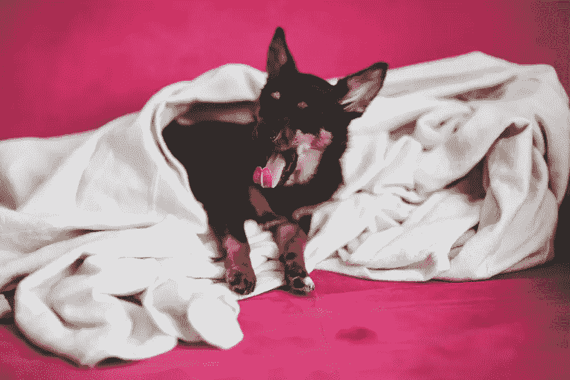
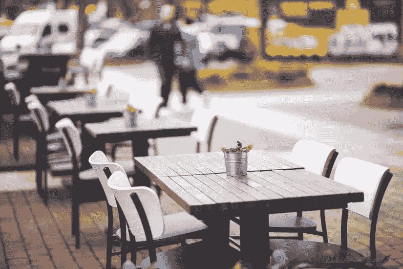
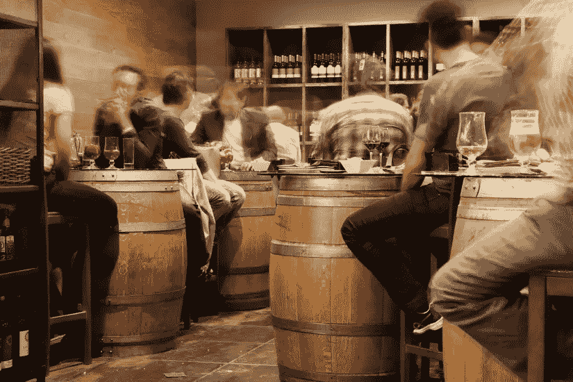

# 数字游牧是如何把我变成一个充满动力的设计师的

> 原文：<https://www.sitepoint.com/how-digital-nomadism-designer/>

我们中的许多人都梦想辞去全职工作，在家工作，声称这样可以更努力地工作，最终赚更多的钱。另外，那会很有趣。

但是事情从来没有这么简单，不是吗？

有可能，但你就是不愿意停止看《丑女贝蒂》重播或午睡。

我完全愿意承认，我不是那种能在一眨眼的功夫就鼓足干劲开始工作的成年人。这也不是因为缺乏乐趣，普通家庭只是有太多诱人的消遣:电视、视频游戏、Hulu、网飞、舒适的沙发和更多的电视。

## 作为一个流浪者，最初的两个月

无论我读了多少篇“如何成为一个超级有动力的设计师”的文章，我都不够坚强。我已经辞掉工作，我攒的“以防万一”的钱开始消失。所以我们(我和妻子)订了去巴塞罗那的机票，从那里开始了我们的数字游牧之旅。

这是一种“机不可失，时不再来”的情况。

我很快意识到，在一个新国家的家里工作和在你出生的地方工作没有什么不同。Airbnb 的主人非常友好，提供网飞最好的东西等等，我甚至开始为我的午睡辩护，因为在西班牙每个人都在下午睡“午觉”。我不知道这是不是一个神话，但我倾向于相信它。

在里斯本住了一个月后，在我认为更好的公寓里，有充足的自然光，阳台附近有一张巨大、宽敞的办公桌，我发现自己做的工作多了一点，但尽管如此，我仍然非常分心，像树懒一样打盹。

## 回家

因为我们要庆祝几个家庭的生日，我们回家住了一个月。我对数字游牧民的生活方式并不失望，因为为了真正成为一名数字游牧民，你必须工作，而我几乎没做什么。

所以我告诉每个人我们度过了一个非常棒的假期——我们确实做到了。

回到伦敦我并不开心——天气、不礼貌的当地人以及与我在那里长大的经历相关的总体负面情绪，都没有激励我。在几个星期的时间里，我们整理了我们的马其顿斯科普里之行；这也是事情显著改善的地方。

## 我们的第二次尝试

我是那些不会说一句当地语言的游客之一(如果我去过你的国家，或者在我的日程上，我真诚地道歉！)，所以在马其顿，当每个人都跟我们说英语时，我们都很高兴。考虑到这一点，以及生活成本非常低廉的事实，我们几乎每天都在外面吃饭。

我们喜欢在他们的露天餐厅里坐在阳光下，我开始带上笔记本电脑，回忆起当置身于美丽的环境中时，我感到快乐，不知何故有了动力。

在我们的例子中，这就是著名的亚历山大大帝喷泉或伐尔达尔河。我们会一起吃饭，喝鸡尾酒，令我惊讶的是，我会设计(当然，还会写)一些东西。

## 再次回家

我妻子得到了一份高薪的暑期工作，他们不接受拒绝，所以这次我们回家呆了两个月。我们去威尼斯和巴黎度假/绕道旅行了几天，然后(令我沮丧的是)把目光投向了伦敦。

我害怕破坏我的连胜纪录，但这是夏天，一些当地餐馆在该地区开业。我想，如果我能在马其顿做到，我也能在伦敦做到。

我甚至决定进行为期 30 天的写作挑战。

一家新的黎巴嫩餐馆几乎出现在我的门口，还有一家我想去尝尝的意大利咖啡馆，所以我开始经常光顾它们。几个月前，我甚至不会考虑独自出去吃饭，但他们说旅行可以开阔视野，让自己接触新的体验。直到我成为流浪者，我才明白这一点。

回想起来，这似乎很傻，因为数字游牧的基石是在当地的酒吧和咖啡馆找到最佳的 Wi-Fi，并在那里进行设计、编码或写作——但在那之前，我从未尝试过。我不仅尝试了，还完成了我的 30 天写作挑战，这是我有生以来最赚钱的一个月。

现在，每当我决定工作时，我都确保我不是在一个被分心事物包围的沉闷环境中，而是在一个美丽的环境或有微妙噪音的积极氛围中。

## 额外提示:友好、平易近人

尤其是在宁静的下午，员工和老顾客会开始觉得和你很熟悉，他们甚至会问你为什么每天都来，你在你的笔记本电脑上做什么。你可能没有意识到，身处如此舒适的环境中，但这也是一个令人兴奋的社交机会。

戴上你的商务帽，友好一点，让自己看起来平易近人。如果咖啡馆有空位，老板有空闲时间，他对你的谋生之道感兴趣——嗯，不需要安排免费咨询会议，你已经在里面了！事实上，我不止一次地把店主变成顾客，并得到一些免费饮料作为奖励！

## 它对你来说是数字游牧吗？

那么，我在这里实际上提供了什么建议呢？放纵。

沉迷于一种能让你快乐又不会让你分心的方式。美食对我来说很有用，一杯下午茶啤酒也不会有坏处。你应该尝试不同的菜系，试着把每个地方都当成一种体验，而不仅仅是一张工作的桌椅。

一开始我担心这会很贵，但是当动力越来越大的时候，你肯定会轻松地支付这些费用。

## 分享这篇文章