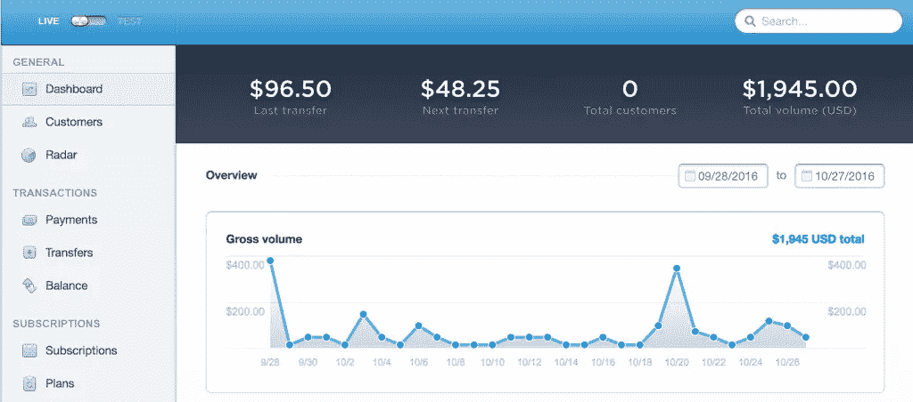
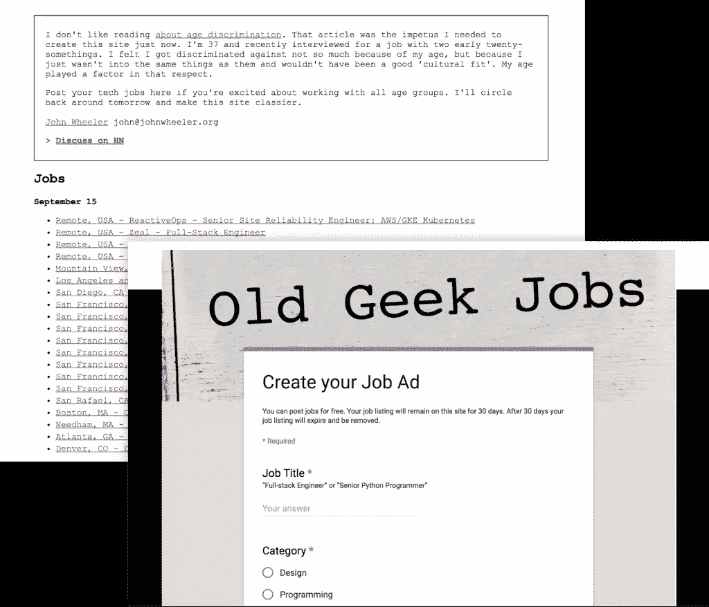
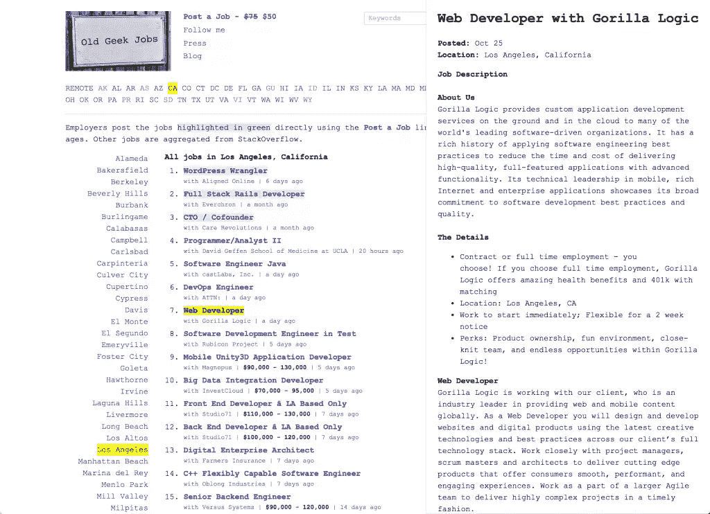
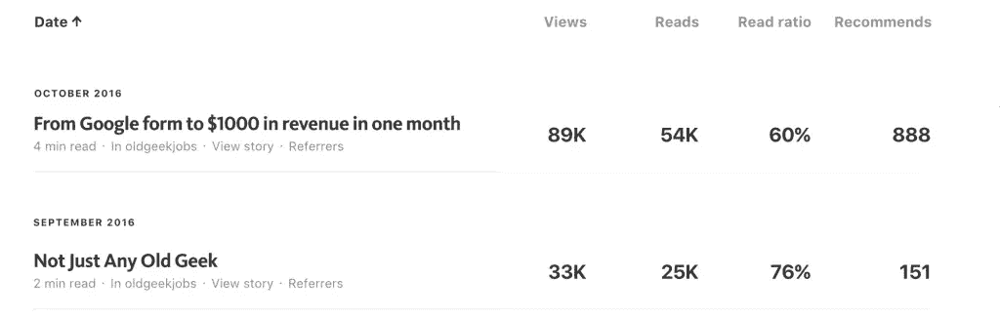

# 我如何从一个基于谷歌表单的 MVP 开始，在 1.5 个月内赚了 2000 美元

> 原文：<https://www.sitepoint.com/how-i-made-2000-in-1-5-months-starting-with-a-google-form-based-mvp/>

10 年前，我自学了 Ruby on Rails，并花了 6 个月的时间开发了一个本地求职板。我从 Craigslist 网站上找了一些工作，并向当地的新闻站支付了 3000 美元，让其刊登了一个月的广告。

不幸的是，所有的时间和金钱一天只带来了 50 名游客。我最终只卖出了一个职位，变得灰心丧气，几个月后关闭了网站。

不用说，我不知道我在做什么，但你会惊讶地发现，今天有多少资金雄厚的初创公司沿着同样的路线前进，甚至比我当时做得更差。

因为答案不在于花费大量的时间和金钱。这是在运行廉价和可测量的测试，提供市场反馈，你需要继续开动你的想法。

下面是我的最新项目[老极客乔布斯](https://oldgeekjobs.com) **如何通过运行廉价实验在一个半月内赚到 2000 美元**。

## 年龄歧视让我获得了第一个 MVP

9 月 15 日，我读了蒂姆·布雷关于科技领域年龄歧视的帖子。

这引起了我的共鸣，因为我经历了我认为是年龄歧视的面试，面试的是一家由 20 岁年轻人经营的初创公司。

我花 9 美元注册了域名[OldGeekJobs.com](https://oldgeekjobs.com)，花 10 美元创建了一个数字海洋实例，上传了一个嵌入在静态网站中的谷歌表单。

## 你的 MVP 是不可行的——除非你能证明这一点

我的网站[发布到了黑客新闻](https://news.ycombinator.com/item?id=12506232)上，而**获得了 500 多张投票。**

第二天，[石英写了一篇](http://qz.com/784118/someone-created-a-tech-job-board-for-people-over-30/)接着是[另一篇](http://www.inc.com/suzanne-lucas/how-to-get-a-tech-job-when-youre-really-old-like-35.html)来自[邪恶 HR Lady](http://www.evilhrlady.org/) 。

雇主开始提交工作，我将它们从 Google 表单复制并粘贴到静态站点。我没有赚到任何钱，因为这些职位是免费的，但是在不到几天的时间里，我得到了推进我的想法所需要的反馈。

在接下来的几周里，我开始使用 jQuery、Python、Flask 和 Postgresql 开发一个更健壮的网站版本。我按城市和州划分了工作岗位，增加了实时关键词搜索，并增加了创新的快速预览功能。

**这是激活快速预览功能后的网站外观:**

## 房间里的大象——它会赚钱吗？

我发布一份工作赚了 50 美元。

作为 50 美元的交换，工作会发布 45 天，以绿色突出显示，并显示在从 StackOverflow 聚合的其他工作之上。我从他们那里带来工作，所以网站上有足够多的好工作来吸引访问者。我还在网站上贴了一个通知，解释它是如何工作的:

> 雇主会直接贴出用绿色突出显示的职位，这样你就知道他们欢迎所有年龄的人。其他作业从 StackOverflow 聚合。

然而，最大的问题是:起初，**50 美元的价格标签只是另一个实验**——雇主仍然可以免费发布。在我能够证明雇主愿意支付之前，我没有花费任何精力来实现支付。

他们一直在发帖，所以我第二天就实现了 Stripe。

那是 28 天前的事了，从那以后，我已经卖出了价值 2000 美元的工作职位，每份售价在 25 美元到 50 美元之间。

现在，我把我的时间 50/50 分配在破解产品和推动流量上，我在 Reddit 和 HackerNews 上分享了[个中型帖子](https://blog.oldgeekjobs.com/)。

到目前为止，已经有两篇文章登上了《黑客新闻》的头版。

以下是他们的中等统计数据:

如果你发现了什么，[分享你的故事和结果是一种廉价而有效的方式，可以带来有针对性的曝光和反馈，但你必须对反馈加以鉴别。](https://blog.oldgeekjobs.com/be-a-prolific-sharer-31bfdfb50a40)

## 不要做一个唯唯诺诺的人——测试，测试，测试

你可以通过人们所做的 **来更多地了解他们想要什么**，而不是他们所说的。****

举个例子，一个人在留言板上建议我建立一个简历数据库，这与 10 个为工作列表付费的雇主写电子邮件问“你的简历数据库在哪里”有很大不同，然后在我告诉他们我没有钱的时候要求退款。

前一种反馈需要测试。**后者是无可争议的。**

不要害怕拒绝那些明显很好但会让你捉襟见肘的请求。只要你分享你的理由，人们可以接受你对他们说不。

例如，有人要求为其他国家制作旧的极客工作版本。既然我这么快就推出了美国版，国际化看起来就像是一个简单的操作——甚至是剪切和粘贴操作。

但是，当我解释说表面上看起来很容易的事情实际上会带来很多麻烦时，提问的开发人员会感同身受。

我不知道他们的地理、风俗和语言；我不熟悉我需要营销的媒体渠道，我想**专注于制造一个伟大的产品，而不是一打半吊子的产品。**

我解释说，这是我获得资源以正确方式国际化的最佳机会。

最后，我告诉他们，如果他们愿意，他们应该尝试建立自己的变体。

你可能会认为我欢迎竞争对手是疯狂的，但我从我目前的[业务](https://feedbackboost.com/)中了解到，无论如何，成功都会带来竞争，**执行才是真正重要的**，竞争的最佳方式是像激光一样专注于你所控制的事情。

## 那么，为什么选择 jQuery 呢？

也有人问我为什么不重新设计我的网站，让它更现代，为什么我使用 jQuery 而不是 Angular 或 React。

这是因为速度和简单性是两个最重要的特征，我有意使网站稀疏，以保持其加载时间低于 300 毫秒。

我使用 jQuery 是因为它足够简单和强大。

Angular 2 用 webpack 下载时的速度是 [700+ KB](https://gist.github.com/Restuta/cda69e50a853aa64912d) ，我没有时间学习 React。此外，我的网站并没有复杂到足以保证这些。

仅仅因为你有一把锤子并不意味着一切都是钉子。

> 对于以前的极客工作，我把迄今为止的成绩归因于我没有做的事情，而不是我做的任何事情。

我没有在产品上花太多时间。

我没有在员工和广告上花一分钱。

相反，我利用我的编码和写作能力，快速构建了一些东西，并拥有了一群听众。

我有足够的经验知道，除非我继续努力实现我的想法，否则我所取得的一点点成功将毫无意义。与此同时，我的进步意义重大，因为我花了 10 年时间才明白，互联网不在乎你花多少时间或金钱；它只关心你提供的价值。

不要无谓地浪费时间和精力在你的项目上。

在构建之前运行廉价的测试，并尽早、经常地分享你的成果。

## 分享这篇文章