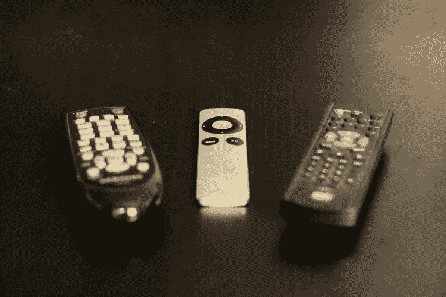

# 信息霸主如何毁掉你的工作生活

> 原文：<https://www.sitepoint.com/how-information-overload-is-ruining-your-work-life/>

信息过载是指当你的大脑超过了它的处理能力，让你感觉很累(就像当你的电脑内存耗尽，电脑崩溃)。它还会削弱你的注意力，让你更容易做出错误的决定，结果，更有可能让自己从其他*信息来源中超载，以此作为拖延重要任务的手段。是的，没错，我指的是电视、互联网、查看电子邮件、观看视频，以及任何能给你提供信息的东西。*

让我们来看看信息过载是如何毁掉你的工作生活的，以及你可能是如何在不知不觉中做到这一点的。

## 为什么你的身体渴望信息

多巴胺是大脑中的一种神经递质，会影响你的生产力、动机和注意力——有些人甚至称之为“动机分子”，因为它可以增强你的动力和注意力，同时帮助你抵制负面冲动。

其中一个冲动是进食的需要，我指的不仅仅是你的饮食摄入量；你的身体也渴望*信息*。当你锻炼、吃东西、喝酒、从事你的爱好等等时，多巴胺会诱发欣快感。这些东西很多，包括信息，都是会上瘾的。

基本上，你做的任何让你开心的事都会让你开心，因为它会向你的大脑释放多巴胺。如果你的摄入量没有节制，大多数这些东西对你都是有害的(比如不健康的食物)。其中最难控制的是你的**信息摄取量**，因为它只会影响你的精神健康，让你感觉无精打采、注意力不集中，如果你让自己超负荷，有时甚至会感到沮丧。

## 信息超载对你有什么影响

信息过载可能意味着很多事情。这可能意味着你一次摄入了太多的待办事项，你感到有点不知所措；这可能意味着在过去的两个小时里，你滚动脸书已经耗尽了你所有的认知能力；这可能意味着你没有足够地过滤你的邮件，你浪费了半天的时间回复它们。

这甚至可能意味着你看了太多的 YouTube 视频或谷歌了太多的东西——网瘾是真实存在的，因为它也会诱导体内的多巴胺。在我们生活的这个世界里，互联网让我们如此容易获取信息，以至于随着时间的推移，我们甚至会对多巴胺变得不敏感，这让我们更难获得最佳幸福。

### 注意力疲劳

信息过载可以以多种方式触发，而这种触发的结果就是我们所说的**注意力疲劳**。

注意力疲劳是指你的大脑因为有太多的信息要处理而关闭，让你感觉没有动力和疲惫。在许多方面，你可以限制你的信息摄入量，但有时(当你有太多事情要做的时候)，你也可以通过休息来重置你的大脑。让我们来看看抑制注意力疲劳的一些方法。

## 如何改掉坏习惯

打破坏习惯一开始是有压力的，因为你对它们给你的多巴胺上瘾，你也在重复你的坏习惯，因为它们已经成为你的第二天性——你甚至不加思考就去做。以下是你现在可以做的事情来改掉这些习惯:

### 1.定期休息或优化你的工作时间

经过反复试验后，我发现每天工作 4 个小时让我感觉精力充沛，而不是典型的朝九晚五，让我感觉筋疲力尽。

### 2.用各种方法提高你的多巴胺水平

不要把你所有的时间都花在一项活动上；这适用于你的爱好和日常工作任务。过多的任何事情最终都会导致无聊和注意力疲劳。

### 3.永远不要用电脑开始新的一天

不要在开始新的一天之前就浪费掉所有的果汁。这是一个非常常见的错误，也是最糟糕的错误！

### 4.锁定你的触发器(电视、互联网)

虽然我自己并不是一个电视迷，但有些电视功能可以在一天的特定时间阻止访问，而且有许多应用程序可以对互联网访问(或特定网站，如果需要)做同样的事情。

**延伸阅读** : [*如何掌握养成好习惯的习惯*](https://www.sitepoint.com/how-to-master-the-habit-of-forming-good-habits/)

## 如何遏制不必要的沟通

我相信每个人都会有这样的感受:到达零收件箱，却发现又有一堆邮件涌入。这是一个永无止境的故事，即使你设法完成了这本书，还有一个续集叫做“沟通与合作:如何作为一个团队谈论你的项目，直到该回家了”。

### 电子邮件霸主

防止注意力疲劳归结为优先考虑你在工作中实际做的事情。如果你发现你收到的邮件有一半是可以避免的，那么也许你需要一个系统来过滤来自社交媒体渠道的不请自来的请求、垃圾邮件、时事通讯和通知。我把这些邮件过滤到不同的邮箱里，这样我就可以把不重要的邮件留到一天结束的时候，否则在我开始工作之前，我就会变得非常疲惫和无聊。

### 对话过载

在建立团队时，一个常见的错误是将一个通信应用程序投入到工作流程中，并假设它会自动提高生产率。如果你允许团队之间互相交流，他们会一直聊到母牛回家，有时甚至是避免做任何实际工作的一种手段。

就拿 Slack 来说吧。您可以[将您的其他应用](https://www.sitepoint.com/7-slack-integrations-that-make-collaboration-easier/)(管理应用、待办事项应用、客户服务应用、协作应用、白板应用)集成到 Slack 中，使对话更具可操作性和情境性。

所以不要说“是的，所以当我们结束这次谈话时，我会做这个和那个”，你可以在空闲时做。许多其他通信应用程序都可以像这样扩展，使你能够非常快速地回到你的工作中。

## 结论

感觉注意力疲劳的影响是非常可怕的，尤其是当你的注意力焦点并没有让你更接近实现你的目标，让你在开始之前就感觉“完成”了。但是现在你知道了信息过载是如何工作的，你可以优先考虑(或者消除)那些通常会占用你一天大量时间的活动。

当你查看脸书或回复电子邮件时，时间过得真快，这真令人着迷，当你不断寻找刺激大脑的东西时，时间会变得多么令人上瘾。你如何分配你的时间？

## 分享这篇文章