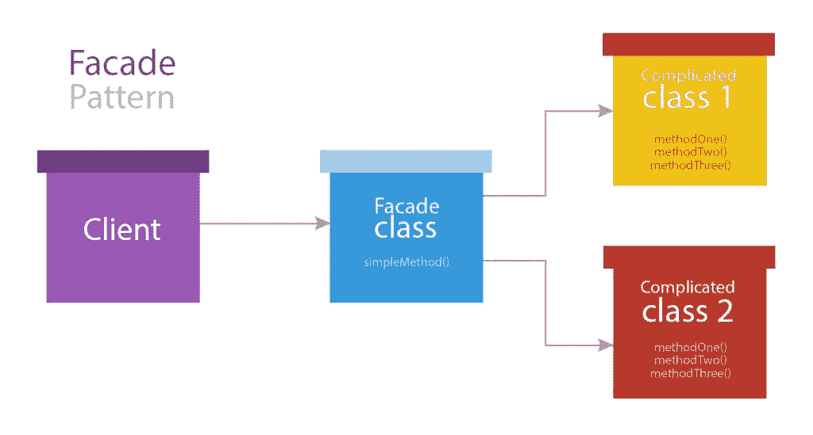

# Laravel 立面如何工作以及如何在其他地方使用它们

> 原文：<https://www.sitepoint.com/how-laravel-facades-work-and-how-to-use-them-elsewhere/>

Facade 模式是一种软件设计模式，常用于面向对象编程。事实上，facade 是一个包装复杂库的类，为它提供一个更简单、更易读的接口。Facade 模式还可以用于为一组复杂且设计不佳的 API 提供统一且设计良好的 API。



Laravel 框架有一个类似于这个模式的特性，也称为 Facades。在本教程中，我们将学习如何把 Laravel 的“门面”带到其他框架中。在我们继续之前，您需要对 [Ioc 容器](https://www.sitepoint.com/inversion-of-control-the-hollywood-principle/)有一个基本的了解。

让我们先来看看 Laravel 外墙的内部工作部分，然后我们将讨论如何将这一功能应用到其他环境中。

## 拉勒维尔的立面

Laravel facade 是一个为容器内部的服务提供类似静态接口的类。根据文档，这些外观充当访问容器服务的底层实现的代理。

尽管在 PHP 社区中有很多关于这个命名的争论。有些人认为这个术语应该改变，以避免开发人员的困惑，因为它没有完全实现 Facade 模式。如果这个命名让你感到困惑，你可以随意称呼它，但是请注意我们将要使用的**基类**在 Laravel 框架中被称为 **Facade** 。

### Laravel 中的立面是如何实现的

您可能知道，容器中的每个服务都有唯一的名称。在 Laravel 应用程序中，要直接从容器中访问服务，我们可以使用`App::make()`方法或`app()`助手函数。

```
<?php

App::make('some_service')->methodName();
```

如前所述，Laravel 使用 facade 类以一种更可读的方式为开发人员提供服务。通过使用 facade 类，我们只需要编写以下代码来完成同样的事情:

```
// ...
someService::methodName();
// ...
```

在 Laravel 中，所有服务都有一个 facade 类。这些 facade 类扩展了基础 Facade 类，它是`Illuminate/Support`包的一部分。他们唯一需要实现的是`getFacadeAccessor`方法，该方法返回容器内的服务名。

在上面的语法中，`someService`指的是 facade 类。`methodName`实际上是容器中原始服务的一个方法。如果我们在 Laravel 的上下文之外看这个语法，这意味着有一个名为`someService`的类公开了一个名为`methodName()`的静态方法，但这不是 Laravel 实现这个接口的方式。在下一节中，我们将看到 Laravel 的基础 Facade 类如何在幕后工作。

### 基础立面

Facade 类有一个名为`$app`的私有属性，它存储对服务容器的引用。如果我们需要使用 Laravel 之外的 facades，我们必须使用`setFacadeApplication()`方法显式地设置容器。我们很快就会谈到这一点。

在基本 facade 类中，`__callStatic` magic 方法已经被实现来处理实际上并不存在的静态方法的调用。当我们针对 Laravel facade 类调用静态方法时，会调用`__callStatic`方法，因为 facade 类还没有实现该方法。因此，`__callStatic`从容器中获取相应的服务，并对其调用方法。

下面是基本 facade 类中的`__callStatic`方法的实现:

```
<?php
// ...
/**
     * Handle dynamic, static calls to the object.
     *
     * @param  string  $method
     * @param  array   $args
     * @return mixed
     */
    public static function __callStatic($method, $args)
    {
        $instance = static::getFacadeRoot();

        switch (count($args)) {
            case 0:
                return $instance->$method();

            case 1:
                return $instance->$method($args[0]);

            case 2:
                return $instance->$method($args[0], $args[1]);

            case 3:
                return $instance->$method($args[0], $args[1], $args[2]);

            case 4:
                return $instance->$method($args[0], $args[1], $args[2], $args[3]);

            default:
                return call_user_func_array([$instance, $method], $args);
        }
    }
```

在上面的方法中，`getFacadeRoot()`从容器中获取服务。

### 剖析一个门面类

每个 facade 类都扩展了基类。我们唯一需要实现的是`getFacadeAccessor()`方法。这个方法除了返回容器中的服务名之外什么也不做。

```
<?php namespace App\Facades;

use Illuminate\Support\Facades\Facade as BaseFacade;

class SomeServiceFacade extends BaseFacade {

    /**
     * Get the registered name of the component.
     *
     * @return string
     */
    protected static function getFacadeAccessor() { return 'some.service'; }

}
```

### 别名

由于 Laravel facades 是 PHP 类，我们需要在使用它们之前导入它们。由于 PHP 中的名称空间和自动加载支持，当我们通过完全限定名访问类时，所有的类都会自动加载。PHP 还通过使用`use`指令支持类的别名:

```
use  App\Facades\SomeServiceFacade SomeServiceFacade:SomeMethod();
```

然而，我们必须在每个需要特定外观类的脚本中这样做。Laravel 使用别名加载器以自己的方式处理外观的别名。

### 拉勒维尔是如何给门面起别名的

所有别名都保存在位于`/config`目录下的`app.php`配置文件中的`aliases`数组中。

如果我们看一下数组，我们可以看到每个别名都映射到一个完全限定的类名。这意味着我们可以为 facade 类使用任何我们想要的名称:

```
// ..  'aliases'  =>  [  // ...  'FancyName'  =>  'App\Facades\SomeServiceFacade',  ],
```

好了，现在让我们看看 Laravel 如何使用这个数组来别名 facade 类。在引导阶段，Laravel 使用名为`AliasLoader`的服务，它是`Illuminate\Foundation`包的一部分。`AliasLoader`获取`aliases`数组，遍历所有元素，并使用 PHP 的 [spl_autoload_register](http://php.net/manual/en/function.spl-autoload-register.php) 创建一个`__autoload`函数队列。每个`__autoload`函数负责通过使用 PHP 的 [class_alias](http://php.net/manual/en/function.class-alias.php) 函数为各自的 facade 类创建一个别名。

因此，我们不必像通常使用`use`指令那样，在使用它们之前导入和别名这些类。所以每当我们试图访问一个不存在的类时，PHP 将检查`__autoload`队列以获得正确的自动加载器。到那时，`AliasLoader`已经注册了所有的`__autoload`功能。每个自动加载器取一个奇特的类名，并根据`aliases`数组将其解析为原始类名。最后，它为该类创建一个别名。考虑下面的方法调用:

```
<?php

// FancyName is resolved to App\Facades\SomeServiceFacade according to the aliases array

FancyName::someMethod()
```

在后台，`FancyName`被解析为`App\Facades\SomeServiceFacade`。

## 在其他框架中使用外观

好了，现在我们已经很好地理解了 Laravel 处理其外观和别名的方式，我们可以将 Laravel 的外观方法应用于其他环境。在本文中，我们将在 Silex 框架中使用 facades。但是，通过遵循相同的概念，您也可以将这个特性应用于其他框架。

Silex 有自己的容器，因为它扩展了`Pimple`。要访问容器内部的服务，我们可以像这样使用`$app`对象:

```
<?php
$app['some.service']->someMethod()
```

在 facade 类的帮助下，我们也可以为我们的 Silex 服务提供一个类似静态的接口。除此之外，我们可以使用`AliasLoader`服务为这些外观创建有意义的别名。因此，我们可以像这样重构上面的代码:

```
<?php
SomeService::someMethod();
```

### 要求

为了使用基础 facade 类，我们需要使用 composer 安装`Illuminate\Support`包:

```
composer require illuminate\support
```

这个包还包含其他服务，但是现在我们只需要它的基本 Facade 类。

### 创建外观

要为服务创建 facade，我们只需要扩展基本 Facade 类并实现`getFacadeAccessor`方法。

对于本教程，让我们保持所有的外观在`src/Facades`路径下。例如，对于名为`some.service`的服务，facade 类如下所示:

```
<?php
namespace App\Facades

use Illuminate\Support\Facades\Facade;

class SomeServiceFacade extends Facade {

    /**
     * Get the registered name of the component.
     *
     * @return string
     */
    protected static function getFacadeAccessor() { return 'some.service'; }

}
```

请注意，我们已经在`app\facades`下命名了这个类。

唯一剩下的事情是在 facade 类上设置应用程序容器。正如前面指出的，当我们在静态上下文中调用 facade 类的方法时，`__callStatic`被触发。`_callStatic`使用`getFacadeAccessor()`返回的数据来识别容器内的服务，并尝试获取它。当我们在 Laravel 之外使用基本 Facade 类时，容器对象不是自动设置的，所以我们需要手动设置。

为此，基础 facade 类公开了一个名为`setFacadeApplication`的方法，该方法为 facade 类设置应用程序容器。

在我们的`app.php`文件中，我们需要添加以下代码:

```
<?php
Illumiante\Support\Facade::setFacadeApplication($app);
```

这将为所有扩展基本 facade 类的 facade 设置容器。

现在，我们可以使用刚刚创建的 facade 类，而不是从容器中访问服务，这也允许我们在静态上下文中调用所有方法。

### 实现别名

为了给 facade 类起别名，我们将使用我们之前介绍的`AliasLoader`。`Aliasloader`是`illuminate\foundation`包的一部分。我们可以下载整个软件包，或者只是借用[代码](https://github.com/laravel/framework/blob/5.1/src/Illuminate/Foundation/AliasLoader.php)，并将其保存为一个文件。

如果只是想复制源文件，建议保存在`src/Facades`下。您可以基于项目的架构命名`AliasLoader`类。

对于这个例子，让我们复制代码并将其命名为`app/facades`。

### 创建别名数组

让我们在我们的`config`目录中创建一个名为`aliases.php`的文件，并将别名-外观绑定放入其中，如下所示:

```
<?php
return [
    'FancyName' => 'App\Facades\SomeService',
];
```

`FancyName`是我们想用来代替`App\Facades\SomeService`的名字。

#### 注册别名

`AliasLoader`是一个单一服务。为了创建或获取别名加载器的实例，我们需要调用`getInstance`方法，将别名数组作为参数。最后，为了注册所有的别名，我们需要调用它的`register`方法。

再次在`app.php`文件中，添加以下代码:

```
<?php

// ...

$aliases = require __DIR__ . '/../../config/aliases.php';
App\Facades\AliasLoader::getInstance($aliases)->register();
```

这就是全部了！现在我们可以像这样使用服务:

```
<?php
FancyName::methodName();
```

## 包扎

Facade 类只需要实现`getFacadeAccessor`方法，该方法返回容器内部的服务名。因为我们在 Laravel 环境之外使用这个特性，所以我们必须使用`setFacadeApplication()`方法显式地设置服务容器。

为了引用 facade 类，我们要么使用完全限定的类名，要么用 PHP 的`use`指令导入它们。或者，我们可以遵循 Laravel 的方法，通过使用别名加载器来给外观添加别名。

有问题吗？评论？把它们留在下面！感谢阅读！

## 分享这篇文章