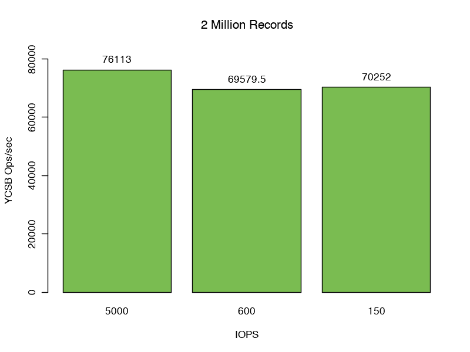
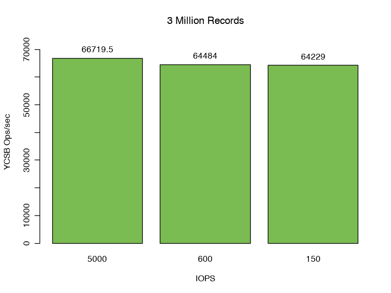
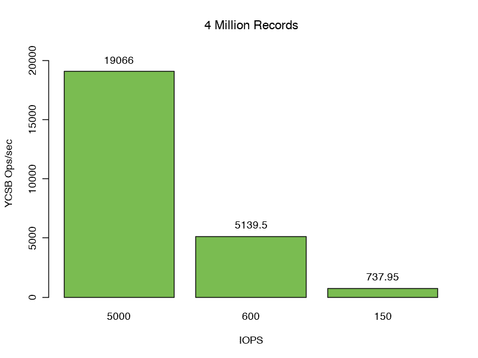
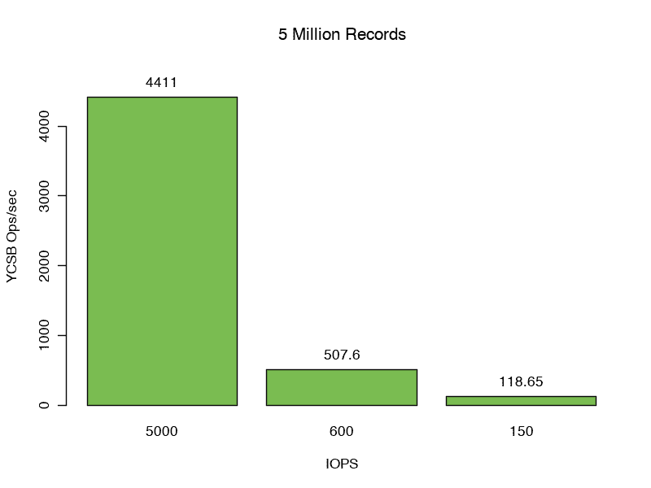

# 内存和磁盘性能如何影响您的 MongoDB 数据库

> 原文：<https://www.sitepoint.com/how-memory-disk-performance-affects-your-mongodb-database/>

*本文最初发表于 [MongoDB](https://www.mongodb.com/blog/post/through-the-looking-glass-analyzing-the-interplay-between-memory-disk-and-read-performance?utm_medium=sp-synd&utm_source=sitepoint&utm_content=memory&jmp=sp-ref) 。感谢您对使 SitePoint 成为可能的合作伙伴的支持。*

了解各种内部缓存和磁盘性能之间的关系，以及这些关系如何影响数据库和应用程序性能，可能是一项挑战。我们使用了 YCSB 基准测试，改变了工作集(用于测试的文档数量)和磁盘性能，以更好地展示它们之间的关系。在回顾结果时，我们将介绍一些 MongoDB 的内部知识，以提高对常见数据库使用模式的理解。

## 关键要点

1.  了解磁盘基准性能对于了解整体数据库性能非常重要。
2.  高磁盘等待和利用率表明存在磁盘瓶颈。
3.  WiredTiger IO 是随机的。
4.  针对单个副本集的查询是单线程和顺序的。
5.  磁盘性能和工作集大小密切相关。

## 摘要

影响整体系统性能的主要因素是工作集与存储引擎缓存大小(专用于存储数据的内存)和磁盘性能(为数据访问速度提供物理限制)的关系。

使用 [YCSB](https://github.com/brianfrankcooper/YCSB) ，我们探索了磁盘性能和缓存大小之间的相互作用，展示了这两个因素如何影响性能。虽然 YCSB 用于此测试，但合成基准并不能代表生产工作负载。通过这些方法获得的延迟和吞吐量数字并不反映生产性能。我们在这些测试中使用了 MongoDB 3.4.10、YCSB 0.14 和 MongoDB 3.6.0 驱动程序。YCSB 配置了 16 个线程，以及“统一的”只读工作负载。

我们表明，将工作集放在内存中可以提供最佳的应用程序性能，对于任何数据库来说，超过这个限制都会对延迟和总吞吐量产生负面影响。

## 了解磁盘指标

考虑磁盘性能时，有四个重要指标:

1.  磁盘吞吐量，即请求数量乘以请求大小。这通常用每秒兆字节来衡量。4kb 范围内的随机读写性能是最具代表性的标准数据库工作负载。请注意，许多云提供商限制磁盘吞吐量或带宽。
2.  磁盘延迟。在 Linux 上，这由`await`表示，即从应用程序发出读或写命令到数据被写入或返回给应用程序之间的时间，以毫秒为单位。对于固态硬盘，延迟通常低于 3 毫秒。硬盘通常在 7 毫秒以上。高延迟表明磁盘很难跟上给定的工作负载。
3.  磁盘 IOPS(每秒输入/输出操作数)。`iostat`将此指标报告为`tps`。给定的云提供商可以为给定的驱动器保证一定数量的 IOPS。如果达到这个阈值，任何进一步的访问都将排队，从而导致磁盘瓶颈。一个高端 PCIe 连接 NVMe 设备可以提供 1，500，000 IOPS，而一个典型的硬盘可能只支持 150 IOPS。
4.  磁盘利用率。由`iostat`中的`util`报告。Linux 的每个设备都有多个`queues`来服务 IO。利用率表示在给定时间这些队列中有多少百分比处于繁忙状态。虽然这个数字可能会令人困惑，但它是整体磁盘健康状况的良好指标。

## 测试磁盘性能

虽然云提供商可能会为给定的卷和磁盘提供 IOPS 阈值，并且磁盘制造商会公布预期的性能数字，但您系统上的实际结果可能会有所不同。如果观察到的磁盘性能有问题，执行 IO 测试会非常有帮助。

我们一般用 [fio](https://git.kernel.org/pub/scm/linux/kernel/git/axboe/fio.git) 测试，灵活的 io 测试器。我们对 10GB 的数据(psync 的 ioengine)进行了测试，读取范围在 4kb 到 32kb 之间。虽然默认的 fio 设置不能代表 WiredTiger 的工作负载，但我们发现这种配置可以很好地近似 WiredTiger 的磁盘利用率。

所有测试都在三种磁盘场景下重复进行:

### 场景 1

AWS c5 io1 100GB 卷提供的默认磁盘设置。5000 号

*   每秒 1144 次 IOPS / 5025 次物理读取/ 99.85%效用

### 场景 2

将磁盘限制为 600 IOPS，并引入了 7 毫秒的延迟。这应该反映了带硬盘的典型 RAID10 SAN 的性能

*   134 次 IOPS /每秒 150 次物理读取/ 95.72%利用率

### 场景 3

进一步将磁盘限制为 150 IOPS，延迟为 7 毫秒。这应该是一个商用旋转硬盘的模型。

*   34 次 IOPS /每秒 150 次物理读取/ 98.2%的利用率

## 如何从磁盘为查询提供服务？

WiredTiger 存储引擎执行自己的缓存。默认情况下，WiredTiger 缓存的大小为系统内存的 50%减去 1GB，以便为其他系统进程、文件系统缓存和消耗额外内存的内部 MongoDB 操作(如构建索引、执行内存排序、重复数据删除结果、文本评分、连接处理和聚合)提供足够的空间。为了防止完全填满的缓存导致性能下降，当利用率超过 80%时，WiredTiger 会自动开始从缓存中清除数据。对于我们的测试，这意味着有效的缓存大小是(7634 MB–1024 MB)* . 5 * . 8，即 2644MB。

所有查询都由 WiredTiger 缓存提供服务。这意味着在返回结果之前，查询将导致索引和文档通过文件系统缓存从磁盘读入 WiredTiger 缓存。如果请求的数据已经在缓存中，则跳过这一步。

默认情况下，WiredTiger 使用 snappy 压缩算法存储文档。从文件系统缓存中读取的任何数据在存储到 WiredTiger 缓存中之前都会先进行解压缩。默认情况下，索引使用前缀压缩，并且在磁盘上和 WiredTiger 缓存中进行压缩。

文件系统缓存是一种操作系统结构，用于将频繁访问的文件存储在内存中，以加快访问速度。Linux 在缓存文件方面非常激进，会试图用文件系统缓存来消耗所有空闲内存。如果需要额外的内存，将收回文件系统缓存，以便为应用程序提供更多内存。

这是一个动画图形，显示了 100 次 YCSB 读取操作对 YCSB 集合的磁盘访问。每个操作都是为单个文档提供 _id 的单独查找。

左上角代表 WiredTiger 集合文件中的第一个字节。磁盘位置向右侧递增并环绕。每行代表 WiredTiger 集合文件的一个 3.5MB 的片段。访问按时间排序，并由动画帧表示。访问用红色和绿色方框表示，以突出显示当前的磁盘访问。

**3.5 MB vs 4KB**

在这里，我们看到了读入内存的集合数据文件。因为数据存储在 B+树中，我们可能需要通过访问磁盘上的一个或多个位置来找到文档的磁盘位置(较小的访问)，然后才能找到和读取我们的文档(较大的访问)。

这演示了 MongoDB 查询的典型访问模式——文档在磁盘上不太可能彼此靠近。这也表明，即使文档一个接一个地插入，它们也不太可能位于连续的磁盘位置。

WiredTiger 存储引擎被设计为“完全读取”:它将一次发出对它需要的所有数据的读取。这导致我们建议将 WiredTiger 部署的磁盘预读限制为零，因为后续访问不太可能利用通过预读检索的额外数据。

## 工作集适合缓存

对于我们的第一组测试，我们将记录计数设置为 2 百万，结果数据和索引的总大小为 2.43 GB，即 92%的缓存。

在这里，我们看到场景 1 每秒 76，113 个请求的强劲性能。检查文件系统缓存统计数据，我们观察到 WiredTiger 缓存命中率为 100%,没有访问，零字节读入文件系统缓存，这意味着在整个测试中不需要额外的 IO。

不出所料，在场景 2 和 3 中，更改磁盘性能(增加 7 毫秒的延迟并将 iops 限制为 600 或 150)对吞吐量的影响最小(分别为每秒 69，579.5 和 70，252 次操作)。

我们所有三个测试的 99%响应延迟都在 0.40 到 0.44 毫秒之间

## 工作集大于 WiredTiger 缓存，但仍适合文件系统缓存

现代操作系统缓存频繁访问的文件以提高读取性能。因为文件已经在内存中，所以访问缓存的文件不会导致物理读取。由`free` Linux 命令显示的`cached`统计数据详细说明了文件系统缓存的大小。

当我们将记录数量从 200 万增加到 300 万时，我们将数据和索引的总大小增加到 3.66GB，比仅通过 WiredTiger 缓存所能提供的大 38%。

指标清楚地表明，我们平均以 548 mbps 的速度读取 WiredTiger 缓存，但是在检查文件系统缓存指标时，我们可以观察到 99.9%的命中率。

对于这个测试，我们开始看到性能下降，与我们的基线相比，每秒仅执行 66，720 次操作，与我们之前仅通过 WiredTiger 缓存进行的测试相比，下降了 8%。

正如预期的那样，这种情况下磁盘性能的降低并没有显著影响我们的总吞吐量(分别为 64，484 和 64，229 次操作)。如果文档的可压缩性更高，或者 CPU 是一个限制因素，那么从文件系统缓存中读取的损失会更明显。

我们注意到观察到的 p99 潜伏期增加了 54%,达到 0 . 53 到 0 . 55 毫秒。

## 工作集略大于 WiredTiger 和文件系统缓存

我们已经建立了 WiredTiger 和文件系统缓存，它们协同工作，为我们的查询提供数据。然而，当我们的记录数量从 300 万增加到 400 万时，我们不能再单独利用这些缓存来为查询提供服务。我们的数据大小增长到 4.8GB，比 WiredTiger 缓存大 82%。

在这里，我们以 257.4 mbps 的速率读取 WiredTiger 缓存。我们的文件系统缓存命中率降低到 93-96%，这意味着 4-7%的读取会导致从磁盘进行物理读取。

改变可用的 IOPS 和磁盘延迟对这个测试的性能有很大的影响。

第 99 百分位响应等待时间进一步增加。场景 1:19 毫秒，场景 2:171 毫秒，场景 3:770 毫秒，分别是缓存中情况的 43 倍、389 倍和 1751 倍。

与我们之前的测试相比，当 MongoDB 提供完整的 5000 iops 时，我们发现性能降低了 75%，而我们之前的测试完全适合缓存。场景 2 和场景 3 分别实现了每秒 5139.5 和 737.95 次操作，进一步证明了 io 瓶颈。

## 工作集比 WiredTiger 和文件系统缓存大得多

移动多达 500 万条记录，我们将数据和索引大小增加到 6.09GB，比 WiredTiger 和文件系统缓存的总和还要大。我们看到我们的吞吐量下降到 IOPS 以下。在这种情况下，我们仍然为来自文件系统缓存的 81%的 WiredTiger 读取提供服务，但是从磁盘溢出的读取使我们的 IO 饱和。在这个测试中，我们看到 71、8.3 和 1.9 Mbps 的数据被读入文件系统缓存。

第 99 百分位响应等待时间进一步增加。场景 1:22 毫秒，场景 2:199 毫秒，场景 3:810 毫秒，缓存内响应延迟分别增加了 52 倍、454 倍和 1841 倍。这里，更改磁盘 IOPS 会显著影响我们的吞吐量。

## 摘要

通过这一系列测试，我们展示了两个要点。

1.  如果工作集适合缓存，磁盘性能不会对应用程序性能产生很大影响。
2.  当工作集超过可用内存时，磁盘性能很快成为吞吐量的限制因素。

理解 MongoDB 如何利用内存和磁盘对于确定部署规模和理解性能都是非常重要的。WiredTiger 存储引擎的内部工作试图最大限度地利用硬件，但内存和磁盘是影响工作负载整体性能特征的两个关键基础设施。

## 分享这篇文章