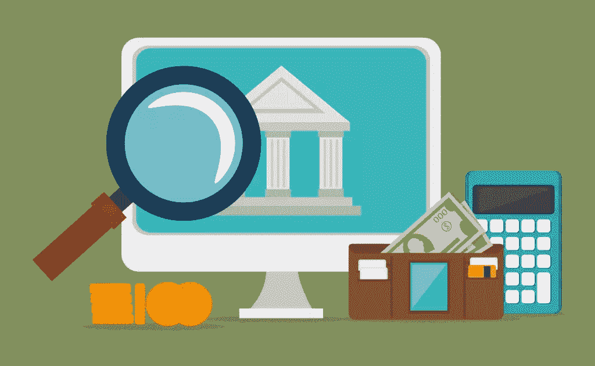

# 开始创业之旅需要多少钱？

> 原文：<https://www.sitepoint.com/how-much-money-do-you-need-in-the-bank-to-start-your-entrepreneurial-journey/>

当你决定追求自己的道路，成为你命运的船长，你灵魂的主人，你梦想的老板，你就决定成为一名企业家。创业之旅包括创造积极的变化、承担风险、建立团队和改变世界。

显然，这一旅程并不容易。它充满了风险、压力和不确定性。在享受这一旅程的“奢侈”的同时，关键是你已经认真审视了自己的财务状况，并把它们安排妥当。但是，你真正需要在银行存多少钱来开始你的创业冒险呢？

简单的答案是，没有什么秘方或你需要开始的“确切金额”。没有适合所有人的“数量”,所以你必须确定你自己的财务公式。但是，有一些不可忽视的框架。所以让我们开始吧！

## 1.最低可行收入

你肯定需要钱来生活。那是显而易见的。这里的要点是计算出你每个月需要多少钱来生存。这就是你所谓的“最低可行收入”，它能让你有饭吃，还能支付账单。

从计算你的固定支出和可变支出开始。固定支出是那些你为了维持生活水平而必须承担的费用，比如房租。另一方面，可变支出是那些根据你消费多少而波动的支出，比如娱乐或咖啡。

### 最低可行收入公式:固定生活费+可变生活费

如果你年轻，单身，没有什么可失去的，就像史蒂夫·乔布斯创业时那样，你甚至可以削减一些固定生活开支。通过和朋友或父母住在一起，你实际上减少了生活中的一项主要开支。只要确保你不会习惯于逃避房租的舒适生活，并在搬出去之前给自己一个作为“客人”生活多久的最后期限。

一旦你[达到这个数字](http://www.businessinsider.com/this-simple-formula-will-help-you-figure-out-how-to-leave-your-job-and-work-for-yourself-2015-6?IR=T)——假设是每月 1000 美元——你需要想出一个办法，在尽可能少的时间内赚到这笔钱，这样你就可以把剩下的时间投入到你想做的“改变生活的想法”上。如果一个月 1000 美元，你能每周提供几个小时的咨询服务，或者在易贝上销售产品吗？仔细评估你的选择和技能，选择一个适合你的。

## 2.你想建立什么类型的企业？

你希望建立一个基于服务或产品的企业吗？前者需要更少的前期投资，而后者需要更高的前期资本支出和“持有能力”来生存，直到你的业务变得有利可图。

你需要评估进入哪种类型的企业，这取决于你独特的个人和职业环境和资源。从长远来看，没有什么可以阻止你从基于服务的业务开始，过渡到基于产品的业务。重要的是迈出第一步。

计算一下你的生意需要多少钱。商业注册费用、法律费用、初始营销费用、任何技术费用、互联网费用、印刷费用。目标是对你每个月的开销有一个清晰的概念。

如果你正在建立一个以产品为基础的企业(尤其是科技产品)，无论你的产品需要多少钱，都要翻倍。历史证明，科技项目几乎从来不会按时完成。不妨提前计划，明智地规划你的开支。

作为一个建议，在以产品为基础的业务中，你应该有足够的资金来至少资助“MVP ”,这样你就可以在去找投资者寻求更多资金之前，让你的想法得到一些支持。

一旦你知道了所涉及的费用，你就能自信地为你的企业设定一个收入目标。这是绝对重要的，以确保您的业务是可行的。虽然预测可能与你的现实不符，但重要的是**知道**你的企业需要赚取多少收入，这样你就可以根据事情的进展情况开辟正确的道路。

## 3.你有什么资源？

这不仅仅包括金钱，还包括共同创始人、导师和顾问、你人际网络中的投资者和其他资源。如果你有联合创始人，你可以依靠他们的技能来省钱。如果你的人际网络中有投资者和导师，你比那些没有人际网络的人更容易筹集到资金。像这样无形的东西会影响你作为一个企业家的信心水平，你可以用银行里较少的个人资金冒险。

以贝宝为例。埃隆·马斯克(Elon Musk)与其他 3 名联合创始人(俗称“PayPal 黑手党”)一起创业。他们只有钱支付生活费用，住在宿舍外面。由于拥有才华横溢、技术娴熟的联合创始人，开发产品的成本得以弥补。因此，他们唯一需要的启动资金是他们个人生存的“最低可行收入”，因为建立企业的成本已被覆盖，所有创始人都为股权而工作。

如果你能依靠家人和朋友的资金来创业，你就不需要银行存款来创业。虽然投资者可能不愿意在你的企业处于创意阶段时投资，但朋友和家人更有可能在你的企业上下赌注，因为你有望与他们建立起“个人善意”。

你能从银行贷款吗？虽然如果你对如何偿还贷款没有一个清晰的策略，不建议你从金融机构借款，但这是值得了解的。在某些国家，政府通过提供补助金来支持小企业，这肯定能为你的企业提供急需的推动力。

当你需要的时候，信用卡也可以帮助你筹集资金。科岗的创始人鲁斯兰·科岗在银行一无所有的情况下创办了他的百万美元企业。他在几张信用卡的帮助下为他的产品购买提供资金，并承诺在承担成本的基础上获得收入。很明显，如果你确定你的产品会卖出去，你可以用信用卡来为产品融资，然后在有收入时还清债务。这绝对不是一个值得推荐的策略，只是证明了一个人在银行一无所有的情况下创造了数百万美元的生意。

作为一名企业家，你的首要任务之一是尽可能多地收集资源，以实现你的梦想。这意味着坚持不懈地足智多谋，极具创造力。

## 3.金融跑道

你有个人存款吗？你有多少钱？个人储蓄可以为你的个人和商业开支提供大量资金。你拥有的越多越好，因为这将成为你度过艰难时期的财务“缓冲垫”。作为一个“财务跑道”,在任何时候你的账户里都应该有至少 6 个月的开销。当然，这不是一成不变的，总会有例外。

这可能是一种“连续策略”。因此，如果你明天辞职，有 6 个月的财务跑道，这基本上意味着你有时间在 6 个月中的至少 3 个月里实现你的大想法。希望在 3 个月结束时，你会知道你的企业是否会赚钱，或者你是否会恢复到你的“最低可行收入计划”，以延长你的企业需要现金流为正的时间。

## 4.金钱的未来承诺

如果你对未来通过销售或在商业竞争中赢得的钱进入你的银行有信心，你今天就需要减少银行存款来开始你的创业之旅。

举个例子，如果你确定你会赢得下一集《鲨鱼池》(这是很难确定的事情！)，你可以相应地对冲你的赌注，尽早成为一名全职企业家。

未来的金钱承诺也可以是“后备工作”的形式，以防你的冒险失败。考虑到企业家世界中存在的大量不确定性，这总是明智的。如果事情变得糟糕透顶，知道你有工作可做，会给你更多信心。

## 5.应急基金

这对你的事业和个人生活都是绝对必要的。事情并不总是按计划进行，你需要一笔应急基金来应对生活抛给你的“惊喜”。

除了“正常过程”中所需的财务跑道之外，计划有一个至少 3 个月费用(包括业务和个人)的[应急基金](http://foodtruckr.com/2014/04/start-food-truck-13-build-emergency-fund/)。

## 6.众筹

企业家有太多的选择。众筹你的业务或产品是一个可行的方法来资助你的业务。

出于这个目的，你在银行里需要的唯一一笔钱就是竞选活动本身所需的资金。做好最坏的打算，以防竞选失败。聪明的企业家在发起众筹活动之前，会与目标受众建立联系，从而增加成功的几率。

很明显，如果你足够大胆，你不需要在银行存很多钱就可以开始。但与此同时，你需要多少钱没有直接的答案，因为这取决于一系列因素。良好的财务规划确保你至少有足够的钱来支付你的生活费用，以及你需要启动和获得初始牵引力的资金，这是实现飞跃的关键。

## 分享这篇文章