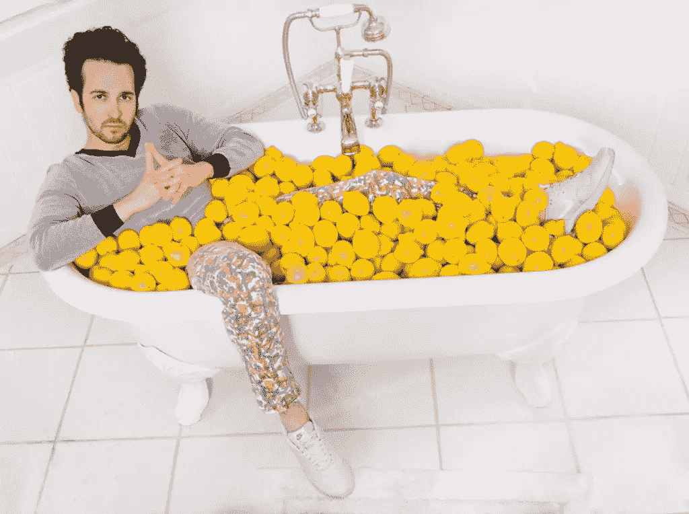

# 说唱天才如何在不知道自己在做什么的情况下筹集到 180 万美元

> 原文：<https://www.sitepoint.com/how-rap-genius-raised-1-million/>

* * *

### [这篇文章最初发表于 Genius](http://genius.com/Tom-lehman-how-rap-genius-raised-s18m-in-seed-funding-without-knowing-what-we-were-doing-annotated)

* * *

现在是 2011 年 8 月 25 日——在[演示日](http://genius.com/1900687)后的第三天，在[2011 年 5 月 2 日的第 115 天，这一天奥萨马死了，说唱天才进入了 Y Combinator](http://genius.com/1900694) 。

Ilan 和我正在旧金山四季酒店与一位真正的投资者进行第一次会面，准备工作非常完美。是[这个俄罗斯纨绔子弟](http://genius.com/1900764)–[完美的胡茬](http://genius.com/1922751)，最柔软的柴油牛仔裤，麂皮休闲鞋[不穿袜子](http://genius.com/1900739)。

和他相处了 10 秒钟后，我确信这家伙在他的公寓 [里安装了轨道照明(事实上，前一天我们查看他的 AirBnB 房源时，我自己也看到了。](http://genius.com/1924762) [每晚 600 美元！](http://genius.com/1900736))

所以我们在谈论一些关于说唱天才的事情，但主要是关于他女朋友的模特朋友告诉他的关于威廉斯堡的事情，他和哪个著名的制作人一起去玩桨板，以及某个雕塑的价值，最后他问[“那么，你们这些人的估价是多少？”](http://genius.com/1900786)

我们不知道该说什么！

我的意思是，我们之前讨论过这个问题，我们知道我们希望以高估值融资，这很好，对吗？

我们知道一些其他 YC 公司的做法，但不是很了解。 [我们听说最好的策略是让风投公司命名第一个数字](http://genius.com/1900796)..现在说这个太晚了吗？这可能吗？

在这种情况下，你会怎么做？

嗯，如果你是我，你要做的第一件事就是在你的脑海中形成一个清晰的画面，那就是你的 TechStars 拒绝邮件。

一旦你经历了这些，你就会想象你被 Y 组合拒绝的电子邮件。

然后你会想到 6 个月前弗雷德·威尔逊对你那封冷冰冰的电子邮件的回复..那也是拒绝邮件吗？当时，他似乎只有[几个可以克服的异议](http://genius.com/1900813)..这绝对是一封拒绝邮件。

然后你会想到你在 YC 之前的生活。

在我们进入 YC 的两年前， [Rap Genius 是一个副业项目](http://genius.com/1900824)我和我的朋友认为很酷，但没有人关心或甚至认为这是[试图成为一项业务的东西](http://genius.com/1900882)。

但是在四季的那个时刻， [Rap Genius 是 YC 最新一批](http://genius.com/1900890)中最热门、发展最快的公司之一，因此我们有充分的理由成为全世界最热门的创业公司之一。然而，在我看来，几乎没有什么变化。

网站肯定比 YC 开始时更大，但它基本上是相同的产品，并且[的交通图有相同的形状](http://genius.com/1900928)。[我们本可以在 YC 开始](http://genius.com/1900933)之前给出确切的演示日演示。

发生了什么事？我们一直都很性感吗？大家之前的没兴趣是装的吗？

当时看起来很真实。或者可能是演示日后的风头是假的，很快每个人都会回到不关心？

当然，关键是没有潜在的客观现实——没有教师版的创业教科书来解释哪些公司真正热门，以及什么是真正正确的说唱天才估值..又或许考上 Y Combinator 是老师版，但之后所有页面都是空白的。[没关系——重点是鞋子没有魔力，你必须强迫自己跳舞](http://genius.com/1915419)。

当然，俄罗斯球员也是如此。[这不仅仅是你网站的优点](http://genius.com/1902966)——如果是的话，我们早 6 个月就在四季酒店了—[这是关于你是否表现出活力、兴奋和自信](http://genius.com/1900965)。所以当 dude 问你的估价是多少时，你必须看着他的眼睛，说出你能说出的最大的数字，而不要失控或崩溃，那天对我们来说是 1700 万美元。

这就是一个筹款的教训:项目信心。 [但更重要的是，你实际上必须有信心](http://genius.com/3185465)因为有些时候事情看起来如此黯淡，除非你真的相信，否则你会欺骗自己以为一切都结束了。

在遇到那个俄罗斯人三周后，我们已经筹集了大约 50 万美元，我们告诉每个人我们计划筹集 150 万美元，但我们遇到了一连串的“不”，我们感觉不太好，所以去和 T2·保罗·格拉厄姆·T3 的办公室寻求一些灵感。

我们很早就到了，所以我们无意中听到了宝洁与另一位创始人的对话，这位创始人向他施压，要求提供一种对我们来说完全陌生的融资建议。

创始人 : *宝洁公司——我们还有什么可以做得更好的吗？还是我们做的一切都很完美？*

保罗·格拉厄姆 : *不，你们已经搞定了。你差不多完成了*

有什么方法可以让我们感谢罗恩·康韦为我们介绍了这么多的投资者？

不，你已经做了一件了不起的工作，谢谢他了！你已经完美地谢过他了！

如此下去，我们的情绪越来越低落，直到最后轮到我们向 PG 展示我们的筹款电子表格。

电子表格看起来是这样的:我们认识的还没有说“不”的每个投资者都有一行，还有(a)投资概率和(b)可能投资规模范围的列。

问题是，即使每一个热情的领导都投入了最大的合理金额，我们也只能勉强达到 100 万美元。

保罗·格拉厄姆看了一眼电子表格，宣布***“*哇，你们这些家伙真他妈的混蛋。如果这些是你唯一的线索，你不可能得到 150 万美元。*“***

当然[这将是一个非常尴尬的结果](http://genius.com/1901046),因为这意味着对我们寻求的估值的兴趣远低于我们向已经投资的人传达的信息。

宝洁建议我们想出一些办法来降低现有投资者的上限，以获得更多的投资者，这将是一个 hella-beta 的对话，谁知道它是否会奏效，因为表现出这种弱点是一个主要的障碍。

好吧，那么另一个问题:你的偶像保罗·格拉厄姆刚刚告诉你你把一切都搞砸了，你会怎么做？

这个稍微简单一点:你直接开车去门洛帕克 Quiznos，点了[一份味道像纸板一样的巨大烤鸡肉三明治](http://genius.com/1901070)，然后你坐在那里沮丧地看着 Ilan，除了[你们两个大杯健怡可乐的嘶嘶声](http://genius.com/1901073)。

然而，最终一切都很好。事情就像我们假装知道的那样发生了。

我们在一轮超额认购中以很高的估值筹集了 180 万美元。

因此，即使你是一家“炙手可热”的初创企业，在竞争激烈的一轮融资中，你仍会经历极度恐惧的时刻。但是只要你不抓狂，告诉所有人你搞砸了，多年后拒绝你的投资者会开玩笑地问你为什么不让他们投资。

筹资是一种心理上的考验，它很少依赖于对你产品质量的冷静分析，而更多地依赖于你能多好地展示自信和管理自己的心理。

当然，这只是种子阶段。

[募集 A 轮要难得多](http://genius.com/1901138)。在种子阶段，你要找的是一群人投入几十万美元和很少的名誉和时间，而在首轮投资中，你要找的是一个人在你身上押上数百万美元、大量时间和他的全部名誉。

这意味着你不能只是拿出所有的咖啡，准备说大数字。相信我，我们尽力了。

如果你第一次去见一个风险投资人，告诉他你要融资 1500 万美元，你会花整个谈话来证明这么大的融资是合理的，而不是谈论你的网站有多酷。

相反，你必须用几个月的时间来建立一种真正的关系，和他交往，让他注册并做出贡献，等等。

然后，在最后一秒钟，在合伙人会议上，你有机会[看着网络浏览器的发明者的眼睛，再次说出你能说出的最大数字，同时仍然面无表情](http://genius.com/1901192)。

## 分享这篇文章