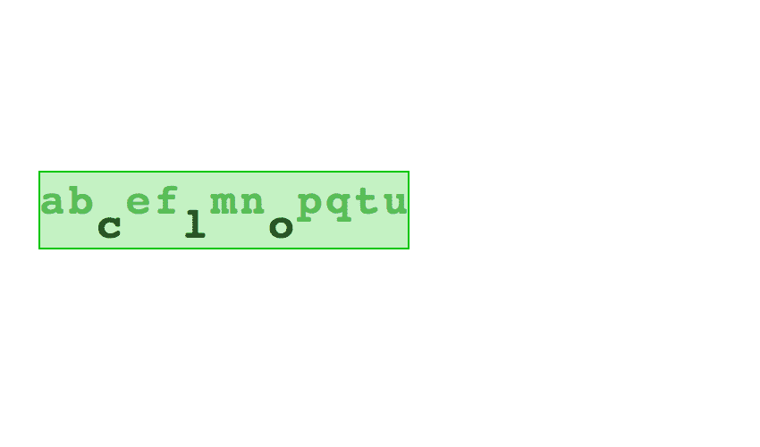
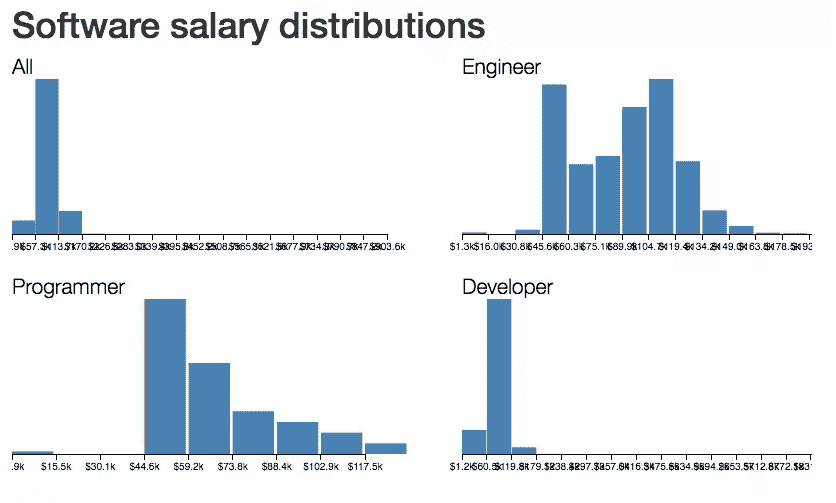
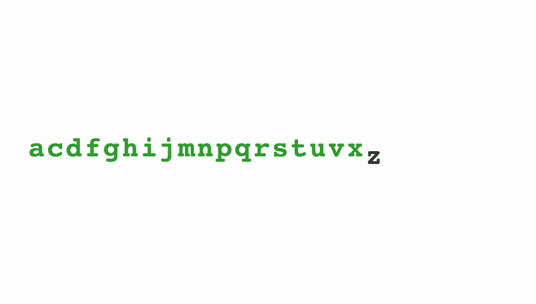

# 构建动画组件，或者 React 如何让 D3 更好

> 原文：<https://www.sitepoint.com/how-react-makes-your-d3-better/>

**D3 很棒。作为 web 数据可视化世界的 jQuery，它可以做你能想到的一切。**

你在网上看到的许多最好的数据可视化都使用 D3。这是一个很棒的库，随着[最近的 v4 更新](https://github.com/d3/d3/blob/master/CHANGES.md)，它变得比以往更加健壮。

加上 React，可以让 D3 更好。

就像 jQuery 一样，D3 功能强大但水平低。你的可视化越大，你的代码就越难处理，你花在修复 bug 和拔头发上的时间就越多。

React 可以解决这个问题。

你可以阅读我的书 [React+d3js ES6](http://swizec.com/reactd3js/) 以获得深入的见解，或者继续阅读如何最好地集成 React 和 D3 的概述。在一个实际的例子中，我们将看到如何构建声明性的、基于过渡的动画。

这篇文章的一个版本也在 YouTube 上以 D3 meetup talk 的形式存在。

## React 值得吗？

好吧，反应大了。它给你的有效负载增加了大量的代码，并且增加了你的依赖性。这是另一个你必须保持更新的库。

如果您想有效地使用它，您将需要一个构建步骤。将 JSX 代码转换成纯 JavaScript 的东西。

如今设置 Webpack 和 Babel 很容易:只需运行`create-react-app`。它为您提供了 JSX 编译、现代 JavaScript 特性、林挺、热加载和产品构建的代码精简。太棒了。

尽管尺寸和工具复杂，React *是*值得的，*尤其是*如果你对你的可视化很认真的话。如果你正在构建一个你永远不需要维护、调试或扩展的一次性组件，坚持使用纯 D3。如果你正在构建一些真实的东西，我鼓励你加入 React。

对我来说，主要的好处是 React ~~forces~~ 强烈鼓励你将代码组件化。其他好处要么是组件化的症状，要么是组件化使之成为可能。

在 D3 代码中使用 React 的主要好处是:

*   组件化
*   更容易的测试和调试
*   智能 DOM 重绘
*   热负荷

**组件化**鼓励你将代码构建成一系列逻辑单元——组件。有了 JSX，你可以像使用 HTML 元素一样使用它们:`<Histogram />`、`<Piechart />`、`<MyFancyThingThatIMade />`。我们将在下一节对此进行更深入的探讨。

将你的可视化构建为一系列组件使得测试和调试更加容易。您可以一次关注一个逻辑单元。如果一个组件在这里工作，它在那里也会工作。如果它通过了测试并且看起来不错，那么不管你如何频繁地渲染它，不管你把它放在哪里，也不管谁调用它，它都会通过测试并且看起来不错。🙌

**React 理解你的代码**的结构，所以它知道如何只重画有变化的组件。决定什么要重新渲染，什么不要处理不再是一件困难的事情。只是**改变，忘记**。React 可以自己搞清楚。是的，如果你看一个剖析工具，你会看到*只有*有变化的部分被重新渲染。



使用 [`create-react-app`](https://facebook.github.io/react/blog/2016/07/22/create-apps-with-no-configuration.html) 来配置你的工装，React 可以利用**热加载**。假设您正在构建 30，000 个数据点的可视化。对于 pure D3，每次代码更改都必须刷新页面。加载数据集，解析数据集，渲染数据集，四处点击到达你测试的状态…哈欠。

使用 React ->不重新加载，不等待。只是页面上的即时更改。当我第一次看到它工作时，感觉就像在吃冰淇淋，而背景音乐是 1812 序曲的渐强。思维=爆炸。

## 组件化的好处

组件这个，组件那个。等等等等。你为什么要在乎？您的 dataviz 代码已经可以工作了。你建造它，你运输它，你让人们快乐。

但是代码让你开心吗？有了组件，就可以了。组件使您的生活更轻松，因为它们使您的代码:

*   宣言的
*   可重复使用的
*   可理解的
*   组织

如果这听起来像流行语汤也没关系。让我展示给你看。

例如，**声明性代码**是那种你说*你想要什么*而不是*你想要什么*的代码。写过 HTML 或者 CSS 吗？您知道如何编写声明性代码！恭喜你。

React 使用 JSX 让你的 JavaScript 看起来像 HTML。但是不要担心，这一切都在幕后编译成纯 JavaScript。

试着猜猜这段代码是做什么的:

```
render() {
  // ...
  return (
    <g transform={translate}>
      <Histogram data={this.props.data}
         value={(d) => d.base_salary}
         x={0}
         y={0}
         width={400}
         height={200}
         title="All" />
      <Histogram data={engineerData}
         value={(d) => d.base_salary}
         x={450}
         y={0}
         width={400}
         height={200}
         title="Engineer" />
      <Histogram data={programmerData}
         value={(d) => d.base_salary}
         x={0}
         y={220}
         width={400}
         height={200}
         title="Programmer"/>
      <Histogram data={developerData}
         value={(d) => d.base_salary}
         x={450}
         y={220}
         width={400}
         height={200}
         title="Developer" />
    </g>
  )
} 
```

如果您猜测*“呈现四个直方图”*，那么您是对的。万岁。

创建直方图组件后，您可以像使用普通的 HTML 一样使用它。一个直方图显示在你用正确的参数放置`<Histogram />`的任何地方。

在这种情况下，参数是`x`和`y`坐标、`width`和`height`大小、`title`、一些`data`和一个`value`访问器。它们可以是您的组件需要的任何东西。

参数看起来像 HTML 属性，但是可以接受任何 JavaScript 对象，甚至是函数。就像打了类固醇的 HTML。

有了一些样板文件和正确的数据集，上面的代码给了你这样一幅图。编写软件的不同类型人员的工资分布比较。



再看看代码。注意到**可重用的**组件了吗？就好像`<Histogram />`是一个创建直方图的函数。在幕后，它*将*编译成一个函数调用— `(new Histogram()).render()`，或者类似的东西。`Histogram`成为一个类，每次使用`<Histogram />`时调用一个实例的渲染函数。

React 组件应该遵循良好的函数式编程原则。无副作用，无状态，等幂，可比性。除非你真的真的想打破规则。

与 JavaScript 函数不同，遵循这些原则需要深思熟虑，React 使得很难*而不是*以这种方式编码。当你在团队中工作时，这就是胜利。

默认情况下，声明性和可重用性使得你的代码**可以被理解**。如果您曾经使用过 HTML，您可以阅读该代码的作用。你可能不明白细节，但如果你懂一些 HTML 和 JavaScript，你就知道如何阅读 JSX。

复杂的组件由更简单的组件组成，更简单的组件又由更简单的组件组成，而更简单的组件最终又由纯 HTML 元素组成。这使得你的代码**有条理**。

当你六个月后回来时，你可以看着你的代码想，*“啊，是的，四个直方图。要调整这一点，我应该打开直方图组件，四处看看。”*

React 采用了我一直喜欢的关于花哨的函数式编程的原则，并使它们变得实用。我喜欢这样。

让我给你看一个例子——一个动画字母表。

## 实际例子



我们要建立一个动画字母表。不是因为它是 React 和 D3 一起使用的最简单的例子，而是因为它看起来很酷。当我在现场演讲中展示这一点时，人们总是哦哦啊，特别是当我展示了只有发生变化的 DOM 元素才会被重绘的证据时。

这是几个月前我在博客上发布的一篇关于 React 和 D3 以及转换的文章的精简版。在这个版本中，我们将忽略一些细节，以保持简短。你可以深入到 [GitHub 库](https://github.com/Swizec/react-d3-enter-exit-transitions/tree/alphabet)中的完整代码库。

代码基于 React 15 和 D3 4.0.0。我使用的一些语法，比如类属性，在稳定的 ES6 中还没有，但是如果你在工具设置中使用`create-react-app`应该可以。

————

要制作一个动画字母表，我们需要两个组件:

*   `Alphabet`，它每 1.5 秒创建一个随机的字母列表，然后映射它们来呈现`Letter`组件
*   `Letter`，它呈现一个 SVG 文本元素，并负责自己的进入/更新/退出转换。

我们将使用 React 来呈现 SVG 元素，我们将使用 D3 来进行过渡、间隔和一些数学运算。

### 字母表组件

`Alphabet`组件保存当前状态中的字母列表，并在一个循环中呈现一组`Letter`组件。

我们从这样的骨架开始:

```
// src/components/Alphabet/index.jsx
import React, { Component } from 'react';
import ReactTransitionGroup from 'react-addons-transition-group';
import * as d3 from 'd3';

require('./style.css');

import Letter from './Letter';

class Alphabet extends Component {
  static letters = "abcdefghijklmnopqrstuvwxyz".split('');
  state = {alphabet: []}

  componentWillMount() {
    // starts an interval to update alphabet
  }

  render() {
    // spits out svg elements
  }
}

export default Alphabet; 
```

我们导入依赖项，添加一些样式，并定义`Alphabet`组件。它在静态`letters`属性中保存了一个可用字母列表，在组件状态中保存了一个空的`alphabet`。我们还需要一个`componentWillMount`和一个`render`方法。

每 1.5 秒创建一个新字母表的最佳位置是在`componentWillMount`:

```
// src/components/Alphabet/index.jsx
  componentWillMount() {
    d3.interval(() => this.setState({
       alphabet: d3.shuffle(Alphabet.letters)
         .slice(0, Math.floor(Math.random() * Alphabet.letters.length))
         .sort()
    }), 1500);
  } 
```

我们使用`d3.interval( //.., 1500)`每 1.5 秒调用一次函数。在每个周期，我们打乱可用的字母，切下一个随机的数量，对它们进行排序，并用`setState()`更新组件状态。

这确保了我们的字母表既随机又按字母顺序排列。`setState()`触发重新渲染。

我们的声明魔法始于`render`方法。

```
// src/components/Alphabet/index.jsx
render() {
  let transform = `translate(${this.props.x}, ${this.props.y})`;

  return (
    <g transform={transform}>
      <ReactTransitionGroup component="g">
        {this.state.alphabet.map((d, i) => (
          <Letter d={d} i={i} key={`letter-${d}`} />
        ))}
      </ReactTransitionGroup>
    </g>
  );
} 
```

我们使用一个 SVG 转换将我们的字母表移动到指定的`(x, y)`位置，然后定义一个`ReactTransitionGroup`并通过`this.state.alphabet`映射来渲染一堆`Letter`组件。

每个`Letter`获得其当前文本`d`和索引`i`。属性帮助 React 识别哪个组件是哪个组件。使用`ReactTransitionGroup`为我们提供了特殊的组件生命周期方法，有助于平稳过渡。

#### 反应转变组

除了告诉我们组件何时安装、更新和卸载的正常生命周期挂钩之外，ReactTransitionGroup 还为我们提供了对`componentWillEnter`、`componentWillLeave`和其他一些内容的访问。注意到什么熟悉的东西了吗？

`componentWillEnter`与 D3 的`.enter()`相同，`componentWillLeave`与 D3 的`.exit()`相同，`componentWillUpdate`与 D3 的`.update()`相同。

“相同”是一个很强的概念；它们是相似的。D3 的钩子操作整个选择——组件组——而 React 的钩子操作每个组件。在 D3 中，一个霸主正在指挥发生什么；在 React 中，每个组件都知道该做什么。

这使得 React 代码更容易理解。我想。\_(ツ)_/

给了我们[更多的钩子](https://facebook.github.io/react/docs/animation.html)，但这三个正是我们所需要的。令人高兴的是，在`componentWillEnter`和`componentWillLeave`中，我们可以使用回调显式地说*“转换完成了。反应过来，回你"*。

感谢米歇尔·蒂利在堆栈溢出上写了关于`ReactTransitionGroup` [的文章。](http://stackoverflow.com/questions/29977799/how-should-i-handle-a-leave-animation-in-componentwillunmount-in-react)

### 字母组件

现在我们已经准备好接受这个很酷的东西了——一个可以声明性地将自己移入和移出可视化的组件。

我们的`Letter`组件的基本框架如下所示:

```
// src/components/Alphabet/Letter.jsx

import React, { Component } from 'react';
import ReactDOM from 'react-dom';
import * as d3 from 'd3';

class Letter extends Component {
    state = {
      y: -60,
      x: 0,
      className: 'enter',
      fillOpacity: 1e-6
    }
    transition = d3.transition()
                   .duration(750)
                   .ease(d3.easeCubicInOut);

    componentWillEnter(callback) {
      // start enter transition, then callback()
    }

    componentWillLeave(callback) {
      // start exit transition, then callback()
    }

    componentWillReceiveProps(nextProps) {
      if (this.props.i != nextProps.i) {
        // start update transition
      }
    }

    render() {
       // spit out a <text> element
    }
};

export default Letter; 
```

我们从一些依赖项开始，用默认状态和默认转换定义一个`Letter`组件。在大多数情况下，您会希望避免对坐标和其他瞬态属性使用`state`。这就是道具的作用。对于转换，我们使用状态，因为它有助于我们保持 React 的现实与 D3 的现实同步。

也就是说，这些神奇的默认值可能是默认道具。这将使我们的`Alphabet`更加灵活。

#### 组件将输入

我们将输入转换放在`componentWillEnter`中。

```
// src/components/Alphabet/Letter.jsx
    componentWillEnter(callback) {
      let node = d3.select(ReactDOM.findDOMNode(this));

      this.setState({x: this.props.i*32});

      node.transition(this.transition)
        .attr('y', 0)
        .style('fill-opacity', 1)
        .on('end', () => {
            this.setState({y: 0, fillOpacity: 1});
            callback()
        });
    } 
```

我们使用`reactDOM.findDOMNode()`获取 DOM 节点，并使用`d3.select()`将其转换为 d3 选择。现在 D3 能做的事情，我们的组件也能做。是啊。🙌

然后我们使用当前索引和字母宽度更新`this.state.x`。宽度是一个我们刚刚知道的值。将`x`置于状态有助于我们避免跳跃:每次更新时`i`道具都会改变，但是我们希望延迟`Letter`移动的时间。

当一个`Letter`第一次渲染时，它是不可见的，比基线高 60 像素。为了让它向下移动并变得可见，我们使用了一个 D3 过渡。

我们使用`node.transition(this.transition)`来开始一个新的过渡，使用先前的默认设置。随着时间的推移，我们所做的任何`.attr`和`.style`更改都直接发生在 DOM 元素本身上。

这种混乱的反应，因为它假设自己是这个世界的主人。所以我们必须使用一个回调函数来同步 React 的现实和真实的现实:`.on('end', …)`。我们使用`setState()`来更新组件状态，并触发主`callback`。现在反应过来知道这封信是做出来的。

#### 组件将离开

退出过渡进入`componentWillLeave()`。与上面的概念相同，只是相反。

```
// src/components/Alphabet/
  componentWillLeave(callback) {
    let node = d3.select(ReactDOM.findDOMNode(this));

    this.setState({className: 'exit'});

    node.transition(this.transition)
      .attr('y', 60)
      .style('fill-opacity', 1e-6)
      .on('end', () => {
          callback()
      });
  } 
```

这一次，我们更新状态来改变`className`而不是`x`。那是因为`x`没有改变。

退出过渡本身是进入过渡的逆过程:字母向下移动，变得不可见。转换之后，我们告诉 React 可以移除组件了。

#### componentWillReceiveProps

更新过渡进入`componentWillReceiveProps()`。

```
// src/components/Alphabet/Letter.jsx
  componentWillReceiveProps(nextProps) {
    if (this.props.i != nextProps.i) {
      let node = d3.select(ReactDOM.findDOMNode(this));

      this.setState({className: 'update'});

      node.transition(this.transition)
        .attr('x', nextProps.i*32)
        .on('end', () => this.setState({x: nextProps.i*32}));
    }
  } 
```

你现在知道模式了，不是吗？更新状态，做过渡，过渡后状态与现实同步。

在这种情况下，我们改变`className`，然后将字母移动到新的水平位置。

#### 提供；给予

在所有的过渡魔法之后，你可能会想*“天哪，我该如何渲染它！?"*。我不怪你！

但是我们做了所有艰苦的工作。渲染很简单:

```
// src/components/Alphabet/Letter.jsx
  render() {
    return (
      <text dy=".35em"
          y={this.state.y}
          x={this.state.x}
          className={this.state.className}
          style={{fillOpacity: this.state.fillOpacity}}>
        {this.props.d}
      </text>
    );
  } 
```

我们用一个`className`和一个`fillOpacity`返回一个呈现在`(x, y)`位置的 SVG `<text>`元素。它显示了由`d`道具给出的一个字母。

如上所述:用状态来表示`x`、`y`、`className`和`fillOpacity`在理论上是错误的。你通常会用道具。但是状态是我能想到的在渲染和生命周期方法之间交流的最简单的方式。

## 你知道最基本的！

嘣。就是这样。您知道如何构建一个动画的声明性可视化。如果你问我的话，我觉得这很酷。

这是它实际运行的样子:

[https://sitepoint-editors.github.io/react-d3-enter-exit-transitions/](https://sitepoint-editors.github.io/react-d3-enter-exit-transitions/)

如此漂亮的转换，你所要做的就是循环遍历一个数组并呈现一些`<Letter>`组件。多酷啊。😉

## 最后

你现在明白了如何做出技术决策。你可以看看这个项目，然后决定:*“是的，这不仅仅是一个一次性玩具。组件和可调试性将对我有所帮助。”*

为了获得额外的乐趣，您还知道如何一起使用 React 和 D3 来构建声明性动画。这是过去最困难的壮举。

要了解更多关于正确集成 React 和 D3 的信息，请查阅我的书， [React+d3js ES6](http://swizec.com/reactd3js) 。

这篇文章由[马克·布朗](https://www.sitepoint.com/author/mbrown)和[杰克·富兰克林](https://www.sitepoint.com/author/jfranklin)进行了同行评议。感谢 SitePoint 的所有同行评审员使 SitePoint 的内容尽可能做到最好！

## 分享这篇文章