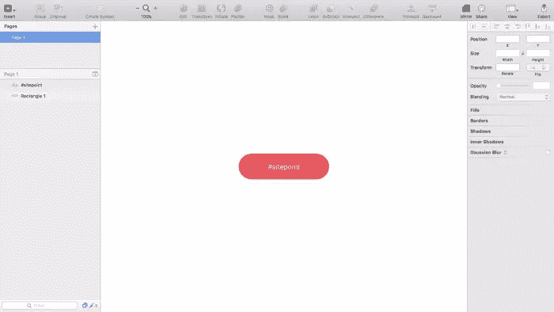
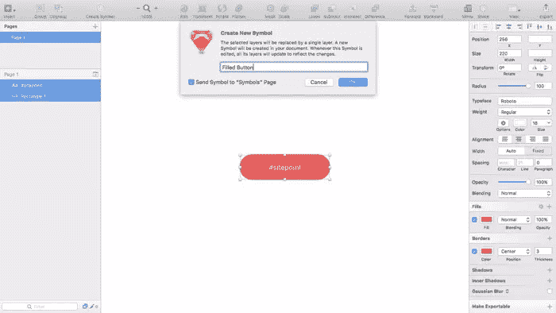
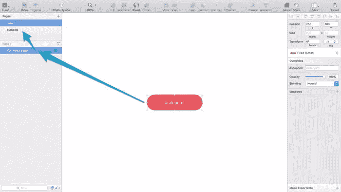
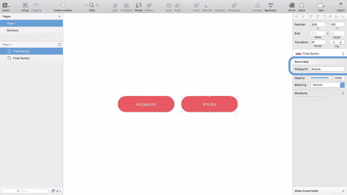
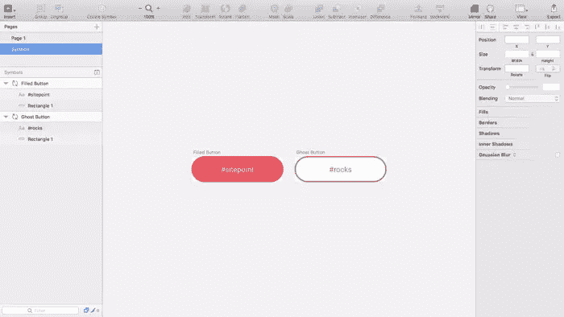
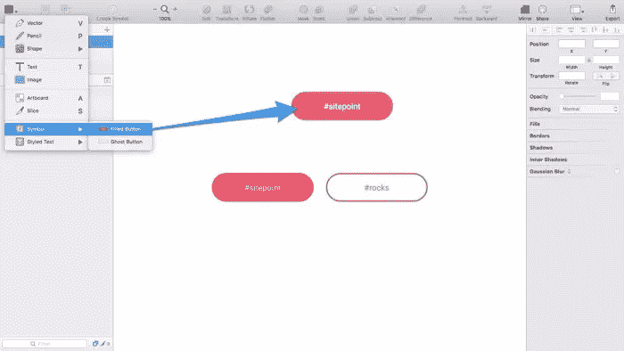
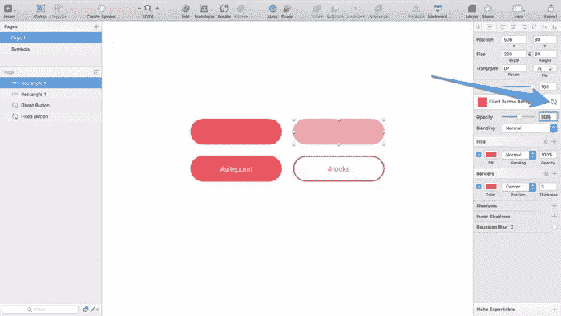

# Sketch 的新符号将如何改善您的工作流程

> 原文：<https://www.sitepoint.com/how-sketch-symbols-will-improve-your-workflow/>

宣布:如果你是一个素描迷，丹尼尔刚刚为 SitePoint 出版了他的第一本书。[查看跳转开始草图！](https://www.sitepoint.com/premium/books/jump-start-sketch)

Sketch 漂亮的*符号*功能将一组普通的图层变成一个可重复使用的元素。发生在一个符号实例上的事情会发生在所有的实例上(除了一些例外，比如文本值)，这使得在整个中保持某些设计组件的一致性变得更加容易。草图文档。

在 3.7 版本之前，Sketch 不支持嵌套符号；也就是说，符号内的符号*。假设您的网站的标题在多个画板中重复出现，但是您的标题包含*和另一个*符号(例如可重用的按钮组件)。在 Sketch 3.7 之前，这是不可能的，而且有很大的限制，因为我们无法制作一些可重用的元素。*

我们现在不仅可以在其他符号中创建符号，而且该功能已经增强到可以在一个特殊的符号专用画布中存储、编辑甚至创建新符号的阶段。

## 创建可重用元素

让我们从创建一个可重用的元素开始。按钮是非常可重用的，并且按钮的每个实例的文本都是不同的，这使得它成为符号的理想候选。

按下 **R** 创建一个矩形；使用以下样式:

*   宽度:220
*   身高:60
*   填充:#FF3654
*   边框(*颜色* ): #FF3654
*   边框(*粗细* ): 3

以及新的文字层(键盘字母:**T**)；对于这些风格:

*   宽度:220
*   字体:Roboto
*   尺寸:18
*   颜色:#FFFFFF

*注意:具体的风格并不重要，请按照教程使用自己的风格*。

## 附加一个符号

当您准备创建符号并将其附加到这些图层时，请选择它们并选择工具栏中的“创建符号”功能。将出现一个对话框，要求您命名该符号——称之为“填充按钮”,并确保“将符号发送到符号页面”选项也被选中。你很可能在想这和草图 3.6 有什么不同，所以让我们来谈谈不同之处以及为什么这种方法更好。

## 管理符号和激活覆盖

首先，让我们讨论一下符号页面，以及为什么符号不再专门应用于组。分组是一种一次移动几个相互依赖的层的方法；在 Sketch 3.7 中，当你从一系列层中创建一个符号时，层*看起来*好像它们已经被展平成一个，这意味着即使它没有被分组，你也可以四处移动它。

相反，单个(可编辑)图层被发送到“符号”页面，这是一个仅存储符号的整个画布。现在可以在此符号页面中编辑符号。如果你习惯在 Photoshop 中使用智能参考线，这是一样的。

在我们进入符号页面之前，让我们看看工作画布为我们提供了多大的灵活性。首先，我们仍然可以使用检查器附加和分离符号；但是，检查器现在还提供了对旧功能的增强，即“从元件中排除文本值”功能。不是从符号中排除文本值，而是符号有一个默认的文本值，我们可以使用检查器覆盖每个实例。

按下 **command+D** 复制符号，然后使用检查器键入您的覆盖。在我的例子中，符号文本是“#sitepoint ”,但我用“#rocks”覆盖了它。现在，除了文本，这些组件将总是相同的。

## 从符号页面
创建符号

从图层列表的页面选项卡中，选择符号页面。正如我之前提到的，这是我们编辑符号的地方——**而不是工作画布中的**。确实与草图 3.6 非常不同。

在这个符号页面(顺便说一下，有点像*风格指南*)中，每个符号都有自己的画板。当我们从“符号”页面编辑符号时，不仅更改会反映在那里，而且整个文档中该符号的每个实例也会更新。本质上，您正在对“样式指南”进行更改，工作画布会相应地进行自我更新。

复制元件，将其重命名为“鬼按钮”，删除背景，然后将#FF3654 颜色应用于文本。我们现在有两个完全独立的符号——如果您将文本值更改为“#rocks ”,那么也不再需要覆盖。

## 将新实例插入工作画布

从工具栏中选择“插入”，然后选择“符号”，然后选择要插入的符号。单击画布上的任意位置，在鼠标光标正下方插入该元件的一个实例。与往常一样，这个实例将与它在符号页面中的链接符号保持一致，当然除了被覆盖的内容。

## 参考消息:共享样式和文本样式

共享样式和文本样式也得到了显著的，虽然相对简单的更新。现在，您可以对共享或文本样式的实例进行独特的更改，但是这些更改不会**与*其他*实例同步，除非您单击更新图标，这实质上为我们创建和管理可重用元素的方式提供了巨大的灵活性。**

现在我们可以拥有只共享某些样式的层。

## 结论

根据素描小组的说法，这仅仅是个开始。在即将到来的 Sketch 版本中，符号得到了一系列的增强，所以我非常期待看到它的发展。我感到失望的是，在新的符号页面之间切换，或者在画布中插入符号，都没有快捷键——希望随着 3.7 版本的开发，这种情况会有所改变。

你如何看待 Sketch 3.7 的更新？这种新的工作流程效率更高吗，还是会怀念以前的做事方式？

宣布:如果你是一个素描迷，丹尼尔刚刚为 SitePoint 出版了他的第一本书。[查看跳转开始草图！](https://www.sitepoint.com/premium/books/jump-start-sketch)

## 分享这篇文章