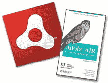

# 你有多聪明？测验时间到了！

> 原文：<https://www.sitepoint.com/how-smart-are-you-its-quiz-time/>

 **我们知道你一直在等它…好了，等待结束了— *测验回来了！***

不过，首先要做的是:我们刚刚出版了另一个优秀的教程，你应该去看看。然而，我们都知道*阅读*某事和*理解*它是完全不同的两回事。好了，现在你可以测试一下你*实际上*吸收了多少教程。欢迎来到 SitePoint，在这里我们弥合了信息吸收的鸿沟！；)

本周，我们的传奇人物 Jack Herrington 再次带来了另一个激动人心的 Flex 教程——这一次是关于跨平台分布式处理，由于 Adobe AIR 的强大功能，它非常简单！在本教程中，Jack 向您展示了如何将 PHP 应用程序的处理分派到应用程序的许多用户的桌面上。你都明白了吗？

如果你错过了过去的机会[拿起一本优秀的袖珍指南*Adobe AIR For JavaScript Developers*(这是死树版本)，那么现在你有机会](https://www.sitepoint.com/free-book-giveaway-adobe-air-for-javascript-developers/)[再拿一本](https://www.sitepoint.com/quiz/air/distributed-processing/)。我保证这是一个有限的机会(只有 100 份可用)，虽然你可以得到 PDF 格式的下载…但硬拷贝确实很方便*不时*！另外，它确实适合你的口袋(嗯，不是你所有的口袋——只是大口袋)。

所以…如果你还没有安装 Flex Builder 3 的[试用版，现在就安装吧。一旦你读完这篇文章，](http://ad.doubleclick.net/clk;207716356;29856687;b#flex_builder)[参加测验](https://www.sitepoint.com/quiz/air/distributed-processing/)，留下你的详细信息就可以获得一份免费赠品。请记住，只有前 100 人得分奖！

那么你还在等什么？现在就去[下载 Flex Builder](http://ad.doubleclick.net/clk;207716356;29856687;b#flex_builder) ，阅读 Jack 的文章，然后[参加测验……](https://www.sitepoint.com/quiz/air/distributed-processing/)！

## 分享这篇文章