# Telerik 平台如何帮助您构建下一个移动应用

> 原文：<https://www.sitepoint.com/how-telerik-platform-can-help-you-build-your-next-mobile-app/>

本文由 [Telerik](http://www.telerik.com/) 赞助。感谢您对使 SitePoint 成为可能的赞助商的支持。

众所周知，构建本地或混合移动应用程序是一项非常困难的任务。与为 web 构建不同，每个操作系统都需要在开发开始之前理解一套独特的语言和工具。

虽然有些人可以雇用一个机构，并花费数千美元来建立他们的应用程序，其他人只是没有能力，由于时间，资源或财政限制。

令人欣慰的是，Telerik 平台将帮助您构建自己的应用程序，而无需外部机构的麻烦和大量开发成本。

## 站台

[Telerik 平台](http://www.telerik.com/platform#overview)旨在简化混合和本地移动应用的开发。这个想法深深地融入了 Telerik 的产品理念，甚至不需要下载 SDK 就可以开始使用。

这是因为在 Telerik 平台上的构建是在其浏览器内 IDE 中进行的。在应用程序设计阶段，您可以利用 Telerik 的内置设计主题来查看应用程序的外观和感觉，同时运行实时数据。由于 Telerik 利用 Phonegap/Cordova，您可以使用 HTML、CSS 和 JavaScript 构建应用程序，同时仍然可以部署到多个平台。

Telerik 提供项目模板，因此常用的组件不需要从头开始构建。以[这个日历小部件](http://plugins.telerik.com/cordova/plugin/calendar)为例，点击一个按钮就可以将它添加到任何 Telerik app builder 项目中。编写完所有代码后，您可以在应用程序上测试、部署和收集分析数据，而无需离开 Telerik 平台。

## 构建应用程序

让我们构建一个样例待办事项列表应用程序来快速了解 Telerik 平台是如何工作的。注册[免费试用](https://platform.telerik.com/#register)后，首先在你的仪表盘中选择一个空白的混合应用模板。

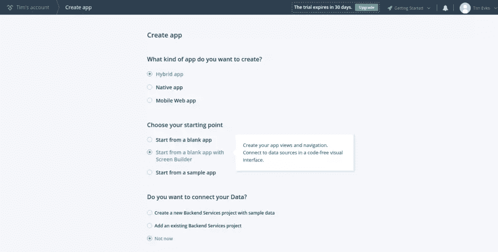

提交您的初始应用程序描述和模板设置后，您将被带到一个仪表板，在那里您可以开始自定义应用程序。

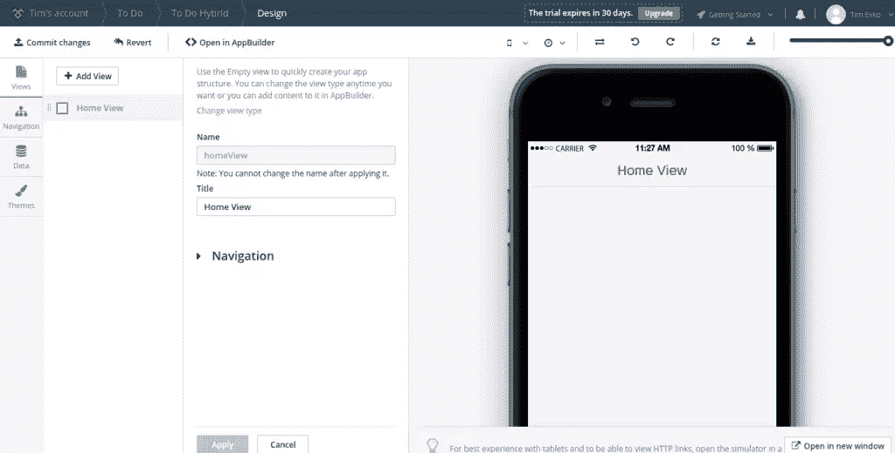

因为这是一个简单的待办事项列表应用程序，所以只需要一个视图。在 Telerik 平台中，视图是应用程序的一个独特部分。待办事项列表实际上只需要一个独特的部分，因为它只提供一个特性。将此视图命名为“任务列表”。

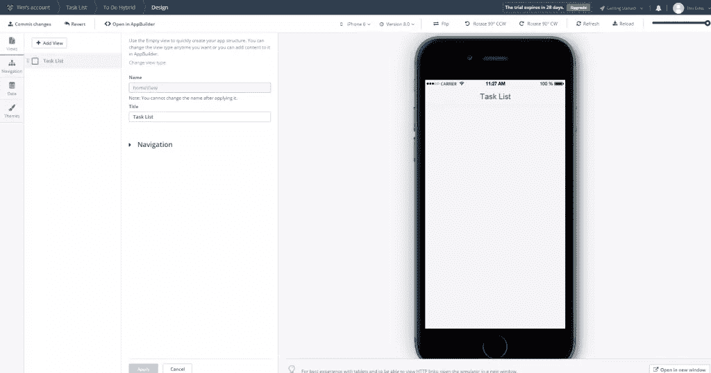

这也意味着你不需要任何导航，因为打开应用程序会直接带你到应用程序提供的唯一特性。

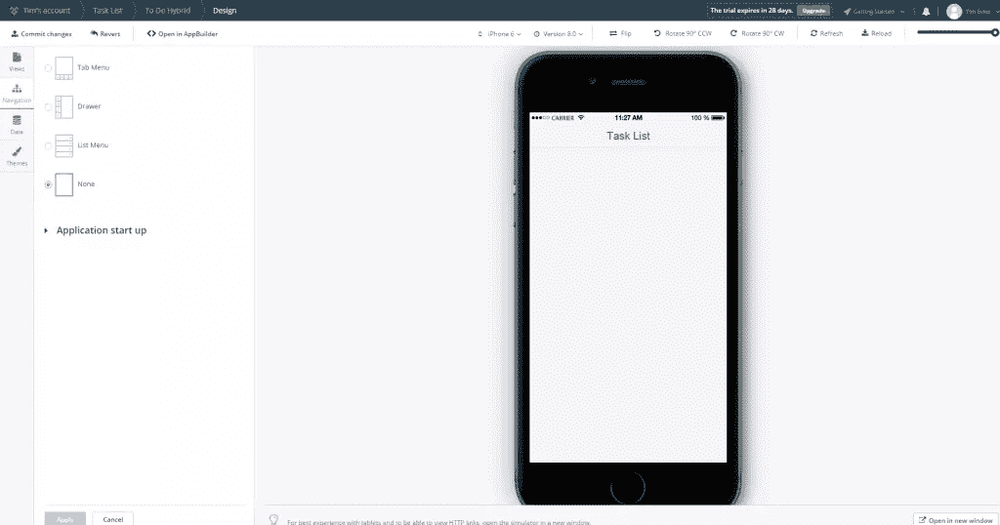

在调整了应用程序的视图和导航设置之后，我们可以跳过数据，直接进入仪表板的主题设置，因为应用程序不需要数据源。对于这个示例应用程序，我们将坚持平面设计主题。我们已经准备好进入应用程序开发的下一个阶段，但是首先，花点时间提交对 app builder 源代码控制的更改。

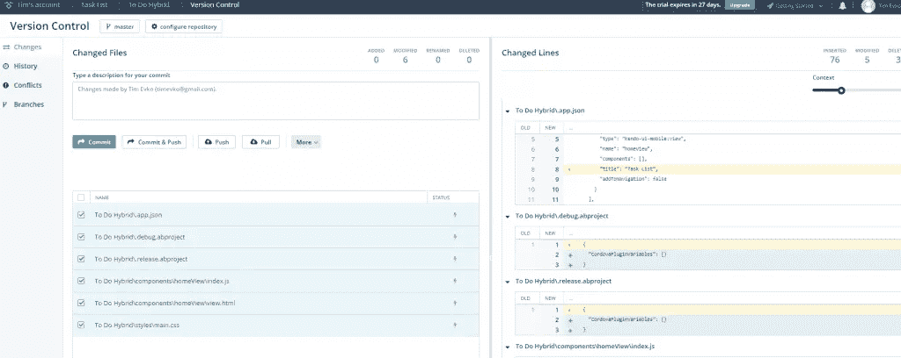

我们已经准备好编写一些代码，所以继续从屏幕构建器(在这里我们添加视图、导航和主题设置)移动到应用程序构建器，在这里您将编写应用程序的逻辑。

在下面的截图中，我启用了拆分视图，这样应用程序预览和我将要编辑的代码就可以同时看到了。

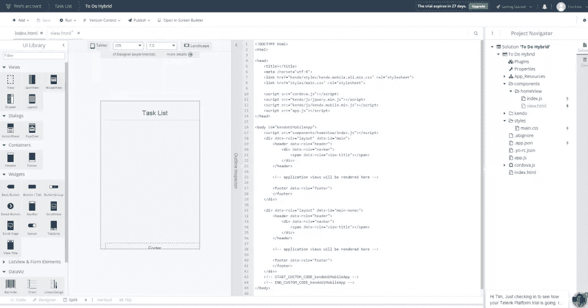

我们将在 view.html 文件中编写一些 HTML，开始构建待办事项列表框架。这个文件可以在导航器的*components/home view/view . html*中找到。添加初始 HTML 后，view.html 文件应该如下所示:

```
 <div data-role=“view” data-title=“Task List” data-layout=“main-nonav” data-model=“app.homeView” data-show=“app.homeView.onShow” data-after-show=“app.homeView.afterShow”>
	<!— START_CUSTOM_CODE_homeView —>
	<h1>
		Tasks
	</h1>
	<ul>

	</ul>
	<button>
		Add a task
	</button>

	<!— END_CUSTOM_CODE_homeView —>
</div> 
```

在这一阶段，当您预览应用程序时，应该会看到类似这样的内容:

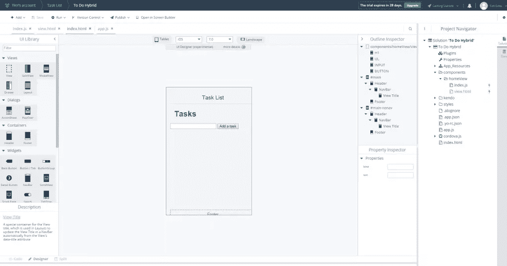

接下来，您需要向项目添加一些 JavaScript，以便用户可以添加、编辑和删除待办事项列表项。打开 index.js 文件，该文件与视图文件位于同一文件夹中。因为这是一个示例应用程序，所以您将使用 jQuery，它是平台中的一个依赖项。重要的是要记住，Telerik 平台使用剑道 UI 库，所以我们的代码将遵循它的一些约定。以下是 index.js 文件在进行任何调整之前的样子:

```
 'use strict';
app.homeView = kendo.observable({
  onShow: function() {}, 
  afterShow: function() {}
});
// START_CUSTOM_CODE_homeView 
// END_CUSTOM_CODE_homeView 
```

您将向 onShow 方法添加自定义代码，这意味着只要主视图变得可见，代码就会被触发。

在添加了允许我们添加、完成和删除待办事项列表项的 JavaScript 之后，index.js 应该是这样的:

```
 'use strict';
app.homeView = kendo.observable({
  onShow: function() {
    //adding a to do list item
    $('button').click(function() {
      var text = $('.toDoListInput').val();
      if (text === '') {
        return
      }
      else {
        $('.toDoListContainer').append( ' ' + text + 'delete item complete item' );
        $('.toDoListInput').val('');
      }
    });

    //checking off a to do list item
    $('.toDoListContainer').on('click', '.toDoListItem', function() {
      $(this).find('.delete').toggle();
      $(this).find('.complete').toggle();
    });

    $('.toDoListContainer').on('click', '.complete', function(e) {
      $(this).parents('.toDoListItem').addClass('completed');
      $(this).toggle();
      $(this).siblings('.delete').toggle();
      e.stopPropagation();
    });

    $('.toDoListContainer').on('click', '.delete', function() {
      $(this).parents('.toDoListItem').remove();
    });
  },
  afterShow: function() {}
}); 
```

有了 JavaScript，这个应用程序需要一些 CSS，这样它看起来就可以用了。打开样式文件夹中的 main.css 文件。通过点按工具栏中的“运行”按钮并选择 iPhone 模拟器来启用设备模拟器。这将允许您在 CSS 文件中看到对布局的更改。

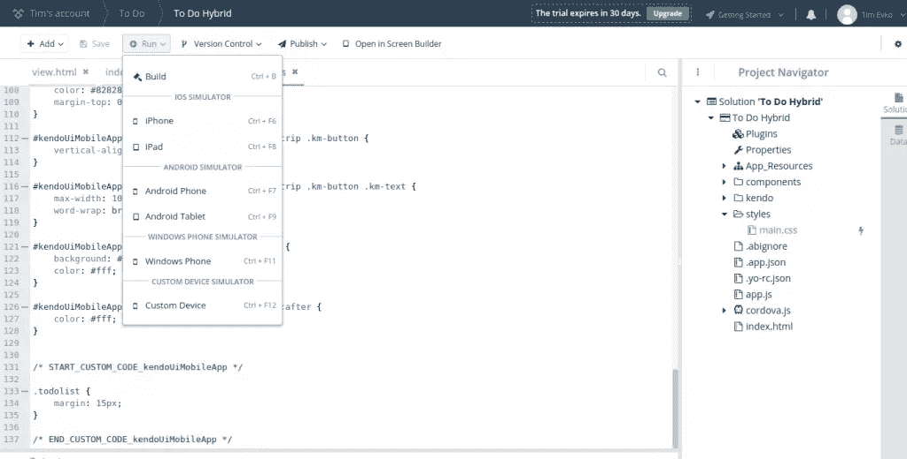

一旦添加了 CSS，您的应用程序就差不多完成了。我们剩下要做的就是测试！不要忘记运行设备模拟器，并在所有可用的设备上测试您的应用程序。在我们的例子中，我们正在用 jQuery 构建一个简单的待办事项列表应用程序，所以没有什么是不正常的。对于更复杂的应用程序，情况可能并非如此。

## 部署应用程序

现在应用程序已经构建好了，您可以在物理设备上试用它了！再次单击工具栏中的 Run 按钮，但这次选择 Build。您将看到编译到各种环境的选项。

我选择了 Android，因为我打算在 Android 设备上测试这个应用程序。

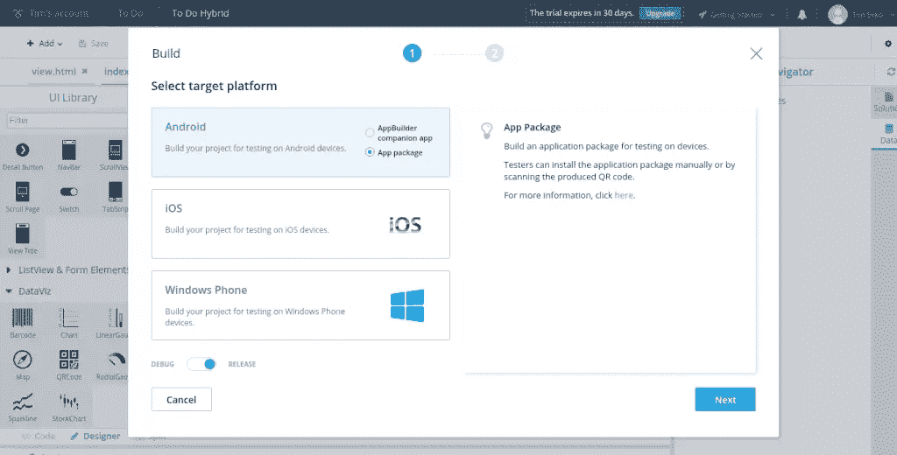

构建完成后，您将看到一个链接，您可以在移动设备的浏览器上访问该链接，安装过程将在此进行。

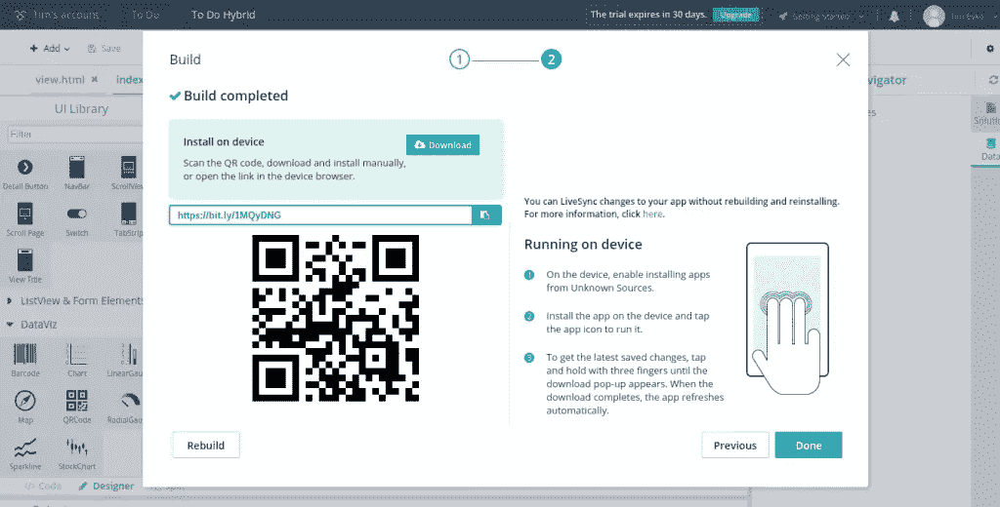

务必确保您的设备设置允许您安装未知来源的应用程序，否则您将无法安装测试应用程序。当你准备好发布你的应用供公众使用时，Telerik 将帮助你将应用提交到 iOS、Android 和 Windows Phone 应用商店。

成功！

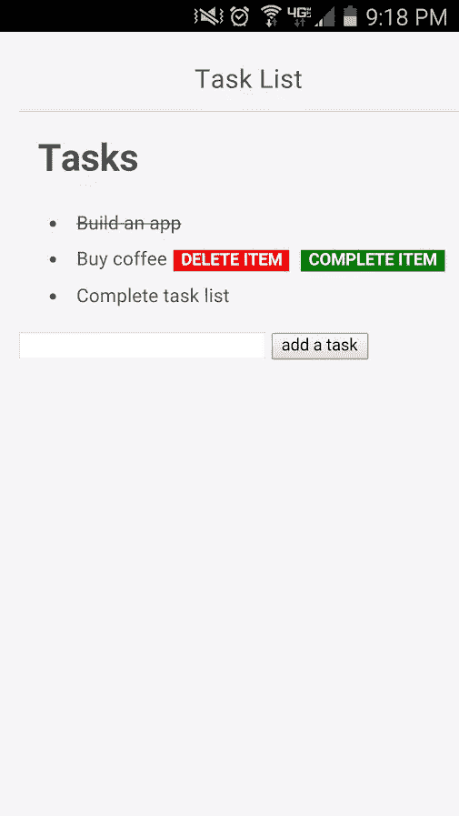

## 结论

我们只是简要介绍了使用 Telerik 平台可以做的一些事情。创建本地或混合移动应用程序比以往任何时候都更容易。Telerik Platform 不仅可以帮助您节省时间、金钱和一些麻烦，您还可以创建部署到各种应用程序商店的应用程序，而无需编写除 HTML、CSS 和 JavaScript 之外的任何内容。

## 分享这篇文章