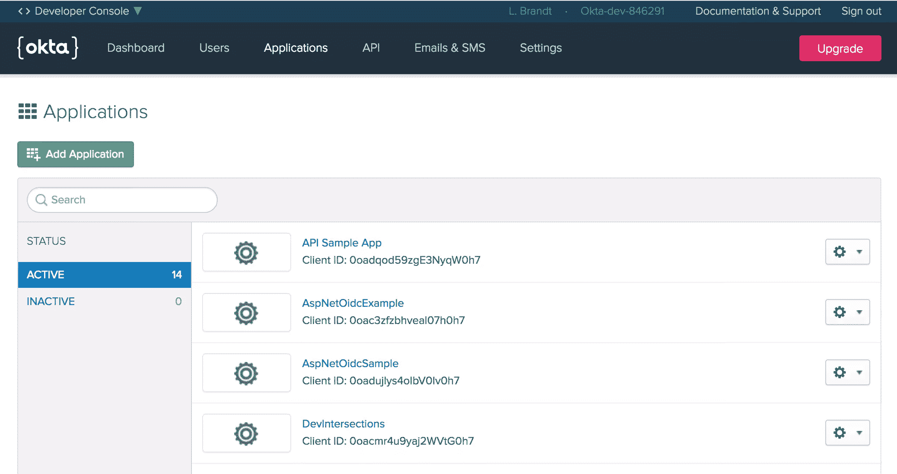
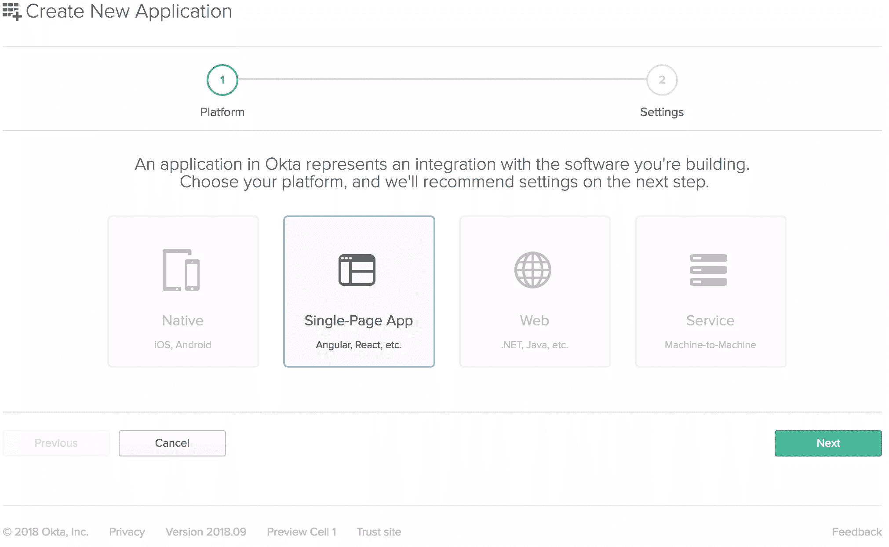
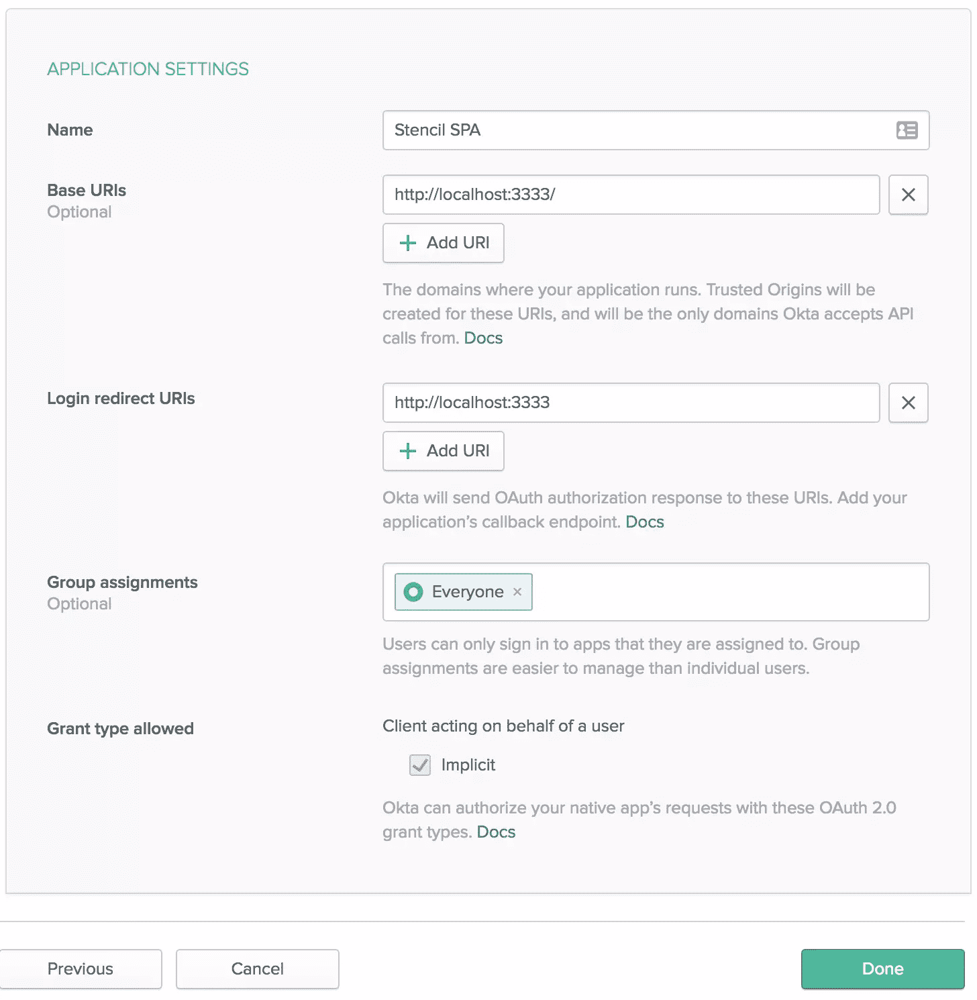
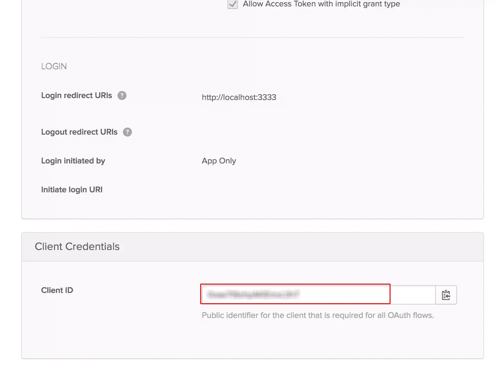
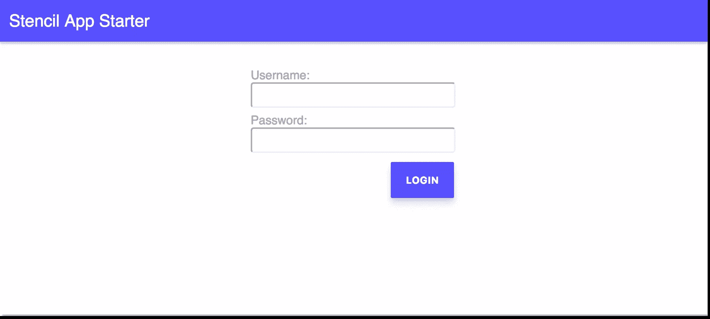

# 如何使用 Okta 和模板将 Auth 添加到 PWA 中

> 原文：<https://www.sitepoint.com/how-to-add-auth-to-your-pwa-with-okta-and-stencil/>

*这篇文章最初发表在[Okta 开发者博客](https://developer.okta.com/blog/2018/04/16/add-auth-to-your-pwa-with-okta-and-stencil)上。感谢您对使 SitePoint 成为可能的合作伙伴的支持。*

渐进式网络应用是网络开发领域的最新技术，它们的到来正好解决了一个日益严重的问题。当新特性发布时，许多公司都在努力使他们组织中孤立的开发团队保持最新。一些公司甚至试图决定是否值得同时开发网络应用*和移动应用*。不足为奇的是，这是大多数公司都希望避免的头痛问题。PWAs 可以为公司提供他们需要的移动应用程序的许多功能，而无需管理多个团队和代码库。

在快速连接时，A [PWA](https://developers.google.com/web/progressive-web-apps/) 表现出色，在离线或 Wi-Fi(速度不够快，不能称为 Wi-Fi，有时称为“Lie-Fi”)时仍然表现良好。它通过缓存和一个 JavaScript“服务工作者”来实现这一点，该服务工作者拦截服务器调用并尝试首先从缓存中提供数据，然后当服务器最终响应时，它会用来自服务器的可能“更新鲜”的数据替换缓存的数据。

最近， [Ionic](https://ionicframework.com/) 团队发布了一个名为 [Stencil](https://stenciljs.com/) 的新项目。Stencil 是一个编译器，可以生成符合标准的 web 组件。与大多数 JavaScript 框架不同，它没有向浏览器提供代码的“框架”。它简单地获取您编写的代码，并使用其编译器来创建普通组件。你也可以使用 Stencil 的编译器*和*你喜欢的框架。 [Stencil starter 项目](https://github.com/ionic-team/stencil-app-starter)是开始使用 Stencil 的最简单的方法，它产生了一个基础应用程序，该应用程序在 [Lighthouse](https://developers.google.com/web/tools/lighthouse/) 的渐进式 web 应用程序记分卡上获得了接近 100%的分数。

要开始使用 Stencil 构建 PWA，克隆 starter 应用程序并将其从 GitHub remote 中分离出来。

**警告** : Stencil 还没有发布到 1.0 版本(在撰写本文时)。所以请注意，如果你继续，你是在早期采用者的领域。如果发现 bug，[提交问题](https://github.com/ionic-team/stencil/issues)。

## 设置 Starter 应用程序

```
git clone https://github.com/ionic-team/stencil-starter.git first-stencil
cd first-stencil
git remote rm origin 
```

然后，安装新模板应用程序需要的所有依赖项。

```
npm install 
```

在`fsevents`前后，你可能会看到来自`node-pre-gyp`的一些警告。这里没什么可看的。这只是为了避开一个[讨厌的小 npm bug](https://github.com/strongloop/fsevents/issues/157) 。

接下来，将 Okta Auth SDK(通过 CDN)添加到`index.html`页面的底部，就在结束的`</body>`标签之前。

```
<script src="https://ok1static.oktacdn.com/assets/js/sdk/okta-auth-js/1.8.0/okta-auth-js.min.js" type="text/javascript"></script> 
```

虽然 Okta 的 Auth SDK 有一个 npm 包，但 Stencil 很难编译它。总的来说，如果你只是使用 CDN 来包含它的话，现在效果会更好。

如果你和我一样，接下来你要做的就是运行`npm start`并使用 Lighthouse 检查站点。如果你这样做，你会注意到分数是*种*低。特别是，它不注册服务人员，也不在离线时返回 200。这是因为它是一个*开发*版本，一般来说，你不希望服务人员在开发中拦截服务器调用并返回缓存数据。

为了确保准确描述你开箱即用的 PWA 类型，请确保使用`npm run build`运行*生产*构建。一旦你这么做了，你会看到一个`www`文件夹，在这个文件夹里，你会看到一个`sw.js`文件。那是你的服务人员！

## 设置您的 Okta 应用程序

如果你还没有这样做，[创建一个永久免费的开发者账户](https://developer.okta.com/signup/)。

注册完成后，点击顶部菜单中的**应用程序**。然后点击**添加应用**。



然后，您将被带到应用程序创建向导。选择**单页 App** ，点击底部的**下一个**。



在下一个屏幕上，您将看到单页应用程序模板提供的默认设置。将应用程序的名称改为更具描述性的名称，如“Stencil SPA”。此外，将基本 URIs 和登录重定向 URIs 设置更改为使用端口 3333，因为应用程序将在那里运行。其余的默认设置都没问题。



点击底部的**完成**。

从列表中选择您新创建的应用程序，点击 **General** 选项卡查看常规设置。


在底部，您会看到一个**客户端 ID** 设置(显然，您的设置不会模糊)。复制这个在你的模板应用中使用。您还需要 Okta 组织的 URL，可以在仪表板页面的右上角找到。它可能看起来像“https://dev-XXXXXX . oktapreview . com”。

## 添加身份验证组件

在`components`文件夹中，添加名为`app-auth`的新文件夹。这是您的登录页面组件将要去的地方。你可以随便叫它什么，我只是遵循这里的 starter 应用程序设置的命名约定。我强烈建议尽早决定命名约定，并坚持下去。

在新创建的`app-auth`文件夹中创建两个文件:`app-auth.css`和`app-auth.tsx`。首先创建`app-auth.tsx`文件的外壳。

```
import { Component } from '@stencil/core';

@Component({
  tag: 'app-auth',
  styleUrl: 'app-auth.css'
})
export class AppAuth {
  render() {
    return <div>Hello</div>;
  }
} 
```

如果你像我一样，你可能会想，“这是什么样的科学怪人框架？”

你会注意到像 Angular 这样的`AppAuth`类声明上的`@Component`装饰器，以及像 React 这样的底部的`render()`方法。对我来说，这就是模板的魅力。它吸取了两种流行框架的一些精华，并用它们来编译可重用的组件！

## 添加登录表单

接下来，您将把 JSX(没错，我说过了)添加到新组件中。将`render()`方法改为:

```
render() {
  return (
    <form class="app-auth">
      <div class="form-item">
        <label>
          Username:
          <input type="text" name="username" autocomplete="username" />
        </label>
      </div>
      <div class="form-item">
        <label>
          Password:
          <input
            type="password"
            name="password"
            autocomplete="current-password"
          />
        </label>
      </div>
      <div class="form-actions">
        <button type="button" onClick={() => this.login()}>
          Login
        </button>
      </div>
    </form>
  );
} 
```

这只是一个普通的 JSX 表单，但是登录按钮的`onClick`事件目前被绑定到一个不存在的函数上。

## 添加登录方法的依赖项

在创建该函数之前，您需要设置`OktaAuth` JavaScript 对象来调用 Okta API 进行认证。您将把对象添加到组件的状态中，所以在类声明的正下方，添加下面一行:

```
@State() authClient: any; 
```

您还必须导入`@State()`装饰器。这用于与组件内部状态相关的值。在第一个`import`语句中，将状态添加到解构列表中。

```
import { Component, State } from '@stencil/core' 
```

您还需要从表单本身获取用户名和密码值，所以像您刚刚创建的那样，在代码的`@State()`的正下方添加一个`@Element()`,如下所示:

```
@State() authClient: any;
@Element() host: HTMLElement; 
```

然后还将`@Element()`装饰器添加到导入中，因此它显示为:

```
import { Component, State, Element } from '@stencil/core'; 
```

`login()`函数需要的最后一件事是访问路由器，这样如果用户认证成功，您就可以将用户重定向到他们的个人资料页面。您将需要一个类属性，所以将其添加到`@Element`的正下方。

```
@State() authClient: any;
@Element() host: HTMLElement;
@Prop() history: RouterHistory; 
```

要导入它，将`@Prop()`装饰器添加到主导入，然后从核心导入语句正下方的`@stencil/router`导入`RouterHistory`。`@Prop`装饰器用于定义可以传递给组件的属性。在这种情况下，它不是传入的值，但是如果需要的话，它可以是。您最后的导入部分应该是:

```
import { Component, Prop, State, Element, Listen } from '@stencil/core';
import { RouterHistory } from '@stencil/router'; 
```

最后，为了使用从 CDN 引入的`OktaAuth` JavaScript 库，在 import 语句的正下方添加一个声明。

```
declare const OktaAuth: any; 
```

## 添加登录方法

现在，您已经包括了获得登录功能所需的一切，以便向您的 Okta 组织认证用户。首先，在`AppAuth`类的构造函数中设置`OktaAuth`对象。在`RouterHistory`对象属性的正下方，添加:

```
constructor() {
  this.authClient = new OktaAuth({
    clientId: '{yourClientId}',
    url: 'https://{yourOktaDomain}.com',
    issuer: 'default'
  });
} 
```

您可以从 Okta 应用程序常规设置页面获得您的客户端 ID。



您还需要您的 Okta org URL，位于 Okta 仪表板页面的右上角。


现在已经为`login()`函数做好了一切准备，所以接下来您将创建它。在`render()`方法的正上方，添加一个`login()`函数。

```
login() {
  let inputs = this.host.querySelectorAll('input');
  let user = {
    username: inputs[0].value,
    password: inputs[1].value
  };

  return this.authClient.signIn(user)
    .then(res => {
      if (res.status === 'SUCCESS') {
        return this.authClient.token
          .getWithoutPrompt({
            responseType: 'id_token',
            scopes: ['openid', 'profile', 'email'],
            sessionToken: res.sessionToken,
            redirectUri: 'http://localhost:3333'
          })
          .then(token => {
            localStorage.setItem(
              'okta_id_token',
              JSON.stringify(token)
            );
            this.history.push('/profile', {});
          });
      } else {
        throw `Unable to handle ${res.status} status code`;
      }
    })
    .fail(function(err) {
      console.error(err);
    });
} 
```

因为确实是组件的“核心”,所以我将带您了解这里发生了什么。

首先，获取组件的`form`元素中的所有输入。然后，使用各自输入的用户名和密码创建一个用户对象。

接下来，`authClient`对象被用来调用创建的用户对象的`signIn()`方法。它返回一个承诺，因此您通过获取响应来处理`then`条件，并检查响应的状态是否为 200。如果是，调用`authClient.token`的`getWithoutPrompt()`方法，该方法也返回一个承诺。它需要一个设置为`id_token`的`responseType`属性，因为那是你想从 Okta 得到的。您还请求了三个作用域，它们将为您提供与新通过身份验证的用户相关的 openid、概要文件和电子邮件数据。该方法需要从`signIn()`方法的响应中返回的会话令牌。最后，您已经告诉函数回调`redirectUri`，当您创建应用程序时，它在 Okta 中被设置为可信重定向源。

在这个承诺的`then`条件中，您获取接收到的 id 令牌，并在本地存储中将其设置为`okta_id_token`。如果一切正常，用户将被重定向到个人资料页面。

如果响应的状态不是 200，它只会抛出一个错误，指出它不能处理任何其他状态。最后，`signIn()`方法调用的失败条件只是将任何错误记录到控制台。

## 简化登录

虽然这样做是可行的，但是有两件事情可以让这个组件变得更好一些:能够点击 enter 来登录，而不是点击 log in 按钮；当用户已经登录时，如果用户试图进入登录页面，甚至不显示登录表单。

为了实现这一点，如果用户已经登录，添加一个方法将用户直接带到配置文件页面。像 React 组件一样，模板组件也有生命周期方法。代替 React 的`componentWillMount()`，Stencil 有一个`componentWillLoad()`方法，所以这就是你将在这里使用的。

```
componentWillLoad() {
  let idToken = localStorage.getItem('okta_id_token');
  if (idToken) {
    this.history.push('/profile', {});
  }
} 
```

简单地说，您所做的就是从本地存储中读取令牌。如果存在，您假设他们已经登录并重定向到个人资料页面。

使这个登录表单更容易使用的最后一件事是添加使用 enter 键提交表单的功能。Stencil 有一些内置的按键监听器。在这种情况下，请使用“keydown.enter”侦听器。在导入`Component`的顶层导入语句中导入`@Listen()`装饰器。

```
import { Component, Prop, State, Element, Listen } from '@stencil/core'; 
```

然后在`componentWillLoad()`函数下面添加一个“keydown.enter”事件的处理程序。

```
@Listen('keydown.enter')
handleEnter() {
  this.login();
} 
```

## 更新个人资料页面

现在您已经有了一个漂亮的登录页面，请更新配置文件页面，以便在用户登录后显示他们的声明。

首先，您需要一个类型来存放用户的声明。所以在`app-profile`文件夹中创建一个名为`AppUser.tsx`的新文件。内容很简单，但是很长。我只是查看了存储在`localStorage`中的令牌中的所有声明，并创建了一个与之匹配的接口。所以`AppUser.tsx`文件如下:

```
interface AppUser {
  sub: string;
  name: string;
  locale: string;
  email: string;
  ver: number;
  iss: string;
  aud: string;
  iat: number;
  exp: number;
  jti: string;
  amr: string[];
  idp: string;
  nonce: string;
  nickname: string;
  preferred_username: string;
  given_name: string;
  family_name: string;
  zoneinfo: string;
  updated_at: number;
  email_verified: boolean;
  auth_time: number;
} 
```

一旦您为您的概要文件的用户对象声明了一个类型，更新`app-profile.tsx`文件。

顶部的导入应该类似于:

```
import { Component, Prop, State } from '@stencil/core';
import { RouterHistory } from '@stencil/router'; 
```

移除`match`的`@Prop()`线，替换为:

```
@Prop() history: RouterHistory;
@State() user: AppUser;
@Prop({ context: 'isServer' }) private isServer: boolean; 
```

`isServer`属性是一个特殊的属性。因为 Stencil 支持预渲染，并且在预渲染过程中`localStorage`可能不可用，所以您需要将`localStorage`调用包装在`if(!isServer){}`中，以确保它将为生产而构建。这不应该阻止它工作，这只是构建过程的一个变通办法。

对于`componentWillLoad()`方法，只需从本地存储器的‘okta _ id _ token’中读入用户信息:

```
componentWillLoad() {
  if (!this.isServer) {
    let token = JSON.parse(localStorage.getItem('okta_id_token'));
    if (token) {
      this.user = token.claims;
    } else {
      this.history.push('/login', {});
    }
  }
} 
```

这也将是您的个人资料页面的保护程序，它只是检查令牌是否存在。如果是这样，它从其中加载声明。如果没有，它会重定向到登录页面。

对于`render()`方法，将其更改为在列表中显示声明。

```
render() {
  if (this.user) {
  let keys = Object.keys(this.user);
  return <div class="app-profile">
      <h2>User Claims</h2>
      <ul>
        {keys.map(key => <li><span>{key}</span>: {this.user[key]}</li>)}
      </ul>
      <button onClick={this.logout}>
        Logout
      </button>
    </div>;
  }
} 
```

唯一剩下的就是添加`logout()`方法。这将从本地存储中删除令牌并重新加载页面，这将迫使`componentWillLoad()`将用户重定向到登录页面。

```
logout() {
  if (!this.isServer) {
    localStorage.removeItem('okta_id_token');
    location.reload();
  }
} 
```

## 设置登录路径

剩下的唯一一件事就是将登录组件的路径添加到应用程序中，以便用户可以到达那里。

在`components/my-app/my-app.tsx`文件中，将路线添加到`stencil-router`组件中，这样最终的部分如下所示:

```
<stencil-router>
  <stencil-route url="/" component="app-home" exact={true} />
  <stencil-route url="/profile" component="app-profile" />
  <stencil-route url="/login" component="app-auth" />
</stencil-router> 
```

您还需要更新主页上链接的路径。在`components/app-home/app-home.tsx`中，更新`stencil-route-link`元素的 url，不再传入 url 参数。

```
<stencil-route-link url="/profile">
  <button>
    Profile page
  </button>
</stencil-route-link> 
```

就是这样！现在，您应该能够运行应用程序，点击个人资料页面，重定向到登录页面，并在登录后重定向回个人资料页面。认证后，个人资料页面应该会显示您的所有声明。

恭喜，您现在拥有了一个带身份验证的 PWA，准备好征服世界了！

## 添加样式

作为额外的奖励，您可能希望为登录表单和个人资料页面添加一些样式。下面是我在`app-auth.css`中登录页面的样式表:

```
.app-auth {
  width: 30%;
  margin: 2rem auto;
}
.app-auth .form-item {
  padding: .25rem;
}
.app-auth label {
  width: 100%;
  font-size: 1rem;
  color: #999;
}

.app-auth label input {
  width: 97%;
  border-radius: .25rem;
  font-size: 1.5rem;
}

.app-auth .form-actions {
  text-align: right;
} 
```

最后，在`app-profile.css`中只是一些简单的样式来加粗每个项目的标签。

```
.app-profile {
  padding: 10px;
}

.app-profile ul li span {
  font-weight: bold;
} 
```

现在，当你运行应用程序，你会看到一个很好的风格的应用程序，准备上网！



## 了解更多信息

要了解更多关于 PWAs 的信息，请查看 Okta 开发者博客上 Matt Raible 的[PWAs 终极指南](https://developer.okta.com/blog/2017/07/20/the-ultimate-guide-to-progressive-web-applications)。

如果你想了解更多关于 Ionic apps 的信息，可以看看 Matt 关于[构建 Ionic apps](https://developer.okta.com/blog/2017/08/22/build-an-ionic-app-with-user-authentication) 的博文。

你可以从 Brandon Parise 的文章中了解如何用 VueJS 构建一个基本的 CRUD 应用程序。

最后，在这里您可以看到[如何使用 Node 和 React](https://developer.okta.com/blog/2018/02/06/build-user-registration-with-node-react-and-okta) 设置用户注册！

一如既往，如果您有任何问题，可以在下面评论或在 Twitter 上联系我 [@leebrandt](https://twitter.com/leebrandt) ，不要忘记关注 [@OktaDev](https://twitter.com/oktadev) 获取我们社区的精彩内容+所有关于 Okta 开发者平台的新闻！

## 分享这篇文章