# 如何将图像添加到您的 Pebble Watchfaces 中

> 原文：<https://www.sitepoint.com/how-to-add-images-into-your-pebble-watchfaces/>

虽然我们可以在 Pebble watchfaces 中使用线条和形状等矢量图形，但有时需要图像来提供更高层次的细节。图像可以提供一个很好的背景，不需要几个小时的精确编码，而且很容易更新。在本文中，我们将探讨一些简单的方法来准备图像，并将它们包含到适用于所有平台的 Pebble 应用程序中——经典的 Pebble 手表、Pebble Time 手表和 Pebble Time Round 手表。特别是，我们将制作一个横跨表盘宽度和高度的背景图像。

## 你需要什么

为了逐步完成本指南，您需要以下内容:

*   **cloud Pebble–**如果您正在为所有三个平台进行构建，您需要在这里登录并在 Pebble Time Round 上测试您的更改。
*   **Pebble 应用程序开发的一般知识—**如果你是 Pebble 开发的新手，请阅读我的初学者教程《用 JavaScript 开发 [Pebble 手表》](https://www.sitepoint.com/pebble-watch-development-javascript/)开始学习。
*   **至少 180×180 的图像–**你需要将它裁剪为 180×180 和 144×168。
*   **Photoshop–**这将需要为 Pebble Time Round 设置正确调色板中的图像。然而，如果您不太关心 Pebble Time Round，您可以使用一些其他技术来准备您的图像，我将在这里介绍这些技术。*(你也可以使用 GIMP 或者 ImageMagick，但是我不会在这篇文章中讨论这些。)*

## 代码

所有的代码都可以在 GitHub 上找到。这是我从为极客音乐家[梅里琥珀](http://www.meriamber.com) ( [可以安装在你的手表上](http://apps.getpebble.com/en_US/application/550511950c9d5835d500006d))打造的手表界面中清理出来的代码。我已经删除了所有的时间保持和其他组件，专注于图像切换如何工作。

## 准备我们的图像

在这个多种 Pebble 设备类型并存的时代，我们希望支持多种平台。谈到我们的图像，我们关心三种潜在的设备类型:

*   配有矩形黑白显示屏的经典 Pebble 和 Pebble Steel 手表–该图像尺寸应为`144 x 168`。
*   配有矩形彩色显示屏的 Pebble Time 手表–该图像尺寸应为`144 x 168`。
*   配有圆形彩色显示屏的 Pebble Time Round 手表–该图像尺寸应为`180 x 180`。

## 为 Aplite 准备图像

照片图像只有黑白，所以为了显示它们，我们需要转换图像，使它们看起来仍然可以从原始图像中辨认出来，尽管严重缺乏色彩。

### 在线图像转换器

一个非常快速简单的方法是使用这个[在线图像转换器](http://www.watchface-generator.de/converter/)。它适用于细晶岩和玄武岩图像。

首先，上传你的文件。然后对于 Aplite，选择“黑白”的颜色模式来删除图像中的所有颜色。这可能是你得到一个好的结果所需要的，但是有些图像用不同的抖动选项效果会更好。尝试改变抖动选项，看看什么最适合你的图像-这可能是不同的每种风格的图像你使用！

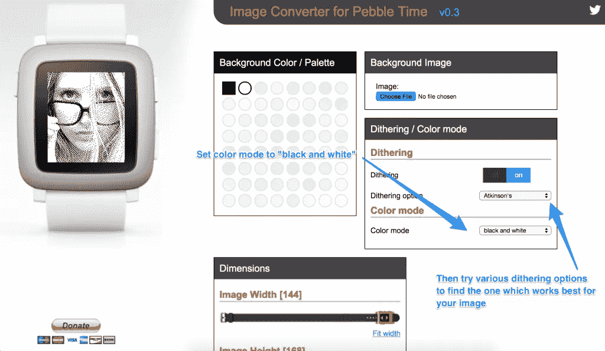

您可以向下滚动，更改亮度、对比度等。一旦您对图像的外观感到满意，请点按页面底部的图像，将其下载到您的电脑上以备使用。


### 超抖动

Mac OSX 用户的另一个选择是名为 [HyperDither](http://2002-2010.tinrocket.com/software/hyperdither/index.html) 的免费应用。它可以非常有效地将彩色图像转换成单色图像。打开后，它会等待你的图像:

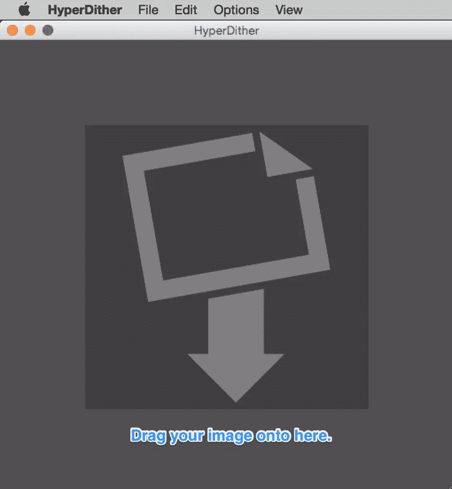

将图像拖到应用程序中:

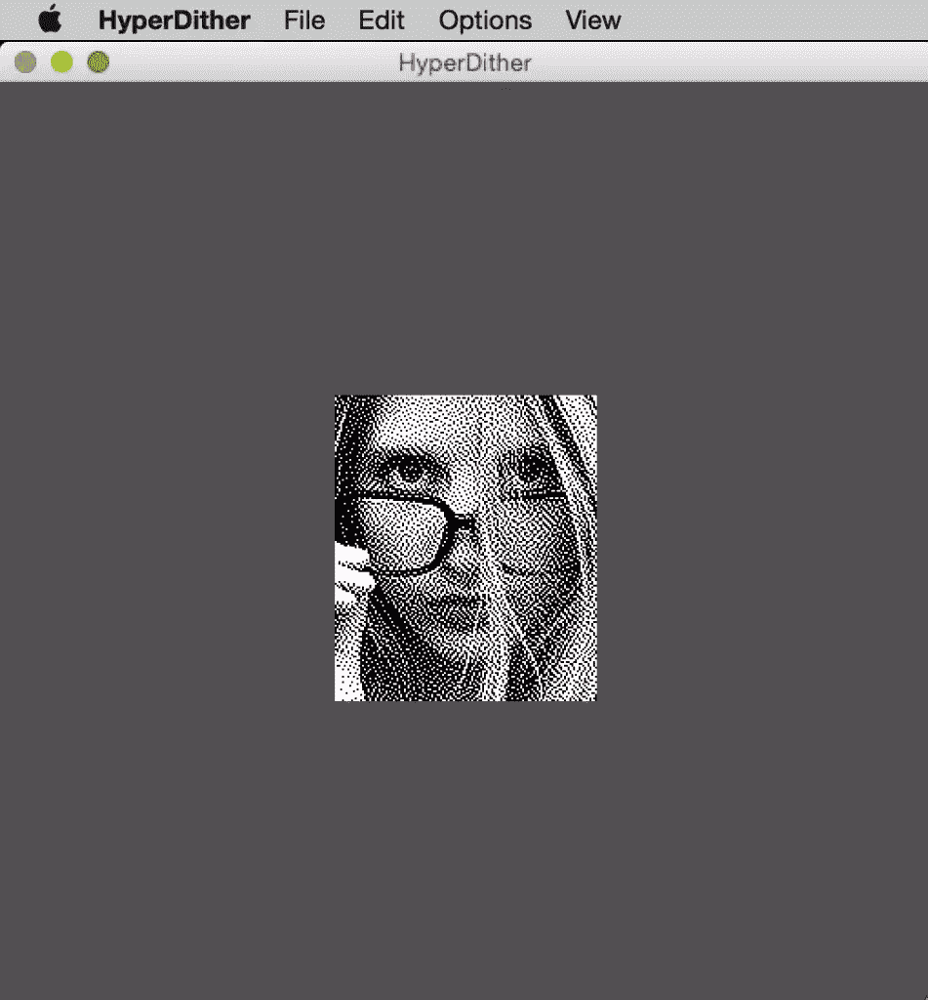

然后，您可以调整设置，例如“对比度”,如下所示:

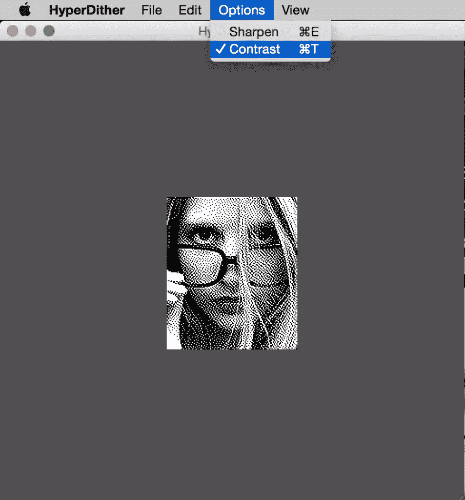

或者锐化它:

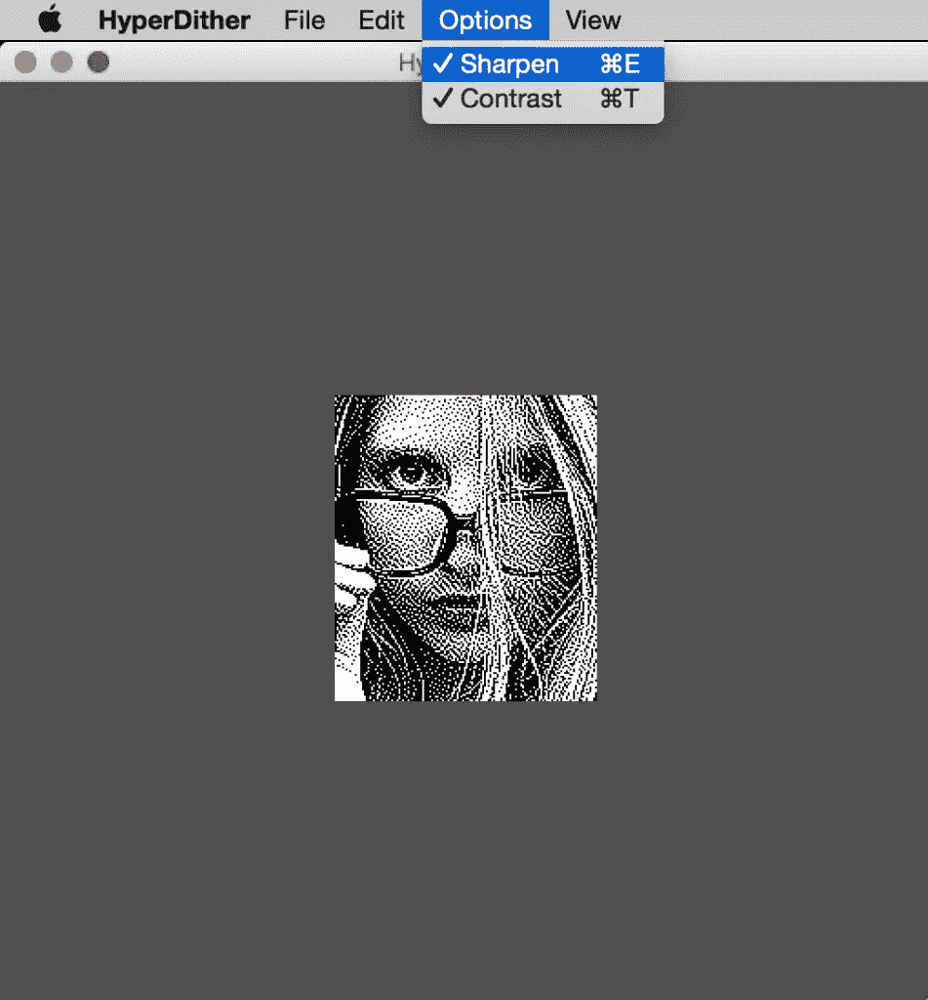

### 用计算机修改（图片或照片）

如果你是 Photoshop 的拥有者，你也可以在 Photoshop 中这样做。很可能有很多技术可以解决这个问题，但最基本的是:

进入*图像>模式>索引颜色…* 。

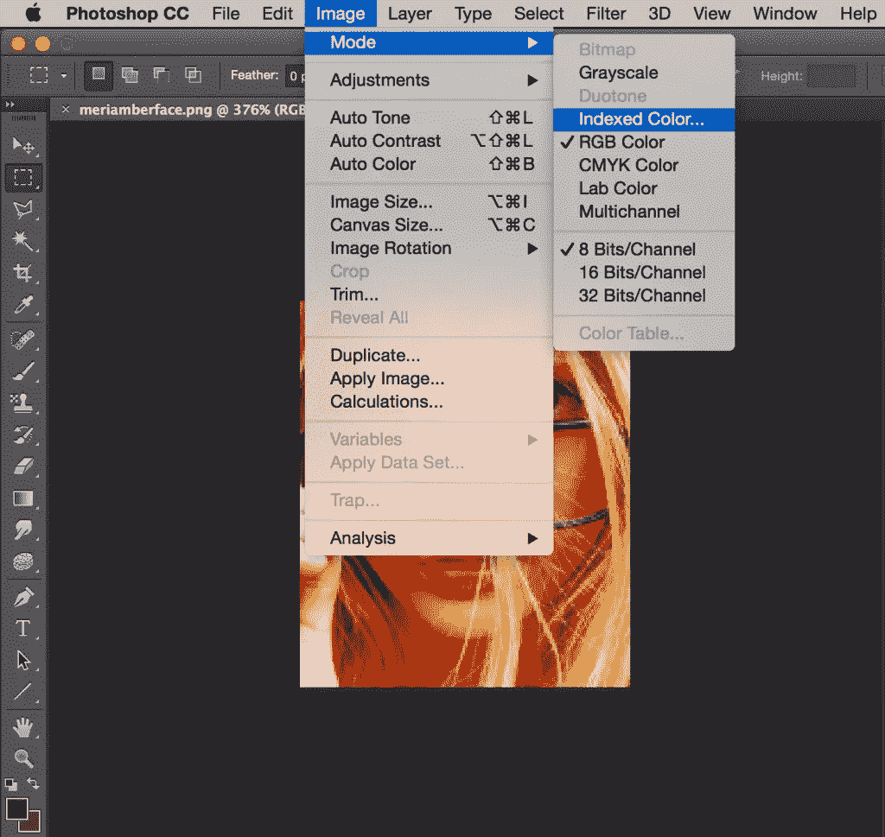

为你的调色板选择一个“局部”或“统一”选项，将颜色数量设置为 2，并调整扩散选项，看看什么最适合你的图像:

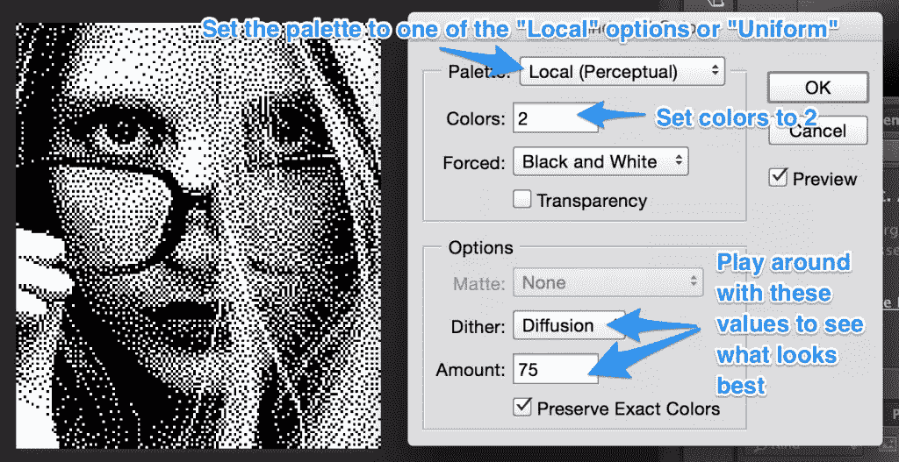

## 为玄武岩和白垩准备图像

玄武岩和白垩允许 64 种特定的颜色。超抖动不起作用，因为它只做黑白抖动。所以我们只剩下另外两个选择。

### 在线图像转换器

这个目前只适用于玄武岩，因为它似乎还不能导出正方形图像。

回到[在线图像转换器](http://www.watchface-generator.de/converter/)，放入你的图像。这一次，选择“64 色”作为你的颜色模式，然后再用抖动选项等等。

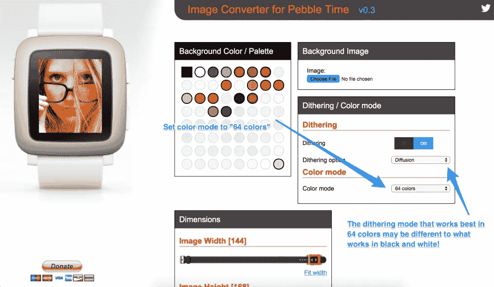

### 用计算机修改（图片或照片）

Photoshop 需要知道你想在图像中使用的特定 64 种颜色。要下载这些，请前往 Pebble“创建多彩应用程序”页面的[调色板](http://developer.getpebble.com/guides/pebble-apps/display-and-animations/intro-to-colors/#color-palettes)部分，并下载 Photoshop `.act`文件:

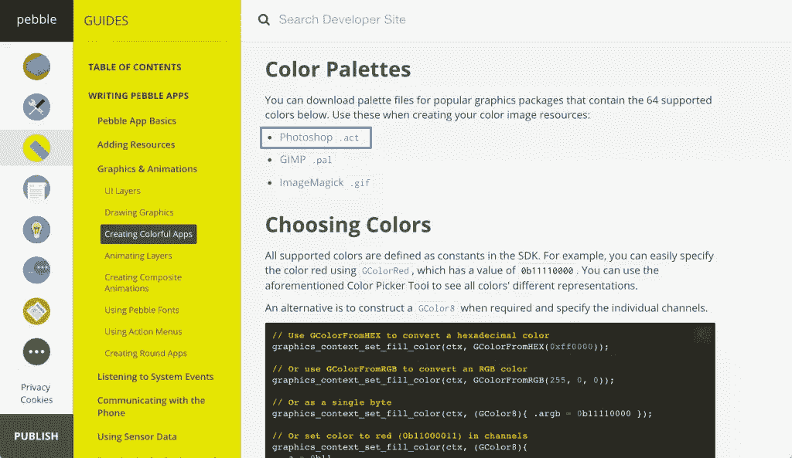

然后，返回到*图像>模式>索引颜色…* ，但是从调色板中选择“自定义”。会出现一个要求“颜色表”的对话框，点击该屏幕上的“加载”并找到您的`.act`文件:


64 色调色板看起来应该是这样的:

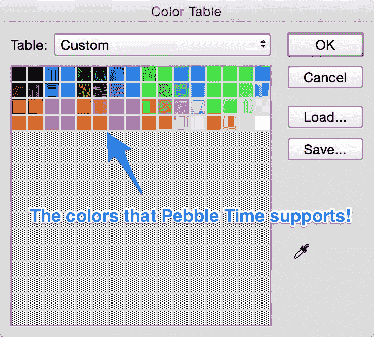

单击“确定”,然后您将返回到可以调整设置的屏幕:

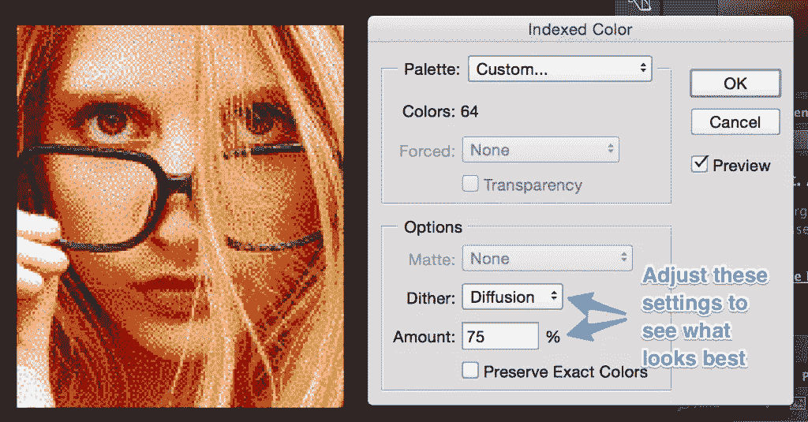

现在，您应该能够为我们的平台设置所有三种类型的图像。是时候想办法把这些放进我们的应用程序了。

## 检测平台

我们的背景图像的每个版本都将动态地定位在表盘的中心，并将适合表盘的大小，因此我们不需要为此进行任何平台检测。我们甚至不需要在代码中提到图像会在不同的设备上改变，这将在我们的图像资源中处理。总的来说，我们在代码中保留了尽可能多的图像切换功能——这确保了我们的应用程序可维护，并且易于与未来的 Pebble 平台兼容。

你可能会像我最初一样，通过`#if defined(PBL_BW)`和`#elif defined(PBL_COLOR)`样式语句来切换图像。**别这样！**在 CloudPebble 中上传图片时，最好使用您可以设置的平台特定资源。

## 在 CloudPebble 中上传您的图像

如果你是在 Pebble 应用程序中使用图像的新手，那么到目前为止，CloudPebble 的“资源”部分可能还有点神秘。这就是我们要添加形象的地方。首先，单击“资源”旁边的“添加新项”按钮:

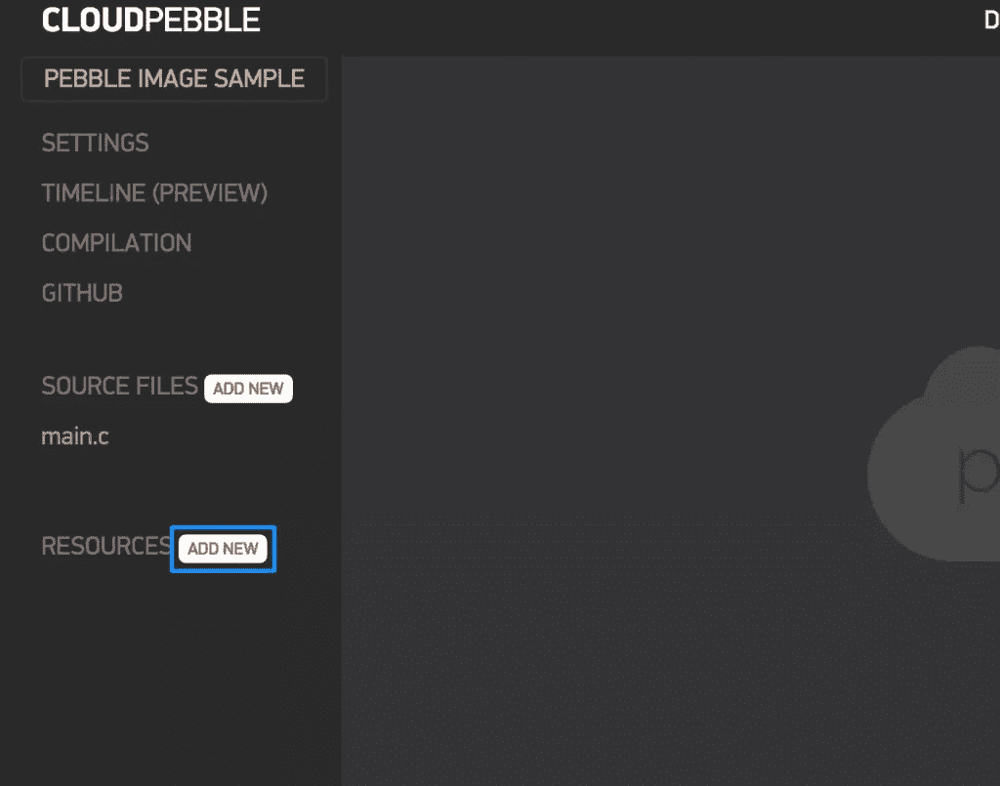

在出现的屏幕中，在“标识符”栏中输入图像的名称。在我们的代码中，它被命名为“MERI”，因为我们的样本图像是梅里琥珀。如果你有别的东西，相应地命名它并记住这个名字，因为你将在你的代码中使用它来引用这个图像。然后，跳过“文件名”字段，因为一旦你上传了你的图片，这个字段会自动填写。在“上传新文件”部分上传您的文件:


如果您点击“保存”，图像资源将被上传，您将看到一个更新的界面，预览您的图像在每个可用的平台。如你所见，我们目前在每个平台上都显示黑白图像。接下来，我们将添加其他特定于平台的映像。

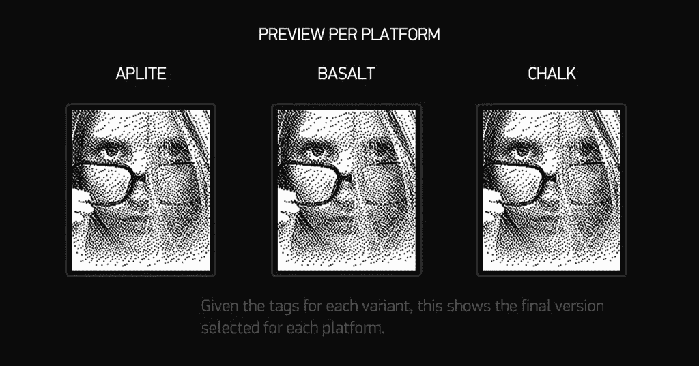

如果你滚动到资源屏幕的底部，你会发现一个“上传新文件”部分。把你的矩形彩色图像上传到那个里面。加载时，您会看到界面因冲突而变红。不要害怕。这只是意味着我们需要添加一些标签，以便它知道每个图像是为不同的平台。

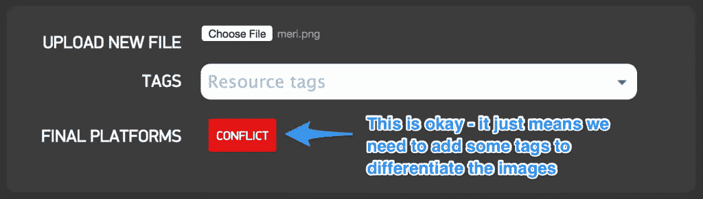

回到我们的黑白图像，并添加标签“单色”。这告诉我们的 Pebble 应用程序，该图像用于黑白显示(例如我们的经典 Pebble 和 Pebble Steel)。

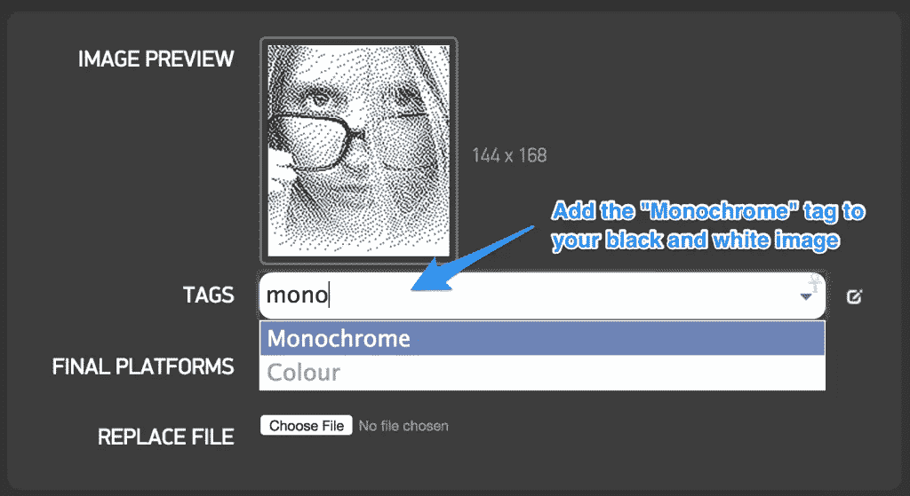

一旦有了这个标签，您应该会看到“Aplite”平台被自动检测到，危险的红色冲突消息已经消失。

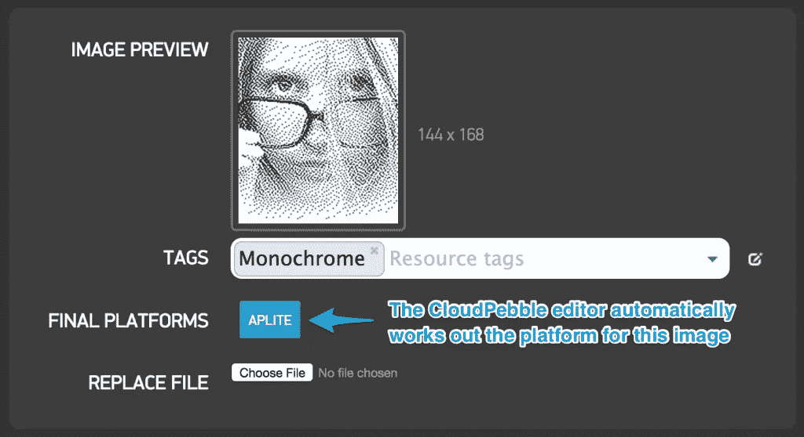

下图也将看到它自己的平台已经被自动分配。CloudPebble 已经将剩下的两个平台分配给我们正在上传的彩色图像。单击“保存”最初保存我们的新彩色图像。我们还不想给这个图像加标签，因为 CloudPebble 希望每次保存时每个平台都有一个定义好的图像选项。一旦我们在那里有了我们的最终图像，我们将标记这个图像——所以每次我们保存资源时，所有的平台都被覆盖。

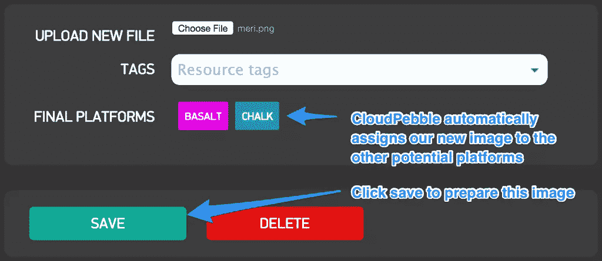

保存后，您现在应该可以看到细晶岩的黑白图像以及玄武岩和白垩的彩色图像。

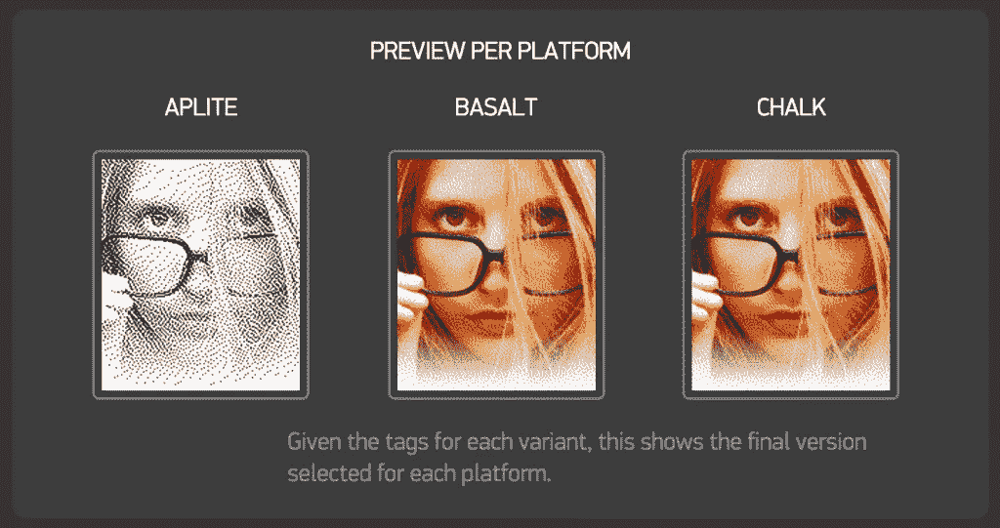

向下滚动，最后一次点击“上传新文件”选项。选择你的正方形彩色图像。它将再次出现冲突，因为我们还没有告诉它要关注的平台。键入“Round”作为该图像的标签，它会自动将该图像的平台设置为 Chalk-Pebble Time Round 平台。

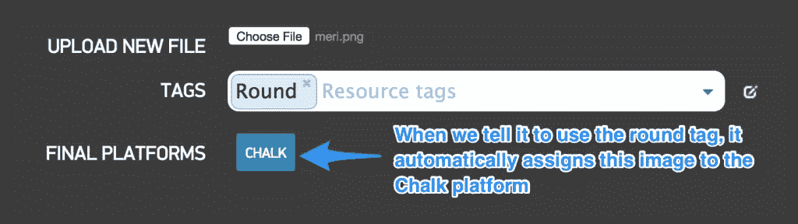

我们的矩形彩色图像被自动赋予玄武岩平台，因为它是唯一剩下的平台。

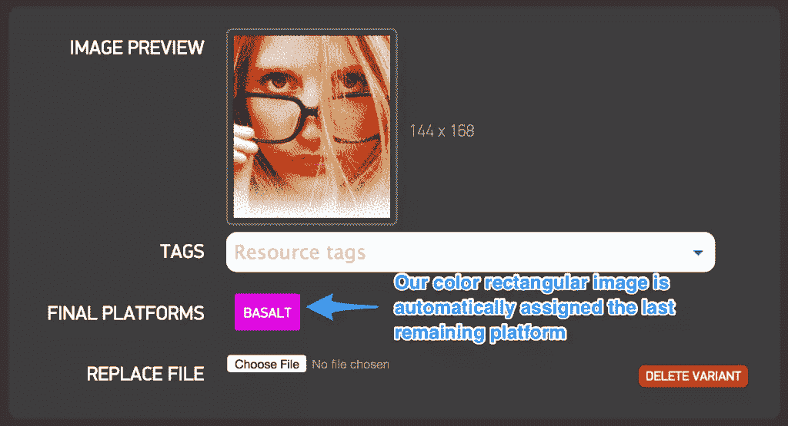

给这张图片添加“颜色”和“矩形”的标签。这确保了在未来的平台上也能正确使用该映像。他们将知道该图像用于这些目的，并确保我们能够控制该图像的使用时间。

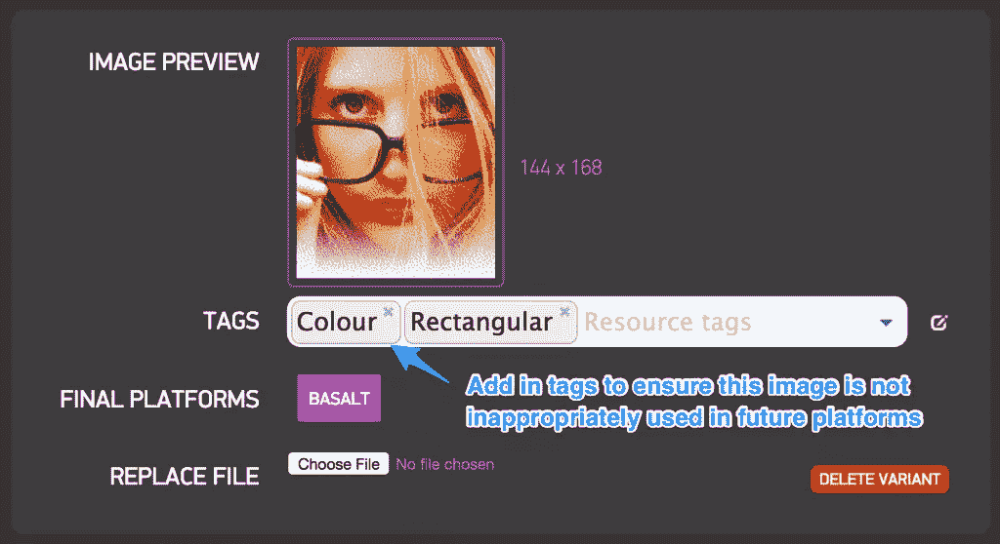

单击“保存”保存我们新的正方形彩色图像和我们包含的新标签。保存后，我们应该会看到图像的每个版本都显示在正确的平台预览中:

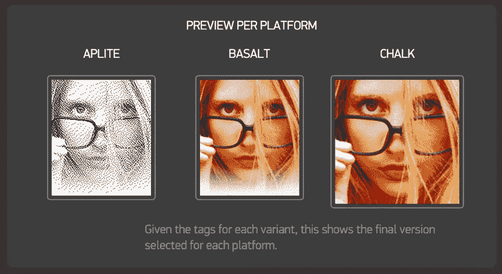

我们的资源现在完全可以在应用程序中使用了！

## 我们的准则解释说

我们在这个例子中的所有代码都在`main.c`中。请记住，我已经删除了所有的时间保持和其他组件，以专注于图像切换如何工作。那段 C 代码看起来像这样:

```
#include "pebble.h"

static BitmapLayer *meri_image_layer;
static GBitmap *meri_image;

Window *window;

static void window_load(Window *window) {
  Layer *window_layer = window_get_root_layer(window);
  GRect bounds = layer_get_bounds(window_layer);

  meri_image_layer = bitmap_layer_create(bounds);
  meri_image = gbitmap_create_with_resource(RESOURCE_ID_MERI);

  bitmap_layer_set_compositing_mode(meri_image_layer, GCompOpAssign);
  bitmap_layer_set_bitmap(meri_image_layer, meri_image);
  bitmap_layer_set_alignment(meri_image_layer, GAlignCenter);
  layer_add_child(window_layer, bitmap_layer_get_layer(meri_image_layer));
}

static void window_unload(Window *window) {
  gbitmap_destroy(meri_image);
  bitmap_layer_destroy(meri_image_layer);
}

static void init(void) {
  window = window_create();
  window_set_window_handlers(window, (WindowHandlers) {
    .load = window_load,
    .unload = window_unload,
  });

  const bool animated = true;
  window_stack_push(window, animated);
}

static void deinit(void) {
  window_destroy(window);
}

int main(void) {
  init();
  app_event_loop();
  deinit();
}
```

## 包括我们的形象

Pebble 应用程序中的图像需要两样东西，一个`BitmapLayer`和一个`GBitmap`。`BitMapLayer`是我们放置图像的应用程序层。图像本身存储在`GBitmap`中。

```
static BitmapLayer *meri_image_layer;
static GBitmap *meri_image;
```

在`window_load()`中，我们设置了`BitmapLayer`的大小。因为我们将在应用程序中使用这个作为背景，所以我们将大小设置为`bounds`——我们的 Pebble 设备的宽度和高度。

```
meri_image_layer = bitmap_layer_create(bounds);
```

如果你想把你的图像用于没有覆盖整个屏幕的东西，你可以做`bitmap_layer_create(GRect(0, 0, 64, 64))`，这里`{0,0}`是坐标，图像是 64×64 像素大。

接下来，我们将之前上传的图像资源分配给`meri_image` `GBitmap`。我们在屏幕上将图像资源称为“MERI”。翻译过来就是`RESOURCE_ID_MERI`。如果您使用自己的不同名称的图像，只需确保在图像前添加`RESOURCE_ID_`:

```
meri_image = gbitmap_create_with_resource(RESOURCE_ID_MERI);
```

然后我们在`meri_image_layer`上设置渲染设置。第一个是合成模式:

```
bitmap_layer_set_compositing_mode(meri_image_layer, GCompOpAssign);
```

我们使用了`GCompOpAssign`,因为它直接将图像放到图层上，而不用担心不透明度或任何调整。这是完美的背景图片。然而，对于图像，我们可以有多种选择:

*   `GCompOpAssign`–将图像中的像素分配到目的位置，忽略不透明度。
*   `GCompOpSet`–在色彩平台上，这提供了透明度，因为它使用我们的图像作为遮罩，将图像的像素分配到目标上。在单色上，这种模式有点奇怪。图像中的任何黑色像素在目标上都显示为白色。

还有其他构图模式，如`GCompOpAssignInverted`、`GCompOpOr`、`GCompOpAnd`和`GCompOpClear`，但这些模式仅适用于在 Aplite 单色平台上运行的应用。对于新的应用程序，我建议不要依赖这些，因为它们对你的彩色图像不起作用。

为了将`meri_image`分配给`meri_image_layer`，我们使用了`bitmap_layer_set_bitmap`函数:

```
bitmap_layer_set_bitmap(meri_image_layer, meri_image);
```

为了将我们的图像设置在图像层的中心，我们执行以下操作:

```
bitmap_layer_set_alignment(meri_image_layer, GAlignCenter);
```

最后，我们将该层放入应用程序的窗口，如下所示:

```
layer_add_child(window_layer, bitmap_layer_get_layer(meri_image_layer));
```

在我们的窗口卸载时，重要的是要破坏图像和它的图层:

```
static void window_unload(Window *window) {
  gbitmap_destroy(meri_image);
  bitmap_layer_destroy(meri_image_layer);
}
```

## 在活动

我们可以在 CloudPebble 模拟器中测试每个版本。以下是我的图像在 Aplite 平台上的显示效果:

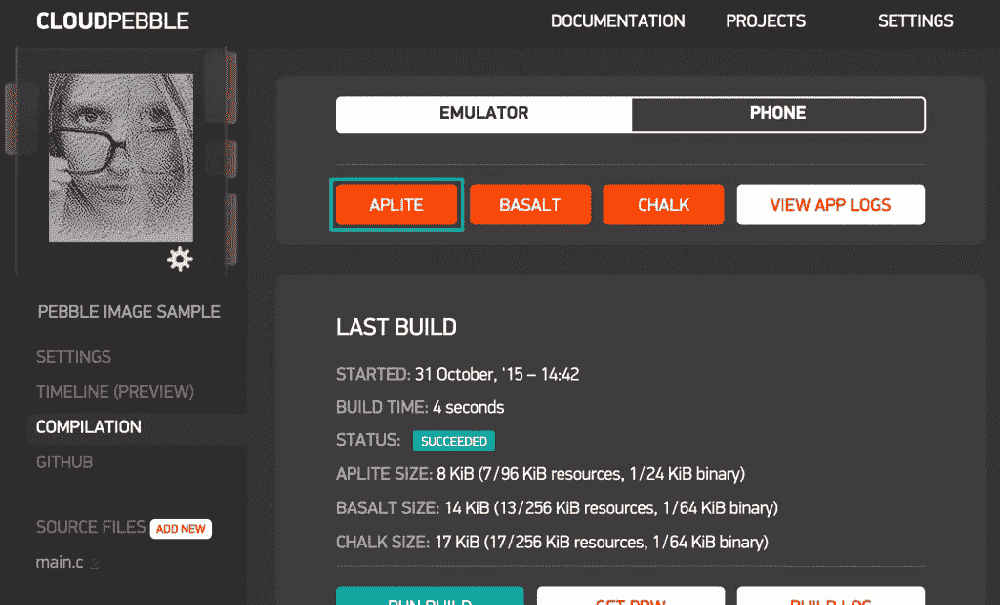

这是玄武岩上的:


在圆形粉笔平台上，它看起来是这样的:

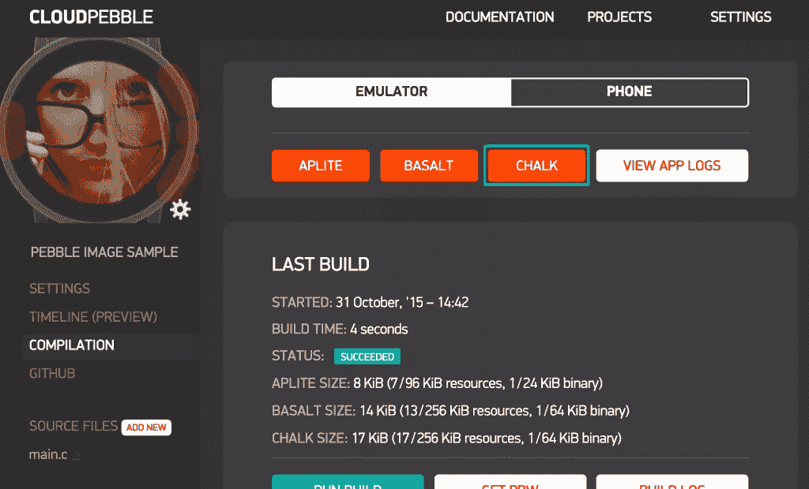

## 结论

添加图片是打造一个漂亮表盘的关键部分。希望这篇文章有助于 Pebble 开发人员了解这个过程！

如果你收集了一些很棒的图像驱动 Pebble watchfaces，请在评论中分享或在 Twitter 上与我联系( [@thatpatrickguy](http://www.twitter.com/thatpatrickguy) )。我很想看看它们，并在我的卵石上试用它们！

如果你正在寻找关于 Pebble 开发的更多链接，我在我的 [Dev Diner Pebble 开发指南](http://devdiner.com/guides/pebble/)上有一组精选的链接。如果你有我没有列出的其他好资源，也请告诉我！

*感谢[梅里·安伯](http://www.meriamber.com)让我剖析她的部分应用程序！*

## 分享这篇文章