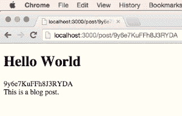

# 如何添加永久链接到一个流星项目

> 原文：<https://www.sitepoint.com/how-to-add-permalinks-to-a-meteor-project/>

现代 web 应用程序没有理由没有永久链接(也称为“漂亮的 URL”)。它们更容易被用户记住，对 SEO 来说很重要，而且当使用 [Meteor](https://www.meteor.com/) 时，非常容易实现。

为了演示如何创建一个基本的永久链接系统，我们将构建一个准系统的博客应用程序。默认情况下，每个帖子都有一个 URL，其中包含帖子的 ID，如下所示:`http://localhost:3000/post/pCZLhbwqtGXPdTDMM`。

这是最简单的方法，但是产生的 URL 不是很好，所以我们将学习如何用自定义值替换那个 ID。我们的更改将使我们能够有这样一个 URL:`http://localhost:3000/post/hello-world`。

在这个过程中，我们还将学习一些其他技巧，这些技巧在使用 [Meteor](https://www.meteor.com/) 构建任何类型的 web 应用程序时都会派上用场。如果你想玩本文[中创建的代码，我已经为你创建了一个库](https://github.com/sitepoint-editors/permalinks)。

开始吧！

## 入门指南

在一个新的 Meteor 项目中，通过运行以下命令安装 [Iron Router](https://github.com/iron-meteor/iron-router) :

```
meteor add iron:router
```

对于外行来说，Iron Router 是 Meteor 开发人员首选的路由包，它允许我们将模板与 URL 路径相关联。

例如，我们可以创建如下所示的“主页”模板:

```
<template name="home">
    <form>
        <input type="text" name="title" placeholder="Title goes here...">
        <textarea name="content" placeholder="Entry goes here..."></textarea>
        <input type="submit" value="Add Post">
    </form>
</template>
```

然后这个模板的路径如下所示:

```
Router.route('/', function(){
    this.render('home'); 
});
```

一旦完成，每当我们访问应用程序的根路径时，就会显示“home”模板的内容。

## 写帖子

为了为我们的应用程序存储博客文章，我们需要创建一个“posts”集合:

```
var Posts = new Meteor.Collection('posts');
```

在一个`isClient`条件中，我们将编写一些语句，一旦“home”模板中的表单被提交，这些语句将向集合中添加数据:

```
if(Meteor.isClient) {
    Template.home.events({
        'submit form': function(event){
            event.preventDefault();
            var title = event.target.title.value;
            var content = event.target.content.value;
            Posts.insert({
                title: title,
                content: content
            });
        }
    });
}
```

我们还需要每个帖子有一个“永久链接”字段来定义将出现在 URL 中的值。我喜欢将这个字段设置为默认的`_id`字段的值。

为此，将`insert()`函数返回的值存储在一个变量中，然后调用`update()`函数，如下所示:

```
var post = Posts.insert({
    title: title,
    content: content
});

Posts.update(
   { _id: post },
   { $set: {permalink: post} }
);
```

有了这个代码，我们就可以:

1.  创建新职位。
2.  将文章的 ID 存储在名为`post`的变量中。
3.  更新指定的帖子。
4.  将“permalink”字段设置为文章 ID 的值。

例如，如果您创建了一个帖子，并且它的 ID 为“pCZLhbwqtGXPdTDMM”，那么该帖子的结构将如下所示:

```
{
    _id: 'pCZLhbwqtGXPdTDMM',
    title: 'Hello World',
    content: 'This is the content...',
    permalink: 'pCZLhbwqtGXPdTDMM'
}
```

您还可以基于帖子的标题创建一个永久链接—因此，如果帖子标题是“Hello World”，永久链接将是“Hello-World”—但这超出了本教程的范围。

## 发布页面

每篇博客文章都需要自己的独立页面。对于初学者来说，这些页面将依赖于文章的 ID，而不是 permalink 的值(即使这些值目前是相同的，正如我们刚刚提到的)。

首先，为这些帖子页面创建一个“帖子”模板:

```
<template name="post">
    <h1>{{title}}</h1>
    <div class="entry">
        {{content}}
    </div>
</template>
```

然后创建一条路线:

```
Router.route('/post/:_id', function(){
    var postId = this.params._id;
    this.render('post', {
        data: function(){
            return Posts.findOne(postId);
        }
    });
});
```

在此代码中，我们:

1.  从 URL 中提取`_id`字段。
2.  将该值存储在“postId”变量中。
3.  基于该 ID 检索文档。

因此，如果一篇文章的 ID 为“pCZLhbwqtGXPdTDMM”，那么这篇文章将可以通过 URL `http://localhost:3000/post/pCZLhbwqtGXPdTDMM`访问。

您不需要 URL 的"/post "部分，您可以使用以下代码更改路由代码，以删除 URL 的这一部分:

```
Router.route('/:_id', function(){
    var postId = this.params._id;
    this.render('post', {
        data: function(){
            return Posts.findOne(postId);
        }
    });
});
```

有了这样的改变，同一个帖子页面的 URL 将变成`http://localhost:3000/pCZLhbwqtGXPdTDMM`。

## 编辑“永久链接”字段

我们即将为应用程序添加永久链接支持，但是，首先，让我们编写代码来编辑“永久链接”字段。为此，我们需要通过添加“permalink”字段来更新“post”模板。我们还将向周围的`div`元素添加一个`contentEditable`属性。使用该属性，我们将能够在页面中直接编辑 permalink 字段，尽管我们需要构建逻辑来实现这一点。模板的结果代码如下所示:

```
<template name="post">
    <h1>{{title}}</h1>
    <div class="permalink" contenteditable="true">{{permalink}}</div>
    <div class="entry">
        {{content}}
    </div>
</template>
```

要创建前面提到的业务逻辑，需要创建一个事件，允许用户编辑“permalink”元素的值，并按“Return”键将该值保存到数据库中。创建此类事件的代码如下所示:

```
Template.post.events({
    'keypress .permalink': function(event, template){
        var permalink = template.find('.permalink').innerHTML;
        if(event.which === 13){
            event.preventDefault();
            Posts.update({_id: this._id}, {$set: {permalink: permalink}});
            event.target.blur();
        }
    }
});
```

它是这样工作的:

1.  当用户聚焦在具有类别`permalink`的元素上并按下一个键时，触发`keypress`事件。
2.  用`template.find`函数检索“permalink”字段的内容，并存储在“permalink”变量中。
3.  如果按下“Return”键,“permalink”变量中的值将保存到数据库中，并覆盖旧值。

完成最后一步后，用户界面将是这样的:



## 添加永久链接支持

到目前为止，我们已经设置了几乎所有需要的代码。但是，要使 permalinks 按计划工作，您必须更改处理路由的代码，如下所示:

```
Router.route('/post/:permalink', function(){
    var permalinkValue = this.params.permalink;
    this.render('post', {
        data: function(){
            return Posts.findOne({permalink: permalinkValue});
        }
    });
});
```

这里，有几件事正在进行:

1.  路由的路径包含“permalink”参数，而不是“_id”参数。
2.  我们没有使用“postId”变量，而是使用了“permalinkValue”变量。
3.  对`findOne`函数进行了修改，以根据`permalink`字段的值而不是`_id`字段的值来执行搜索。

因此，URL `http://localhost:3000/post/pCZLhbwqtGXPdTDMM`将不再工作，但是`http://localhost:3000/post/hello-world`可以工作。

很整洁，不是吗？

## 更改永久链接

目前，如果用户改变了一个页面的永久链接，这个页面就会被破坏。我们可以解决这个问题，以便在修改永久链接后，用户可以被重定向到新的路由。

为此，向我们的帖子的路由添加一个“name”参数:

```
Router.route('/post/:permalink', function(){
    var permalinkValue = this.params.permalink;
    this.render('post', {
        data: function(){
            return Posts.findOne({permalink: permalinkValue});
        }
    });
}, {
    name: 'post'
});
```

然后给`keypress`事件添加一个`Router.go`函数:

```
Template.post.events({
    'keypress .permalink': function(event, template){
        var permalink = template.find('.permalink').innerHTML;
        if(event.which == 13){
            event.preventDefault();
            Posts.update({_id: this._id}, {$set: {permalink: permalink}});
            event.target.blur();
            Router.go('post', {permalink: permalink});
        }
    }
});
```

这里，我们使用这个`Router.go`函数，使用 permalink 字段的编辑值重定向到“post”路由。

## 结论

设置 permalink 系统的基础非常简单。棘手的部分是所有需要考虑的额外细节。这里有几个问题需要思考:

*   如果用户试图定义一个已经为单独页面定义的永久链接，会发生什么？
*   在定义永久链接时，应该实施什么样的限制？(长度、允许的字符类型等。)
*   如何根据博客文章的标题自动创建永久链接，而不是默认使用永久链接中文章的 ID？

这些问题是检验你知识的好练习。所以你可能想在自己的时间里解决它们。如果你想玩这篇文章中创建的代码[，我已经为你创建了一个库](https://github.com/sitepoint-editors/permalinks)。