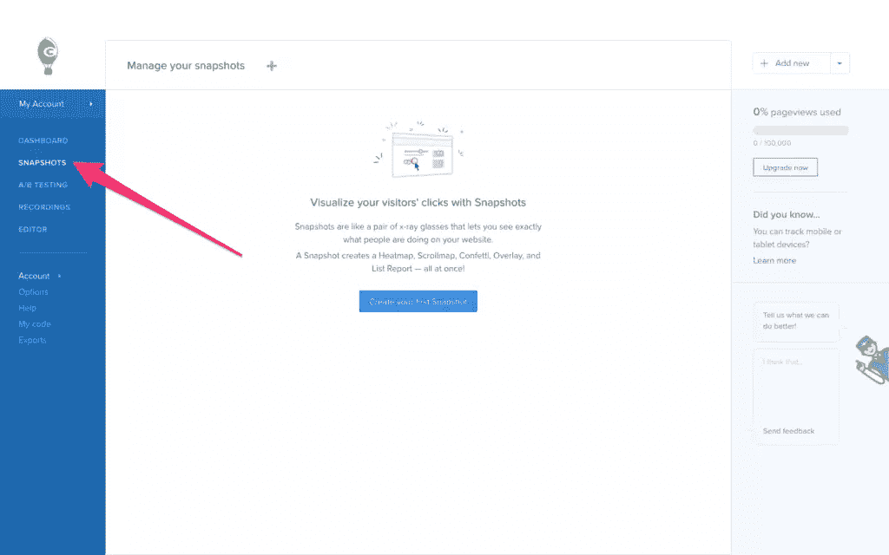
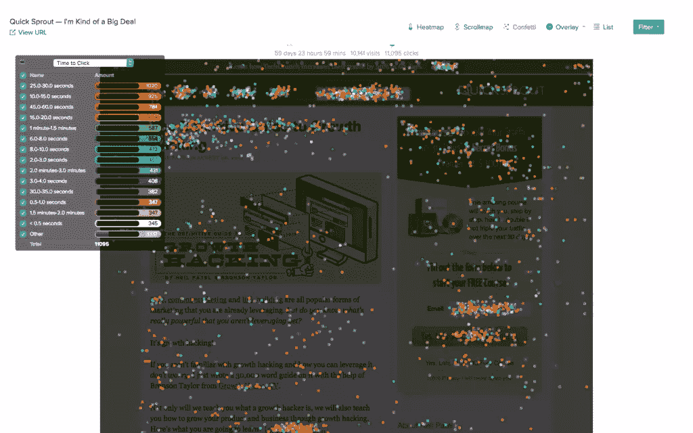
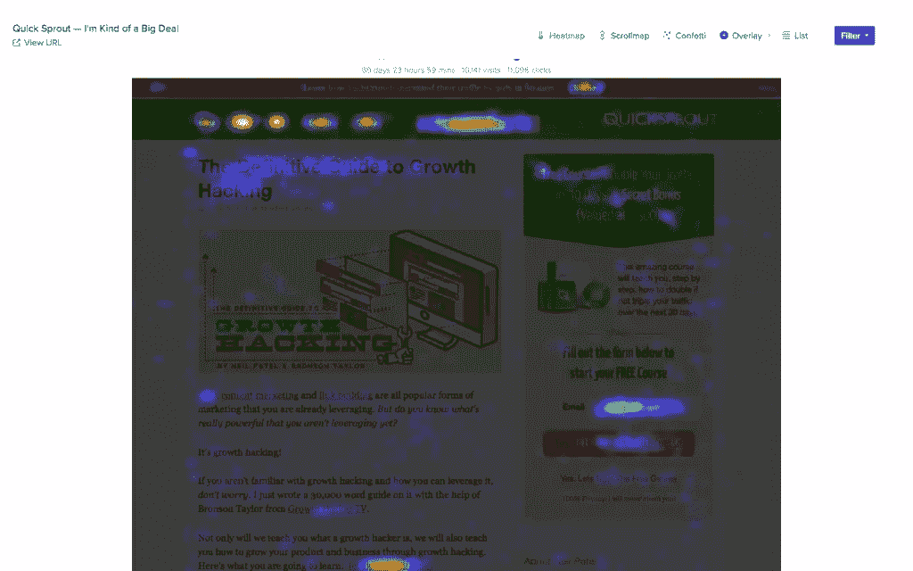
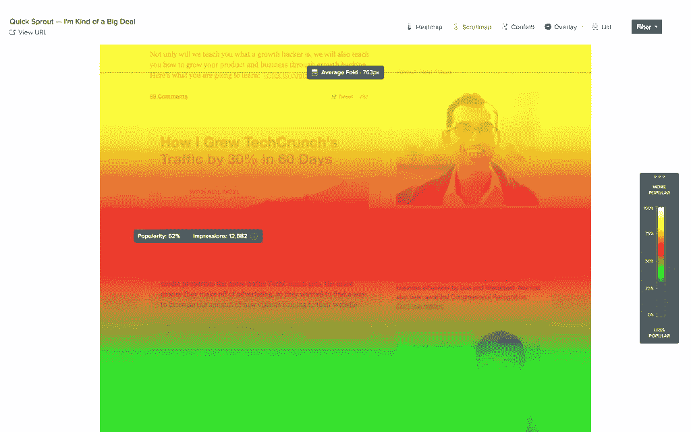
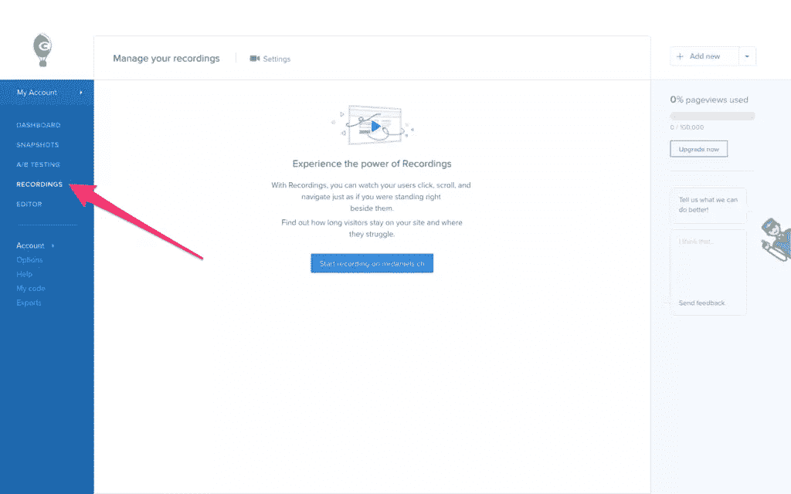
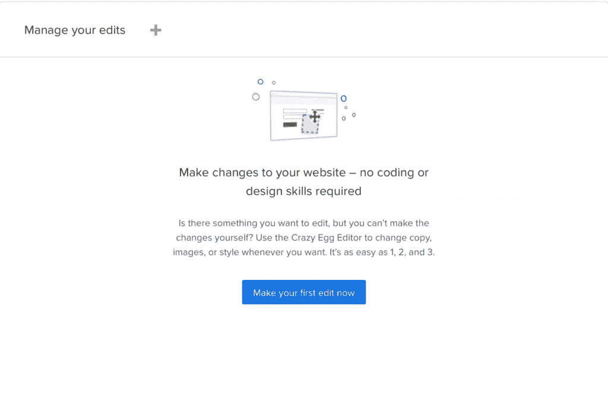
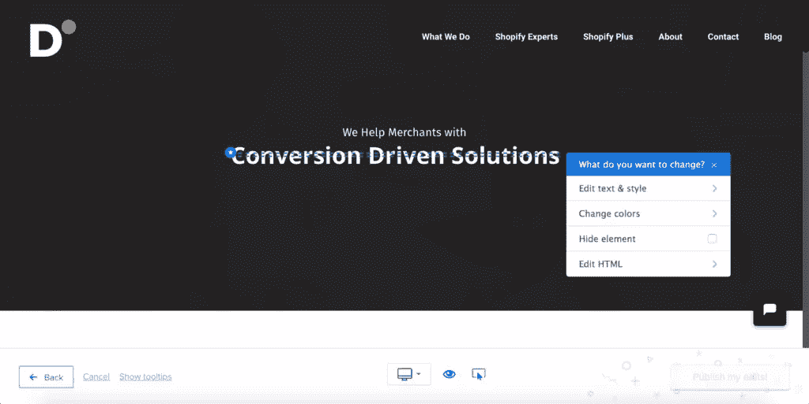
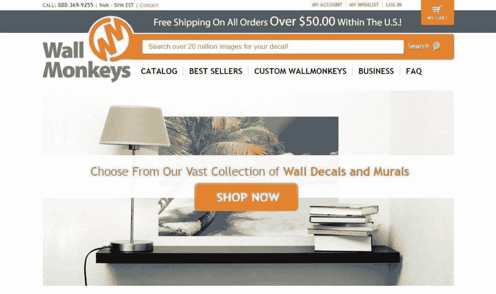
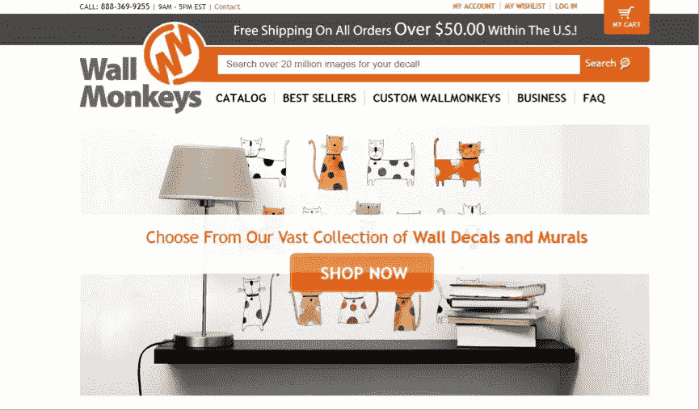
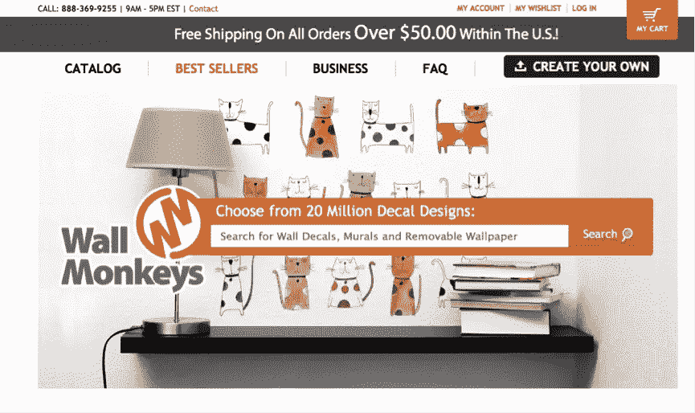

# 如何分析热图并使用疯狂鸡蛋创建 A/B 测试

> 原文：<https://www.sitepoint.com/how-to-analyze-heatmaps-and-create-ab-tests-with-crazy-egg/>

曾几何时，拥有一家网上企业仅仅是拥有一个网站。但是现在，网上交易变得越来越大，越来越快，越来越复杂。曾经是一种表达“这就是我们，这就是我们所做的”的方式，现在是各种不同商业模式的机会——订阅、服务、产品等等。

为了实现这些转化，你需要为你的企业使用正确的工具——这些工具可以让你发现你的网站在 UX 方面的不足，然后用一个可行的解决方案来纠正它。热图和 A/B 测试工具是必不可少的，它们帮助你了解你的用户，扩展你的业务，让 UX 变得更好。

## 什么是热图？

热图讲述了一个关于你的网站的故事。热图将像谷歌分析一样跟踪用户在你网站上的活动，但它的重点将是你的访问者通过鼠标点击和屏幕记录滚动活动的运动。谷歌分析可以告诉你正在发生什么，热图可以告诉你*为什么*。

## 什么是 A/B 测试？

A/B 测试工具允许你尝试你的网站的不同变化(甚至是单个元素)，看看哪个转换最好。虽然热图可以识别用户困惑的地方和原因，但 A/B 测试可以帮助您尝试一些解决方案。这就是为什么在一个应用程序中同时拥有这两种功能是一个成功的想法。进入[疯狂彩蛋](https://www.crazyegg.com/)。

## 疯狂鸡蛋入门

一旦你创建了你的[疯狂彩蛋](https://www.crazyegg.com/)账户，点击[这里](https://app.crazyegg.com/v2/install/manually/)来获得你的追踪代码。这种跟踪代码记录你的用户的活动，并用分析、热图和屏幕记录来表示这些数据。Crazy Egg 为您创建的 JavaScript 片段需要插入到网站代码的`<head>`部分。之后，我们可以读取数据。

## 三种不同类型的热图

疯狂蛋创建了三种不同类型的热图。

你可以通过点击工具条上的*快照*找到这些地图。

### 点击地图(又名五彩纸屑)

点击地图是一种热图，它会向你显示网页的哪些区域被点击了。这可能表明您的 CTA 有问题，这显然是不可取的，但它也表明了用户感兴趣的 UI 区域(如类别),这让您非常惊讶。

同样考虑这个场景:一个用户试图点击一张图片(*让我们假设这是一张产品照片*，期望它放大/展开。根据这一行为，您可以决定实现图像缩放。

您可以将这些点击与指标配对，例如点击的*时间。*

### 气垫地图(又名热图)

悬停地图(hover maps)，更广为人知的名称是热图(heatmaps)，它可以识别出用户实际光标最常停留的屏幕区域。热图将帮助您了解用户最感兴趣的区域，突出用户的意图，即使他们没有点击该区域。

例如，假设用户悬停在你的导航上方并期望第三层(例如*男装→智能→衬衫*，其中*衬衫*是缺少的层)，但是他们没有点击，因为你的导航只有两层。然后，您可以根据这些信息进行更改。

您可能还会发现，用户正在两种定价模式之间导航，这表明“中间某处”的成本可能更合适。

### 滚动地图

Scrollmaps 将向你展示你的访问者在网页上滚动了多远，以及他们在哪个部分花了大部分时间。

Scrollmaps 将用*人气*和*印象*来显示。这可以帮助你微调你的电子商务网站上的目录，或者根据用户滚动到的部分重新排列你的登陆页面上的部分。可能是最有价值的内容被沉在了底部，而上面的内容并没有得到你原来认为的那么多的关注。“热”部分将会变暖(红色/橙色)，而不太重要的部分将会变冷(蓝色/绿色)。一般来说，你不想让用户滚动来找到你最好的内容！

## 记录:特定用户的热图

能不能放大到具体用户？是的。

一旦跟踪代码已经运行了 30 分钟，并且假设在这段时间内你已经有网站访问者，从侧边栏导航到*记录*来查看你的用户在网站上的行为的每个记录版本。从那里你可以看到一个特定用户的五彩纸屑，热图和滚动图。疯狂蛋会默认记录每个用户的会话。

## A/B 测试:尝试解决方案

当我们确定了关注领域后会发生什么？我们是否应该转而使用一种工具来测试可能的解决方案？没有。疯狂蛋也允许我们创建 A/B 测试！假设你的五彩纸屑/点击地图显示有两个类别被点击的次数比任何其他类别都多，我们想测试将这些类别移到导航的前面是否有助于提高转化率。通过 A/B 测试，我们可以做到这一点。

在侧边栏中，点击*编辑器*。可视化编辑器允许我们直接在疯狂蛋中创建变体，不需要任何代码。

点击*立即进行首次编辑*按钮，选择您想要编辑的网站，然后点击您想要试验的设备。您的网站现在将会出现。单击一个元素，并从出现的下拉列表中选择您想要更改元素的哪些方面。

一旦你完成了编辑，点击右下角的*发布我的编辑*按钮，这些修改将会在一个不同的网址上生效(例如:`http://www.example.com/?variant=1`)。有了[谷歌分析细分](https://www.crazyegg.com/blog/segmentation-ab-testing-google-analytics/)，你就可以确定哪种变化最能转化用户(你可以创造尽可能多的变化)，然后决定永久应用这种变化。

您还可以使用快照(五彩纸屑、热图、滚动图)来分析实验的结果。

## WallMonkeys:一个疯狂的鸡蛋案例研究

好的，这里有一个现实生活中的 A/B 测试的例子——wall monkey[如何通过热图和 A/B 测试将它们的转化率提高了 550%。](https://www.wallmonkeys.com/)

WallMonkeys 知道，第一条“信息”和视觉体验将对他们的电子商务转化率产生最大的影响。他们对用户行为和 UX 心理学进行了一些研究，并试图将这些发现与用户在其网站上的行为方式相关联(如《疯狂鸡蛋》中的热图和滚动图所示)。然后他们开始 A/B 测试各种东西，一次一个变化。(一次做多个改变只会让你疑惑什么改变对转换有影响。)

总共有三次 A/B 测试。在所有的 A/B 测试过程中，他们移除了没人点击(或者没人感兴趣)的滑块，让主图像看起来更“有趣”。菜单和搜索栏也变得更加明显，因为 Wallmonkeys 暗中怀疑用户真正想要的是搜索他们的项目。

**原始变化**

**变化#1: **收入增长 27%**

**变化#2:收入增加 550%!**

## 结论

疯狂蛋可以帮助你通过点击地图、热图和滚动地图来揭示你的网站的低性能部分，然后你可以运行各种 A/B 测试，作为持续 UX 改进的行为。如果 WallMonkeys 的案例研究向我们展示了什么，那就是总有改进的空间，而这种改进不可能一下子发生。

疯狂蛋的功能可以帮助你识别可怜的 UX，尝试不同的体验，然后确认 UX 应该是什么样子。

## 分享这篇文章