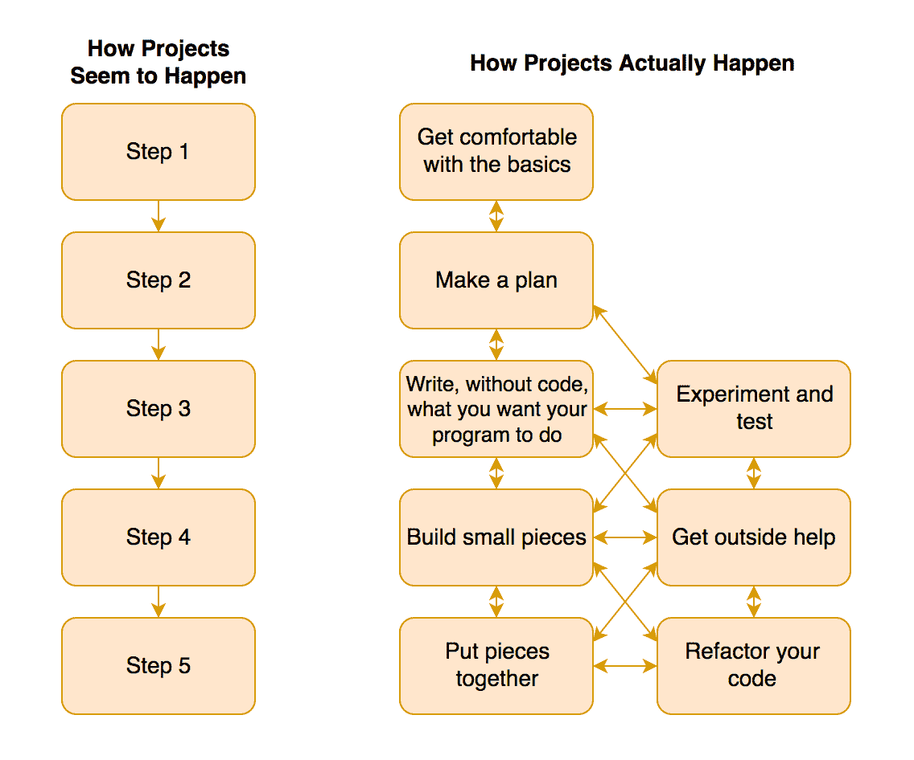

# 哪些教程没有告诉你:如何接近项目

> 原文：<https://www.sitepoint.com/how-to-approach-javascript-projects-what-the-tutorials-dont-tell-you/>


我经常听说那些学习教程的人发现自己无法独立完成 JavaScript 项目。

发生这种情况的一个原因是教程给了你一套整洁的步骤，而不是你自己解决这些步骤的实际过程。人们与项目斗争的另一个原因是，他们将自己的中间步骤与别人的成品进行比较，从而感到气馁。

接近一个项目的真相并不像教程(包括我的)看起来那么简单。现实是，项目不是一行行完美的代码，而是分成小块进行，有大量的试验和错误，并通过参考资料进行适当的搜索。

在这篇文章中，您将 [" >学习如何自己处理 JavaScript](http://<a%20href=) 项目。

重要提示:在阅读本文时，您将看到一些代码示例。如果其中任何一个看起来是新的或不熟悉的，现在浏览一下就可以了。这篇文章的目的是让你理解完成一个项目的整个过程，而不是被技术细节分散注意力。

## 首先熟悉基础知识

至少，您需要熟悉 JavaScript 的一些基础知识(以及一般的编程)。这可能包括变量、函数、if 语句、循环、数组、对象、DOM 操作方法，比如`getElementById`、`querySelectorAll`和`innerHTML`。当你写完这篇文章后，你可以谷歌一下或者在 [MDN](https://developer.mozilla.org/en-US/docs/Learn/JavaScript/) 上查找。

一旦你熟悉了这些概念，你会进展得更快，因为你可以专注于[创建你的项目](https://www.sitepoint.com/start-new-projects-faster/)而不是担心如何写一个 if 语句。

很多人匆匆走过这一步，结果是一切都要花更长的时间。这就像试图玩视频游戏的第 3 级，而不熟悉第 1 级的控制一样。许多可以避免的挫折。

## 想办法



不要一头扎进去，试图用一系列线性步骤来做你的项目，先花些时间看看大图。制定一个总体计划。需要发生什么样的事情？例如，如果你想做一个倒计时钟，你可能需要一种测量时间的方法，一个保存数据的地方，一个显示数字的地方，也许还需要一种控制时钟的方法。

在这个阶段，你不希望陷入技术细节，因为你仍然在思考你想要什么的大致想法。只要你有一个全面的计划，你就会有路标来防止你迷路。在软件设计方面。这种技术通常被称为[用例分析](https://en.wikipedia.org/wiki/Use-case_analysis)。

## 不用代码写

现在你有了计划，你会想弄清楚细节。我最喜欢的方法是具体写下你希望项目的每个部分做什么。关键是不要用代码，而要用通俗易懂的语言。(这个叫做[伪代码](https://simple.wikipedia.org/wiki/Pseudocode)。)这样，您就可以清楚地思考您的项目在做什么，而不会被语法细节分散注意力。

对于倒计时钟，您的笔记可能如下所示:

*   获取当前时间
*   指定结束时间
*   找出当前时间和结束时间之间的差异，以获得剩余时间
*   重复获得倒计时每一步的剩余时间
*   在倒计时的每一步在屏幕上显示剩余时间

您可以将单个部分分成更小的部分，如下所示:

*   在倒计时的每一步在屏幕上显示剩余时间
    *   将时间分成小时、分钟、秒钟
    *   在一个容器中显示小时
    *   分分秒秒做同样的事情

一旦你写出了你的逻辑，你写代码就容易多了。这是因为编写具体步骤的代码(如“从结束时间中减去当前时间”)比编写整个项目的代码(如“构建一个倒计时钟”)更简单

还要注意，你不需要一开始就写出一系列完美的步骤。这是一个流畅的过程，可以添加东西、删除东西、出错、学习和改进。

## 构建小块

一旦你写出了你的步骤，你就可以开始写小段代码了。对于倒计时钟，您可以从获取当前时间开始:

```
const currentTime = new Date().getTime();
console.log(currentTime); 
```

一旦你满意了，你可能会得到倒计时的结束时间:

```
const endTime = new Date(2017, 4, 4, 7, 30).getTime();
console.log(endTime); 
```

当您制作自己的时钟时，您可以像上面的代码示例一样选择一个特定的结束日期，但是因为我不希望本文中的代码在某个日期后停止工作，所以我将把结束时间设置为从现在起的 10 天(注意 10 天到毫秒的转换，因为这些是 JavaScript 使用的单位):

```
const endTime = new Date().getTime() + 10*24*60*60*1000;
console.log(endTime); 
```

以下是将代码编写成小段的一些好处:

*   在进入下一步之前，您有机会确保功能的各个部分正常工作。
*   当你一次没有被太多移动的部分分心时，更容易思考你在做什么。
*   你会走得更快，因为你不会试图同时跟踪一百万件事情。
*   这样更容易发现和防止错误。
*   你可以根据需要进行实验和学习。
*   你最终往往会写出有用的代码，可以在其他地方使用。

## 把碎片拼在一起

准备好你的个人作品后，你就可以开始把你的项目放在一起了。在这一阶段，关键的挑战是确保独立工作的部件在连接后仍然能够工作。这可能需要一些小的改变。

例如，下面是如何将开始时间和结束时间放在一起计算倒计时钟的剩余时间:

```
// set our end time
const endTime = new Date().getTime() + 10*24*60*60*1000;

// calculate remaining time from now until deadline
function getRemainingTime(deadline){
  const currentTime = new Date().getTime();
  return deadline - currentTime;
}

// plug endTime into function to output remaining time
console.log(getRemainingTime(endTime)); 
```

这种把小部分放在一起的方法比试图一次做一个完整的项目要容易得多，因为这样，你不需要同时记住你头脑中的所有东西。

现在我们有了一个获取剩余时间的函数，我们可以重复运行该函数来保持时间显示更新。

HTML:

```
<div id="clock"></div> 
```

JavaScript:

```
// set our end time
const endTime = new Date().getTime() + 10*24*60*60*1000;

// calculate remaining time from now until deadline
function getRemainingTime(deadline){
  const currentTime = new Date().getTime();
  return deadline - currentTime;
}

// store clock div to avoid repeatedly querying the DOM
const clock = document.getElementById('clock');

// show time repeatedly
function showTime(){
  const remainingTime = getRemainingTime(endTime);
  clock.innerHTML = remainingTime;

  requestAnimationFrame(showTime);
}
requestAnimationFrame(showTime); 
```

在上面的例子中，我们添加了一个`showTime`函数，在屏幕上显示剩余时间。在函数的最后，我们包含了`requestAnimationFrame(showTime)`，它基本上是说一旦浏览器准备好就再次运行`showTime`。这使得我们能够以高性能的方式不断更新时间显示[。](https://developer.mozilla.org/en-US/docs/Web/API/window/requestAnimationFrame)

你会注意到倒计时完全以毫秒为单位。下一步将是把一切都转换成天、小时、分钟和秒。

使用你到目前为止学到的方法(小步骤等)。)，您可以先将毫秒转换为秒，看看是什么样子，然后将它放入您的函数中。然后，您可以重复这个过程来计算分钟、小时和天。最终结果可能如下所示:

```
function showTime(){
  const remainingTime = getRemainingTime(endTime);
  const seconds = Math.floor((remainingTime/1000) % 60);
  const minutes = Math.floor((remainingTime/(60*1000)) % 60);
  const hours = Math.floor((remainingTime/(60*60*1000)) % 24);
  const days = Math.floor(remainingTime/(24*60*60*1000));

  clock.innerHTML = `${days}:${hours}:${minutes}:${seconds}`;
  requestAnimationFrame(showTime);
}
requestAnimationFrame(showTime); 
```

## 实验和测试

到项目的这一步，你已经做了大量的实验和测试，以确保一切正常。一旦它看起来起作用，看看你是否能打破它。例如，如果用户点击这里或那里会怎样？如果其中一个输入是意外的呢？屏幕尺寸窄怎么办？在你期望的浏览器中一切正常吗？对于这个项目的任何部分，有更有效的方法吗？

回到我们的倒计时钟的例子，如果计时器到达零会发生什么？我们可以添加一个 if 语句来确保时钟停在零:

```
function showTime(){
  ...

  // ensure clock only updates if a second or more is remaining
  if(remainingTime >= 1000){
    requestAnimationFrame(showTime);
  }
} 
```

请注意，我们在这种情况下使用 1000 毫秒(1 秒)的原因是，如果我们使用零，时钟将会过冲，最终达到-1。如果你的时钟使用小于秒的单位，那么让结束条件小于一秒。

当我在写这篇文章时，一个好朋友指出了这个问题，这只是代码第一次可能不完美的另一个例子。

这很好地引出了下一点。

## 寻求外界帮助

在做项目的任何时候，获得外界的帮助都是重要的一步。这种帮助可以来自参考资料或其他人。我提出这个问题的原因是，有一个普遍的误解，即开发人员坐下来编写完美的代码，而不必查阅任何资料或向任何人寻求建议。

我经常听说新开发人员惊讶于一个有经验的开发人员会多频繁地查找资料。事实上，因为不可能知道所有的事情，所以能够查找信息是你能拥有的最有价值的技能之一。

工具和技术在变化，但是学习的技巧不会消失。

## 重构您的代码

在完成项目之前，您需要重构代码。为了改进项目，您可以问自己以下几个问题:

### 你的代码简洁易读吗？

如果您必须在简洁性和可读性之间做出选择，您通常会选择可读性，除非有重大的性能原因。可读性使代码更容易维护、更新和修复。

### 你的代码高效吗？

例如，如果您在文档中反复搜索相同的元素，您可以将该元素存储在一个变量中，以减少代码的工作量。我们已经在下面的倒计时时钟示例中做到了这一点:

```
// store clock div to avoid repeatedly querying the DOM
const clock = document.getElementById('clock'); 
```

### 你对你的函数和变量使用了清晰的命名吗？

例如像`showTime`这样的函数名会比`st`更清晰。这一点很重要，因为人们通常认为事物的名字有意义，但后来却忘记了它们的缩写是什么意思。清晰性的一个好测试是你是否需要向不熟悉代码的人过多地解释一个名字。

### 是否存在任何潜在的命名冲突？

例如，您是否使用了像“容器”这样很可能在其他地方使用的名称？

你是否用太多的变量污染了全球范围？

保护全局作用域的一个简单方法是将你的倒计时代码放入一个 IIFE 中([立即调用的函数表达式](https://www.sitepoint.com/demystifying-javascript-closures-callbacks-iifes/#immediately-invoked-function-expressions-iifes))。这样，时钟可以访问它的所有变量，但其他任何东西都不能。

```
(function(){
    // code goes here
})(); 
```

### 编辑过程有没有造成什么错误？

例如，您是否在一个地方更改了变量名，而没有在其他地方更改它？你有没有在一个物体上加了东西却忘了加一个逗号？

### 输出需要打磨吗？

在我们的倒计时时钟示例中，最好能看到前导零(所以是 10:09 而不是 10:9)。一种方法是查看一个数字是否小于 9，然后在它前面加一个“0”，但这有点长。我曾经看过一个代码示例，它有一个巧妙的技巧，就是在前面加一个“0 ”,然后使用`slice(-2)`无论如何只取最后两位数字。这些更改将使我们的代码看起来像这样:

```
function showTime(){
  const remainingTime = getRemainingTime(endTime);
  const seconds = ('0' + Math.floor((remainingTime/1000) % 60)).slice(-2);
  const minutes = ('0' + Math.floor((remainingTime/(60*1000)) % 60)).slice(-2);
  const hours = ('0' + Math.floor((remainingTime/(60*60*1000)) % 24)).slice(-2);
  const days = ('0' + Math.floor(remainingTime/(24*60*60*1000))).slice(-2);

  clock.innerHTML = `${days}:${hours}:${minutes}:${seconds}`;

  // ensure clock only updates if a second or more is remaining
  if(remainingTime >= 1000){
    requestAnimationFrame(showTime);
  }
}
requestAnimationFrame(showTime); 
```

### 你的代码是多余的吗？

您是否在重复可能在函数或循环中的代码？参考上面的内容，我们可以移动代码，在它自己的函数的输出中添加一个额外的零。这减少了重复，使内容更容易阅读。

```
function pad(value){
  return ('0' + Math.floor(value)).slice(-2);
}

const seconds = pad((remainingTime/1000) % 60); 
```

### 用新的眼光看这个项目会有帮助吗？

几天后试着回到你的代码。以全新的视角，你会开始发现哪些部分可以做得更干净、更高效。

随着你的重构，你的代码将开始变得越来越优雅。然后你会推出成品，人们会想知道你是如何写出如此完美的代码的。

几个月后，当你回首往事，你会发现你本可以做得更好。正如我的一个朋友明智地说的，这是一件好事；这意味着你在进步。

如果您感到好奇，这里有一个时钟示例的现场演示(添加了一些样式):

在 [CodePen](http://codepen.io) 上通过 SitePoint ( [@SitePoint](http://codepen.io/SitePoint) )看到 Pen [requestAnimationFrame 倒计时](http://codepen.io/SitePoint/pen/QpwRxz/)。