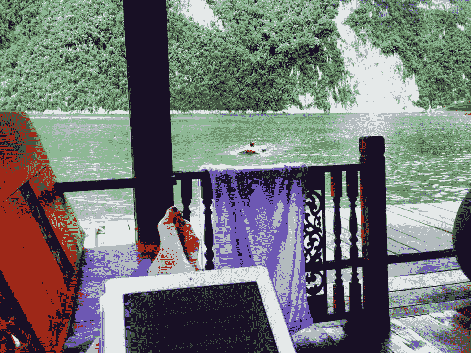
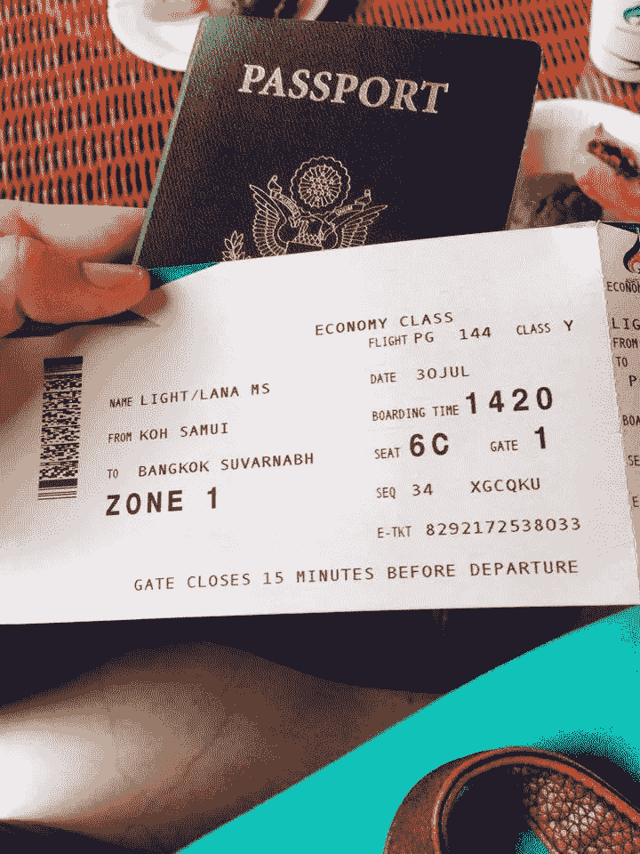
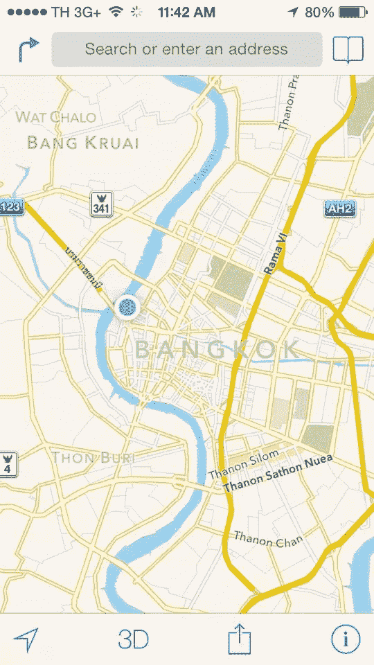
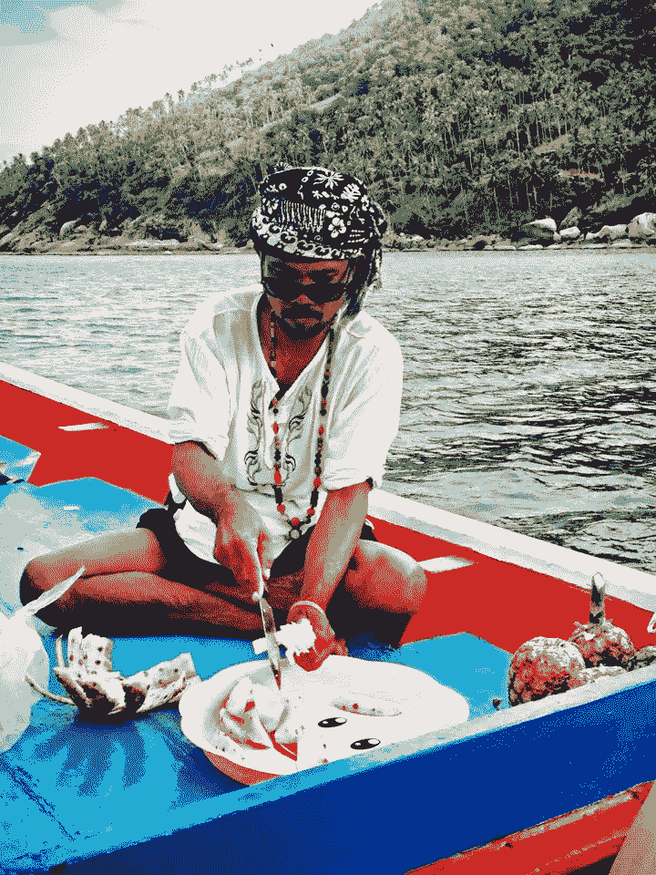
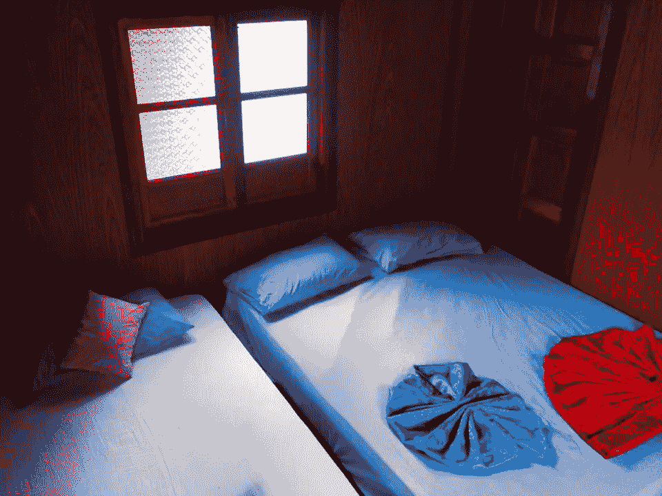
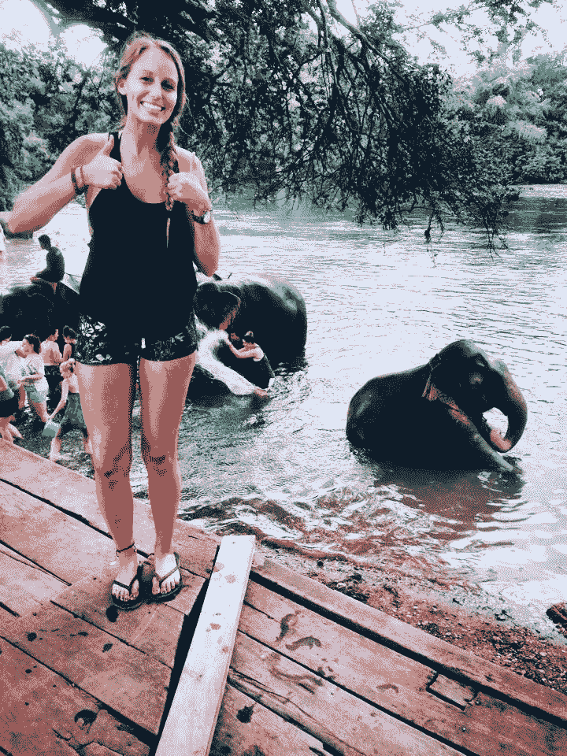
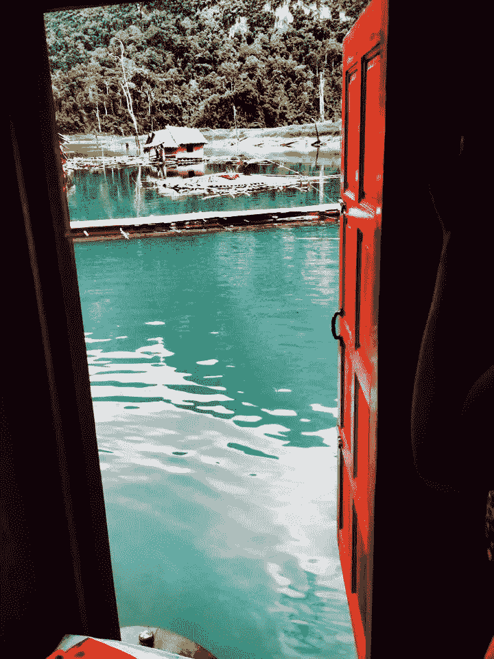

# 如何在不倾家荡产的情况下成为一名数字流浪者

> 原文：<https://www.sitepoint.com/how-to-be-a-digital-nomad-without-breaking-the-bank/>

特别感谢 Lana Light 让我们在这篇文章中与你分享她的照片。

自从开始我的数字游牧生活以来——大约一年前——我收到了许多来自有抱负的游牧者的可爱的电子邮件，他们对这种生活方式感兴趣，但对财务状况感到担忧。

对于那些不熟悉这个术语的人来说，成为一名数字流浪者意味着在世界任何地方远程工作(T2 ),同时还能过上好日子。

数字游牧者通常是自由设计师、网络开发者、社交媒体专家、营销大师或企业家，但你肯定不限于这些选项。

在这篇文章中，我将详细阐述数字游牧生活方式，并试图说服你自己去冒险。

## 选择你的目的地

在你旅行的头几周，你可能根本没有任何收入。

我不会建议你在没有任何积蓄的情况下开始你的旅程，我会建议你从生活成本低的国家开始。东欧和东南亚是世界上值得一游的两个壮观的地区，许多游牧民实际上选择留在那里。

巴厘岛(印度尼西亚)和清迈(泰国)是两个极其美丽的目的地，考虑到快速的 wifi 速度、生活成本、*生活质量*和风景优美，许多数字游牧民声称这是两个最合适的地点。

重要的是要记住，便宜并不意味着丑陋！

## 不要在飞机上搞砸了

根据你在世界上的位置，航班可能会很贵。放聪明点；使用 [Skyscanner](http://www.skyscanner.net/) 在一年左右的时间里找到你理想目的地的最便宜的航班，那将是你新的冒险开始的日期。从一天到第二天，机票价格可能会上涨一半或两倍，所以要确保你先做好调查。

如果你的理想目的地很远，你可以把长途飞行分成几次较小的旅行。机票费用大致相同，而且一路上你会有更多的冒险经历。

例如，从伦敦飞往巴布亚新几内亚(出于某种原因，这是我的理想地点)会非常昂贵，但你可以先在欧洲或亚洲呆一段时间，然后考虑从那里去巴布亚新几内亚旅行，费用会更便宜。

## 呆在原地至少一个月

过于频繁的搬家只会让你在飞机上花更多的钱，而且我们可能经常忘记，昂贵的机场接送也是如此。

Airbnb 的主人通常会提供优惠的月房价，偶尔还会提供他们自己的机场接送服务。我建议选择一个位于市中心的地方——在城市的某个地方，以避免交通费用。更不用说，你会喜欢在当地的酒吧和餐馆工作，这些地方有时也不比在家吃饭贵。

## 像当地人一样生活，像当地人一样吃饭

不要无聊；像当地人一样生活。

如果你来自北美，尤其是英国，你会失望地发现大多数其他国家吃得比你好，而且买现成的饭菜很贵。

相反，吃他们吃的东西；毕竟，如果你不愿意尝试新事物，你还不如根本不去旅行。

## 通过团队旅行来分摊费用

团体旅行不仅更安全，而且你还可以通过分摊公寓租金来节省一些钱。大多数公寓，甚至那些只有一个卧室的公寓，通常都有一个备用沙发或床垫，如果你独自旅行，你就不会用到。

当然，你也可以通过共享出租车来省钱，但除此之外，许多旅游景点和其他文化体验(在泰国骑大象跃入脑海！)如果你能说服一个(或几个)伙伴和你一起做，提供折扣。

## 用你的史诗技能换取基本需求

沙发冲浪名声不好，但对数字游民来说，这是一种生活方式。不一定是不愉快的。事实上，有一个非常有用的网站可以把你和世界各地的沙发联系起来。

在真正的沙发冲浪中，你的主人可以带你参观这个城镇，带你去旅游区，甚至陪你去吃晚餐。

你可以通过交换技能来回报，而不是付钱；对于住在廉价旅馆的人来说，这更是家常便饭。

非技术型冲浪者通常会申请帮助打扫卫生或招待，但你完全可以扩展你作为网页设计师或社交媒体专家的技能，例如，换取一个免费的房间。这比你想象的要平常得多！

## 额外提示:何时辞职

正如我已经提到的，在你决定这样做之前，你绝对必须存一些钱，以防万一。

此外，你几乎总是会忽略的一个小事实是，如果你在年度纳税年度没有赚到足够的钱，至少在一些国家，你将有权要求一些税收返还。

确保在你达到这个门槛(在英国大约是 11，000 美元，在加拿大是 11，000 美元，在澳大利亚是 18，000 美元)之前辞职，几个月后你会收到一张令人惊讶的支票！

## 结论

独立于位置并没有你想象的那么难。

既然我们已经讨论了作为一个数字流浪者我们可以省钱的方法，现在是时候讨论作为一个流浪者我们如何赚钱了。

请继续关注本系列的下一篇文章。

如果你有任何关于成为数字流浪者的具体问题，请在下面的评论中提出来，我会很乐意回答，甚至在未来的文章中详细阐述这个主题。

## 分享这篇文章