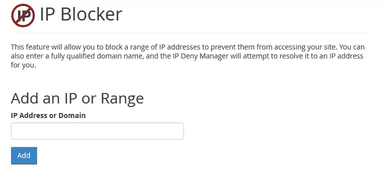
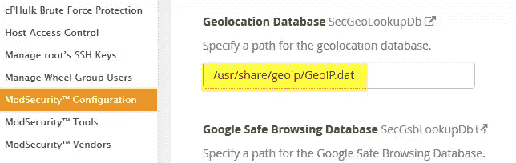
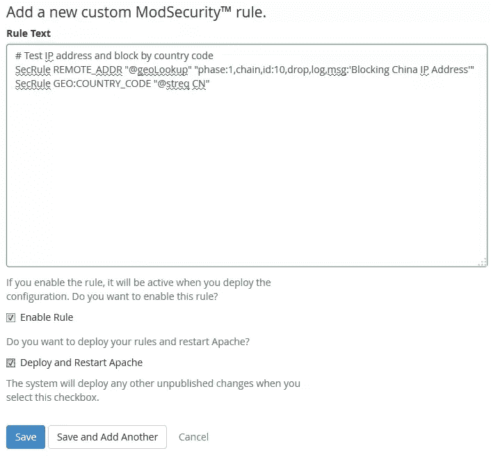
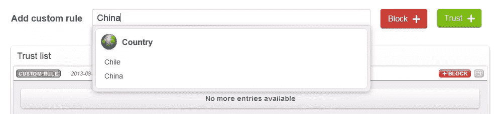
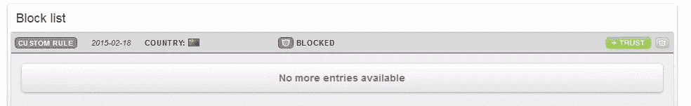

# 如何阻止整个国家访问您的网站

> 原文：<https://www.sitepoint.com/how-to-block-entire-countries-from-accessing-website/>

如果你运行一个网站，那么默认情况下，它可以访问整个地球。许多网站与其他国家的人毫无关系。所以，你不应该理所当然地期望从他们那里获得大量的流量。

如果你有一个本地书店，你的主要市场是走进你的商店的本地人，那么没有必要让任何其他国家的索引或浪费你的服务器上的带宽。洗车、保姆或割草也是如此。

如果您运行个人甚至私人网站，如家庭博客，您可能希望在默认情况下高度限制流量。

下面是 Awstats 的截图，告诉我中国是我管理的某个网络论坛的第二大流量来源。这只是 2015 年 1 月的。


虽然中国人可能会觉得论坛的内容很有用，但这个活动确实没有任何解释。我们不专门迎合中国，也不做广告吸引中国居民。该网站甚至不提供中文翻译或谈论中国问题。

我还碰巧知道 99%的暴力破解用户密码的企图都来自中国的 IP 地址。在这个网站上，每天大约有 50 到 100 次“猜测”合法用户名密码的暴力攻击来自中国的 IP 地址。

190 万页和 13.4 万页的差别挺大的，1.86GB 的带宽也不是世界末日。但是当我知道 99%都是假的，机器人，暴力黑客，漏洞扫描器和网络爬虫，那么我为什么不阻止中国访问我的网站呢？

也有一些反对阻止进入国家的理由。最明显的例子是酒店。尽管他们只迎合那些进门就想住上一段时间的当地人，但是到这个地区旅游的外国人会在到达之前就开始寻找旅馆。同样的道理也适用于高级餐厅、度假村、汽车租赁、通勤服务等等。你将不得不决定(并检查你的网页统计！)屏蔽特定国家对你是否有利。

下面是许多常用的阻止国家的方法，有一些优缺点和代码示例。

## 。htaccess

如果你是一个网站管理员，你可能知道试图做一些事情(如阻止整个国家通过。htaccess)是一场败局。合法黑客使用代理或机器人农场做他们的脏活。仅仅因为一个知识产权来自中国，并不意味着阻止知识产权从长远来看会有一点好处。

网络管理员很少会仅仅因为一个 IP 做了一次坏事就封杀它。一个真正的黑客不会使用他们自己的个人 IP，也不能保证这个 IP 将永远属于一个不道德的用户。

合法用户也可能使用代理！请注意，如果你屏蔽了一个不太糟糕的国家，仅仅是因为你认为他们与你的流量无关，你可能会有[个用户在那个国家使用代理或 VPN](https://www.sitepoint.com/create-your-own-vpn-server/)。

这也是一个失败的游戏，因为有超过 40 亿个 IPv4 IPs 在那里，没有简单的方法将它们按国家分开。换句话说，你的。如果你想以这种方式阻止国家，htaccess 或 Apache 配置文件(或其他 ACL/防火墙)可能会增长到几十万行文本。不实用，[也不具有表演性](http://httpd.apache.org/docs/2.2/howto/htaccess.html#when)。

如果你想知道它能容纳多少行。htaccess 要屏蔽一个国家，尝试使用 [ip2location](http://www.ip2location.com/blockvisitorsbycountry.aspx) 。要屏蔽美国，你需要超过 150，000 行文本！

底线是，不要使用。htaccess 或 Apache config 或任何其他 web 服务器 ACL 来尝试阻止国家。对于少数 IP 来说这可能没问题，但是这些文件在每个请求时都在**被读取，并且没有被缓存；它最终会伤害你。**

> 提示:如果你有兴趣去。无论如何，如果你想得到一个准确的，来自源头的，每日更新的各国 IP 列表，你可以从阅读这个家伙做了什么开始。

实际代码来阻止一个 IP 使用。htaccess 可以像这样简单:

```
Order Deny,Allow
Deny from 1.1.1.1
Deny from 2.2.2.2
Deny from 3.3.3.3 
```

你可以使用[这个工具](http://www.htaccesstools.com/block-ips/)来生成代码。

您可以获得更高级的功能，例如基于所使用的协议进行限制，但这是基本思想。你的。htaccess 文件将增长失控！

## 使用托管公司，将屏蔽作为其内置控制的一部分

这听起来不错，但非常罕见。大多数托管公司提供服务器的方式使得这成为他们无法提供的功能。两种主要类型是:

### Bare Metal

裸机或 VPS 是您可以完全控制的机器。从软件防火墙到托管软件和控制面板，一切尽在掌握。

例如，这些可能是来自 InMotionHosting 或 Rackspace 的 DigitalOcean Droplet 或裸机服务器。

通常，当您购买裸机或 VPS 时，您无法改变后端的路由方式。我还没有发现一台主机的默认计划和配置中包含国家封锁。他们最多给你一个基本的防火墙，用于将 IP 添加到黑名单或白名单中。

### 共享主机

您可能会得到一台配置了 Plesk 控制面板或 cPanel 的服务器。这些只是控制面板，用于处理数据库、电子邮件、备份和许多其他事情。共享服务器通常带有控制面板，但是您不能启用网络控制，这将影响共享服务器上托管的具有相同 IP 的其他网站。

在最好的情况下，控制面板将让您轻松地将 IPs 添加到防火墙，或允许编辑。htaccess，但我还没有见过一个一键控制来阻止不同国家的流量。

这是我的 cPanel IP 拦截器:



简而言之，托管公司本身不可能帮你解决这个问题，你也不可能通过控制面板一个接一个地屏蔽 IP。

国家封锁看起来确实像是你认为一个网络主机可以允许的事情，这就是为什么我把这个类别包括在内，但令人惊讶的是我找不到任何这样做的。

## 内容交付网络

这不是你整个网站的全面解决方案，但它确实部分解决了这个问题。如果您的网站提供静态内容，如媒体文件、图像或其他文件，您可以使用带有内置地理工具的 CDN 来阻止对某些国家/地区的访问。

这里的一个大玩家是亚马逊 CloudFront。阅读[详细信息](http://aws.amazon.com/cloudfront/details/)页面，并滚动至标题为“地理限制”的部分。引用:

> 地理限制或地理封锁允许您选择要限制内容访问的国家。通过配置国家的白名单或黑名单，您可以控制您的内容通过 Amazon CloudFront 仅发送到您拥有分发许可的国家。

大多数好的 cdn 都有某种形式的地理限制。另一个例子是 Akamai，它不仅允许根据国家代码进行阻止，还可以根据他们的美国禁运国家名单进行阻止。

如果你有一个 CDN 来传送你的内容，你可能就不会那么担心带宽(除非你在 CDN 支付额外的费用！).但它在其他方面也有帮助，比如如果你不允许你的媒体在某些国家被观看或听到，你可以申请许可。

## Apache 模块

你不必填满你的。有几千行 IP 的 htaccess 文件。相反，您可以安装一个 C 库和一个 Apache 模块来帮您完成繁重的工作。

MaxMind 提供了一个流行的免费数据库，经常用于 IP 查找。他们的 [GeoLite2](http://dev.maxmind.com/geoip/geoip2/geolite2/) 是一个免费的数据库，每月更新一次。如果你需要的话，他们的付费产品会更准确，更新更频繁。

通过使用这个数据库并安装他们的各种 API 中的一个，你可以以你认为合适的方式处理流量。

出于我们的目的，您需要安装 C 库 API 以及 Apache 模块。一旦这些都工作并启用，将数据库文件放在某个地方，然后您就可以在。htaccess 或 Apache 配置文件:

```
MaxMindDBEnable On
MaxMindDBFile DB /path/to/GeoIP/GeoLite2-Country.mmdb
MaxMindDBEnv MM_COUNTRY_CODE DB/country/iso_code

SetEnvIf MM_COUNTRY_CODE ^(RU|DE|FR) BlockCountry
Deny from env=BlockCountry 
```

这将阻止俄罗斯、德国和法国。在此获取您的双字母 ISO 国家代码[。](http://countrycode.org/)

这比您的服务器必须解析。htaccess 文件！

您确实需要对您的服务器进行高级访问来安装库和模块，所以这对于共享主机或您在 VPS 上没有这种访问权限的地方是没有好处的。

如果出于某种原因，您希望在文件夹级别制定特定的阻止规则，这也是可行的。

## 应用层

在流量到达您的 web 服务器之前，当流量完全离开您的服务器，在路由级别或由单独的 DNS 服务器或代理进行处理时，会发生最快的阻塞。下一个最快的将是软件防火墙作为操作系统的一部分，在流量路由到你的网络服务器软件之前。

我们已经讨论了 web 服务器级别的阻塞，例如 Apache 配置或。但是现在我们到达了最顶端，OSI 的第 7 层，在应用层。

您可以通过使用前面提到的相同 MaxMind APIs 在应用层进行阻止。这一次，您可以安装 PHP 或。NET 或 Perl APIs 来帮助您在应用程序逻辑中做出正确的地理位置决策。

如果您需要做出决定，例如为不同的国家或语言显示不同的页面，或者根据国家提供完全不同的产品，并且需要以某种方式更改应用程序的核心逻辑，这可能是必要的。

阅读[这篇](http://timtrott.co.uk/block-website-access-country/)来了解它是如何在 PHP 中完成的。

这将是最慢的方法之一，因为在您的代码可以完全编译一个页面之前，您必须查找并验证它们的 IP。如果你不是高度优化的，乘以每天数千次的访问，你可能会遇到一些性能上的滞后。

我不喜欢在应用层进行**完全**阻塞。当这个人被阻止的时候，他们已经和你的服务器进行了通信，发送了一些数据，使用了带宽，占用了一些 CPU 周期，等等。但在某些特殊情况下，这可能正是**你所要求的**方法。

应用程序层封锁以任何可以想象的形式出现，你可以找到你需要的任何语言的 API 和数据文件。一些预建软件，尤其是电子商务软件，很可能内置了地理定位工具，如 Prestashop。他们会根据地理数据改变显示的货币。

### 我真的需要处理 API 之类的东西吗？

当然不是！在应用层做到这一点的最酷的方法之一是使用任意数量的可用(和免费)web APIs。

例如，[freegeoip.net](https://freegeoip.net/)将以“free geo IP . net/{ format }/{ IP _ or _ hostname }”的形式通过访问他们的 URL 向您发送地理数据，其中格式为 csv、xml、json 或 jsonp。

您所要做的就是获取用户的 IP 地址，将其发送到 URL 并解析响应！Freegeoip 每小时允许多达 10，000 个查询，但如果你需要更多，你可以免费下载他们的服务器并运行自己的服务！

你不仅可以获取国家代码，还可以读取城市、邮政编码、时区和 GPS 坐标。

自然地，当您等待来自一个完全不同的域的响应时，这个方法引入了它自己的延迟，但是我们在这里不是在讨论秒！速度非常快，显然他们每小时可以同时为许多用户提供 10，000 个查询，这很了不起。

## 路由表

我简单地提到了防火墙级别的阻止；这当然也是一种选择。这可能是自动化程度最低的解决方案之一，除非您是一名经验丰富的服务器管理员。

这自然会减少 web 服务器软件(如 Apache)的开销，而且您也不必在应用程序级别自己编写代码。

我通常认为，试图用准确的 IP 地址来更新路由表会成为一个令人头疼的维护问题。我不会走这条路，除非您需要阻止的 IP 数量很少，并且您非常喜欢编辑防火墙表并自动更新它们。

无论如何，去 ipdeny.com 看看吧，在那里你可以下载国家列表作为区域文件。他们的区域文件实际上只是每行一个 CIDR 地址的文本。

关于在 Linux 中使用 iptables 和编写这个过程的脚本的一些说明，[阅读这个](http://www.cyberciti.biz/faq/block-entier-country-using-iptables/)。

尽管这消除了 web 服务器的一些开销，但在路由器中有数千条线路要处理也会带来自身的开销。我认为这真的不是最好的方法。

这种方法确实有不同的效果。任何被阻止的 IP 不仅仅是阻止 80 端口的网络流量，而是阻止对你的服务器的任何访问！其他方法可能会阻止中国访问您的网页，但这并不能阻止他们尝试通过 SSH 登录到 root！

这种强化的安全性更适合用消极的安全模式来设置，只需封锁除了路由器中几个有效接入点之外的所有东西，而不是试图封锁地球上的大部分区域！

这种方法也不适用于共享主机或锁定的服务器，在那里你不能访问路由程序或对它们进行批量更新。

## ModSecurity

[ModSecurity](http://www.modsecurity.org/) 是一款针对 Apache、IIS 和 Nginx 的 web 应用防火墙，用于防范多种类型的攻击，并支持 HTTP 流量监控、日志记录和实时分析。

如果您有技术，您可以在空服务器上安装和配置它！如果您有一台提供 WebHostManager (WHM)的主机，您可以在 WHM 界面中配置它。

ModSecurity 配置有自己的语言，称为 ModSecurity 规则语言，用于处理 HTTP 交易数据。

ModSecurity 本身就是一个巨大的话题，它可以提供许多不同形式的保护。不过，出于我们的目的，它内置了对前面提到的用于 GeoIP 查找和规则的 MaxMind 数据库的支持。

下面是 ModSecurity 屏蔽中国的一个规则示例:

```
SecGeoLookupDb /path/to/geo/data/GeoIP.dat
SecRule REMOTE_ADDR "@geoLookup" "chain,id:20,drop,msg:'Block China IP address'"
SecRule GEO:COUNTRY_CODE "@streq CN" 
```

要做到这一点，您必须注意您使用的是哪个 MaxMind 数据库，以及您的 ModSecurity 实现。

如果你使用 WHM，你可以这样做。

先下载**遗留**国家数据库找到[这里](http://dev.maxmind.com/geoip/legacy/geolite/)。重要的是将遗留数据库放入*。dat 格式，因为 Apache ModSecurity 模块不能使用较新的*。MMDB 格式还没有。

一个更快的方法是首先创建一个文件夹来存储数据库文件，我使用了很常见的`/usr/share/geoip/`。

使用此命令每月下载文件(在每月的第一个星期二更新)。

```
wget -N http://geolite.maxmind.com/download/geoip/database/GeoLiteCountry/GeoIP.dat.gz 
```

许多人会在周三或周四下载最新版本，以防他们在更新文件方面落后。

下载完成后，使用以下命令进行解压缩:

```
gzip -df GeoIP.dat.gz 
```

开关告诉它“缩小”并覆盖现有文件。

现在，登录 WHM，进入安全中心->ModSecurity 配置。向下滚动到“地理位置数据库”并输入上面的路径。



您还可以确保规则引擎被设置为处理规则。然后保存更改。

接下来转到 ModSecurity 工具部分。您将看到当前的“命中列表”,显示任何活动规则执行的操作。单击“规则列表”按钮，然后单击“添加规则”。

复制此规则:

```
# Test IP address and block by country code
SecRule REMOTE_ADDR "@geoLookup"  "phase:1,chain,id:10,drop,log,msg:'Blocking China IP Address'"
SecRule GEO:COUNTRY_CODE "@streq CN" 
```

单击“启用规则”复选框和“部署并重启 Apache”复选框，然后保存。



很快，您就会看到您的新规则阻止了一些流量。


只是一定要知道，如果你使用这种技术，它将阻止所有的域名托管下 WHM！如果您希望仅基于特定域进行阻止，则需要额外的配置。我在这个 WHM 服务器上托管的域名都不需要来自中国的读者，所以我选择屏蔽所有域名。

还要注意，如果你的 WHM 没有我的菜单，你可能没有跟上时代。请确保您使用的是最新版本，此时恰好是 11.48.0 (build 12)。

如果您没有 WHM，您将不得不手动安装和配置 ModSecurity，并可能使用其他(非遗留)数据库。

### 还有…

您也应该在 [ConfigServer](http://configserver.com/cp/csf.html) 查看产品。他们不仅有自己的安全和防火墙产品，而且还集成了 cPanel 产品。他们甚至有一个 WHM/cPanel 插件来增加对 ModSecurity 的控制。

WAF (Web 应用程序防火墙)空间有许多选项，它本身就是一个大主题。这里有许多竞争者，甚至有裸机设备做这项工作，比如来自 [Barracuda](https://www.barracuda.com/products/webapplicationfirewallvx) 的设备。

## 在您的域中使用代理服务

我们的最后一种方法是将您的域隐藏在一个代理服务之后，该服务在将所有源流量转发到您的服务器之前处理它们。

这在 DNS 级别有效，通常您需要做的就是更改 DNS 设置来使用它们。

这里最著名的玩家将以压倒性优势成为 [CloudFlare](https://www.cloudflare.com/) 。

你的网站不仅通过他们的代理运行，而且他们还提供安全功能、内容交付和许多其他控制。如果你有一个小的网站，并且不需要他们的高级功能，你几乎没有理由不在他们完全免费的计划背后保护你的网站。查看[计划](https://www.cloudflare.com/plans)了解详情。我提到过他们非常擅长对付 DOS 攻击吗？

他们还充当反向代理，提供 CDN 服务，并通过地理定位服务器为您的内容提供服务。正因为如此，他们可以向你的网站注入内容，如额外的分析或你可以添加的各种“应用程序”。一个应用程序的例子是“更好的浏览器”应用程序，如果用户使用过时的浏览器，它会通知用户。他们可以做到这一点，而无需您在站点中编写任何额外的代码或自己构建逻辑。

封锁一个国家再容易不过了。只需登录并进入“威胁控制”，然后在显示“添加自定义规则”的地方，开始输入完整的国家名称，然后从下拉列表中单击它。点击红色的大“阻止”按钮，你就完成了！



封锁任何你需要的国家，然后你会看到他们列在你的“封锁名单”。



这可能是在一个域上启用某种级别的保护、CDN 支持、反向代理缓存和国家阻止功能的最快和最简单的方法。您可以将您的域放在 CloudFlare 上，并在大约 10 分钟内获得保护和设置。

我将在这里提到另一个玩家，那就是 [Incapsula](http://www.incapsula.com/) 。他们做很多相同的事情，并直接与 ClourFlare 竞争。他们也有一个免费的计划，你可以使用基本功能的无限域。使用 CloudFlare，您必须更改您的 DNS 记录，但 Incapsula 只需要一个 CNAME，这可能更适合您的 DNS 处理方式。

如果你真的想使用代理服务(无论如何，你都应该高度重视它)，请对 CloudFlare 和 Incapsula 进行研究，以找到满足你需求的最佳选择。

> TL；dr–Zero Science Lab 在 Slideshare 上对 CloudFlare 与 Incapsula 和 ModSecurity 进行了相当深入的分析，[请查看](http://www.slideshare.net/zeroscience/cloudflare-vs-incapsula-vs-modsecurity)。

## 关于安全性的简要说明

我在 ModSecurity 和 CloudFlare 上花了多一点时间，因为我倾向于相信它们是您今天的最佳选择。我认为你不应该。htaccess 或防火墙规则。某些情况下可能需要在应用层进行地理限制，因此在必要时这是一个不错的选择。

在一天结束时，您应该真正关注 CloudFlare、Incapsula 和 ModSecurity，它们可以为您提供很大程度的保护，以应对当今的攻击和安全问题。或者寻找其他晶片解决方案。

当你用 WHM 安装 ModSecurity 时，会有许多默认规则开始保护你免受一些你从未想过的事情。例如，我的开始使用协议“COOK”阻塞请求，而不是 GET 或 POST。为什么？因为很明显，该协议有时由操作系统中的内置编译器处理，并可通过网络被利用。谁知道呢？这可能是一个成功的黑客在某个时间点，不确定它是否很久以前就被修复了。

如果你从头开始安装 ModSecurity，默认情况下它没有任何规则。最常见的做法是安装一个现成的规则集。最好的是 [OWASP ModSecurity 核心规则集(CRS)](https://www.owasp.org/index.php/Category:OWASP_ModSecurity_Core_Rule_Set_Project) 。这可以防止许多已知的黑客技术和不良行为，例如使用 COOK 协议请求内容！

如果你使用 ModSecurity，你必须小心误报。做好应对的准备，留意你通常会允许的交通堵塞。留意日志中任何有趣的东西。

## 进一步阅读

如果你正在寻找一些额外的相关读物，为什么不试试:

*   [CDNs 之战:比较 CloudFlare 和 Incapsula](https://www.sitepoint.com/battle-of-cdn-comparing-cloudflare-incapsula/)
*   [你应该在 WordPress 上使用 CDN 的 5 个理由](https://www.sitepoint.com/5-reasons-why-you-should-be-using-a-cdn-with-wordpress/)
*   内容交付网络(CDN):走向边缘！

## 结论

我没有足够的空间来为每种阻止国家的方法提供准确的安装和代码示例，但是我希望您仍然能找到一些有用的东西。

有些网站管理员会因为我建议封锁国家而扇我耳光，但这完全取决于你，你可能有完全正当的理由在自己的域名上这么做，所以我不在乎！

我还想知道你是否知道任何网络主机有内置的，开箱即用的地理限制支持，没有大惊小怪或先进的设置。我找不到任何东西！

如果我错过了一些技巧，请随意分享。如果你想要一篇关于在特定环境下使用特定技术的更深入的文章，也许我们可以在论坛上发起讨论。