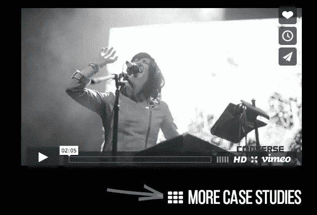
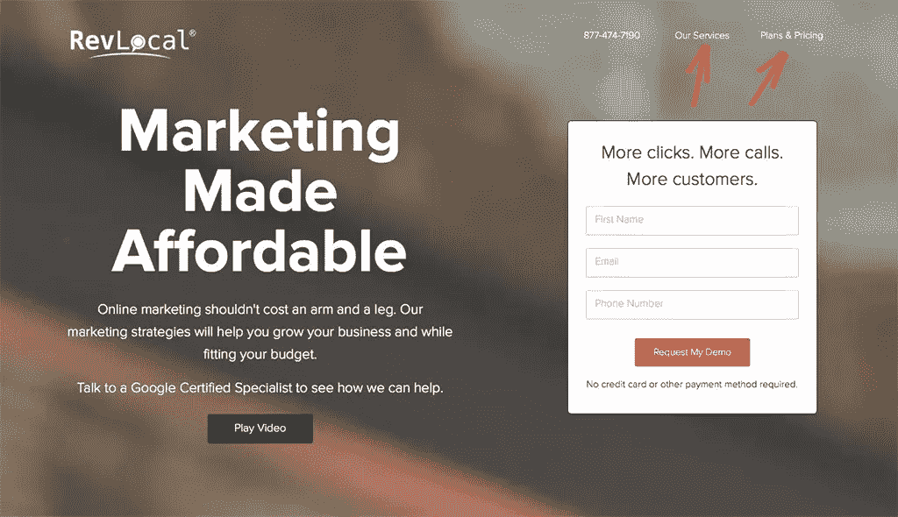
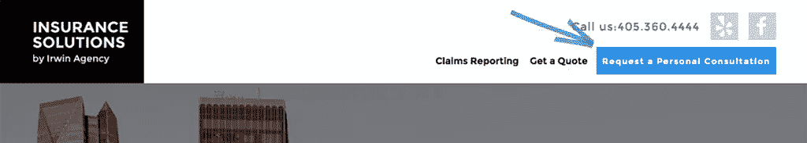

# 通过优先导航提高转化率的 4 个步骤

> 原文：<https://www.sitepoint.com/how-to-boost-conversions-with-prioritized-navigation/>

一个构思良好的导航策略可以成就或毁灭任何一个网站。如果做得好，你就规划了一条你希望网站访问者走的路，从而导致销售、潜在客户的产生或成功的表单提交。

当做错了，你基本上是让你的访客漫无目的地闲逛。他们有可能会找到你的目标，但可能不会。为什么要冒险呢？

好的 UX 不应该如此随意地对待转化——它应该牵着用户的手，提供他们可以理解的直观提示。这样，他们知道在哪里可以找到他们需要的东西，同时给予你一直想要的东西——一种转变。

在这篇文章中，我将向你介绍一个简单的策略，你可以在任何网站上使用它来提高转化率。

如果使用得当，你可以为客户提供一个不仅看起来很棒，而且能帮助他们成功实现商业目标的网站。

换句话说，你将成为他们的英雄。

## 第一步:采用登陆页面策略

根据我们对 2016 年在线营销的了解，每个网站都应该将登陆页面作为其转化策略的一部分。如果你把这个应用到重新设计中，这一步并不要求你删除现有的页面，而是在你已有的页面上添加。

这个想法是，你建立一个自包含的页面，包含所有必要的信息，以适当地说服访问者转换。登录页面的数量会有所不同，这取决于业务及其目标。为了简单起见，让我们用你自己的投资组合网站作为例子。

假设你同时提供**网页设计**和**标志设计**作为服务。除了展示您的作品的简单作品集页面，您还需要创建两个新的登录页面——每个服务一个。在每个登录页面上，您可以包括产品组合亮点、[一些令人信服的销售文案](http://unbounce.com/landing-page-copywriting/egocentric-landing-page-copy/)、您可以提供的优势列表、客户评价和清晰的行动号召(CTA。)

这些登陆页面的原因是这样的:你不希望你的访问者不得不点击从一页到另一页。在一个地方为他们提供所需的一切。这将会产生一个更集中的销售漏斗，你不会有失去他们的风险。

## 第二步:突出你的“钱”页

除了您的新登录页面之外，您认为还有哪些页面是转换过程所必需的吗？也许是一整页的推荐信？或者你的其他服务列表？

如果是这种情况，那么您有几个选择:

### 上下文链接

在登陆页面的正文中放置链接可以很好地引导网站访问者通过预先选择的路径。假设您的登录页面上有几个[案例研究](https://www.sitepoint.com/secrets-powerful-web-design-case-studies/)。您可能希望通过案例研究示例下面的上下文链接，让他们了解更多内容。

图片来源:[http://anthemicagency.com](http://anthemicagency.com)

### 有限的标题导航

另一种方法是选择你最上面的两到三页，通过一个精简的标题导航条链接到它们。以同样的投资组合网站为例，您可能希望在标题中包含两个登录页面的链接，允许访问者在您的不同产品之间来回切换。

图片来源:[http://revlocal.com](http://revlocal.com)

理想情况下，您会希望这个标题栏“有粘性”，这样当用户向下滚动页面时，它会保持不动。

## 第三步:淡化其他一切

你听说过“决策疲劳”吗？这基本上是说，给人们太多的选择，他们不太可能采取任何行动。有一个[著名的研究](https://sivers.org/jam)用果酱说明了这个概念。

研究人员在杂货店的小货架上摆放了五种果酱。路人会停下来看看选择，大多数停下来的人都会选择一个。那天晚些时候，他们增加了更多的选择，直到有 30 种果酱可供选择。人们会停下来看看，被众多的选择弄得不知所措，然后继续走。

这不是我们想要的网站。当你给访问者太多的导航选择时，他们可能看不到一条清晰的路径，并且犹豫不决。以下是解决方法:

***所有其他页面不应作为主要选项呈现。*它们将被指定为辅助导航。**

如何处理这种二级导航由您决定。您可以将它放在页面上另一个不太重要的位置(如页脚上方)，也可以选择将它存储在隐藏的抽屉菜单中，通过菜单按钮可以访问它。

是的，我知道这是 UX 专家之间的激烈辩论。他们中的许多人讨厌隐藏导航的想法，因为它制造了额外的障碍。但是请记住:*你的登陆页面和主要导航项目应该足以吸引用户。次级页面只为那些选择寻找它们的人而存在。*

通过消除不太重要的选项，(或者至少不强调它们)，人们面前将会有一条更清晰的道路，无论从哪方面来看，这都是很好的用户体验。

## 第四步:放置你的 CTA 按钮

一个清晰、强大的 CTA 是一个网站的全部目的。

按照我们同一个投资组合网站的例子，假设您的最终目标是让您的潜在客户填写表格，以便安排与您的咨询。一旦你想通了这一点，你会想把它放在一个最显眼的地方。

除了有策略地把它放在登陆页面的正文中，我还建议把它放在主标题导航中。

但是为了让它从其他两三个导航选项中脱颖而出，你应该把它设计成一个按钮。这给了它更多的视觉冲击力，特别是如果它是一种明亮的颜色，与网站上的其他内容形成鲜明的对比。

Img 来源:[http://insurance-solutions.com](http://insurance-solutions.com)

## 将它们放在一起

完成上述步骤后，您就成功地确定了导航的优先级，创建了一个定义良好的层次结构:

1.  **最重要:** CTA 按钮
2.  **中等重要性:**主要导航项目
3.  **不太重要:**隐藏或不强调的次级导航项目

通过创建这个层次结构，您应该会看到转化率的整体增长，因为您的 CTA 旨在脱颖而出，而您的其他主要导航元素则起到辅助作用。

所有其他在转变过程中不重要的因素都被隐藏起来，消除了对手头目标的干扰。

## 最终想法

作为网页设计师，我们能为客户做的最重要的事情是最大限度地利用他们最大的营销工具——他们的网站。通过创建清晰的转化路径，我们可以确保我们为客户的成功做出了贡献。正是这种附加价值将使你从其他设计师中脱颖而出，让你可以用更多的预算去追求更大的客户。

毕竟，一个漂亮的网站是伟大的，但一个实际上导致更多转换的网站每次都是一个扣篮。

## 分享这篇文章