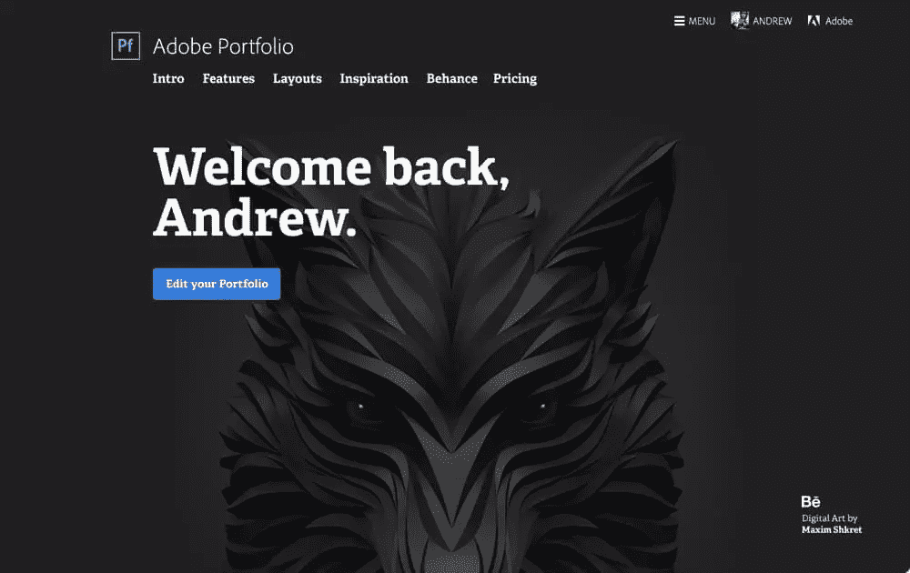
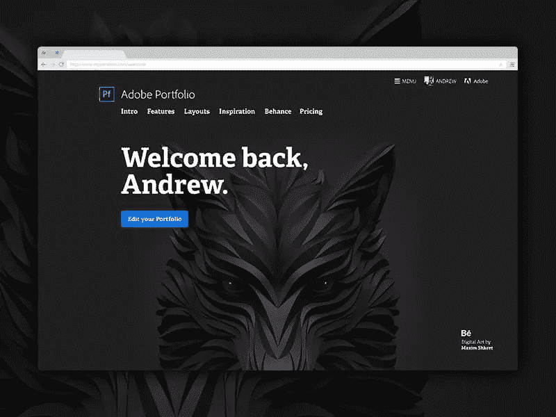
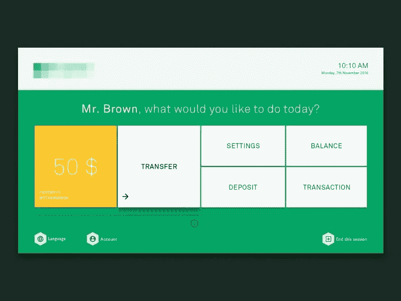
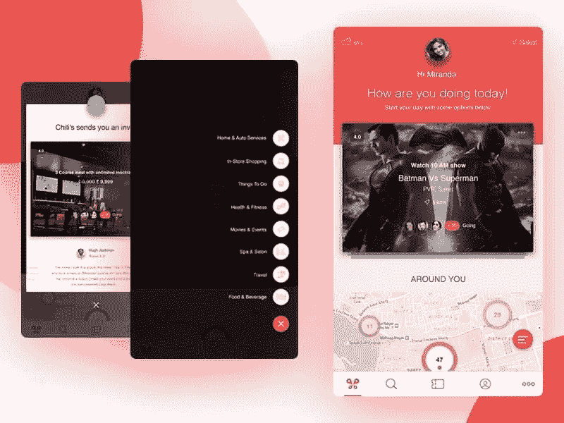
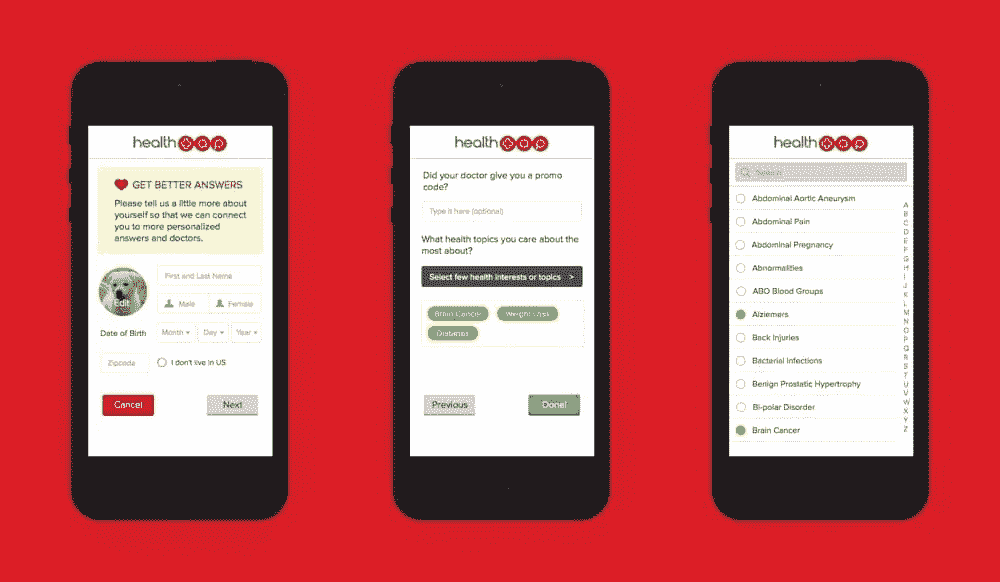

# 如何通过个性化用户界面提升幸福感和参与度

> 原文：<https://www.sitepoint.com/how-to-boost-engagement-with-personalized-uis/>

个性化，或者更具体地说，*个性化用户界面*，是这些热门设计趋势之一。这当然不是一个新的设计概念，但它符合 2017 年用户导航内容的方式，就像拼图的最后一块。

但是为什么呢？

UI 设计是一种平衡行为。设计师希望使用有效和成熟的设计技术，但他们也需要通过创造一些新鲜的东西来帮助他们的品牌从竞争中脱颖而出，当设计师依赖可靠的技术时，这可能很难。

虽然优秀的设计没有一成不变的模式，但现代用户界面设计师必须找到方法来利用设计技术，这些技术不仅高效，还能给用户留下深刻印象。

这个问题的解决方案不是下周之前就过时的视觉趋势，而是设计*个性化的*用户界面和用户体验，它们是**专门为个人用户**量身定制的。

【Luke Hay 在他的书《研究 UX:分析》中介绍了数据驱动的 UX，这本书的购买价格为 19 美元，SitePoint Premium 订阅用户可以免费获得！

。

## 那么什么是个性化呢？

当我说个性化时，我指的是定制/策划的内容，记住用户的名字，并使用对话语气(仅举几个例子)。

个性化有助于将相关内容传递给用户⏤可以说，它有助于“减少废话”。当用户开始看到对他们没有吸引力或不适用的内容时，他们开始失去兴趣。

然后那个用户**丢失**。

让我们来看看移情如何帮助我们设计用户界面，以一种吸引人的、更像人类的方式与用户“对话”，或者设计利用后端代码在幕后交付相关内容的体验。

## 同理心如何培育更好的 UX

你可能会很惊讶地发现，阿提克斯·芬奇的《杀死一只知更鸟》的建议在 UX/用户界面设计中的重要性不亚于它在日常生活中的重要性:

> “你永远不会真正了解一个人，除非你站在他的角度考虑问题……除非你爬到他的皮肤里，在里面走来走去。” ~阿提克斯雀。

感同身受不仅仅是简单地想象什么会让用户体验更好，它需要你花时间去思考作为用户，实际使用你设计的界面会是什么样子。

同理心需要了解你的受众；你的人口统计。想象自己点击他们的鼠标，敲击他们的键盘按钮⏤当你这样做的时候，你会体验到他们的问题，然后你就可以开始想出直观的解决方案来解决他们/你面临的问题。

就像我们使用同理心来提高可用性和可访问性一样，我们可以使用同理心来创建个性化的 ui，提高用户满意度和用户参与度。

让我们来看看是如何做到的。

## 记住用户名

高中第一年。

“你好斯蒂芬！”👋

她记得我的名字。

我觉得一开始我对她没那么感兴趣。我们只见过一次面，是在高中的第一天，但她记得我的名字。关系建立在忠诚、信任和共同利益的基础上，但正是这小小的努力开启了友谊。

为什么？因为我们建立了*个人*联系。

我们都知道计算机不是人类，但是如果你手头有用户的数据，为什么不充分利用它呢？记住用户的一些小事会让他们觉得自己很特别，最终会提高幸福感和参与度。

## 以对话的语气对用户说话

“布朗先生，你今天想做什么？”

人们对此的反应有三个原因。

首先，语调让用户界面听起来像是一个人在开始对话。其次，得到回应的最好方式是问一个问题。第三，该陈述建议用户需要采取行动，并且该行动需要是一种选择。它不仅友好和吸引人，而且对用户有指导和帮助。

## 由数据驱动的个性化用户界面和内容

如前所述，当用户开始看到太多与他们无关或不感兴趣的内容时，他们会比闪电还快地点击后退按钮。

在我们生活的世界里，在线内容是如此容易获取，以至于有太多的内容可供选择，而且由于一天只有 24 小时，用户需要对他们选择将宝贵的时间花在什么上面进行挑剔。

如果一个界面主要是由内容驱动的，设计师需要利用特定类型的数据来传递用户想要阅读的内容。这些类型的数据是:

1.  年龄
2.  位置
3.  兴趣
4.  设备
5.  欢迎在评论中提出更多建议！

大多数情况下，这些信息不是免费提供的，然而，许多大品牌(尤其是社交网络)倾向于在入职体验期间收集这些类型的数据，以提供相关广告、建议内容或供进一步阅读的内容。

## 结论

个性化是根据个人的需求和兴趣来定制内容。⏤说到底，决定一个设计成败的是你提供的体验，而不是你选择的流行颜色或你实现的花哨的画布外导航。个性化是我们提供卓越 UX 的主要方式之一，不仅在 2017 年，而且在未来许多年都是如此。

## 分享这篇文章