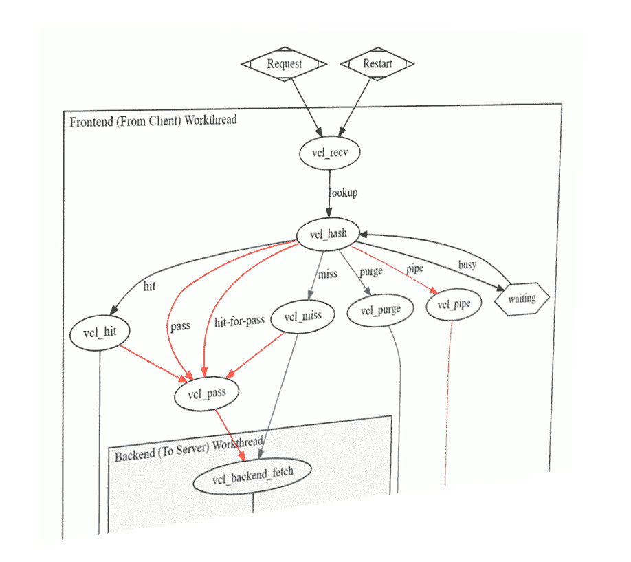
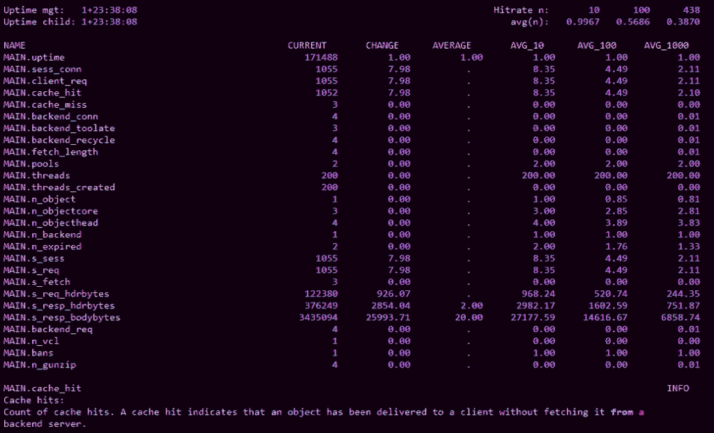
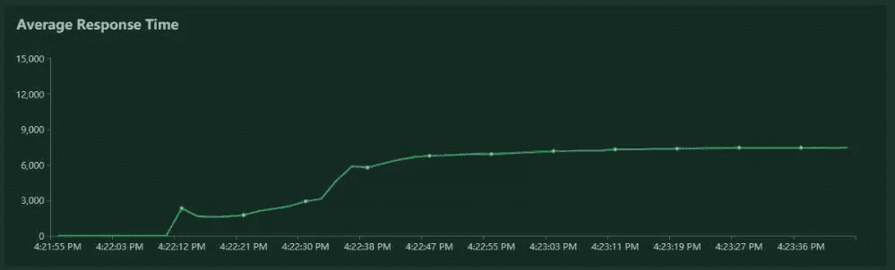
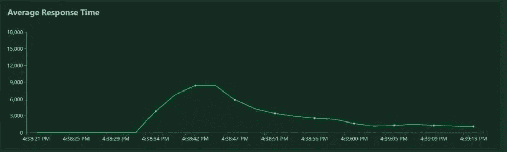
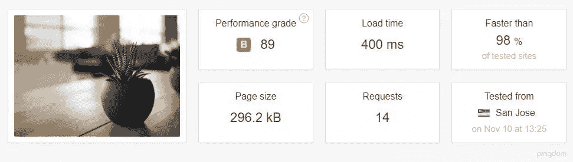
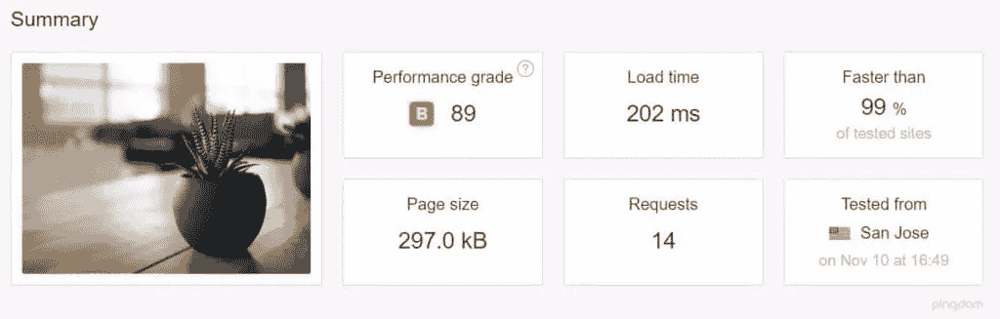
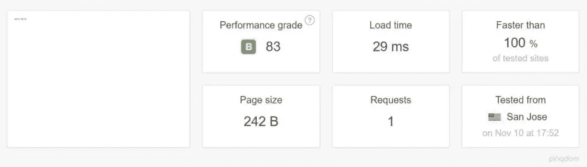
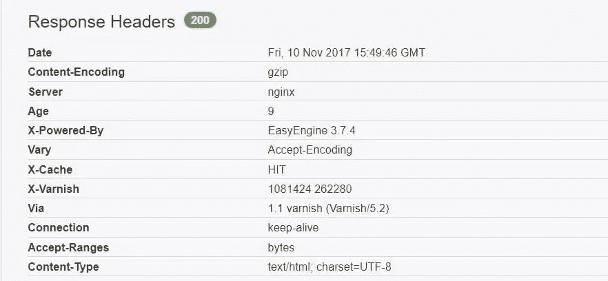

# 如何使用 Varnish 提升您的服务器性能

> 原文：<https://www.sitepoint.com/how-to-boost-your-server-performance-with-varnish/>

**Varnish Cache 是由丹麦顾问和 FreeBSD 核心开发者 [Poul-Henning Kamp](https://www.wikiwand.com/en/Poul-Henning_Kamp) 和挪威的其他开发者 [Linpro AS](https://www.redpill-linpro.com/) 共同开发的 [HTTP 加速器](https://en.wikipedia.org/wiki/Web_accelerator)和[反向代理](https://en.wikipedia.org/wiki/Reverse_proxy)。是 2006 年[发布的](https://varnish-cache.org/lists/pipermail/varnish-announce/2006-September/000638.html)。**

[据专注于网络性能的公司 Pingdom.com](http://royal.pingdom.com/2012/07/11/how-popular-is-varnish/)称，2012 年，Varnish 已经因其加速网络交付的能力而闻名于世界顶级网站，并被 Wired、SlideShare、Zappos、SoundCloud、Weather.com、Business Insider、Answers.com、Urban Dictionary、MacRumors、DynDNS、OpenDNS、Lonely Planet、Technorati、ThinkGeek 和 Economist.com 等网站使用。

它是在一个双条款的 BSD 许可下被许可的。Varnish 有一个高级层， [Varnish Plus](https://www.varnish-software.com/pricing/varnish-plus/) ，专注于企业客户，它提供一些[额外的功能、模块和支持](https://www.varnish-software.com/products/varnish-plus/)。

尽管有其他解决方案也同样[闪耀](https://deliciousbrains.com/page-caching-varnish-vs-nginx-fastcgi-cache/)，Varnish 仍然是一个可以显著提高网站速度、减轻网络应用服务器 CPU 压力的首选解决方案，甚至可以作为防御 DDoS 攻击的[保护层。](https://www.htpcguides.com/wordpress-ddos-attack-protection-varnish-4-firewall/) [KeyCDN 建议](https://www.keycdn.com/support/using-a-varnish-cdn-stack-with-keycdn/)将其部署在原始服务器堆栈上。

Varnish 可以放在一台专用的机器上，以应对要求更高的网站，并确保源服务器不会受到大量请求的影响。

在撰写本文时(2017 年 11 月)，Varnish 的版本为 [5.2](https://varnish-cache.org/docs/5.2/whats-new/changes-5.2.html) 。

## 它是如何工作的

[缓存](https://en.wikipedia.org/wiki/Cache_(computing))通常通过将预先计算好的应用程序输出保存在内存或磁盘上来工作，这样就不必对每个请求反复进行昂贵的计算。 [Web 缓存](https://en.wikipedia.org/wiki/Web_cache)可以在客户端(浏览器缓存)，也可以在服务器端。清漆属于第二类。它通常被配置为在标准 HTTP 端口(80)上侦听请求，然后将请求的资源提供给网站访问者。


第一次请求某个 URL 和路径时，Varnish 必须从源服务器请求它，以便提供给访问者。这被称为缓存未命中，可以在 HTTP 响应头中读取，这取决于 Varnish 设置。

根据[文件](https://www.varnish-software.com/wiki/faq/index.html)，

> 当一个对象(任何类型的内容，如图像或页面)没有存储在缓存中时，我们就有了通常所说的缓存未命中，在这种情况下，Varnish 将从 web 服务器获取内容，将其存储并向用户提供副本，并将其保留在缓存中以响应未来的请求。

当特定的 URL 或资源被 Varnish 缓存并存储在内存中时，可以直接从服务器 RAM 中提供服务；不需要每次都计算。Varnish 将在几微秒内开始提供缓存命中。


这意味着无论是我们的源服务器还是我们的 web 应用程序，包括它的数据库，都不会受到未来请求的影响。他们甚至不会意识到缓存的 URL 上加载的请求。

源服务器——或者服务器，如果我们[使用 Varnish 作为负载平衡器](http://opentsdb.net/docs/build/html/user_guide/utilities/varnish.html)——被配置为监听一些非标准端口，比如 8888，Varnish[知道它们的地址和端口](http://devdocs.magento.com/guides/v2.1/config-guide/varnish/config-varnish-configure.html)。

## 清漆特征

**清漆是[螺纹](https://book.varnish-software.com/4.0/chapters/Tuning.html#threading-model)。**据[报道【Varnish 在单个实例上每秒能够处理超过 20 万个请求。如果配置得当，web 应用程序的唯一瓶颈将是网络吞吐量和内存量。(这应该不是一个不合理的要求，因为它只需要在内存中保存计算过的网页，所以对于大多数网站来说，几个千兆字节就足够了。)](https://kly.no/posts/2010_01_26__Varnish_best_practices__.html)

**清漆可通过[VMODS](https://info.varnish-software.com/blog/varnish-modules-vmods-overview)扩展。这些模块可以使用标准 C 库并扩展 Varnish 功能。这里列出了社区贡献的 VMODS。它们的范围从头部操作到 Lua 脚本、请求节流、认证等等。**

**Varnish 有自己特定领域的语言，[VCL](http://book.varnish-software.com/4.0/chapters/VCL_Basics.html)。VCL 提供了全面的可配置性。对于像 Varnish 这样的全页面缓存服务器，有许多错综复杂的问题需要解决。**



当我们用 GET 查询参数缓存一个有几十或几百个页面和路径的动态网站时，我们会希望从缓存中排除一些页面和路径，或者设置不同的缓存过期规则。有时我们想要缓存某些 Ajax 请求，或者将它们从缓存中排除。这个因项目而异，无法提前量体裁衣。

有时我们希望 Varnish 根据请求头来决定如何处理请求。有时，我们会希望使用某个 cookie 集将请求直接传递到后端。

引用[清漆书](http://book.varnish-software.com/4.0/chapters/VCL_Basics.html#summary-of-vcl-basics)，

> VCL 提供子例程，允许您在执行链的几乎任何地方影响任何单个请求的处理。

清除缓存通常需要动态完成——由发布文章或更新网站触发。清除也需要尽可能地以原子方式完成——这意味着它应该以尽可能小的范围为目标，比如单个资源或路径。

这意味着需要定义特定的规则，并记住它们的优先级顺序。一些例子可以在清漆书中找到(可以在线阅读或者作为[可下载的 PDF](https://info.varnish-software.com/the-varnish-book) )。

Varnish 有一套用于监控和管理服务器的[工具:](http://book.varnish-software.com/4.0/chapters/Appendix_B__Varnish_Programs.html)

*   还有`varnishtop`，它让我们监控请求的 URL 和它们的频率。

*   `varnishncsa`可以用来打印 *Varnish 共享内存日志* (VSL):它转储指向某个域和子域的所有东西。

*   `varnishhist`读取 VSL 并呈现一个实时直方图，显示最近请求数的分布，从而提供服务器和后端性能的概述。

*   `varnishtest`用于测试 VCL 配置文件和开发 VMODS。

*   `varnishstat`显示关于 varnishd 实例的统计数据:

    

*   `varnishlog`用于获取关于特定客户端和请求的数据。

[Varnish 软件](https://www.varnish-software.com/)提供了一套商业的付费解决方案，这些解决方案要么建立在 Varnish 缓存之上，要么扩展其用途并帮助监控和管理: [Varnish Api 引擎](https://www.varnish-software.com/products/varnish-api-engine/)、 [Varnish 扩展](https://www.varnish-software.com/products/varnish-extend/)、[用于 Varnish 的 Akamai 连接器](https://www.varnish-software.com/products/akamai-connector-for-varnish/)、 [Varnish 管理控制台(VAC)](https://www.varnish-software.com/plus/varnish-administration-console/) 和 [Varnish 自定义统计(VCS)](https://www.varnish-software.com/plus/varnish-custom-statistics/) 。

## 安装清漆

清漆文件[涵盖各种系统](https://varnish-cache.org/docs/5.0/installation/install.html)上的安装。在这篇文章中，我们将选择 Ubuntu 16.04 LTS 版。

[Packagecloud.io](https://packagecloud.io/varnishcache/varnish5/install#manual-deb) 有更新 Ubuntu 库和安装 Varnish 版本 5 的说明:

```
curl -L https://packagecloud.io/varnishcache/varnish5/gpgkey | sudo apt-key add -
sudo apt-get update
sudo apt-get install -y apt-transport-https 
```

然后，我们向新创建的文件`/etc/apt/sources.list.d/varnishcache_varnish5.list`添加以下几行:

```
deb https://packagecloud.io/varnishcache/varnish5/ubuntu/ xenial main
deb-src https://packagecloud.io/varnishcache/varnish5/ubuntu/ xenial main 
```

然后我们运行:

```
sudo apt-get update
sudo apt-get install varnish 
```

我们可以在 Nginx 上测试一个全新的 WordPress 安装。首先，我们将 Nginx 的默认监听端口从 80 更改为 8080——这是 Varnish 期望后端运行的端口——方法是在服务器子句中向 Nginx 虚拟主机添加以下行:

```
server {       
  listen 127.0.0.1:8080 default_server;
  listen [::]:8080 default_server; 
```

然后我们配置 Varnish:我们编辑`/etc/default/varnish`，将端口 6081 替换为 80(默认的 web 端口):

```
DAEMON_OPTS="-a :80 \
   -T localhost:6082 \
   -f /etc/varnish/default.vcl \
   -S /etc/varnish/secret \
   -s malloc,256m" 
```

我们还需要改变`/lib/systemd/system/varnish.service`，进行同样的替换:

```
[Service]
Type=simple
LimitNOFILE=131072
LimitMEMLOCK=82000
ExecStart=/usr/sbin/varnishd -j unix,user=vcache -F -a :80 -T localhost:6082 -f /etc/varnish/default.vcl -S /etc/varnish/secret -s malloc,256m
ExecReload=/usr/share/varnish/reload-vcl
ProtectSystem=full
ProtectHome=true
PrivateTmp=true
PrivateDevices=true 
```

然后我们重启 Nginx 和 Varnish:

```
sudo service nginx restart
sudo /etc/init.d/varnish restart 
```

*警告:由于某些特性，Varnish 通常必须重启——或者以这种方式启动，而不是用`service varnish start` —以便读取我们编辑的所有配置文件。*

我们用 [Locust](https://locust.io) 和 [Pingdom Tools](https://tools.pingdom.com) 测试了网站速度和响应能力。

一旦缓存预热，差异就令人印象深刻，尽管 Nginx 以其速度而闻名:*每秒的平均请求数乘以三到四倍*，响应时间大大减少。由于网络延迟，加载时间稍长，因为我们从欧洲的工作站测试了位于加州的网站。

【Nginx 的蝗虫结果:



**Nginx+清漆的蝗虫结果:**



Pingdom 的结果也很好。

【Nginx 堆栈的 Pingdom 结果，在加利福尼亚测试:



**加州 Nginx + Varnish 的 Pingdom 结果:**



还要注意每种情况下的 [TTFB](https://en.wikipedia.org/wiki/Time_to_first_byte) 。

**Nginx 单独:**


**Nginx +清漆:**


即使我们忽略了粉色部分，也就是 DNS 查找，还是有很明显的区别。

## 设置简单

Varnish 不关心端口 8080 上监听的是什么(如果需要，我们也可以更改这个默认端口)。这意味着设置 Apache 或其他应用服务器应该同样简单:我们需要做的就是配置它们在端口 8080 而不是 80 上监听。

### 用节点设置清漆

在我们现有的服务器上，我们已经安装了 Varnish，设置 hello-world 节点应用程序也一样简单。我们安装了`nodejs`和`npm`包，并将 nodej 链接到 Node:

```
ln -s /usr/bin/nodejs /usr/bin/node 
```

然后我们创建了一个简单的节点 *hello-world* 程序监听端口 8080:

```
#!/usr/bin/env nodejs

var http = require('http');
http.createServer(function (req, res) {
      res.writeHead(200, {'Content-Type': 'text/plain'});
      res.end('Hello World\n');
}).listen(8080, 'localhost');

console.log('Server running at http://localhost:8080/'); 
```

然后，我们安装了 Node 的包管理器 [PM2](http://pm2.keymetrics.io/) ，以便能够对我们的应用程序进行后台管理:

```
sudo npm install -g pm2

pm2 start index.js 
```

瞧——我们的节点应用程序由 Varnish 提供服务:



## 其他提示

为了能够控制我们的请求是否缓存在我们的浏览器检查器中，我们应该将下面的代码片段添加到我们的 Varnish 配置文件中的`sub vcl_deliver`块中:

```
sub vcl_deliver {
  if (obj.hits > 0) {
    set resp.http.X-Cache = "HIT";
  } else {
    set resp.http.X-Cache = "MISS";
  }
} 
```

然后，我们可以在我们的响应标题中看到反馈，如*命中或未命中*:



还有一个警告:Varnish(或者至少是开源版本)[不支持 SSL](https://varnish-cache.org/docs/trunk/phk/ssl.html) ，它的创造者 Poul-Henning Kamp 再次[重申了这一点](https://varnish-cache.org/docs/trunk/phk/ssl_again.html)(他是[不羞于表达自己的观点](http://queue.acm.org/detail.cfm?id=2716278))。所以当你需要使用 Varnish 和 HTTPS 的时候，考虑在它前面使用另一个代理来进行 [SSL 终止](https://komelin.com/articles/https-varnish)——比如 [haproxy](https://z0z0.me/create-your-own-cdn-with-haproxy-and-varnish/) ，或者 Varnish 自己的[挂接](https://github.com/varnish/hitch)。

或者，如果这太复杂，就使用 [Nginx 和 FastCGI 缓存](https://www.scalescale.com/tips/nginx/configure-nginx-fastcgi-cache/#)。

## 结论

在本文中，我们试图对 Varnish Cache 做一个简单的介绍，但不深入其设置、监控和管理。

调优服务器性能是一门独立的科学，要展示用例及设置的全部范围需要另一篇文章。我将在另一篇文章中更深入地探讨这个主题，所以请继续关注下一期，我将在真正的应用程序前添加清漆。

## 分享这篇文章