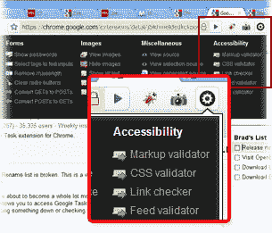
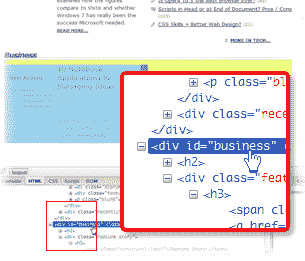
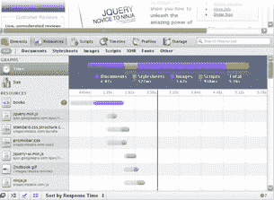
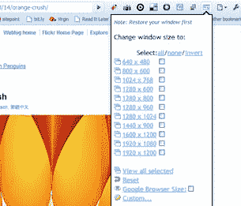

# 如何和火狐分手

> 原文：<https://www.sitepoint.com/how-to-break-up-with-firefox/>

告白时间:在我 T 恤衫抽屉后面的某个地方，有一件黑色 t 恤，上面有一只红色恐龙，还有一块苏联工业字体的“Mozilla”字样。那是在火狐年轻洒脱，我们相爱的时候。

啊，火狐。我们到底怎么了？

当时，把 Chrome 拿出来没什么大不了的——一开始只是为了好玩。它感觉聪明、通风、干净，但是当需要严肃的东西的时候，我总是会回到 Firefox 的家里。

Chrome 是我有趣的周末“甜蜜之旅”，而 Firefox 是我明智的带拖车的工作 SUV。

问题是，我回家的时间越来越长。有一天我意识到我已经一周没打开 Firefox 了。

我现在是 Chrome 用户。

也许你也有过这样的想法，但是一直在想，“哦，我会太想念 extension *X* 了。”嗯，也许不是。让我给你介绍一下我所依赖的五个 Chrome 扩展。

#### 摆动的

火狐最早也是最持久的开发者扩展之一是 Chris Pederick 精彩的 [Web 开发者工具栏](http://chrispederick.com/work/web-developer/)。它最接近的 Chrome 版本是[克里斯蒂安·弗雷的摆锤](https://chrome.google.com/extensions/detail/gbkffbkamcejhkcaocmkdeiiccpmjfdi#)。

###### 钟摆在动

Pendule 从 Pendule 按钮打开一个大面板，提供名副其实的 web 开发工具瑞士军刀，包括验证器、生成的源视图、图像维度视图、颜色选择器、屏幕标尺等等。总之，不可或缺。或许还值得一提的是 Filippo Baruffaldi 的 Chrome Web Developer Tools，这是 Chris Pederick 扩展的一个毫无顾忌的克隆。虽然它很有冲击力，但迷宫般的用户界面在变得真正有用之前还需要做一些工作。这当然是一个值得期待的未来。

#### 萤火虫建兴

我怀疑开发人员可能会对火狐感到依赖的一个最大原因是乔·休伊特备受尊敬的[Firebug 扩展](http://getfirebug.com/)。在 Firebug 出现之前，精英开发人员部分是萨满，部分是*浏览器*耳语者——有天赋的人类拥有不可思议的能力，可以洞察陷入困境的浏览器的思想并理解它。Firebug 是第一个可以让任何人进入浏览器的大脑，看到它到底在想什么的扩展。这对我们许多人来说是一个启示。

###### 萤火虫建兴

目前 Firebug 只在 Chrome 上有它的精简版本。这意味着无法访问网络和 JavaScript 调试面板。这对你来说可能是个问题，但它肯定不会对我大部分时间的工作方式产生大的影响。话又说回来，你甚至可能根本不需要 Firebug。Chrome 内置的 Web Developer Tools 面板(当然是 Safari 共享的)有一个复杂的选项卡式界面，模仿了 Firebug 的许多最酷的功能，甚至还有一些新功能。

###### Chrome 日益先进的内置网络开发工具

#### 网页截图

这里有两种方法可供选择。Aviary 和 [Picnik](https://chrome.google.com/extensions/detail/hcifofgaphfkfdcjbdogpamghiihilkl) 都制作了很好的截屏扩展，旨在与他们优秀的在线编辑直接交互。这些都很棒，但通常我只是想要一个可以直接粘贴到 Fireworks 或 Photoshop 中进行重塑的整页截屏。令人高兴的是，[网页截图](https://chrome.google.com/extensions/detail/ckibcdccnfeookdmbahgiakhnjcddpki)完全符合这个要求。可爱的相机图标允许您选择是只捕捉可视屏幕区域还是捕捉整个呈现的页面。它还提供了一些基本的图像标签选项。这就是全部了。超级简单，很管用。

#### 分辨率测试

尽管当前固定宽度设计的趋势已经使它变得不那么重要了，但是我们都在一系列的分辨率下测试我们的站点。[分辨率测试](https://chrome.google.com/extensions/detail/idhfcdbheobinplaamokffboaccidbal)让您快速获得一组现成的常用屏幕尺寸，并能够设置自定义屏幕尺寸。说够了。

###### 网页截图

如果你正在寻找一个替代方案， [Window Resizer](https://chrome.google.com/extensions/detail/kkelicaakdanhinjdeammmilcgefonfh) 执行类似的任务，并包括一些有趣的屏幕预设。其中包括“iPhone、Android、Palm Pre”、“旧电脑”和“不是那台旧电脑”

#### 滴管

[Eye Dropper](https://chrome.google.com/extensions/detail/hmdcmlfkchdmnmnmheododdhjedfccka) 是另一个精简的、完美的、一招到位的扩展。我很肯定你能猜到它是干什么的。虽然 Pendule 也包含了一个简单的颜色选择器，但我更喜欢 Eye Dropper，因为它可以让你采样屏幕颜色，并从头开始混合颜色。

###### 滴管

#### 总结

让我们明确一点:总的来说，Chrome 的扩展目前比 Firefox 稍逊一筹。Chrome 平台和社区显然仍处于早期阶段，很有可能某个扩展会缺少次要功能或一些可靠性。我还想补充一点，以我的经验来看，Chrome Mac 目前比 Chrome Windows 稍显粗糙。另一方面，Chrome 扩展库的规模和复杂度也在日益增长。经验告诉我们，谷歌的主流产品(例如，Gmail、Docs、Maps、Android 等等)会持续快速发展，所以可以预期这种差距会迅速缩小。和另一个小但重要的快乐。Chrome 可以让你安装和删除任何扩展，而无需重启浏览器。是的，我知道这看起来相当无关紧要，但是 ***爱*** 它。你觉得怎么样？你和火狐的关系是否坚如磐石，足以承受一次尝试性的分离？是的，这是一个挑战…

###### 从设计视图#69 重新发布

## 分享这篇文章