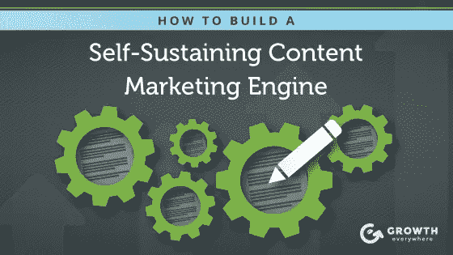
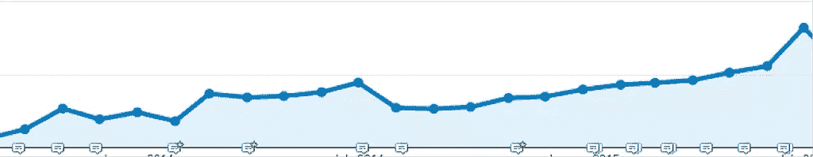
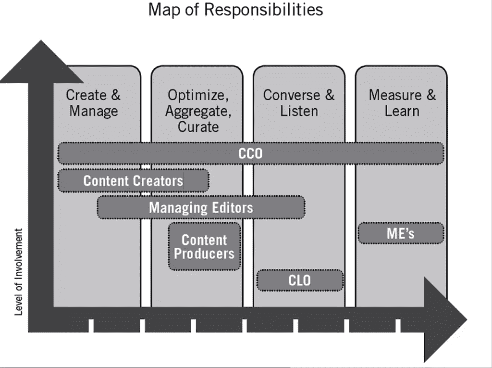
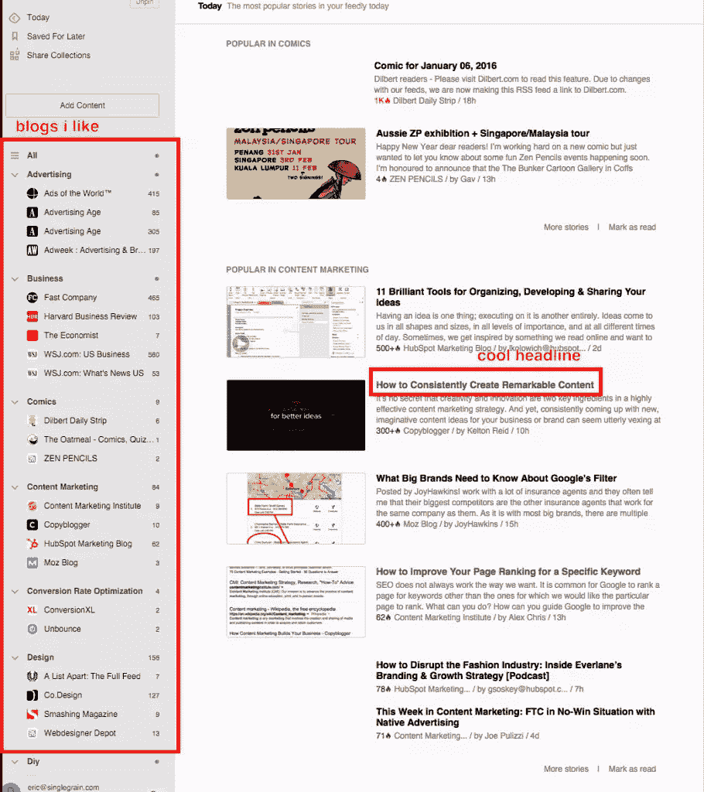
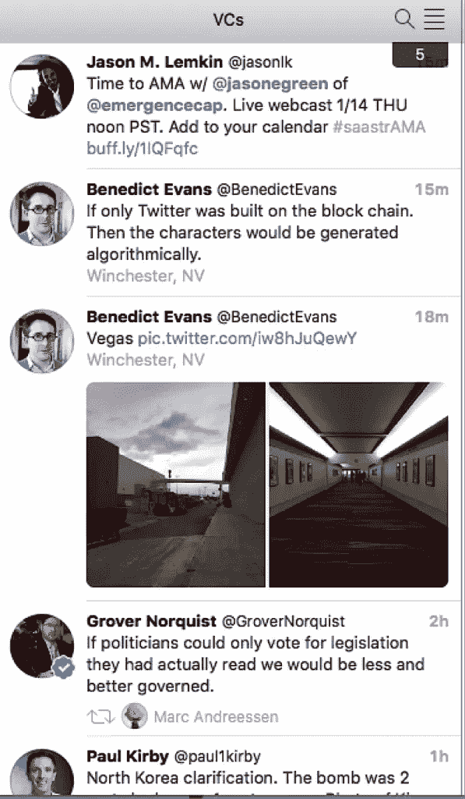
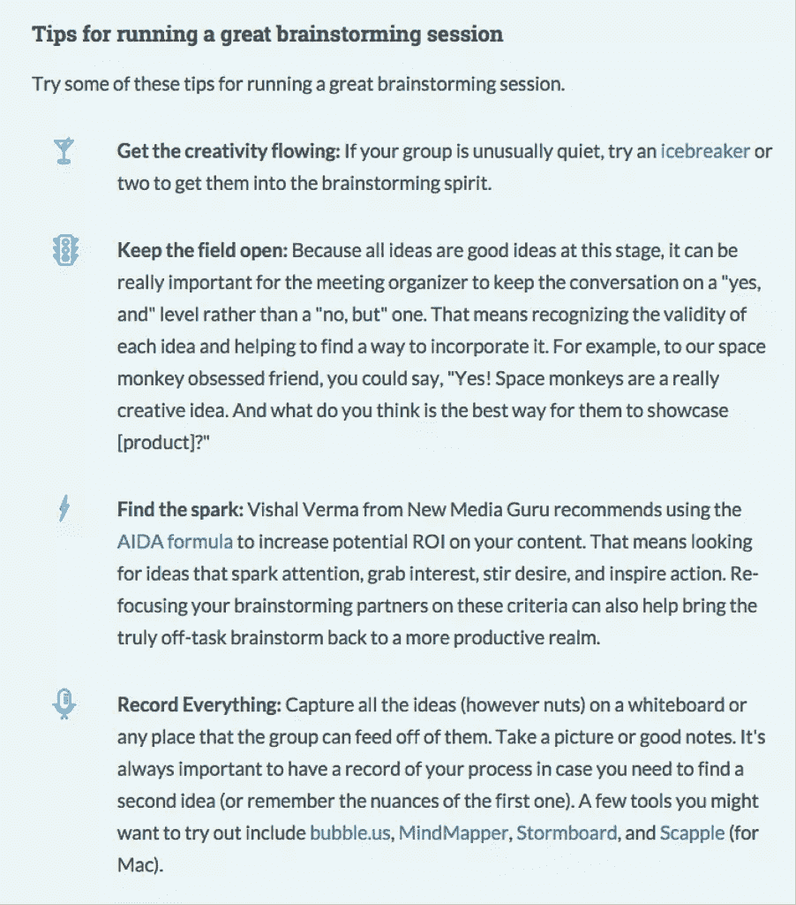
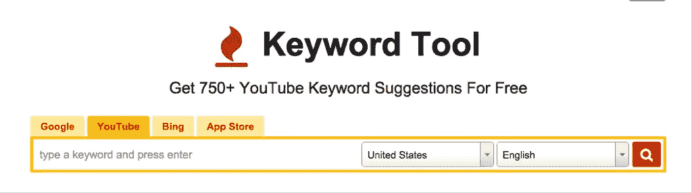
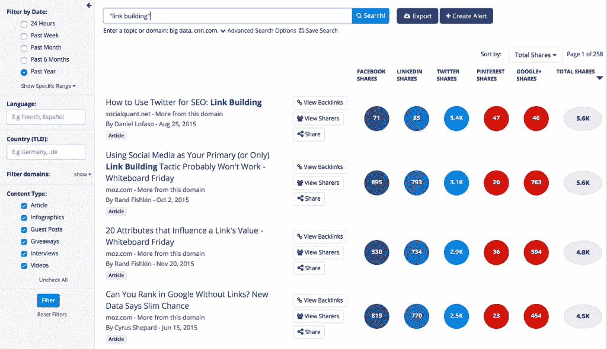
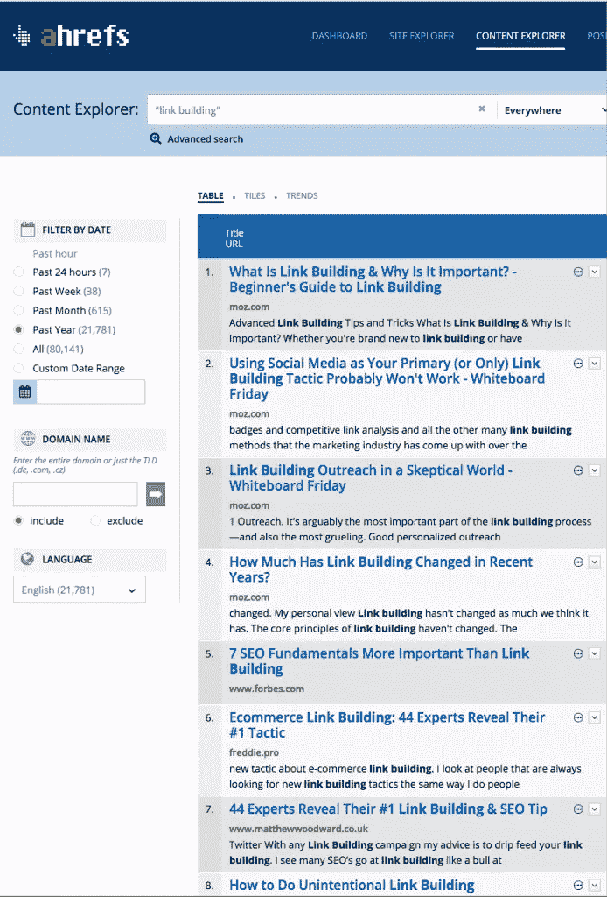
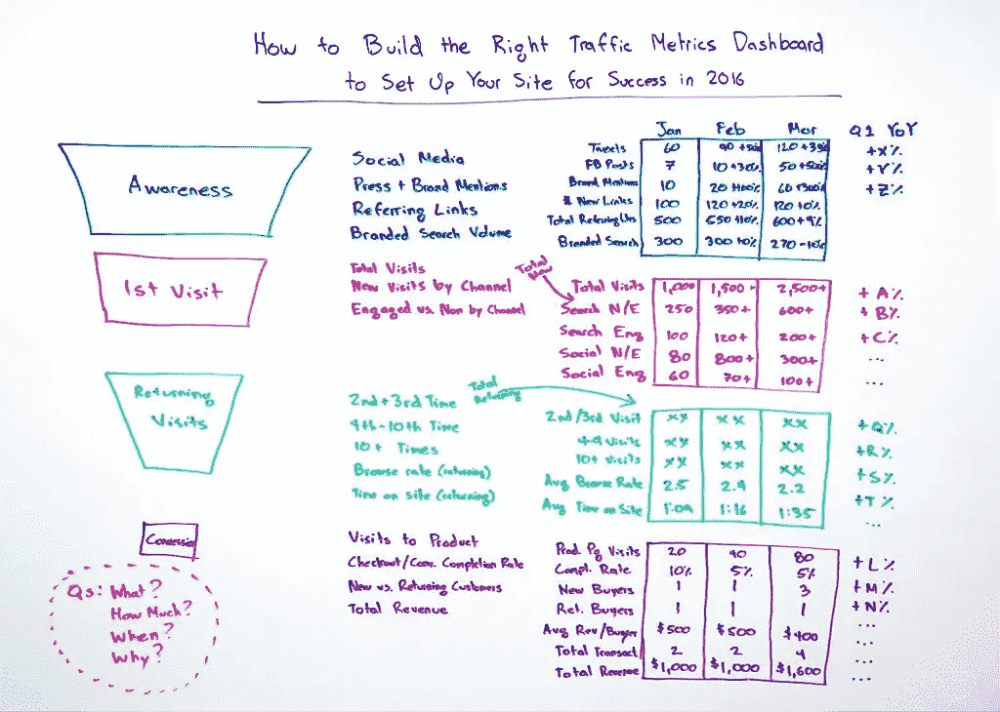

# 如何建立一个自我维持的内容营销引擎

> 原文：<https://www.sitepoint.com/how-to-build-a-self-sustaining-content-marketing-engine/>

*本文最初发表于[增长无处不在](https://growtheverywhere.com/content-marketing/build-self-sustaining-content-marketing-engine-template/%E2%80%9D%20rel=)。*

如今，随着越来越多的企业开始理解 T2 作为媒体公司运营的必要性，越来越多的内容被制作出来。

这很公平。内容营销的结果不可否认:

所以问题是这样的:**你如何创建一个自我维持的内容营销引擎？**所有运动部件像一个整体一样流动就能高效运转的发动机？

这个练习我已经经历过几次了(在这个过程中失败了)。

在这篇文章中，**我将给你一个模板来构建你自己的内容营销引擎**。每个企业都是不同的，所以取其最有意义的，并将其融入你的公司。

## 1.团队

如果你要创建一个内容营销引擎，你将需要帮助。一个人不可能独自完成所有的事情。

下面是一个小公司如何组建团队的例子:

*   编者ˌ编辑
*   设计师
*   社交媒体专家/个人拓展
*   付费广告专家
*   作家

让我们稍微讨论一下这些角色:

### 编者ˌ编辑

编辑负责确保您的内容符合标准，得到预定，并遵循您的内容流程。在某种意义上，他们可以被看作是你的内容机器的执行者。对于较大的公司，你可能有一个内容营销经理，内容战略总监，内容副总裁或首席内容官。

哪里可以找到好的编辑:

*   Inbound.org 和 Growthhackers.com——这些社区是营销人员发布最新营销新闻的地方。他们也有工作公告板，你可以在上面发布你的工作。
*   Problogger.net——pro blogger 有一个工作板，你可以在那里雇佣作家或编辑。这里的人才质量更高，因为 Problogger 被视为学习如何正确写博客的强大资源。
*   Craigslist——不要嘲笑 Craigslist。我发现的一些最优秀的人才来自 Craigslist。这一切都是为了有一个强大的招聘漏斗开始。
*   推荐——如果你需要帮助，总是一个很好的开始。

### 设计师

设计者帮助使你的内容的图像看起来漂亮。请记住，您的图像和图形的外观反映了您的品牌，并且具有[优秀图像的内容会获得更多的参与度](http://www.socialmediaexaminer.com/photos-generate-engagement-research/)

哪里可以找到优秀的设计师:

*   Behance 和 Dribbble——这两个网站都是展示个人设计师作品的目录。我个人比较喜欢 Dribbble。
*   Visual.ly——如果你正在寻找信息图设计师，visual . ly 是你应该去的地方。
*   推荐——如果你需要帮助，总是一个很好的开始。

### 社交媒体专家/个人拓展

社交媒体专家将倾听并与你的观众互动。他们还负责策划你的观众可能感兴趣的内容。如果你想知道你的自我推销和外部内容的比例应该是多少，我建议是 1:4。这意味着，对于每一个自我推销的份额，你应该有四个策划的份额。

个人拓展包括接触:

*   内容片段中提到的人
*   分享过类似内容并且可能对分享你的作品感兴趣的人
*   你认识的人

找到正确的联系信息，然后给人们发电子邮件，跟进，一遍又一遍地重复，这是一项单调乏味的工作。在理想世界中，这本身就是一个角色。可能是资历更浅的人。

如果你是一个较小团队的一部分，我建议对这个人进行[个人拓展](http://growtheverywhere.com/content-marketing/content-expansion/)和付费内容推广的培训。较小的团队成员需要身兼数职，而这些职责最适合这个人。

哪里可以找到优秀的社交媒体专家:

*   脸书集团:社交媒体工作——信不信由你，这是脸书的一个杀手集团，社交媒体专家一直在那里寻找工作。我在这里发现了一些不可思议的天才。
*   [Inbound.org](http://inbound.org)和[Growthhackers.com](http://growthhackers.com)——这些社区是营销人员发布最新营销新闻的地方。他们也有工作公告板，你可以在上面发布你的工作。
*   Problogger.net–pro blogger 有一个工作板，你可以在那里雇佣作家或编辑。这里的人才质量更高，因为 Problogger 被视为学习如何正确写博客的强大资源。
*   不要嘲笑 Craigslist。我发现的一些最优秀的人才来自 Craigslist。这一切都是为了有一个[强大的招聘漏斗](http://growtheverywhere.com/vsl-rp-ab)来启动。
*   推荐——如果你需要帮助，总是一个很好的开始。

## 付费广告专家

这位付费广告专家将帮助推广脸书、Twitter、YouTube、Gmail、LinkedIn 等付费频道的内容。通过付费广告推广内容是一种增长趋势，我认为这是未来的发展方向。

举例来说，现在我们正在支付冷流量来访问我们的博客帖子，我们正在收集电子邮件，每封邮件收费 2.88 美元。这对我们来说很划算。

哪里可以找到优秀的付费广告专家:

*   LinkedIn——寻找在当前机构工作的专家。他们总是在寻找额外的兼职。
*   Inbound.org 和 Growthhackers.com——这些社区是营销人员发布最新营销新闻的地方。他们也有工作公告板，你可以在上面发布你的工作。
*   推荐——如果你需要帮助，总是一个很好的开始。

要更深入地了解内容营销团队应该如何组织，请看一下[内容营销研究所](http://contentmarketinginstitute.com/2011/10/content-marketing-team-workflow/)的这篇文章。

以下是他们理想的工作流程:

## 2.思维能力

**资源:**

*   [内容营销构思初学者指南](https://moz.com/beginners-guide-to-content-marketing/content-ideation)
*   [创作真正独特的内容](http://contentmarketinginstitute.com/2014/05/creating-content-thats-actually-unique/)
*   [团队技能编辑计划](http://contentmarketinginstitute.com/2014/07/team-skills-editorial-plan/)

在 [MindMeister](https://www.mindmeister.com/) 中画出你的工作流程的思维导图。

下一步是为你的听众提出新的想法。

以下是一些好的开始方式:

### 滑动文件

[Swiped.co](http://swiped.co/)包含许多营销刷卡文件，您可以从中获得灵感。可以根据自己的目的拉登陆页/图片灵感。

我也经常使用 Evernote 来剪辑 evergreen 的博客文章，这样我就可以参考它们。

Feedly 也是一个保存你最喜欢的博客的好地方。有了 Feedly，我可以快速浏览我的提要，寻找灵感。这里有一个例子:

我个人最喜欢的是使用 Twitter 列表来跟踪某些行业。例如，我列了一个我喜欢关注的风险投资家的名单，每天查看这些名单总会让我受益匪浅:

## 团队头脑风暴

充分利用你的团队是想出好主意的最有力的方法之一。

Moz 有一套很棒的技巧来进行一次很棒的头脑风暴会议，就在这里:

### 寻找有效的方法

利用像 [Google Trends](http://www.google.com/trends) 和 [Google Display Planner](https://adwords.google.com/da/DisplayPlanner/Home) 这样的工具来看看有什么趋势。[关键词工具](http://keywordtool.io/)是另一个查看关键词数量的好方法，不仅在谷歌上，在 YouTube 上也是如此。

我个人喜欢用 SEMrush 来看看竞争对手在 PPC 和 SEO 方面做了什么。 [BuzzSumo](http://www.buzzsumo.com/) 非常适合观察内容在社交中的表现。

下面是 BuzzSumo 的一个用例示例:

比方说，我对“链接建设”的顶级表现内容感兴趣。我将转到 BuzzSumo 中的“内容研究”选项卡，输入“链接建设”:

因为我们现在正处于构思阶段，所以我想:

1.  导出所有这些结果，并且
2.  为此短语创建警报，以便我可以持续监控它。

只是想了想，也许我可以创建第一个结果的另一个版本。“如何使用 Pinterest 进行 SEO:链接建设”怎么样？或许值得一试。

## 寻找搜索引擎优化方面的工作

虽然你可以使用 BuzzSumo 来查看链接到什么类型的内容，但它的专长不在 SEO。相反，当我做搜索引擎优化分析时，我会求助于 [Ahrefs](http://www.ahrefs.com/) 。Ahrefs 是一个付费的搜索引擎优化工具(最低 99 美元/月)，但我认为它提供的洞察力非常值得。

让我们继续寻找顶级的“链接建设”内容:

类似于 BuzzSumo，我会创建一个警报并导出这些结果。唯一的区别是 Ahrefs 更关注 SEO 指标，如“域名排名”,而不是社交分享。

### 其他行业有哪些运作良好的？

看看 Squatty Potty 的这则广告:

【插入代码】

[https://www.youtube.com/embed/YbYWhdLO43Q?rel=0](https://www.youtube.com/embed/YbYWhdLO43Q?rel=0)

这个广告是纯粹的天才，因为它是一个不一定容易做广告的产品。谁想谈谈优化便便？

但这正是他们所做的。他们甚至让我谈论他们的便便产品。

这个广告既有趣又有教育意义。记住:广告也是内容营销。

看这个广告，想一想你如何能创造出有趣又有教育意义的东西。记住，不一定是独角兽在拉彩虹冰淇淋！；)

## 3.促进

第三步，推广。我已经在我的内容推广文章中详细介绍了这一点。如果你时间紧迫，这里是高水平:

*   给你在文章中提到的人发邮件/发微博。
*   找到分享过类似内容的人，轻轻推动他们分享你的内容。可以用 BuzzSumo 这样的工具。
*   分享到网络上的相关社区。
*   分享给你的社会追随者。
*   共享到您的电子邮件列表。

## 4.继续完善

每个季度，检查一下你的流程，并做出相应的调整。网络世界变化很快。

今天最好的技术在 90 天内可能会变得低劣。搜索算法的改变可能会阻碍你的工作。

不断调整和完善你的流程，否则你的内容引擎将会崩溃。这和保养你的车是一回事。

这里有一些工具，你可以用来保持你的过程在一个地方:

*   [Dropbox](http://www.dropbox.com/)
*   [收纳盒纸](http://www.paper.dropbox.com/)
*   Google Drive
*   [印象笔记](http://www.evernote.com/)(分享笔记)

努力跟踪你的团队投入的所有工作。Moz 有一个关于简单 KPI 仪表板的极好的案例研究[在这里](http://cmxhub.com/how-to-measure-and-report-your-communitys-value-a-moz-case-study/)。以下是他们的创始人兰德·菲什金的一些见解:

[https://fast.wistia.net/embed/iframe/jezppskrsa](https://fast.wistia.net/embed/iframe/jezppskrsa)

当您创建了仪表板后，召集您的团队，浏览每个指标及其重要性。之后，将每个仪表板分配给利益相关者，并每月重新查看数字。每个人都应该看一看这些数字，然后输入他们下一步要做的事情。

## 5.内容营销团队工具

在内容营销方面，我们选择了一些让我们的生活变得更简单的工具:

1.  [协同日程](http://www.coschedule.com/)–协同日程让我们能够像真正的编辑团队一样管理我们的内容。它包括编辑日历，允许我们直接安排社交帖子，并向我们的团队分配任务。
2.  Buffer 是一个社交媒体调度工具，允许我们提前排队发帖。分析也很有帮助。
3.  [meet Edgar](http://www.meetedgar.com/)–Edgar 允许我们创建一个帖子“库”,在那里我们可以按照设定的时间表继续更新旧的 evergreen 内容。如果你已经花了很多时间来创作优秀的内容，那么继续展示你的优秀作品是有意义的，因为社交媒体是如此短暂。
4.  [BuzzSumo](http://www.buzzsumo.com/)–如上所述，BuzzSumo 帮助我们找到表现良好的内容和分享特定内容的影响者。
5.  [Slack](http://www.slack.com/)——我们的沟通工具。外部集成允许我们将新的博客文章发布到频道中，这样我们的团队可以立即得到通知。这让我们在同一页上同时开始推广。
6.  za pier–集成了我们使用的大多数网络应用程序。例如，我们可以让我们的博客 RSS 提要自动与 Buffer 连接，以自动推送新内容。
7.  [Dropbox](http://www.dropbox.com/)–文件存储。
8.  [Evernote](http://www.evernote.com/)——流行的笔记工具。
9.  Google Drive 文件存储。
10.  [LeadPages](http://leadpages.net/)——当我们写内容时，我们通常会添加一个[内容升级](http://backlinko.com/increase-conversions)来帮助增加电子邮件订户。LeadPages 有一个名为“LeadBoxes”的功能，可以让这个过程变得简单。
11.  [Ahrefs](http://www.ahrefs.com/)/[SEM rush](http://www.semrush.com/)——上面提到的。这些工具让我们更深入地了解一个网站的 SEO:入站链接、总得分、某个域名的关键词排名等。它们还提供了对 SEM 活动的深入了解。
12.  [Feedly](http://www.feedly.com/)——上面提到的。这使我们能够整合我们最喜欢的 RSS 提要和缓冲帖子进行管理。
13.  LibSyn 是一个播客托管服务，允许你存储你所有的播客片段。它们还具有将你的播客自动推送到 SoundCloud 进行更多分发的功能。
14.  [谷歌分析](http://www.analytics.google.com/)——谷歌的免费分析工具。
15.  [screen flow](http://www.screenflow.com/)–screen flow 允许我们为内部和外部目的录制教程。
16.  [GoToWebinar](http://www.gotowebinar.com/)–这使我们能够每周举办现场网络研讨会。我们专门使用 GoToWebinar，因为它与 LeadPages 集成在一起。GoToWebinar 的替代产品是 [Zoom](http://www.zoom.us/) (更便宜，功能更多)。

## 结论

创建一台内容机器是一项投资，它将在未来开始产生回报。随着您的内容团队不断壮大，创建一个自我维持的流程以便一切顺利进行非常重要。

**你还会增加哪些其他重要的内容营销流程？**

## 分享这篇文章