# 如何建立一个与 WRLD 互动的历史地图

> 原文：<https://www.sitepoint.com/how-to-build-an-interactive-history-map-with-wrld/>

*本文是与 [WRLD](https://www.wrld3d.com/) 合作创作的。感谢您对使 SitePoint 成为可能的合作伙伴的支持。*

在教育中使用地图并不是什么新鲜事——它们吸引学生，并帮助他们可视化基于位置的信息。随着数字电子学习平台的兴起，它们仍然是一种重要的资源。当今的教育工作者需要一种有吸引力、直观、易于定制、可在线和在移动设备上访问并使与学生共享变得简单的制图工具。如果地图是 3D 的，那就更好了。

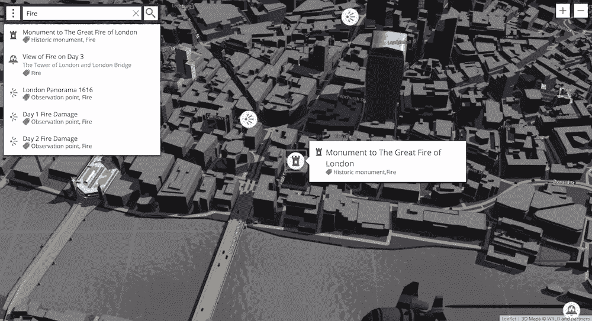

我刚刚描述了 WRLD。虽然[对开发者来说很棒](https://www.sitepoint.com/building-dynamic-3d-maps/)，但该公司的在线地图设计工具([是一款面向所有人的地图工具](https://www.wrld3d.com/blog/introducing-wrld-map-designer-a-mapping-tool-for-everyone/?utm_source=sitepoint&utm_medium=referral&utm_campaign=sp-a4-how-to-build-an-interactive-history-map-with-wrld&utm_content=text-sp-blog-introducing-wrld-map-designer-a-mapping-tool-for-everyone)),为那些完全没有编码技能的人打开了创建强大的定制地图的大门。

> WRLD 邀请任何人通过我们基于云的制图工具设计和管理定制的 3D 地图，无需大量编码，并针对现代网络和移动应用进行了优化。

与谷歌地图不同，WRLD 完全是 3D 的。这将使任何熟悉现代游戏的人感到完全宾至如归。WRLD 还优先考虑隐私、控制和开发者可扩展性。这是一种符合所有标准的产品。老师会如何使用它呢？

## 使用 WRLD 创建自定义 3D 地图

想法是这样的:WRLD 为你提供了这个星球完整的 3D 地图。您选择您正在教授的位置，选择合适的主题，添加兴趣点，并创建传达您基于位置的内容的卡片。然后，您可以共享打开 web 浏览器或移动应用程序的地图链接，将其嵌入网页，甚至将其包含在您自己的电子学习软件中。

> 我们的目标是构建最智能的 3D 世界。

WRLD 是一项正在进行的工作。用 3D 渲染整个世界是一项巨大的任务，它还没有提供每个国家的地图(尽管[用户可以投票选择新的区域](https://www.wrld3d.com/3d-maps/mapping-data?utm_source=sitepoint&utm_medium=referral&utm_campaign=sp-a4-how-to-build-an-interactive-history-map-with-wrld&utm_content=text-sp-3d-maps-map-designer-mapping-data#WRLD-MAP-COVERAGE)纳入 WRLD)。功能仍在增加，文档仍在创建。尽管有这些限制，但这是一款引人注目的地图产品，已经可以满足你的许多需求。

目前有超过 3 亿平方米的地图可供使用。它完全覆盖了美国、加拿大、英国、爱尔兰、斯堪的纳维亚半岛、阿拉伯半岛、意大利等地区，还部分覆盖了西班牙、澳大利亚和泰国。这应该涵盖了你的教学大纲！

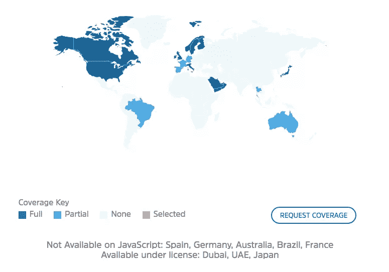

这个费用对大多数教育工作者来说应该是相当有吸引力的。如果你每月有 1000 名或更少的用户，WRLD 是完全免费的，这将是大多数教师和小型培训机构。较大的教育机构和电子学习平台可能需要支付适度的费用，如下图所示。

那么，如何着手创建一个用于教育的 3D 地图呢？我们将通过创建一张关于伦敦大火的地图来展示给你看。您可以[点击这里](https://wrld.mp/c1fcd43)在您的网络浏览器中查看它，或者浏览下面的嵌入内容。

[https://maps.wrld3d.com/embed/?mapscene=c1fcd43](https://maps.wrld3d.com/embed/?mapscene=c1fcd43)

## 地图设计者:创建一个没有编码的 3D 地图

非开发者将使用 WRLD 的[地图设计器](https://www.wrld3d.com/3d-maps/map-designer?utm_source=sitepoint&utm_medium=referral&utm_campaign=sp-a4-how-to-build-an-interactive-history-map-with-wrld&utm_content=text-sp-3d-maps-map-designer)，这是一个为专业人士和初学者设计的在线工具。创建和管理您自己的 3D 地图，选择简单或复杂的样式。

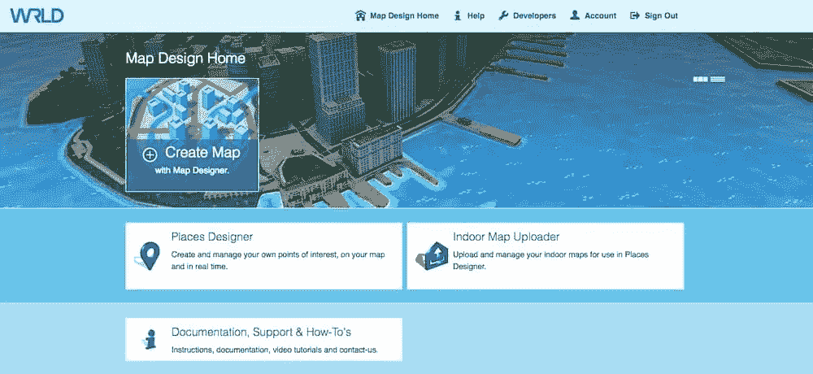

创建帐户后，您可以创建您的第一张地图。给地图起个名字，你就会得到一个网址。您可能希望将地址粘贴到不同的浏览器选项卡中，以便从学生的角度监控您的进度。

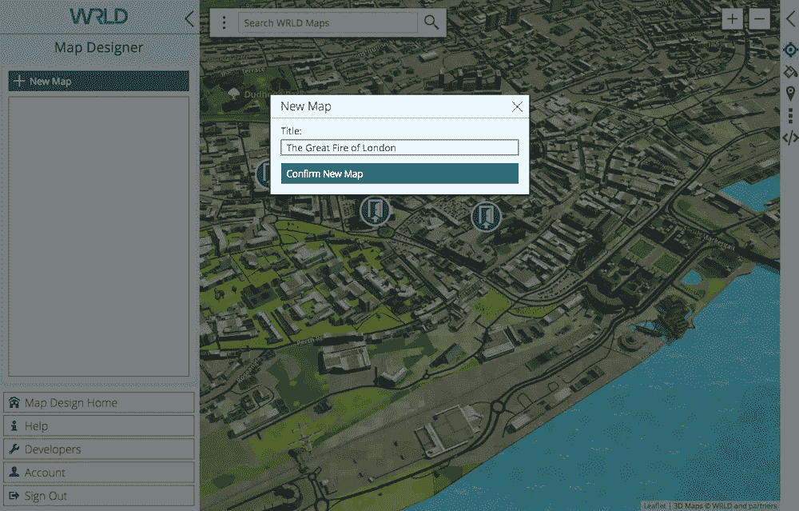

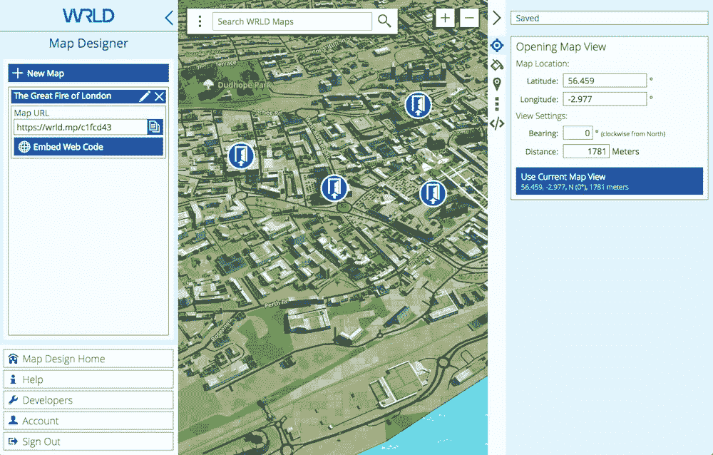

导航地图很直观。左键单击并拖动以移动地图，滚动以放大和缩小，右键单击并拖动以旋转。放大时，显示会自动从 2D 变为 3D。

我们的第一项工作是定义您的学生打开地图时将看到的初始视图。伦敦大火发生在泰晤士河以北，毗邻伦敦桥。我从搜索“伦敦大火”开始，发现那里有一座纪念碑。这应该能让我接近。

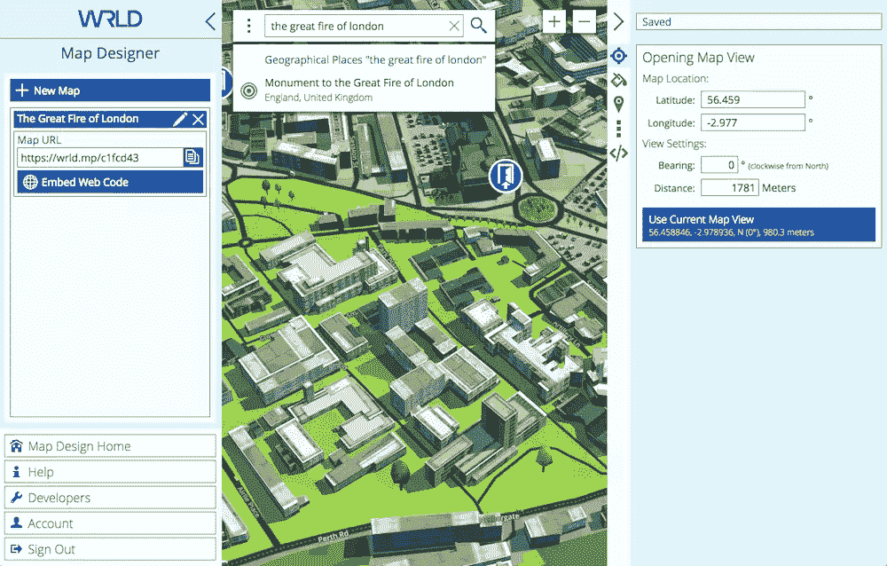

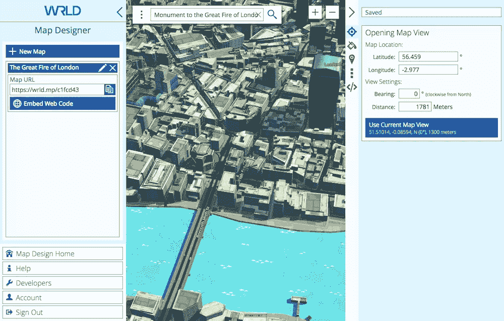

这是完美的，我希望这是地图打开时显示的内容。我点击右窗格中的**使用当前地图视图**。

我们现在需要选择一个主题，所以我单击右窗格中的油漆罐图标。我喜欢黑暗主题的外观。

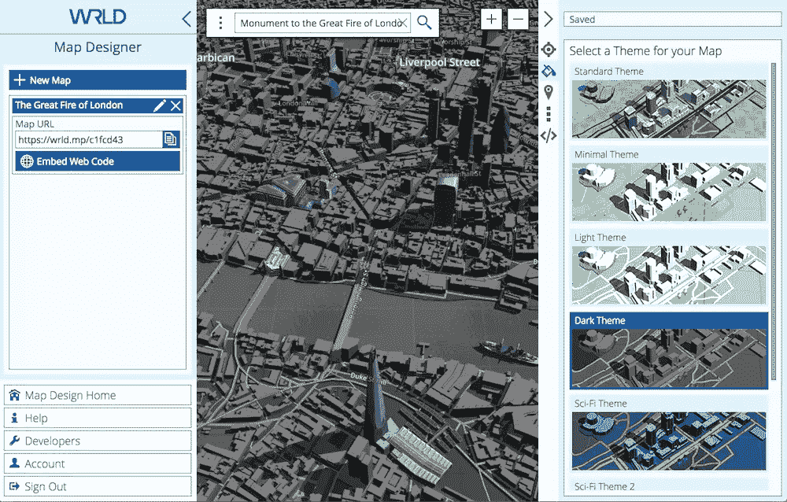

现在是时候补充一些名胜古迹了。我们通过 Places Designer 来实现，我可以通过点击 **Places** 图标，然后点击 **Manage Place Collections** 来打开它(在一个新的浏览器标签中)。

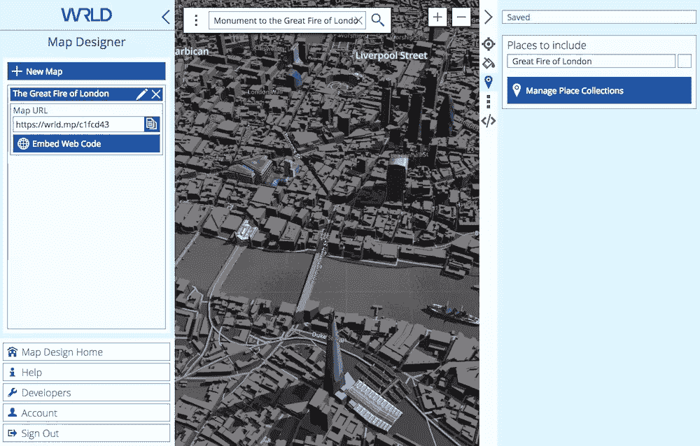

## 地点设计器:添加名胜古迹和基于位置的内容

位置设计器现已打开。我可以通过切换浏览器中的标签在它和地图设计器之间切换。

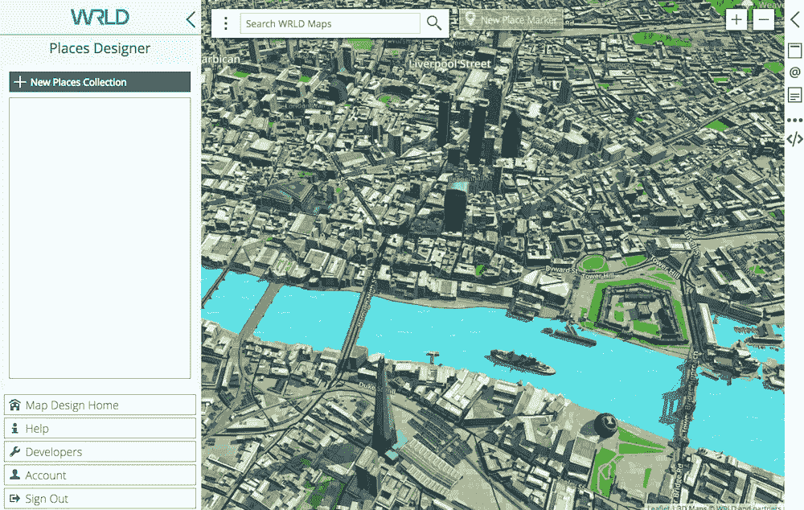

在我将一些感兴趣的地方添加到地图之前，我首先需要创建一些**地点集合**。这些是我们存放物品的容器，帮助我们保持物品井然有序。

我首先需要知道我想添加到地图上的内容。网上有很多关于伦敦大火的有趣资料。因为悲剧发生在 1666 年，显然没有照片，但有数量惊人的绘画可用。出于本文的目的，为了简单起见，我只使用维基百科作为来源。

文章包括几幅四天来火势蔓延的地图，一些当代的火灾绘画，等等。我决定只创建两个集合，并通过选择“应用程序”下的“伦敦大火”将它们用于我的地图:

*   图片:伦敦大火
*   地图:伦敦大火

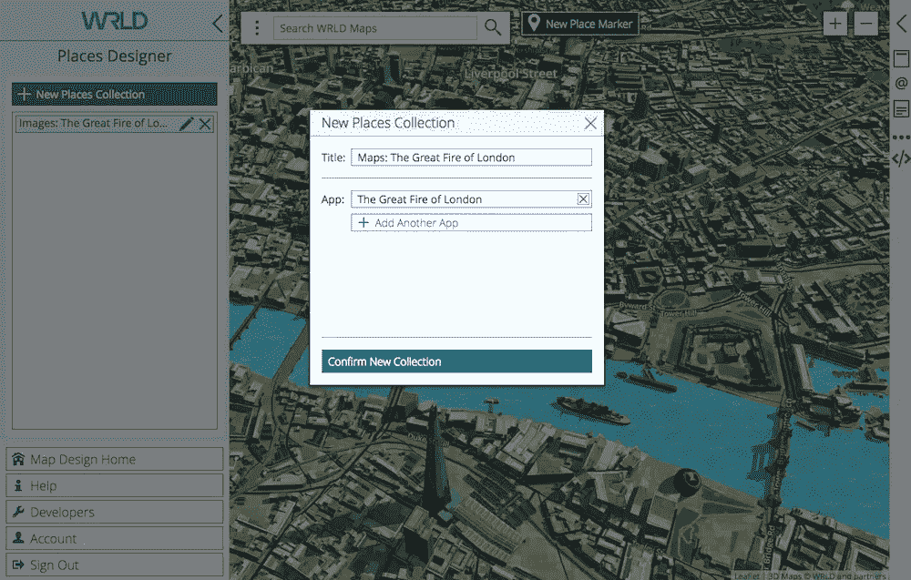

现在，我们将为每个收藏添加一些有趣的地方。每个地方都会在地图上添加一个图钉，选择图钉会显示一个带有附加内容的卡片，包括文本和图像。

我将从维基百科文章中发现的第一幅画开始，它显示了第三天从泰晤士河上的塔码头附近看火的样子，就在火的东部。我希望它在“Images”集合中，所以我点击它，然后点击 **New Place Marker** 。地图的中心放了一个大头针，我把它拖到码头附近。

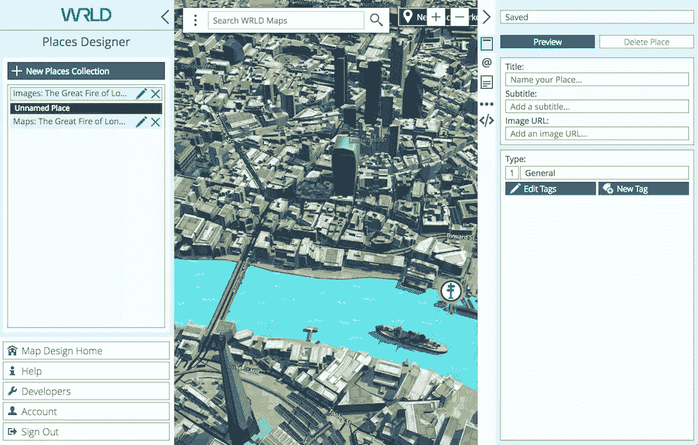

现在我在右窗格中填写表格，包括标题、副标题和图片的 URL。我将标签更改为“Fire ”,这将修改大头针上的图像。我预览了卡片，它显示在下面的截图中。

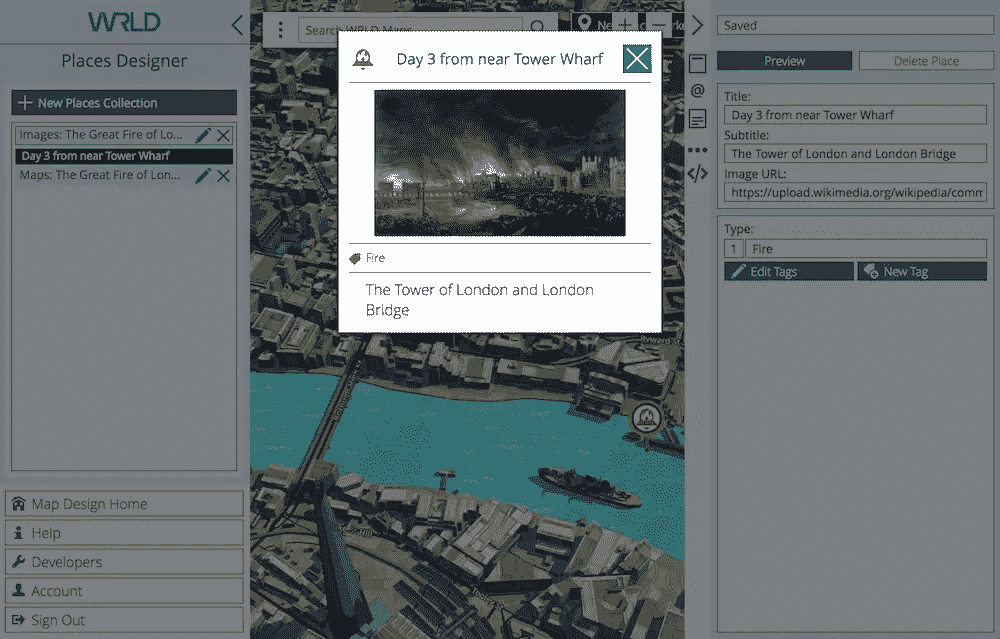

右边面板中的下一个表单是联系信息。我们并不真的需要这样做，但我确实添加了一个指向维基百科文章的链接。

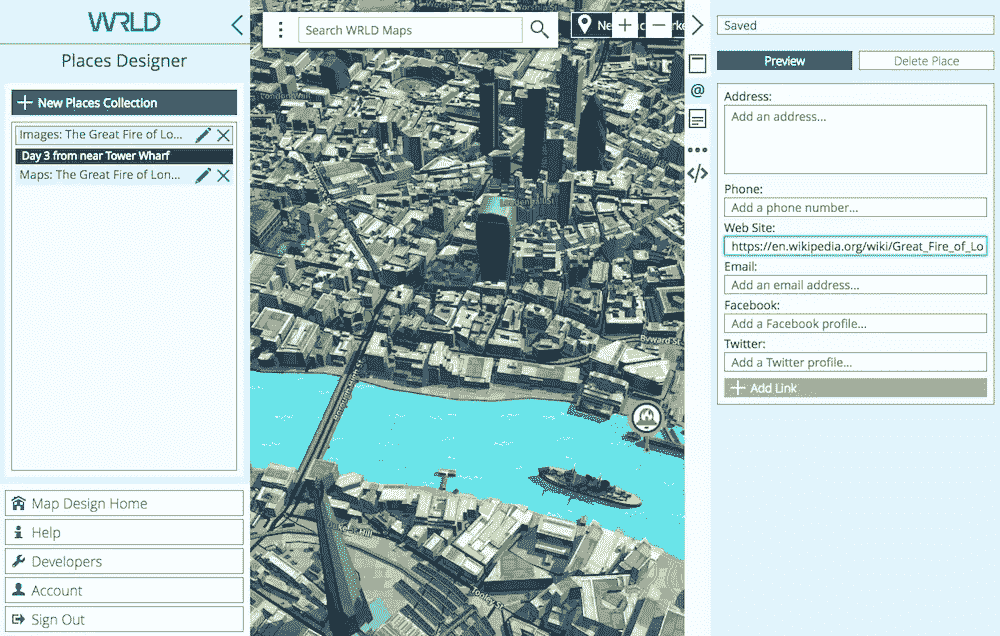

接下来，我们可以输入描述，这是一段文字内容。我添加了来自维基百科的图片描述，并预览了卡片。

下一个表单允许您微调大头针的纬度和经度。我不确定这幅画的确切位置，所以就让它保持原样吧。

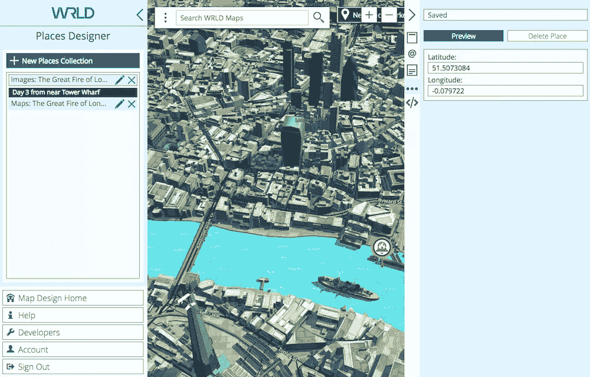

最后一个表单是一个 JSON 编辑器，它有点技术性，允许您直接编辑从表单输入的数据。如果你不介意一些简单的技术工作，可以通过添加 HTML 内容来进一步定制卡片。WRLD 将会在不久的将来发布一个视频教程来教你如何做到这一点。

我用同样的方法在地图上添加了一些卡片，它开始成形了:

*   图片:着火的路德盖特
*   图片:伦敦大火纪念碑
*   图片:第三天的火灾视图
*   地图:第一天火焰伤害
*   地图:第二天火焰伤害
*   地图:第三天火焰伤害

我们快完成了。但是在我们分享我们的地图之前，我们需要返回到地图设计器，使我们感兴趣的地方可以被发现。

## 完成并共享您的自定义 3D 地图

当我们返回到地图设计器时，我们看到我们的地点集合被标记为包含。这并不会使大头针自动可见，但它确实让我们可以在搜索中访问项目。

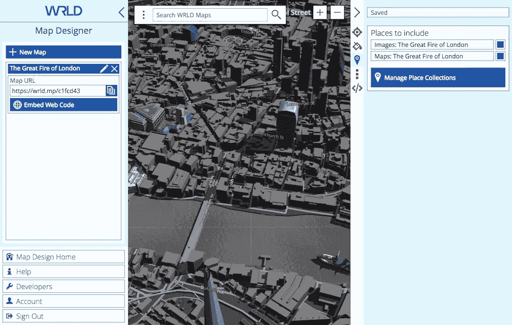

我们可以通过定制**查找菜单**让它们更容易找到。这将允许我们的学生通过单击自动搜索特定标签的菜单项来快速找到地图上的项目。

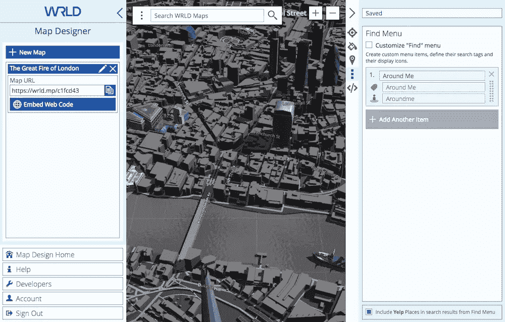

由于我们的地图上只有几个感兴趣的地方，我决定一次搜索应该可以找到所有的地方，所以我返回到 Places Designer 并为每个感兴趣的地方添加“Fire”标记，然后返回。

我勾选**自定义查找菜单**并添加一个新项目:“伦敦大火”。我将让菜单项自动搜索标签“Fire ”,并用“Fire”图标表示该项。与此同时，我删除了 WRLD 自动添加的条目，取消了“在查找菜单的搜索结果中包含 Yelp 的位置”

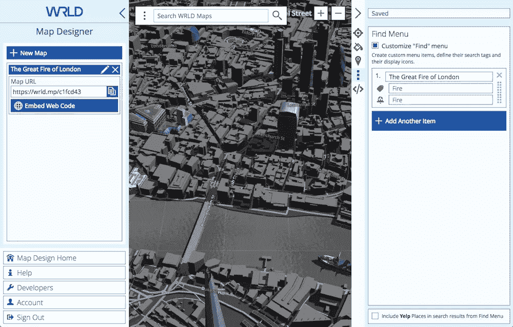

最后，地图设计者还有一个 JSON 编辑器。

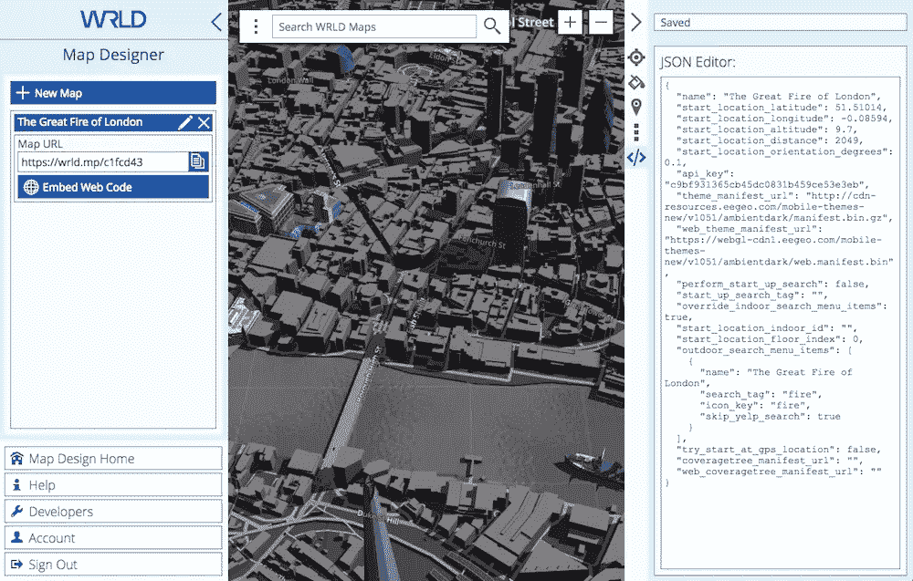

这里的一些快速编辑将使我们的地图变得更加有用，使我们感兴趣的地方可见，而无需首先手动进行搜索。

*   首先，我将`perform_start_up_search`改为“真”。
*   然后我把`start_up_search_tag`改成“火”。

现在只要打开地图，WRLD 就会自动搜索“火灾”标签，并显示相应地点的图像作为搜索结果。它还会在地图上显示匹配的大头针。点击搜索结果将滚动到感兴趣的地方并显示卡片。WRLD 指出，很快，用户将不需要编辑 JSON 来做这些改变。

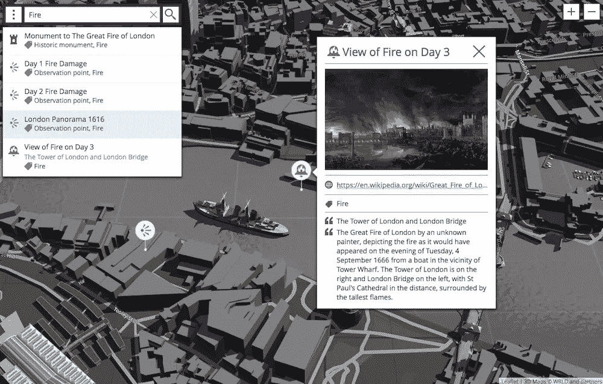

最后，我们需要将地图提供给我们的学生。我们可以通过分享地图的可点击链接，这将直接在浏览器中打开或引导移动用户到应用程序，或者通过将其作为 iframe 嵌入我们的在线课程来实现。点击**嵌入网页代码**会显示一个工具，让你定制嵌入地图的大小。

[https://maps.wrld3d.com/embed/?mapscene=c1fcd43](https://maps.wrld3d.com/embed/?mapscene=c1fcd43)

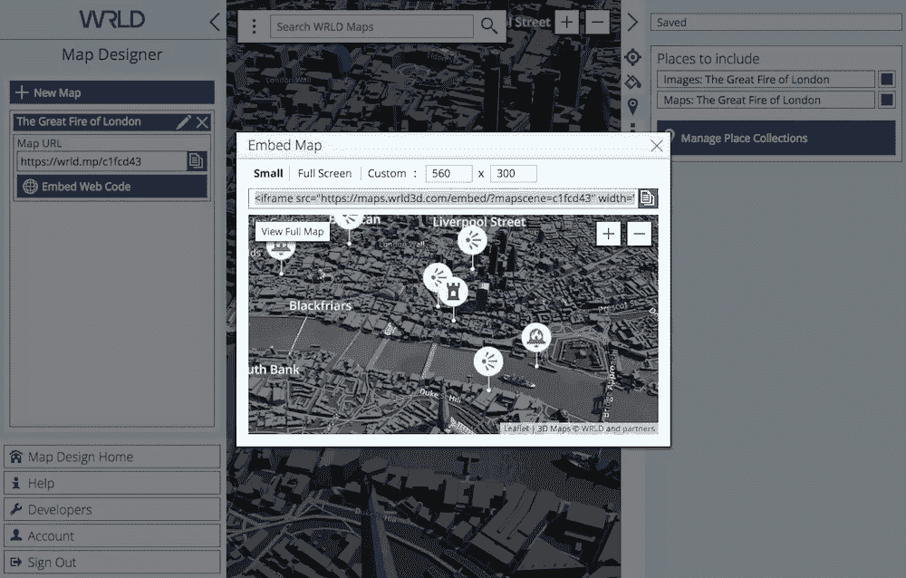

WRLD 的地图设计器允许你创建和分享有用的教育三维地图，没有任何编码。学生可以探索您基于位置的内容并可视化这些材料。

但是请注意，编码可以进一步增强我们的地图。例如，我们可以添加多边形来指示每天被火灾破坏的区域，使用人员伤亡或火灾温度的统计数据来显示热点，并且我们可以对建筑物进行颜色编码来指示它们何时开始燃烧。如果你想了解更多，请在网络频道查看克里斯托弗·皮特关于 WRLD 的更多技术系列。

## 分享这篇文章